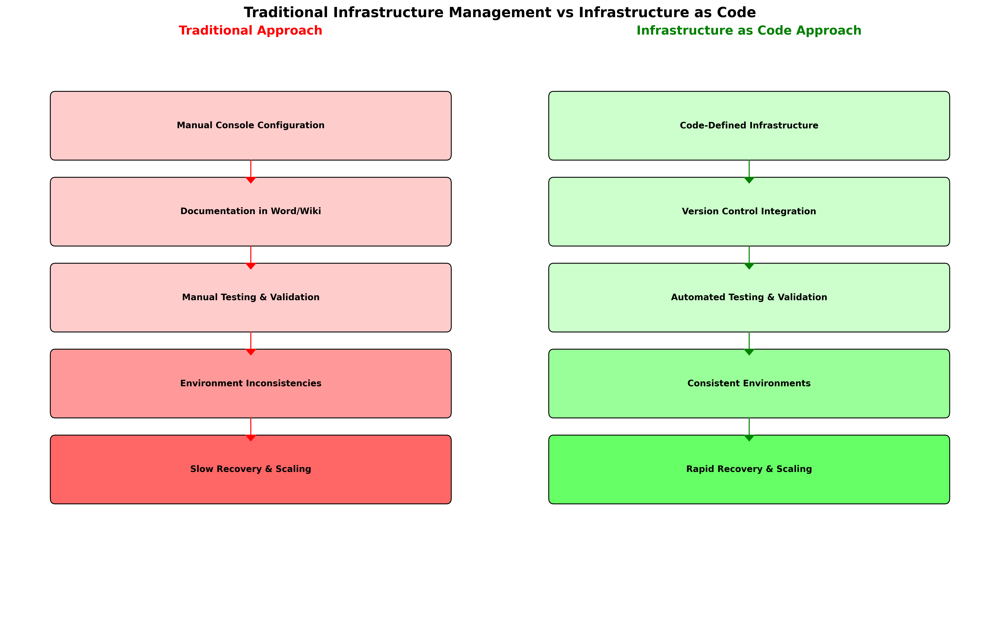
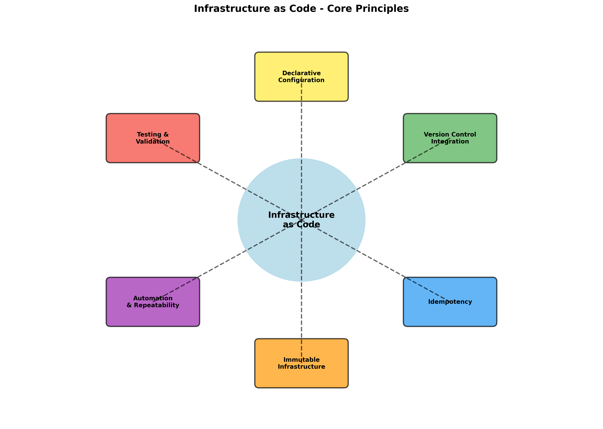
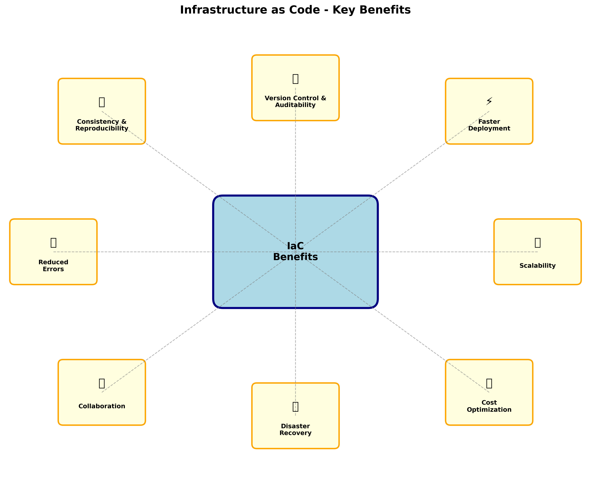
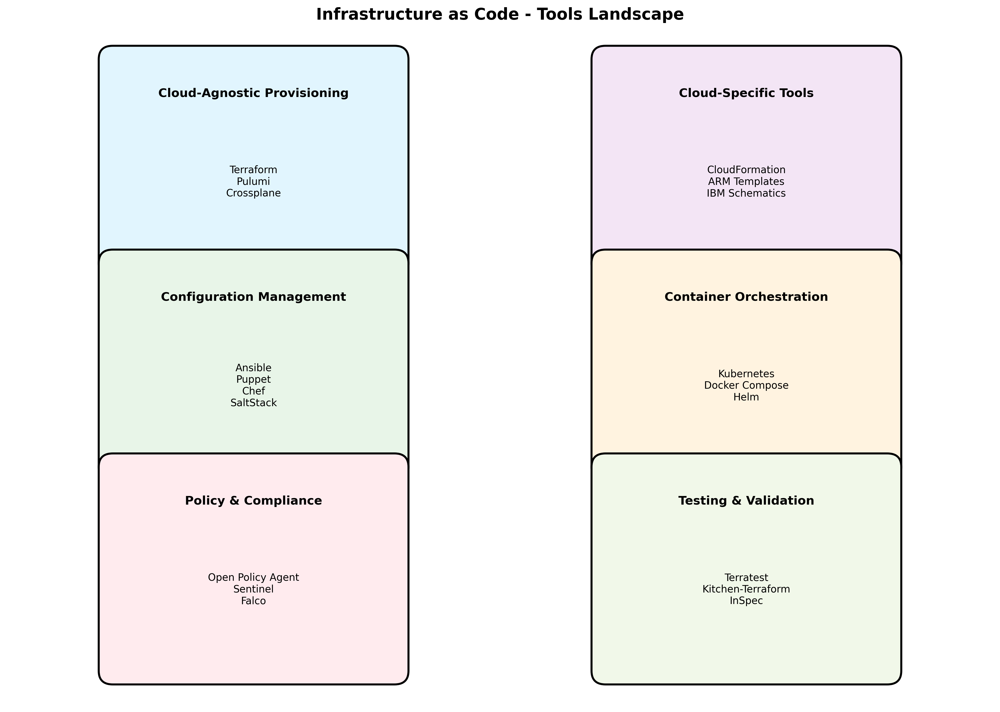

# Infrastructure as Code (IaC) - Comprehensive Overview

## Learning Objectives
By the end of this module, you will be able to:
- Define Infrastructure as Code and explain its core principles
- Identify the key benefits and challenges of IaC implementation
- Compare traditional infrastructure management with IaC approaches
- Understand how IaC fits into modern DevOps and cloud-native practices
- Recognize the role of IaC in IBM Cloud environments

## 1. What is Infrastructure as Code (IaC)?


*Figure 1.1: Side-by-side comparison of traditional infrastructure management versus Infrastructure as Code approach, highlighting workflow differences and automation benefits*

### Definition
Infrastructure as Code (IaC) is the practice of managing and provisioning computing infrastructure through machine-readable definition files, rather than through physical hardware configuration or interactive configuration tools.

### Core Principles


*Figure 1.2: Central hub diagram illustrating the fundamental principles of Infrastructure as Code and their interconnected relationships*

#### 1. **Declarative Configuration**
- Define the desired end state of infrastructure
- Let the IaC tool determine how to achieve that state
- Focus on "what" rather than "how"

```hcl
# Example: Declarative approach
resource "ibm_is_vpc" "training_vpc" {
  name = "training-vpc"
  resource_group = data.ibm_resource_group.training.id
  tags = ["training", "iac-demo"]
}
```

#### 2. **Version Control Integration**
- Infrastructure definitions stored in version control systems
- Track changes, rollbacks, and collaboration
- Treat infrastructure like application code

#### 3. **Idempotency**
- Running the same configuration multiple times produces the same result
- Safe to re-apply configurations without unintended side effects
- Enables reliable automation and recovery

#### 4. **Immutable Infrastructure**
- Replace rather than modify existing infrastructure
- Reduces configuration drift and improves reliability
- Enables consistent environments across development, testing, and production

## 2. Traditional Infrastructure Management vs. IaC

### Traditional Approach (Manual/GUI-based)

#### Characteristics:
- **Manual Processes**: Point-and-click through web consoles or CLI commands
- **Documentation Heavy**: Reliance on runbooks and procedural documentation
- **Error Prone**: Human mistakes in configuration and deployment
- **Inconsistent**: Variations between environments due to manual steps
- **Slow Recovery**: Time-intensive disaster recovery and environment recreation

#### Challenges:
- **Configuration Drift**: Environments diverge over time due to manual changes
- **Scalability Issues**: Manual processes don't scale with infrastructure growth
- **Knowledge Silos**: Critical knowledge trapped with individual team members
- **Audit Difficulties**: Hard to track who changed what and when
- **Compliance Risks**: Difficulty proving consistent security and compliance postures

### Infrastructure as Code Approach

#### Characteristics:
- **Automated Provisioning**: Infrastructure created through code execution
- **Self-Documenting**: Code serves as living documentation
- **Consistent Deployment**: Same code produces identical environments
- **Rapid Recovery**: Quick environment recreation from code
- **Collaborative**: Team-based development with code reviews


*Figure 1.3: Visual representation of key benefits achieved through Infrastructure as Code implementation with clear categorization and impact areas*

#### Benefits:
- **Repeatability**: Consistent infrastructure across all environments
- **Scalability**: Easy to replicate and scale infrastructure patterns
- **Auditability**: Complete change history through version control
- **Testing**: Infrastructure can be tested like application code
- **Cost Optimization**: Programmatic resource lifecycle management

## 3. IaC Implementation Models

### 1. **Imperative vs. Declarative**

#### Imperative (Procedural)
- Specify exact steps to achieve desired state
- Examples: Shell scripts, Ansible playbooks, AWS CLI scripts
- More control but higher complexity

#### Declarative (Functional)
- Specify desired end state
- Examples: Terraform, CloudFormation, ARM templates
- Simpler to understand and maintain

### 2. **Push vs. Pull Models**

#### Push Model
- Central server pushes configurations to target systems
- Examples: Ansible, SaltStack (masterless mode)
- Immediate execution and feedback

#### Pull Model
- Target systems pull configurations from central repository
- Examples: Puppet, Chef, SaltStack (master mode)
- Better for large-scale environments

### 3. **Mutable vs. Immutable Infrastructure**

#### Mutable Infrastructure
- Modify existing infrastructure in place
- Examples: Configuration management tools
- Lower resource usage but higher complexity

#### Immutable Infrastructure
- Replace entire infrastructure components
- Examples: Container orchestration, blue-green deployments
- Higher resource usage but better reliability

## 4. IaC Tools Landscape


*Figure 1.4: Categorized overview of Infrastructure as Code tools ecosystem, helping understand tool selection for different use cases and environments*

### Cloud-Specific Tools
- **AWS CloudFormation**: Native AWS infrastructure provisioning
- **Azure Resource Manager (ARM)**: Microsoft Azure infrastructure management
- **Google Cloud Deployment Manager**: Google Cloud Platform automation
- **IBM Cloud Schematics**: IBM Cloud's native Terraform-based service

### Cloud-Agnostic Tools
- **Terraform**: Multi-cloud infrastructure provisioning and management
- **Pulumi**: Modern IaC with familiar programming languages
- **Crossplane**: Kubernetes-native infrastructure management
- **CDK (Cloud Development Kit)**: Infrastructure definition using programming languages

### Configuration Management Tools
- **Ansible**: Agentless automation and configuration management
- **Puppet**: Declarative configuration management with agents
- **Chef**: Infrastructure automation with Ruby-based DSL
- **SaltStack**: Event-driven automation and configuration management

## 5. Terraform Workflow Lifecycle

### Overview
Terraform follows a well-defined workflow lifecycle that ensures consistent and reliable infrastructure management. Understanding each phase of this lifecycle is crucial for successful IaC implementation, especially in IBM Cloud environments where proper resource management directly impacts costs and security.

### The Four Core Commands

#### 1. terraform init - Initialization Phase

The `terraform init` command prepares your working directory for Terraform operations. This is always the first command you run in a new Terraform configuration.

**What it does:**
- Downloads and installs provider plugins
- Initializes the backend for state storage
- Downloads modules referenced in the configuration
- Creates the `.terraform` directory structure

**IBM Cloud Example:**
```bash
# Initialize a new IBM Cloud Terraform project
terraform init

# Example output:
Initializing the backend...

Initializing provider plugins...
- Finding IBM-Cloud/ibm versions matching "~> 1.58.0"...
- Installing IBM-Cloud/ibm v1.58.1...
- Installed IBM-Cloud/ibm v1.58.1 (signed by a HashiCorp partner)

Terraform has been successfully initialized!
```

**Best Practices for IBM Cloud:**
- Always specify provider version constraints to ensure consistency
- Use remote state backends for team collaboration
- Initialize in a clean directory to avoid conflicts

**Common Init Scenarios:**
```bash
# Initialize with specific backend configuration
terraform init -backend-config="bucket=my-terraform-state"

# Reinitialize after adding new providers
terraform init -upgrade

# Initialize without downloading modules (for CI/CD)
terraform init -get=false
```

#### 2. terraform plan - Planning Phase

The `terraform plan` command creates an execution plan, showing what actions Terraform will take to reach the desired state defined in your configuration.

**What it does:**
- Compares current state with desired configuration
- Shows resources to be created, modified, or destroyed
- Validates configuration syntax and logic
- Estimates costs and dependencies

**IBM Cloud Example:**
```bash
# Create a plan for IBM Cloud resources
terraform plan

# Example output:
Terraform used the selected providers to generate the following execution plan.
Resource actions are indicated with the following symbols:
  + create

Terraform will perform the following actions:

  # ibm_is_vpc.training_vpc will be created
  + resource "ibm_is_vpc" "training_vpc" {
      + address_prefix_management   = "auto"
      + classic_access              = false
      + crn                        = (known after apply)
      + cse_source_addresses       = (known after apply)
      + default_network_acl        = (known after apply)
      + default_routing_table      = (known after apply)
      + default_security_group     = (known after apply)
      + id                         = (known after apply)
      + name                       = "training-vpc-abc123"
      + resource_group             = "default"
      + status                     = (known after apply)
      + subnets                    = (known after apply)
      + tags                       = [
          + "iac-training",
          + "terraform",
        ]
    }

Plan: 1 to add, 0 to change, 0 to destroy.
```

**Advanced Planning Options:**
```bash
# Save plan to file for later execution
terraform plan -out=production.tfplan

# Plan with specific variable values
terraform plan -var="environment=production"

# Plan targeting specific resources
terraform plan -target=ibm_is_vpc.training_vpc

# Plan with detailed logging
TF_LOG=DEBUG terraform plan
```

**Cost Estimation Integration:**
When using IBM Cloud, the plan output can be integrated with cost estimation tools to predict monthly expenses before applying changes.

#### 3. terraform apply - Execution Phase

The `terraform apply` command executes the actions proposed in a Terraform plan to create, update, or delete infrastructure resources.

**What it does:**
- Executes the planned changes
- Updates the Terraform state file
- Provides real-time feedback on resource creation
- Handles dependencies and parallelization automatically

**IBM Cloud Example:**
```bash
# Apply changes with automatic approval
terraform apply -auto-approve

# Apply a saved plan
terraform apply production.tfplan

# Example output:
ibm_is_vpc.training_vpc: Creating...
ibm_is_vpc.training_vpc: Still creating... [10s elapsed]
ibm_is_vpc.training_vpc: Creation complete after 15s [id=r006-12345678-1234-1234-1234-123456789abc]

Apply complete! Resources: 1 added, 0 changed, 0 destroyed.

Outputs:

vpc_id = "r006-12345678-1234-1234-1234-123456789abc"
vpc_name = "training-vpc-abc123"
```

**Error Handling and Recovery:**
```bash
# Apply with detailed logging for troubleshooting
TF_LOG=DEBUG terraform apply

# Apply with parallelism control for large deployments
terraform apply -parallelism=5

# Apply with timeout for slow operations
terraform apply -timeout=30m
```

**IBM Cloud Specific Considerations:**
- Monitor IBM Cloud console during apply for real-time resource status
- Be aware of IBM Cloud service limits and quotas
- Consider regional availability and data residency requirements

#### 4. terraform destroy - Cleanup Phase

The `terraform destroy` command removes all resources managed by the current Terraform configuration.

**What it does:**
- Plans the destruction of all managed resources
- Handles dependency ordering for safe removal
- Updates state file to reflect destroyed resources
- Provides confirmation prompts for safety

**IBM Cloud Example:**
```bash
# Destroy all resources with confirmation
terraform destroy

# Example output:
ibm_is_vpc.training_vpc: Refreshing state... [id=r006-12345678-1234-1234-1234-123456789abc]

Terraform used the selected providers to generate the following execution plan.
Resource actions are indicated with the following symbols:
  - destroy

Terraform will perform the following actions:

  # ibm_is_vpc.training_vpc will be destroyed
  - resource "ibm_is_vpc" "training_vpc" {
      - address_prefix_management = "auto" -> null
      - classic_access            = false -> null
      - crn                      = "crn:v1:bluemix:public:is:us-south:a/..." -> null
      - id                       = "r006-12345678-1234-1234-1234-123456789abc" -> null
      - name                     = "training-vpc-abc123" -> null
      - resource_group           = "default" -> null
      - status                   = "available" -> null
      - tags                     = [
          - "iac-training",
          - "terraform",
        ] -> null
    }

Plan: 0 to add, 0 to change, 1 to destroy.

Do you really want to destroy all resources?
  Terraform will destroy all your managed infrastructure, as shown above.
  There is no undo. Only 'yes' will be accepted to confirm.

  Enter a value: yes

ibm_is_vpc.training_vpc: Destroying... [id=r006-12345678-1234-1234-1234-123456789abc]
ibm_is_vpc.training_vpc: Destruction complete after 5s

Destroy complete! Resources: 1 destroyed.
```

**Safe Destruction Practices:**
```bash
# Destroy specific resources only
terraform destroy -target=ibm_is_instance.test_server

# Destroy with automatic approval (use with caution)
terraform destroy -auto-approve

# Preview destruction without executing
terraform plan -destroy
```

### Workflow Integration Best Practices

#### 1. **Development Workflow**
```bash
# Standard development cycle
terraform init
terraform plan
terraform apply
# Make changes to configuration
terraform plan
terraform apply
terraform destroy  # When done with development
```

#### 2. **Production Workflow**
```bash
# Production deployment cycle
terraform init
terraform plan -out=prod.tfplan
# Review plan thoroughly
terraform apply prod.tfplan
# Monitor and validate deployment
```

#### 3. **Team Collaboration Workflow**
```bash
# Team member workflow
git pull origin main
terraform init
terraform plan
# If plan looks good, create pull request
# After approval and merge:
terraform apply
```

### State Management in the Lifecycle

#### State File Importance
- Terraform state tracks the mapping between configuration and real-world resources
- State enables Terraform to determine what changes need to be made
- State includes metadata about resources and dependencies

#### IBM Cloud State Considerations
```bash
# View current state
terraform show

# List all resources in state
terraform state list

# Import existing IBM Cloud resources
terraform import ibm_is_vpc.existing r006-existing-vpc-id

# Remove resources from state without destroying
terraform state rm ibm_is_vpc.old_vpc
```

### Error Handling and Troubleshooting

#### Common Issues and Solutions

**1. Provider Version Conflicts**
```bash
# Error: Provider version constraint not met
# Solution: Update provider version or constraints
terraform init -upgrade
```

**2. State Lock Issues**
```bash
# Error: State is locked
# Solution: Force unlock (use with caution)
terraform force-unlock LOCK_ID
```

**3. Resource Dependencies**
```bash
# Error: Resource depends on another resource
# Solution: Use explicit dependencies
resource "ibm_is_subnet" "example" {
  depends_on = [ibm_is_vpc.example]
  # ... other configuration
}
```

**4. IBM Cloud Authentication Issues**
```bash
# Error: Authentication failed
# Solution: Verify API key and permissions
export IBMCLOUD_API_KEY="your-api-key"
terraform plan
```

### Performance Optimization

#### Parallelism Control
```bash
# Adjust parallelism for large deployments
terraform apply -parallelism=10
```

#### Resource Targeting
```bash
# Apply changes to specific resources only
terraform apply -target=ibm_is_vpc.main -target=ibm_is_subnet.main
```

#### Refresh Optimization
```bash
# Skip refresh for faster planning
terraform plan -refresh=false
```

## 6. IaC in Cloud-Native Environments

### Microservices Architecture Support
- **Service Isolation**: Each service can have dedicated infrastructure
- **Independent Scaling**: Infrastructure scales with service demands
- **Technology Diversity**: Different services can use optimal infrastructure

### Container Orchestration Integration
- **Kubernetes Integration**: IaC tools provision and configure K8s clusters
- **Container Infrastructure**: Automated setup of container registries, networks
- **Service Mesh Configuration**: Automated service mesh deployment and configuration

### Serverless Computing Support
- **Function Deployment**: Automated serverless function provisioning
- **Event-Driven Infrastructure**: Infrastructure that responds to application events
- **Cost Optimization**: Pay-per-use infrastructure aligned with serverless principles

## 6. DevOps and IaC Integration

### CI/CD Pipeline Integration
- **Infrastructure Testing**: Automated testing of infrastructure code
- **Environment Promotion**: Consistent infrastructure across pipeline stages
- **Deployment Automation**: Infrastructure changes deployed with application code

### GitOps Methodology
- **Git as Source of Truth**: All infrastructure changes through Git workflows
- **Pull Request Reviews**: Infrastructure changes reviewed like application code
- **Automated Deployment**: Git commits trigger infrastructure updates

### Monitoring and Observability
- **Infrastructure Monitoring**: Automated setup of monitoring and alerting
- **Compliance Checking**: Continuous compliance validation through code
- **Cost Tracking**: Automated cost allocation and optimization

## 7. Security and Compliance in IaC

### Security Best Practices
- **Least Privilege Access**: Automated IAM policy creation and management
- **Encryption by Default**: Automated encryption configuration for all resources
- **Network Segmentation**: Programmatic network security implementation
- **Secret Management**: Secure handling of credentials and sensitive data

### Compliance Automation
- **Policy as Code**: Compliance rules implemented as code
- **Automated Auditing**: Continuous compliance checking and reporting
- **Remediation Automation**: Automatic fixing of compliance violations
- **Documentation Generation**: Automated compliance documentation

## 8. IaC Challenges and Considerations

### Technical Challenges
- **Learning Curve**: New skills required for infrastructure teams
- **Tool Complexity**: Understanding multiple tools and their interactions
- **State Management**: Handling infrastructure state and concurrency
- **Debugging**: Troubleshooting infrastructure code and deployments

### Organizational Challenges
- **Cultural Change**: Shift from manual to automated processes
- **Skill Development**: Training teams on new tools and practices
- **Process Integration**: Aligning IaC with existing workflows
- **Governance**: Establishing policies for infrastructure code management

### Operational Challenges
- **Disaster Recovery**: Ensuring IaC tools and state are recoverable
- **Performance**: Managing large-scale infrastructure deployments
- **Cost Management**: Preventing runaway resource provisioning
- **Vendor Lock-in**: Balancing cloud-specific features with portability

## 9. Success Metrics for IaC Implementation

### Technical Metrics
- **Deployment Frequency**: How often infrastructure changes are deployed
- **Lead Time**: Time from infrastructure change request to deployment
- **Mean Time to Recovery (MTTR)**: Time to recover from infrastructure failures
- **Change Failure Rate**: Percentage of infrastructure changes that cause issues

### Business Metrics
- **Cost Reduction**: Savings from automated resource management
- **Time to Market**: Faster application deployment through automated infrastructure
- **Compliance Score**: Improved compliance through automated policy enforcement
- **Team Productivity**: Increased efficiency through automation

### Quality Metrics
- **Configuration Drift**: Reduction in environment inconsistencies
- **Security Incidents**: Decrease in security-related issues
- **Documentation Quality**: Improved infrastructure documentation through code
- **Knowledge Sharing**: Better team collaboration and knowledge transfer

## 10. Future Trends in IaC

### Emerging Technologies
- **AI/ML Integration**: Intelligent infrastructure optimization and prediction
- **Edge Computing**: IaC for distributed edge infrastructure
- **Quantum Computing**: Infrastructure for quantum computing resources
- **Sustainable Computing**: Green infrastructure optimization through code

### Evolving Practices
- **Policy as Code**: More sophisticated governance and compliance automation
- **FinOps Integration**: Better cost management through IaC
- **Security as Code**: Deeper integration of security practices
- **Observability as Code**: Automated monitoring and alerting setup

## Summary

Infrastructure as Code represents a fundamental shift in how we manage and operate infrastructure. By treating infrastructure like software, organizations can achieve greater consistency, reliability, and agility in their operations. The key to successful IaC implementation lies in understanding the principles, choosing the right tools for your environment, and gradually adopting practices that align with your organizational goals.

In the context of IBM Cloud, IaC enables organizations to leverage the full power of cloud services while maintaining control, consistency, and compliance. The next section will explore the specific benefits and use cases for implementing IaC in IBM Cloud environments.

## Key Takeaways
1. IaC transforms infrastructure management from manual processes to automated, code-driven approaches
2. Declarative configuration and version control are fundamental to successful IaC implementation
3. IaC enables consistency, scalability, and reliability in cloud environments
4. Integration with DevOps practices amplifies the benefits of both methodologies
5. Success requires addressing technical, organizational, and operational challenges
6. IBM Cloud provides native and third-party tools to support comprehensive IaC strategies

## Next Steps
- Explore IBM Cloud-specific IaC benefits and use cases
- Set up development environment for hands-on IaC practice
- Begin with simple infrastructure provisioning examples
- Gradually adopt more complex IaC patterns and best practices
