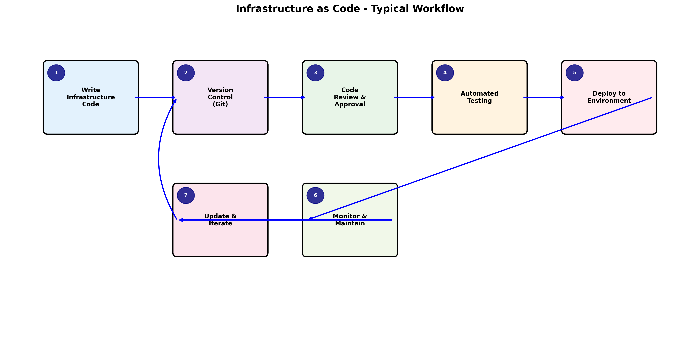

# Lab 1.1: Infrastructure as Code Fundamentals with IBM Cloud

## Lab Information
- **Lab ID**: LAB-1.1-001
- **Duration**: 90 minutes
- **Difficulty**: Beginner
- **Prerequisites**: 
  - IBM Cloud account with appropriate permissions
  - Basic command line familiarity
  - Completed environment setup fromRoad-Map.md

## Learning Objectives

### Primary Objective
Understand and demonstrate the fundamental concepts of Infrastructure as Code (IaC) by comparing traditional manual infrastructure provisioning with automated, code-driven approaches using IBM Cloud services.

### Secondary Objectives
- Experience the difference between manual and automated infrastructure provisioning
- Create and manage infrastructure using both GUI and code-based approaches
- Understand the benefits of version control for infrastructure definitions
- Implement basic infrastructure components on IBM Cloud
- Validate infrastructure state and configuration consistency

### Success Criteria
By the end of this lab, you will have:
- [ ] Successfully provisioned IBM Cloud resources using both manual and automated methods
- [ ] Created version-controlled infrastructure code
- [ ] Demonstrated infrastructure reproducibility and consistency
- [ ] Identified key differences between traditional and IaC approaches
- [ ] Documented lessons learned and best practices observed

## Lab Environment Setup

### Required IBM Cloud Services
- **Virtual Private Cloud (VPC)**: For network isolation
- **Virtual Server Instance (VSI)**: For compute resources
- **Cloud Object Storage (COS)**: For storage demonstration
- **Identity and Access Management (IAM)**: For security configuration

### Initial Configuration
1. **Verify IBM Cloud CLI Installation**:
   ```bash
   ibmcloud version
   ibmcloud plugin list
   ```

2. **Authenticate with IBM Cloud**:
   ```bash
   ibmcloud login --apikey YOUR_API_KEY
   ibmcloud target -r us-south -g default
   ```

3. **Verify Resource Group Access**:
   ```bash
   ibmcloud resource groups
   ```

## Part 1: Traditional Manual Approach (30 minutes)


*Figure 1: Step-by-step visualization of the Infrastructure as Code development and deployment workflow, showing the cyclical nature and continuous improvement processes*

### Step 1: Manual VPC Creation via IBM Cloud Console

1. **Access IBM Cloud Console**:
   - Navigate to https://cloud.ibm.com
   - Log in with your credentials
   - Go to VPC Infrastructure > VPCs

2. **Create VPC Manually**:
   - Click "Create VPC"
   - Name: `manual-training-vpc`
   - Resource Group: `default`
   - Location: `us-south`
   - Default Address Prefixes: Enable
   - Default Security Group: Enable
   - Click "Create"

3. **Document the Process**:
   Create a file `manual-process-log.md` and record:
   - Time taken for each step
   - Number of clicks required
   - Configuration options selected
   - Any errors or confusion encountered

### Step 2: Manual Subnet Creation

1. **Create Subnet**:
   - In the VPC details page, go to Subnets tab
   - Click "Create"
   - Name: `manual-training-subnet`
   - Zone: `us-south-1`
   - IP range: `10.240.0.0/24`
   - Click "Create"

2. **Update Documentation**:
   - Add subnet creation steps to your log
   - Note the relationship between VPC and subnet
   - Record any dependencies observed

### Step 3: Manual Virtual Server Instance Creation

1. **Create VSI**:
   - Navigate to VPC Infrastructure > Virtual server instances
   - Click "Create"
   - Name: `manual-training-vsi`
   - Resource Group: `default`
   - Location: `us-south-1`
   - Image: `Ubuntu 20.04 LTS`
   - Profile: `bx2-2x8` (2 vCPUs, 8 GB RAM)
   - VPC: Select `manual-training-vpc`
   - Subnet: Select `manual-training-subnet`
   - Click "Create"

2. **Validation Steps**:
   ```bash
   # List all VSIs to verify creation
   ibmcloud is instances
   
   # Get detailed information about your VSI
   ibmcloud is instance manual-training-vsi
   ```

### Step 4: Document Manual Process Challenges

Create a summary in `manual-process-log.md` including:
- Total time spent
- Number of manual steps
- Potential for human error
- Difficulty in reproducing exact configuration
- Challenges in documenting the process

## Part 2: Infrastructure as Code Approach (45 minutes)

### Step 5: Initialize Terraform Project

1. **Create Project Directory**:
   ```bash
   mkdir iac-training-lab
   cd iac-training-lab
   ```

2. **Create Terraform Configuration Files**:
   Navigate to the `Terraform-Code-Lab-1.1/` directory (created separately) and examine the provided Terraform files.

3. **Initialize Terraform**:
   ```bash
   terraform init
   ```

### Step 6: Review and Understand Terraform Code

1. **Examine Provider Configuration** (`providers.tf`):
   - Understand IBM Cloud provider setup
   - Review authentication configuration
   - Note version constraints

2. **Analyze Resource Definitions** (`main.tf`):
   - VPC resource configuration
   - Subnet resource configuration
   - VSI resource configuration
   - Understand resource dependencies

3. **Review Variables** (`variables.tf`):
   - Input parameters for customization
   - Default values and descriptions
   - Variable types and validation

4. **Examine Outputs** (`outputs.tf`):
   - Information exposed after deployment
   - Resource IDs and connection details

### Step 7: Plan and Apply Infrastructure

1. **Create Terraform Plan**:
   ```bash
   terraform plan -out=tfplan
   ```
   
   **Analysis Questions**:
   - How many resources will be created?
   - What dependencies does Terraform identify?
   - How does this compare to the manual process?

2. **Apply Infrastructure Changes**:
   ```bash
   terraform apply tfplan
   ```
   
   **Timing**: Record the time taken for automated deployment

3. **Verify Infrastructure Creation**:
   ```bash
   # Verify VPC creation
   ibmcloud is vpcs
   
   # Verify subnet creation
   ibmcloud is subnets
   
   # Verify VSI creation
   ibmcloud is instances
   ```

### Step 8: Demonstrate Infrastructure Reproducibility

1. **Destroy Infrastructure**:
   ```bash
   terraform destroy
   ```

2. **Recreate Infrastructure**:
   ```bash
   terraform apply
   ```

3. **Compare Results**:
   - Verify identical configuration
   - Note consistency in resource naming and configuration
   - Document the reproducibility benefits

## Part 3: Version Control Integration (15 minutes)

### Step 9: Initialize Git Repository

1. **Initialize Git**:
   ```bash
   git init
   git add .
   git commit -m "Initial infrastructure as code implementation"
   ```

2. **Create Infrastructure Modification**:
   - Modify a variable in `terraform.tfvars`
   - Add a tag to resources
   - Commit the changes:
   ```bash
   git add .
   git commit -m "Add resource tags for better organization"
   ```

3. **Apply Changes**:
   ```bash
   terraform plan
   terraform apply
   ```

### Step 10: Demonstrate Change Management

1. **View Change History**:
   ```bash
   git log --oneline
   git diff HEAD~1 HEAD
   ```

2. **Rollback Changes** (if needed):
   ```bash
   git checkout HEAD~1 -- terraform.tfvars
   terraform plan
   terraform apply
   ```

## Expected Outcomes and Deliverables

### Deliverable 1: Process Comparison Document
Create `process-comparison.md` with:
- Side-by-side comparison of manual vs IaC approaches
- Time measurements for each approach
- Error rates and consistency observations
- Scalability considerations

### Deliverable 2: Infrastructure State Documentation
Document the final infrastructure state:
- Resource IDs and configurations
- Network topology created
- Security group configurations
- Cost implications

### Deliverable 3: Lessons Learned Report
Create `lessons-learned.md` including:
- Key insights about IaC benefits
- Challenges encountered and solutions
- Best practices identified
- Recommendations for future implementations

## Validation Methods

### Technical Validation
1. **Resource Verification**:
   ```bash
   # Verify all resources exist and are properly configured
   terraform show
   terraform state list
   ```

2. **Connectivity Testing**:
   ```bash
   # Test network connectivity (if applicable)
   ping [VSI_IP_ADDRESS]
   ```

3. **Configuration Consistency**:
   - Compare manual and IaC-created resources
   - Verify identical configurations where expected

### Knowledge Validation
Answer these questions in your deliverables:
1. What are the key differences between manual and automated infrastructure provisioning?
2. How does version control benefit infrastructure management?
3. What challenges might organizations face when adopting IaC?
4. How does IaC support DevOps practices?

## Troubleshooting Guide

### Common Issues and Solutions

1. **Authentication Errors**:
   ```bash
   # Re-authenticate with IBM Cloud
   ibmcloud login --apikey YOUR_API_KEY
   ibmcloud target -r us-south
   ```

2. **Terraform Initialization Issues**:
   ```bash
   # Clear and reinitialize
   rm -rf .terraform
   terraform init
   ```

3. **Resource Conflicts**:
   ```bash
   # Check for existing resources with same names
   ibmcloud is vpcs
   # Modify resource names in Terraform if conflicts exist
   ```

4. **Permission Issues**:
   - Verify IAM permissions for VPC, VSI, and COS services
   - Check resource group access permissions

### Recovery Procedures
If the lab environment becomes corrupted:
1. Run `terraform destroy` to clean up IaC resources
2. Manually delete any remaining resources via IBM Cloud console
3. Start fresh with a new directory and clean Terraform state

## Extension Activities (Optional)

### Advanced Exercise 1: Multi-Environment Setup
- Modify Terraform code to support multiple environments (dev, staging, prod)
- Use Terraform workspaces or separate state files
- Implement environment-specific configurations

### Advanced Exercise 2: Infrastructure Testing
- Add validation rules to Terraform configurations
- Implement automated testing of infrastructure state
- Create compliance checks for security configurations

### Advanced Exercise 3: Cost Optimization
- Analyze cost implications of different resource configurations
- Implement resource scheduling for cost savings
- Add cost estimation to the deployment process

## Cleanup Instructions

### Automated Cleanup
```bash
# Destroy all Terraform-managed resources
terraform destroy

# Verify cleanup
ibmcloud is vpcs
ibmcloud is instances
```

### Manual Cleanup
If automated cleanup fails:
1. Delete VSI instances via IBM Cloud console
2. Delete subnets
3. Delete VPC
4. Verify no orphaned resources remain

### Final Verification
```bash
# Ensure no billable resources remain
ibmcloud resource service-instances
ibmcloud is instances
```

## Next Steps
After completing this lab:
1. Review the generated diagrams in the DaC directory
2. Prepare for Lab 1.2: Benefits and Use Cases for IBM Cloud
3. Explore additional Terraform providers and resources
4. Consider how IaC principles apply to your organization's infrastructure needs

## Assessment Questions
1. How much time did the manual approach take compared to the IaC approach?
2. Which approach would be more reliable for creating 10 identical environments?
3. How does version control change the way you think about infrastructure management?
4. What are the implications of infrastructure reproducibility for disaster recovery?
5. How might IaC practices integrate with your organization's existing development workflows?
