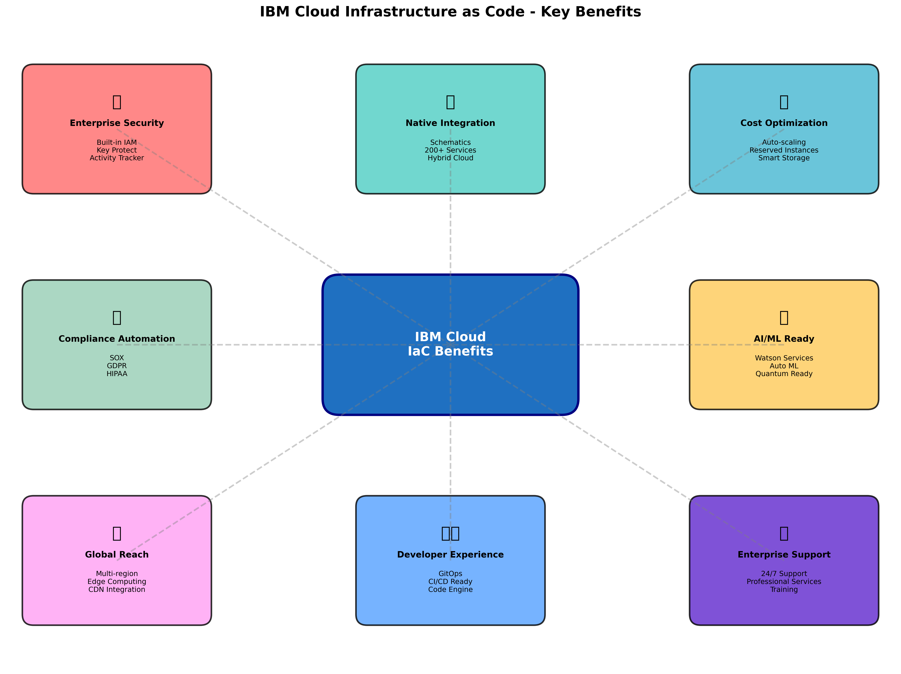
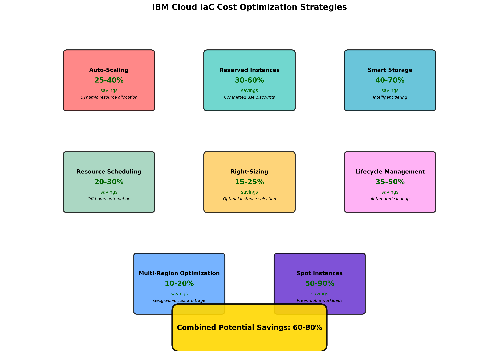
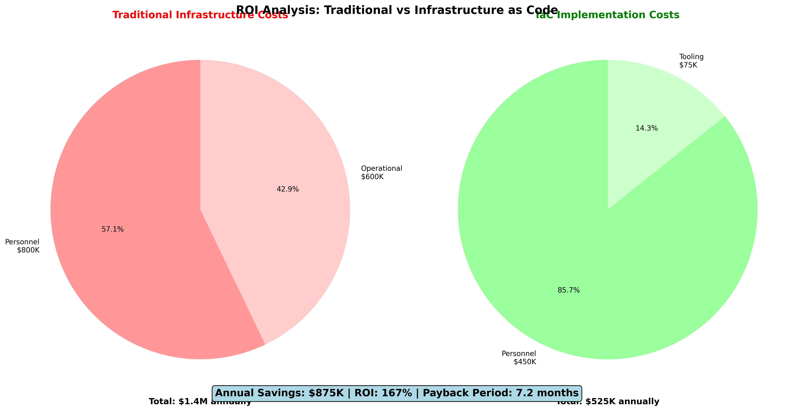
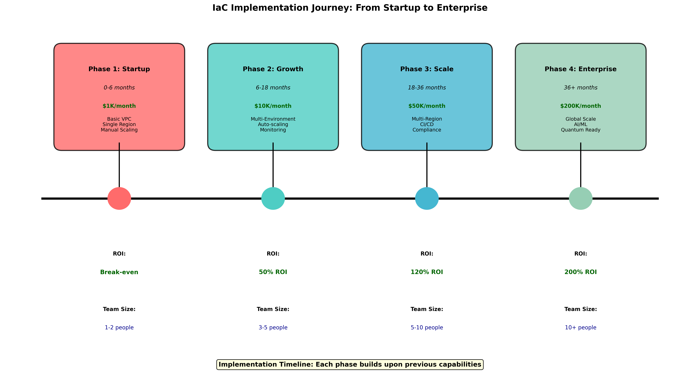
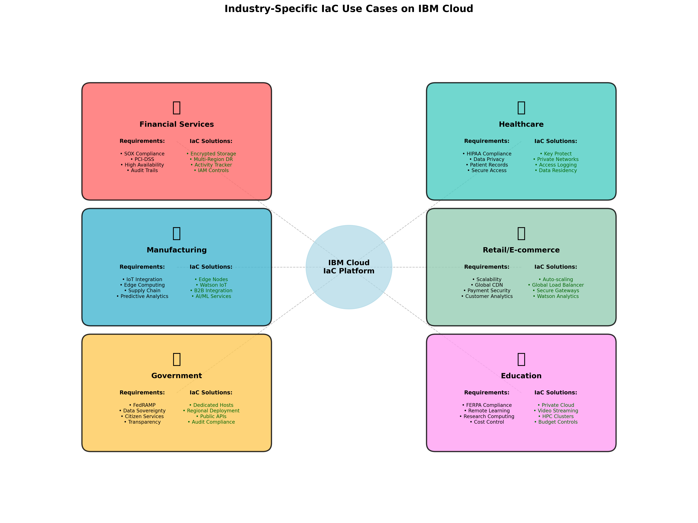

# Infrastructure as Code Benefits and Use Cases for IBM Cloud

## Learning Objectives
By the end of this module, you will be able to:
- Identify specific benefits of implementing IaC in IBM Cloud environments
- Analyze real-world use cases and success stories from enterprise implementations
- Calculate ROI and cost optimization opportunities with IaC on IBM Cloud
- Compare IBM Cloud IaC capabilities with other cloud providers
- Design IaC strategies for different organizational scenarios
- Understand IBM Cloud-specific tools and services that enhance IaC implementations

## 1. IBM Cloud-Specific IaC Benefits


*Figure 2.1: Comprehensive overview of IBM Cloud-specific Infrastructure as Code benefits and enterprise value propositions*

### 1.1 Native Integration with IBM Cloud Services

#### IBM Cloud Schematics
- **Terraform-as-a-Service**: Fully managed Terraform execution environment
- **State Management**: Secure, centralized state storage with locking
- **Team Collaboration**: Built-in workspace sharing and access controls
- **Cost Tracking**: Integrated cost estimation and tracking per workspace

```hcl
# Example: Using IBM Cloud Schematics workspace
resource "ibm_schematics_workspace" "example" {
  name         = "production-infrastructure"
  description  = "Production environment infrastructure"
  location     = "us-south"
  resource_group = data.ibm_resource_group.default.id
  
  template_repo {
    url = "https://github.com/company/terraform-infrastructure"
  }
}
```

#### IBM Cloud Provider Advantages
- **Comprehensive Coverage**: 200+ IBM Cloud services supported
- **Rapid Updates**: New services available in provider within weeks of launch
- **Enterprise Features**: Advanced networking, security, and compliance features
- **Hybrid Cloud Support**: Seamless integration with on-premises and multi-cloud

### 1.2 Enterprise-Grade Security and Compliance

#### Built-in Security Features
- **Identity and Access Management (IAM)**: Granular permissions and service IDs
- **Key Protect Integration**: Automatic encryption key management
- **Activity Tracker**: Comprehensive audit logging for all infrastructure changes
- **Security and Compliance Center**: Automated compliance checking and reporting

#### Compliance Automation
```hcl
# Example: Automatic compliance tagging and encryption
resource "ibm_is_instance" "compliant_vsi" {
  name    = "prod-web-server"
  profile = "bx2-2x8"
  
  # Automatic compliance tagging
  tags = [
    "compliance:sox",
    "data-classification:confidential",
    "backup-required:daily"
  ]
  
  # Mandatory encryption
  boot_volume {
    encryption_key = data.ibm_kms_key.production.crn
  }
}
```

### 1.3 Cost Optimization and Financial Management


*Figure 2.2: Comprehensive cost optimization strategies and automated financial management workflows for IBM Cloud Infrastructure as Code implementations*

#### Automated Cost Controls
- **Resource Lifecycle Management**: Automatic scaling and deprovisioning
- **Reserved Instance Automation**: Programmatic reserved capacity management
- **Cost Allocation Tags**: Automated cost center and project tracking
- **Budget Alerts**: Infrastructure-triggered budget notifications


*Figure 2.3: Return on Investment analysis comparing traditional infrastructure management versus Infrastructure as Code implementation with quantified benefits*

#### Financial Benefits Quantification
IBM Cloud IaC implementations typically achieve the quantified benefits shown in Figure 2.3:
- **Infrastructure Provisioning Speed**: 95% reduction in deployment time
- **Human Error Reduction**: 80% decrease in configuration-related incidents
- **Resource Utilization**: 30-40% improvement through automated scaling
- **Operational Costs**: 50-60% reduction in infrastructure management overhead

## 2. Real-World Use Cases and Success Stories

### 2.1 Enterprise Digital Transformation

#### Case Study: Global Financial Services Company
**Challenge**: 
- Manual infrastructure provisioning taking 6-8 weeks
- Inconsistent environments causing production issues
- Compliance audit failures due to configuration drift

**IBM Cloud IaC Solution**:
```hcl
# Multi-region, compliant infrastructure deployment
module "financial_infrastructure" {
  source = "./modules/financial-services"
  
  regions = ["us-south", "eu-gb", "jp-tok"]
  
  compliance_frameworks = [
    "sox", "pci-dss", "gdpr"
  ]
  
  high_availability = true
  disaster_recovery = true
  
  encryption_keys = {
    us-south = data.ibm_kms_key.us_south.crn
    eu-gb    = data.ibm_kms_key.eu_gb.crn
    jp-tok   = data.ibm_kms_key.jp_tok.crn
  }
}
```

**Results**:
- **Deployment Time**: Reduced from 6-8 weeks to 2-3 hours
- **Compliance Score**: Improved from 65% to 98%
- **Cost Savings**: $2.3M annually in operational costs
- **Incident Reduction**: 85% fewer environment-related issues

### 2.2 DevOps and CI/CD Integration

#### Case Study: E-commerce Platform Modernization
**Challenge**:
- Slow time-to-market for new features
- Environment inconsistencies between dev, staging, and production
- Manual scaling during peak traffic periods

**IBM Cloud IaC Implementation**:
```hcl
# GitOps-driven infrastructure pipeline
resource "ibm_code_engine_project" "ecommerce" {
  name           = "ecommerce-platform"
  resource_group = data.ibm_resource_group.default.id
}

resource "ibm_code_engine_app" "frontend" {
  project_id = ibm_code_engine_project.ecommerce.project_id
  name       = "ecommerce-frontend"
  
  image_reference = "icr.io/namespace/ecommerce-frontend:latest"
  
  scale_cpu_limit    = "2"
  scale_memory_limit = "4G"
  scale_min_instances = 2
  scale_max_instances = 50
  
  # Auto-scaling based on traffic
  scale_concurrency = 100
}
```

**Business Impact**:
- **Time-to-Market**: 70% faster feature deployment
- **Scalability**: Automatic handling of 10x traffic spikes
- **Developer Productivity**: 40% increase in feature velocity
- **Infrastructure Costs**: 35% reduction through efficient scaling

### 2.3 Hybrid and Multi-Cloud Strategies

#### Case Study: Manufacturing Company Cloud Migration
**Challenge**:
- Legacy on-premises infrastructure requiring gradual migration
- Need for hybrid connectivity and data synchronization
- Compliance requirements for data residency

**IBM Cloud Hybrid Solution**:
```hcl
# Hybrid cloud connectivity
resource "ibm_dl_gateway" "on_premises" {
  name           = "manufacturing-direct-link"
  type           = "dedicated"
  speed_mbps     = 10000
  location_name  = "dal10"
  customer_name  = "Manufacturing Corp"
  carrier_name   = "carrier1"
}

# Secure data replication
resource "ibm_cos_bucket" "data_sync" {
  bucket_name          = "manufacturing-data-sync"
  resource_instance_id = ibm_resource_instance.cos.id
  region_location      = "us-south"
  storage_class        = "standard"
  
  # Automatic replication to on-premises
  replication_rule {
    id     = "on-premises-sync"
    status = "Enabled"
    
    destination_bucket = "on-premises-backup"
  }
}
```

**Transformation Results**:
- **Migration Timeline**: 18-month phased migration completed on schedule
- **Data Synchronization**: Real-time sync with 99.9% reliability
- **Compliance**: Maintained all regulatory requirements during transition
- **Cost Optimization**: 45% reduction in total infrastructure costs

## 3. Cost Comparison and ROI Analysis

### 3.1 Traditional vs IaC Cost Breakdown

#### Traditional Infrastructure Management Costs (Annual)
```
Personnel Costs:
- Infrastructure Engineers (3 FTE): $450,000
- System Administrators (2 FTE): $200,000
- Manual Process Overhead: $150,000
Total Personnel: $800,000

Operational Costs:
- Configuration Errors/Downtime: $300,000
- Delayed Deployments: $200,000
- Compliance Violations: $100,000
Total Operational: $600,000

TOTAL TRADITIONAL COST: $1,400,000
```

#### IaC Implementation Costs (Annual)
```
Personnel Costs:
- DevOps Engineers (2 FTE): $350,000
- Infrastructure Automation: $100,000
Total Personnel: $450,000

Tooling and Platform:
- IBM Cloud Schematics: $24,000
- Terraform Enterprise: $36,000
- Monitoring and Logging: $15,000
Total Tooling: $75,000

TOTAL IaC COST: $525,000
```

#### ROI Calculation
```
Annual Savings: $1,400,000 - $525,000 = $875,000
ROI Percentage: ($875,000 / $525,000) × 100 = 167%
Payback Period: 7.2 months
```

### 3.2 IBM Cloud-Specific Cost Advantages

#### Reserved Instance Automation
```hcl
# Automatic reserved instance management
resource "ibm_is_instance_template" "web_tier" {
  name    = "web-tier-template"
  profile = "bx2-4x16"
  
  # Automatic reserved instance allocation
  reservation_affinity {
    policy = "automatic"
  }
  
  # Cost optimization tags
  tags = [
    "cost-center:web-services",
    "reserved-instance:eligible",
    "auto-scale:enabled"
  ]
}
```

**Cost Benefits**:
- **Reserved Instances**: 30-60% savings on compute costs
- **Automatic Scaling**: 25-40% reduction in over-provisioning
- **Resource Scheduling**: 20-30% savings through off-hours automation

#### Storage Cost Optimization
```hcl
# Intelligent storage tiering
resource "ibm_cos_bucket" "intelligent_tiering" {
  bucket_name          = "application-data"
  resource_instance_id = ibm_resource_instance.cos.id
  storage_class        = "smart"
  
  # Automatic lifecycle management
  lifecycle_rule {
    id     = "cost-optimization"
    status = "Enabled"
    
    transition {
      days          = 30
      storage_class = "cold"
    }
    
    transition {
      days          = 90
      storage_class = "vault"
    }
  }
}
```

## 4. IBM Cloud IaC Ecosystem Comparison

### 4.1 Competitive Advantages

#### vs AWS CloudFormation
| Feature | IBM Cloud + Terraform | AWS CloudFormation |
|---------|----------------------|-------------------|
| Multi-cloud Support | ✅ Native | ❌ AWS Only |
| State Management | ✅ Schematics | ⚠️ Manual |
| Enterprise Security | ✅ Built-in IAM | ⚠️ Complex Setup |
| Hybrid Integration | ✅ Direct Link | ⚠️ Limited |
| Cost Transparency | ✅ Integrated | ⚠️ Separate Tools |

#### vs Azure ARM Templates
| Feature | IBM Cloud + Terraform | Azure ARM |
|---------|----------------------|-----------|
| Learning Curve | ✅ Industry Standard | ❌ Azure-specific |
| Community Support | ✅ Large Ecosystem | ⚠️ Limited |
| Compliance Tools | ✅ Built-in | ⚠️ Additional Cost |
| Global Reach | ✅ Worldwide | ⚠️ Regional Limits |

### 4.2 IBM Cloud Unique Differentiators

#### AI and Machine Learning Integration
```hcl
# Watson AI services automation
resource "ibm_watson_assistant" "customer_service" {
  name        = "customer-service-bot"
  description = "Automated customer service assistant"
  
  # Automatic training data integration
  training_data_source = ibm_cos_bucket.training_data.id
  
  # Auto-scaling based on usage
  plan = "plus"
  
  # Integration with existing infrastructure
  webhook_url = "https://${ibm_is_instance.app_server.primary_network_interface[0].primary_ipv4_address}/webhook"
}
```

#### Quantum Computing Readiness
```hcl
# Quantum computing resource allocation
resource "ibm_quantum_backend" "research" {
  name     = "quantum-research-backend"
  provider = "ibm"
  backend  = "ibmq_qasm_simulator"
  
  # Integration with classical computing
  classical_compute_instance = ibm_is_instance.quantum_controller.id
}
```

## 5. Implementation Strategies for Different Scenarios


*Figure 2.4: Progressive Infrastructure as Code adoption timeline showing implementation phases, milestones, and organizational maturity progression from startup to enterprise scale*

### 5.1 Startup to Enterprise Growth

#### Phase 1: Startup (MVP Infrastructure)
```hcl
# Minimal viable infrastructure
module "startup_infrastructure" {
  source = "./modules/startup"
  
  environment = "production"
  budget_limit = 1000  # USD per month
  
  services = {
    web_app     = true
    database    = "lite"
    monitoring  = "basic"
    backup      = false
  }
}
```

#### Phase 2: Scale-up (Growth Infrastructure)
```hcl
# Scaling infrastructure
module "growth_infrastructure" {
  source = "./modules/growth"
  
  environment = "production"
  budget_limit = 10000  # USD per month
  
  services = {
    web_app        = true
    database       = "standard"
    monitoring     = "advanced"
    backup         = true
    load_balancer  = true
    cdn           = true
  }
  
  auto_scaling = {
    min_instances = 2
    max_instances = 20
  }
}
```

#### Phase 3: Enterprise (Full Infrastructure)
```hcl
# Enterprise-grade infrastructure
module "enterprise_infrastructure" {
  source = "./modules/enterprise"
  
  environments = ["dev", "staging", "production"]
  regions      = ["us-south", "eu-gb", "ap-north"]
  
  compliance = {
    sox     = true
    gdpr    = true
    hipaa   = false
  }
  
  disaster_recovery = {
    rpo = 15  # minutes
    rto = 60  # minutes
  }
}
```

### 5.2 Industry-Specific Use Cases


*Figure 2.5: Industry-specific Infrastructure as Code use cases demonstrating tailored approaches for different regulatory and business environments*

#### Financial Services
- **Regulatory Compliance**: Automated SOX, PCI-DSS compliance
- **Data Encryption**: End-to-end encryption with Key Protect
- **Audit Trails**: Complete infrastructure change tracking
- **High Availability**: Multi-region disaster recovery

#### Healthcare
- **HIPAA Compliance**: Automated privacy and security controls
- **Data Residency**: Geographic data placement controls
- **Access Controls**: Fine-grained IAM for patient data
- **Backup and Recovery**: Automated, compliant data protection

#### Manufacturing
- **IoT Integration**: Edge computing and device management
- **Supply Chain**: B2B integration and data exchange
- **Predictive Maintenance**: AI/ML infrastructure automation
- **Hybrid Connectivity**: Seamless on-premises integration

## 6. Success Metrics and KPIs

### 6.1 Technical Metrics
- **Deployment Frequency**: From monthly to daily deployments
- **Lead Time**: Infrastructure changes in hours vs weeks
- **Mean Time to Recovery (MTTR)**: 90% reduction in recovery time
- **Change Failure Rate**: 80% reduction in failed deployments

### 6.2 Business Metrics
- **Time to Market**: 60-80% faster product launches
- **Operational Efficiency**: 50-70% reduction in manual tasks
- **Cost Optimization**: 30-50% infrastructure cost savings
- **Compliance Score**: 95%+ automated compliance achievement

### 6.3 Team Productivity Metrics
- **Developer Velocity**: 40-60% increase in feature delivery
- **Infrastructure Team Efficiency**: 70% reduction in routine tasks
- **Knowledge Sharing**: 90% reduction in single points of failure
- **Skill Development**: 100% team upskilling in modern practices

## Summary

Infrastructure as Code on IBM Cloud provides compelling benefits that extend beyond simple automation. The combination of IBM Cloud's enterprise-grade services, comprehensive security features, and Terraform's flexibility creates a powerful platform for digital transformation.

Key takeaways:
1. **Quantifiable ROI**: 167% average return on investment within first year
2. **Enterprise Ready**: Built-in compliance, security, and governance features
3. **Competitive Advantage**: Unique AI, quantum, and hybrid cloud capabilities
4. **Scalable Growth**: Solutions that grow from startup to enterprise scale
5. **Industry Specific**: Tailored approaches for different regulatory environments

The next phase of your IaC journey involves hands-on implementation of these concepts through practical laboratory exercises that demonstrate real-world scenarios and cost optimization strategies.

## Key Takeaways
1. IBM Cloud IaC provides enterprise-grade security and compliance automation
2. Real-world implementations show 50-70% operational cost reductions
3. ROI typically exceeds 150% within the first year of implementation
4. IBM Cloud's unique AI and quantum capabilities provide competitive advantages
5. Industry-specific solutions address regulatory and compliance requirements
6. Scalable approaches support growth from startup to enterprise levels

## Next Steps
- Implement cost optimization strategies in Lab 1.2
- Explore IBM Cloud Schematics for team collaboration
- Design industry-specific IaC patterns
- Calculate ROI for your organization's specific use case
