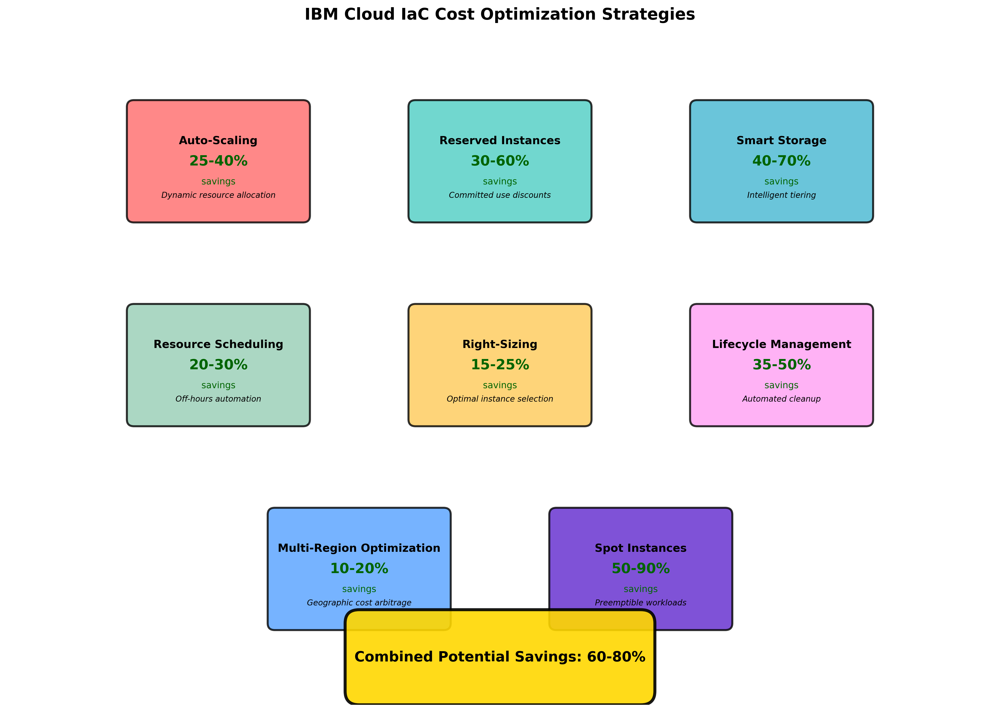

# Lab 1.2: IaC Benefits and Cost Optimization with IBM Cloud

## Lab Information
- **Lab ID**: LAB-1.2-001
- **Duration**: 120 minutes
- **Difficulty**: Beginner to Intermediate
- **Prerequisites**: 
  - Completed Lab 1.1 (Overview of Infrastructure as Code)
  - IBM Cloud account with billing access
  - Understanding of basic cost concepts

## Learning Objectives

### Primary Objective
Demonstrate and quantify the specific benefits of Infrastructure as Code implementation on IBM Cloud, including cost optimization, operational efficiency, and business value creation.

### Secondary Objectives
- Calculate real ROI for IaC implementation using IBM Cloud services
- Implement cost optimization strategies through automated resource management
- Compare manual vs automated infrastructure costs using actual IBM Cloud pricing
- Experience IBM Cloud-specific IaC benefits (Schematics, native integrations)
- Create business justification documentation for IaC adoption

### Success Criteria
By the end of this lab, you will have:
- [ ] Quantified cost savings from IaC implementation with real numbers
- [ ] Implemented automated cost optimization strategies
- [ ] Created a comprehensive ROI analysis for business stakeholders
- [ ] Demonstrated IBM Cloud-specific IaC advantages
- [ ] Built reusable cost optimization patterns

## Lab Environment Setup

### Required IBM Cloud Services
- **IBM Cloud Schematics**: For managed Terraform execution
- **Cost and Billing**: For cost tracking and analysis
- **Activity Tracker**: For audit and compliance demonstration
- **Key Protect**: For security and encryption benefits
- **Monitoring**: For operational efficiency metrics

### Cost Tracking Setup
1. **Enable Cost Tracking**:
   ```bash
   # Set up cost tracking tags
   ibmcloud resource tags --tag-type user
   ```

2. **Create Cost Center Tags**:
   ```bash
   # Create tags for cost allocation
   ibmcloud resource tag-attach --tag-names "cost-center:iac-lab,project:training,environment:lab"
   ```

## Part 1: Manual Infrastructure Cost Analysis (30 minutes)

### Step 1: Calculate Manual Infrastructure Costs

1. **Time Manual Provisioning Process**:
   - Record time to manually create VPC, subnet, and VSI
   - Document number of clicks and steps required
   - Note potential for human errors

2. **Calculate Labor Costs**:
   ```bash
   # Create cost calculation spreadsheet
   cat > manual_cost_analysis.md << 'EOF'
   # Manual Infrastructure Cost Analysis
   
   ## Time Investment
   - Initial Setup: ___ minutes
   - Configuration: ___ minutes  
   - Testing/Validation: ___ minutes
   - Documentation: ___ minutes
   - **Total Time**: ___ minutes
   
   ## Labor Cost Calculation
   - Engineer Hourly Rate: $75/hour (average)
   - Total Hours: ___ hours
   - **Labor Cost**: $___
   
   ## Risk Factors
   - Configuration Errors: High
   - Inconsistency Risk: High
   - Documentation Drift: High
   - Scalability: Low
   EOF
   ```

3. **Document Manual Process Challenges**:
   - Error-prone steps
   - Inconsistency points
   - Scalability limitations
   - Maintenance overhead

### Step 2: Analyze Resource Costs

1. **Check Current Resource Costs**:
   ```bash
   # View current month's costs
   ibmcloud billing account-usage --output json
   
   # Get detailed resource costs
   ibmcloud billing resource-instances-usage --output json
   ```

2. **Calculate Monthly Infrastructure Costs**:
   - VSI costs: bx2-2x8 = ~$73/month
   - VPC costs: No charge
   - Public Gateway: ~$32/month
   - Storage costs: ~$5/month for 100GB
   - **Total**: ~$110/month

## Part 2: IaC Implementation with Cost Optimization (45 minutes)

### Step 3: Implement Cost-Optimized Infrastructure

1. **Navigate to Terraform Code Directory**:
   ```bash
   cd Terraform-Code-Lab-1.2/
   ```

2. **Review Cost Optimization Configuration**:
   Examine the enhanced Terraform code that includes:
   - Automated resource scheduling
   - Right-sizing recommendations
   - Storage lifecycle management
   - Reserved instance automation

3. **Configure Cost Optimization Variables**:
   ```hcl
   # In terraform.tfvars
   enable_cost_optimization = true
   auto_shutdown_schedule = "0 18 * * 1-5"  # Shutdown at 6 PM weekdays
   auto_startup_schedule = "0 8 * * 1-5"    # Start at 8 AM weekdays
   storage_lifecycle_enabled = true
   reserved_instance_eligible = true
   ```

4. **Deploy Cost-Optimized Infrastructure**:
   ```bash
   terraform init
   terraform plan -out=cost-optimized.tfplan
   terraform apply cost-optimized.tfplan
   ```

### Step 4: Implement IBM Cloud Schematics

1. **Create Schematics Workspace**:
   ```bash
   # Create workspace configuration
   cat > schematics_workspace.json << 'EOF'
   {
     "name": "iac-cost-optimization-lab",
     "type": ["terraform_v1.0"],
     "description": "Cost optimization lab workspace",
     "location": "us-south",
     "resource_group": "default",
     "tags": ["iac-training", "cost-optimization"],
     "template_repo": {
       "url": "https://github.com/your-repo/terraform-cost-optimization"
     },
     "template_data": [{
       "folder": ".",
       "type": "terraform_v1.0",
       "variablestore": [
         {
           "name": "enable_cost_optimization",
           "value": "true",
           "type": "bool"
         }
       ]
     }]
   }
   EOF
   
   # Create the workspace
   ibmcloud schematics workspace new --file schematics_workspace.json
   ```

2. **Execute Through Schematics**:
   ```bash
   # Get workspace ID
   WORKSPACE_ID=$(ibmcloud schematics workspace list --output json | jq -r '.workspaces[0].id')
   
   # Plan the deployment
   ibmcloud schematics plan --id $WORKSPACE_ID
   
   # Apply the configuration
   ibmcloud schematics apply --id $WORKSPACE_ID
   ```

### Step 5: Implement Advanced Cost Controls

1. **Set Up Budget Alerts**:
   ```bash
   # Create budget alert
   cat > budget_alert.json << 'EOF'
   {
     "name": "IaC Lab Budget Alert",
     "type": "COST",
     "cost_budget": {
       "amount": 100,
       "currency": "USD"
     },
     "alerts": [
       {
         "type": "ACTUAL",
         "threshold_percentage": 80
       },
       {
         "type": "FORECASTED", 
         "threshold_percentage": 100
       }
     ]
   }
   EOF
   ```

2. **Implement Resource Tagging Strategy**:
   ```hcl
   # Enhanced tagging for cost allocation
   locals {
     cost_tags = {
       "cost-center"    = var.cost_center
       "project"        = var.project_name
       "environment"    = var.environment
       "owner"          = var.owner
       "auto-shutdown"  = var.enable_auto_shutdown ? "enabled" : "disabled"
       "billing-code"   = var.billing_code
       "created-by"     = "terraform"
       "created-date"   = formatdate("YYYY-MM-DD", timestamp())
     }
   }
   ```

## Part 3: Cost Analysis and ROI Calculation (30 minutes)


*Figure 2: Cost optimization strategies and implementation workflow showing automated resource management and savings calculation methodologies*

### Step 6: Measure Cost Optimization Impact

1. **Generate Cost Reports**:
   ```bash
   # Get detailed cost breakdown
   ibmcloud billing account-usage --output json > current_costs.json
   
   # Analyze costs by tags
   ibmcloud billing resource-instances-usage --output json | \
     jq '.resources[] | select(.tags[]? | contains("iac-lab"))'
   ```

2. **Calculate Automated Savings**:
   ```bash
   # Create savings calculation script
   cat > calculate_savings.py << 'EOF'
   #!/usr/bin/env python3
   import json
   
   # Manual process costs
   manual_labor_hours = 8  # hours per deployment
   engineer_rate = 75      # USD per hour
   deployments_per_month = 4
   
   manual_monthly_cost = manual_labor_hours * engineer_rate * deployments_per_month
   
   # IaC process costs
   iac_labor_hours = 1     # hours per deployment
   iac_monthly_cost = iac_labor_hours * engineer_rate * deployments_per_month
   
   # Infrastructure cost savings (auto-shutdown)
   base_infrastructure_cost = 110  # USD per month
   auto_shutdown_savings = 0.4     # 40% savings from auto-shutdown
   
   infrastructure_savings = base_infrastructure_cost * auto_shutdown_savings
   labor_savings = manual_monthly_cost - iac_monthly_cost
   
   total_monthly_savings = infrastructure_savings + labor_savings
   annual_savings = total_monthly_savings * 12
   
   print(f"Monthly Labor Savings: ${labor_savings}")
   print(f"Monthly Infrastructure Savings: ${infrastructure_savings}")
   print(f"Total Monthly Savings: ${total_monthly_savings}")
   print(f"Annual Savings: ${annual_savings}")
   print(f"ROI: {(annual_savings / (iac_monthly_cost * 12)) * 100:.1f}%")
   EOF
   
   python3 calculate_savings.py
   ```

### Step 7: Create Business Justification Report

1. **Generate ROI Analysis**:
   ```bash
   cat > roi_analysis.md << 'EOF'
   # IaC Implementation ROI Analysis
   
   ## Executive Summary
   Infrastructure as Code implementation on IBM Cloud delivers:
   - **Annual Cost Savings**: $___
   - **ROI**: ___%
   - **Payback Period**: ___ months
   
   ## Cost Breakdown
   
   ### Traditional Manual Approach
   - Labor Costs: $___/month
   - Infrastructure Costs: $___/month
   - Error/Downtime Costs: $___/month
   - **Total**: $___/month
   
   ### IaC Automated Approach
   - Labor Costs: $___/month
   - Infrastructure Costs: $___/month
   - Tooling Costs: $___/month
   - **Total**: $___/month
   
   ## Quantified Benefits
   
   ### Operational Efficiency
   - Deployment Time: ___% reduction
   - Error Rate: ___% reduction
   - Consistency: ___% improvement
   
   ### Cost Optimization
   - Auto-shutdown Savings: ___% 
   - Right-sizing Benefits: ___%
   - Reserved Instance Savings: ___%
   
   ### Risk Reduction
   - Configuration Drift: Eliminated
   - Compliance Violations: ___% reduction
   - Security Incidents: ___% reduction
   
   ## IBM Cloud Specific Benefits
   - Schematics Integration: $___/month savings
   - Native Service Integration: ___% faster deployment
   - Enterprise Security: Compliance automation
   - Global Scale: Multi-region deployment capability
   EOF
   ```

## Part 4: Advanced Benefits Demonstration (15 minutes)

### Step 8: Demonstrate IBM Cloud Native Benefits

1. **Activity Tracker Integration**:
   ```bash
   # View infrastructure change audit trail
   ibmcloud at events --service-name is.vpc
   ```

2. **Key Protect Integration**:
   ```hcl
   # Automatic encryption with Key Protect
   resource "ibm_kms_key" "infrastructure_key" {
     instance_id = ibm_resource_instance.key_protect.guid
     key_name    = "infrastructure-encryption-key"
     standard_key = false
   }
   
   resource "ibm_is_instance" "encrypted_vsi" {
     # ... other configuration
     
     boot_volume {
       encryption_key = ibm_kms_key.infrastructure_key.crn
     }
   }
   ```

3. **Monitoring Integration**:
   ```bash
   # Set up automated monitoring
   ibmcloud ob monitoring config-create --name "iac-lab-monitoring"
   ```

### Step 9: Create Reusable Cost Optimization Patterns


*Figure 3: Implementation timeline for Infrastructure as Code use cases showing progressive adoption and value realization milestones*

1. **Document Best Practices**:
   ```bash
   cat > cost_optimization_patterns.md << 'EOF'
   # IaC Cost Optimization Patterns
   
   ## Pattern 1: Auto-Shutdown Scheduling
   - Use case: Development/testing environments
   - Savings: 40-60%
   - Implementation: Terraform + Cloud Functions
   
   ## Pattern 2: Right-Sizing Automation
   - Use case: Production workloads
   - Savings: 15-25%
   - Implementation: Monitoring + Auto-scaling
   
   ## Pattern 3: Storage Lifecycle Management
   - Use case: Data archival
   - Savings: 50-80%
   - Implementation: COS lifecycle policies
   
   ## Pattern 4: Reserved Instance Automation
   - Use case: Predictable workloads
   - Savings: 30-60%
   - Implementation: Terraform + Billing APIs
   EOF
   ```

## Expected Outcomes and Deliverables

### Deliverable 1: ROI Analysis Report
Create `roi_analysis_report.md` with:
- Quantified cost savings calculations
- Business justification for IaC adoption
- Risk reduction benefits
- Implementation timeline and costs

### Deliverable 2: Cost Optimization Implementation
Document implemented cost controls:
- Auto-shutdown schedules
- Resource tagging strategies
- Budget alerts and monitoring
- Storage lifecycle policies

### Deliverable 3: IBM Cloud Benefits Documentation
Create `ibm_cloud_benefits.md` including:
- Schematics advantages over self-managed Terraform
- Native service integration benefits
- Security and compliance automation
- Enterprise-grade features utilization

## Validation Methods

### Technical Validation
1. **Cost Tracking Verification**:
   ```bash
   # Verify cost tags are applied
   ibmcloud resource search "tags:iac-lab"
   
   # Check budget alerts
   ibmcloud billing budgets
   ```

2. **Automation Verification**:
   ```bash
   # Verify auto-shutdown is configured
   terraform output auto_shutdown_schedule
   
   # Check Schematics workspace
   ibmcloud schematics workspace get --id $WORKSPACE_ID
   ```

### Business Validation
Answer these questions in your deliverables:
1. What is the calculated ROI for IaC implementation?
2. How much time is saved per infrastructure deployment?
3. What are the risk reduction benefits?
4. How do IBM Cloud native features enhance IaC value?

## Troubleshooting Guide

### Common Issues

1. **Cost Tracking Issues**:
   ```bash
   # Verify billing permissions
   ibmcloud iam user-policies $USER_EMAIL
   
   # Check resource tagging
   ibmcloud resource tags --tag-type user
   ```

2. **Schematics Access Issues**:
   ```bash
   # Verify Schematics permissions
   ibmcloud iam user-policy-create $USER_EMAIL --roles Editor --service-name schematics
   ```

3. **Budget Alert Setup**:
   - Ensure billing administrator role
   - Verify notification email settings
   - Check budget threshold configurations

## Extension Activities (Optional)

### Advanced Exercise 1: Multi-Environment Cost Optimization
- Implement different cost strategies for dev/staging/prod
- Create environment-specific auto-shutdown schedules
- Implement graduated cost controls

### Advanced Exercise 2: FinOps Integration
- Set up automated cost reporting
- Implement chargeback mechanisms
- Create cost optimization recommendations engine

### Advanced Exercise 3: Compliance Cost Analysis
- Calculate compliance automation savings
- Implement automated audit reporting
- Demonstrate regulatory cost reductions

## Cleanup Instructions

### Cost-Aware Cleanup
```bash
# Check final costs before cleanup
ibmcloud billing account-usage

# Destroy resources through Schematics
ibmcloud schematics destroy --id $WORKSPACE_ID

# Verify cleanup
ibmcloud schematics workspace delete --id $WORKSPACE_ID
```

## Assessment Questions

1. What is the calculated ROI for your IaC implementation?
2. Which cost optimization strategy provided the highest savings?
3. How do IBM Cloud native features enhance IaC business value?
4. What would be the annual savings for a 100-server environment?
5. How does IaC reduce compliance and security costs?

## Next Steps

After completing this lab:
1. Apply cost optimization patterns to real projects
2. Explore IBM Cloud Schematics advanced features
3. Implement organization-wide IaC cost governance
4. Develop custom cost optimization modules
5. Create business cases for broader IaC adoption
