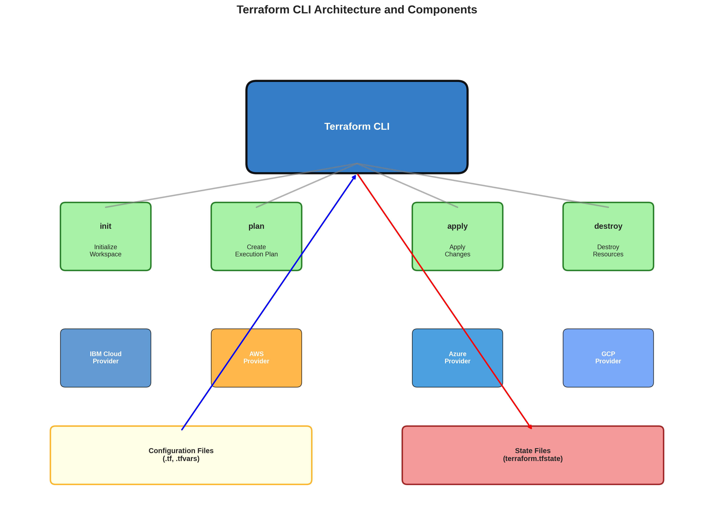
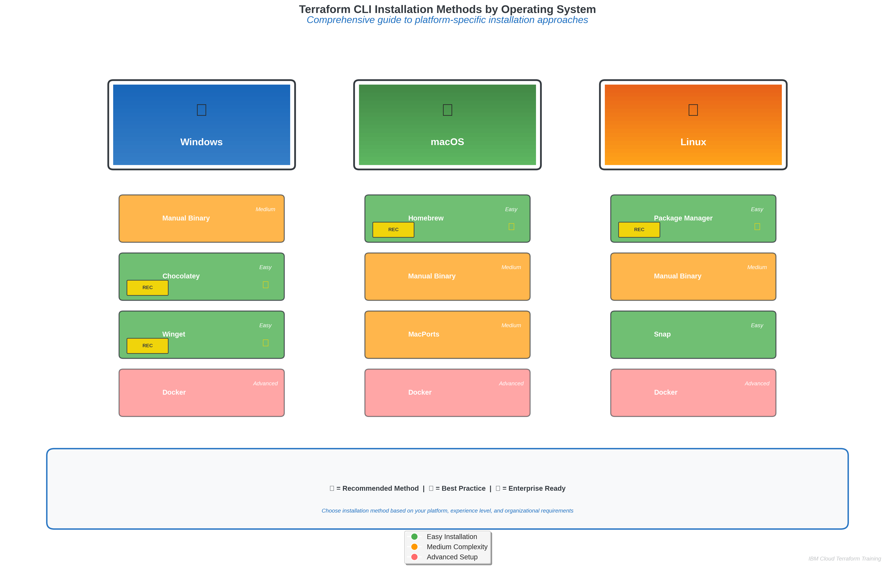
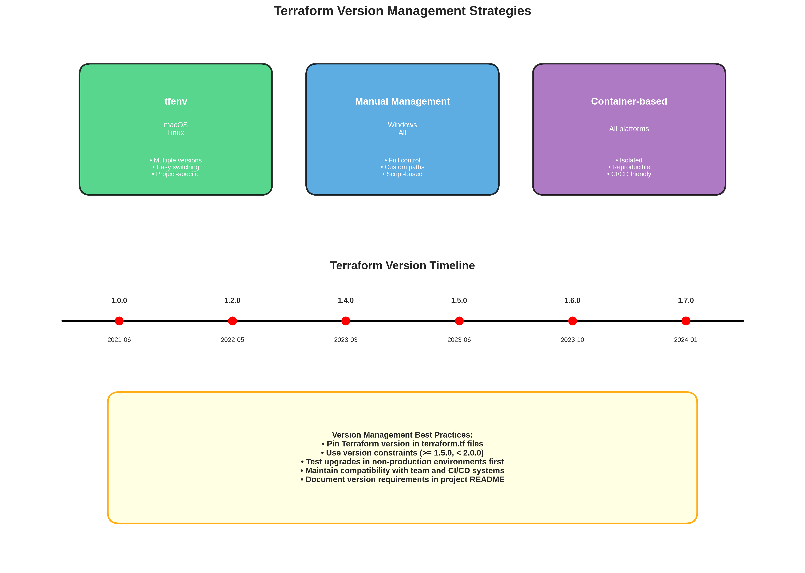

# Terraform CLI Installation - Comprehensive Guide

## Learning Objectives
By the end of this module, you will be able to:
- Install Terraform CLI on multiple operating systems (Windows, macOS, Linux)
- Verify Terraform installation and troubleshoot common installation issues
- Configure Terraform for optimal performance and security in enterprise environments
- Understand Terraform versioning strategies and best practices for team collaboration
- Set up development environments for IBM Cloud infrastructure automation

## 1. Understanding Terraform CLI

### What is Terraform CLI?
The Terraform Command Line Interface (CLI) is the primary tool for interacting with Terraform configurations. It provides a unified interface for managing infrastructure across multiple cloud providers, including IBM Cloud, through a single binary executable.


*Figure 1.1: Terraform CLI architecture showing core components, command relationships, and provider plugin ecosystem*

### Key Features
- **Cross-Platform Compatibility**: Runs on Windows, macOS, and Linux
- **Single Binary Distribution**: No complex dependencies or runtime requirements
- **Version Management**: Support for multiple Terraform versions on the same system
- **Plugin Architecture**: Automatic provider plugin management
- **State Management**: Built-in state file handling and remote backend support

### IBM Cloud Integration Benefits
- **Native IBM Cloud Provider**: First-class support for IBM Cloud services
- **Schematics Integration**: Seamless integration with IBM Cloud Schematics
- **Enterprise Features**: Support for IBM Cloud enterprise accounts and resource groups
- **Cost Management**: Integration with IBM Cloud cost tracking and billing APIs

## 2. Installation Methods Overview


*Figure 2.1: Comprehensive comparison of Terraform CLI installation methods across different operating systems*

### Official Installation Methods
1. **Binary Downloads**: Direct download from HashiCorp releases
2. **Package Managers**: Installation via system package managers
3. **Container Images**: Docker-based installation for containerized environments
4. **Cloud Shell**: Pre-installed in IBM Cloud Shell environment

The diagram above illustrates the recommended installation approach for each operating system, highlighting the most efficient methods with star indicators and showing the complete ecosystem of installation options available.

### Enterprise Considerations
- **Version Consistency**: Ensuring all team members use the same Terraform version
- **Security Scanning**: Verifying binary integrity and security compliance
- **Network Restrictions**: Installation in environments with limited internet access
- **Automation**: Scripted installation for CI/CD pipelines and development environments

## 3. Windows Installation

### Method 1: Manual Binary Installation

#### Step 1: Download Terraform
```powershell
# Download the latest Terraform binary for Windows
$terraformVersion = "1.6.0"
$downloadUrl = "https://releases.hashicorp.com/terraform/${terraformVersion}/terraform_${terraformVersion}_windows_amd64.zip"
Invoke-WebRequest -Uri $downloadUrl -OutFile "terraform.zip"
```

#### Step 2: Extract and Install
```powershell
# Extract the binary
Expand-Archive -Path "terraform.zip" -DestinationPath "C:\terraform"

# Add to PATH environment variable
$env:PATH += ";C:\terraform"
[Environment]::SetEnvironmentVariable("PATH", $env:PATH, [EnvironmentVariableTarget]::User)
```

#### Step 3: Verify Installation
```powershell
# Verify Terraform installation
terraform version
# Expected output: Terraform v1.6.0
```

### Method 2: Chocolatey Package Manager
```powershell
# Install Chocolatey (if not already installed)
Set-ExecutionPolicy Bypass -Scope Process -Force
[System.Net.ServicePointManager]::SecurityProtocol = [System.Net.ServicePointManager]::SecurityProtocol -bor 3072
iex ((New-Object System.Net.WebClient).DownloadString('https://chocolatey.org/install.ps1'))

# Install Terraform via Chocolatey
choco install terraform

# Verify installation
terraform version
```

### Method 3: Winget Package Manager
```powershell
# Install Terraform using Windows Package Manager
winget install HashiCorp.Terraform

# Verify installation
terraform version
```

### Windows-Specific Configuration
```powershell
# Set up Terraform data directory
$env:TF_DATA_DIR = "$env:USERPROFILE\.terraform.d"
New-Item -ItemType Directory -Force -Path $env:TF_DATA_DIR

# Configure Terraform CLI configuration file
$terraformrc = @"
plugin_cache_dir = "$env:USERPROFILE\.terraform.d\plugin-cache"
disable_checkpoint = true
"@
$terraformrc | Out-File -FilePath "$env:APPDATA\terraform.rc" -Encoding UTF8
```

## 4. macOS Installation

### Method 1: Homebrew Package Manager (Recommended)
```bash
# Install Homebrew (if not already installed)
/bin/bash -c "$(curl -fsSL https://raw.githubusercontent.com/Homebrew/install/HEAD/install.sh)"

# Install Terraform via Homebrew
brew tap hashicorp/tap
brew install hashicorp/tap/terraform

# Verify installation
terraform version
```

### Method 2: Manual Binary Installation
```bash
# Download and install Terraform manually
TERRAFORM_VERSION="1.6.0"
curl -LO "https://releases.hashicorp.com/terraform/${TERRAFORM_VERSION}/terraform_${TERRAFORM_VERSION}_darwin_amd64.zip"

# Extract and install
unzip terraform_${TERRAFORM_VERSION}_darwin_amd64.zip
sudo mv terraform /usr/local/bin/

# Verify installation
terraform version
```

### Method 3: MacPorts
```bash
# Install Terraform via MacPorts
sudo port install terraform

# Verify installation
terraform version
```

### macOS-Specific Configuration
```bash
# Set up Terraform configuration directory
mkdir -p ~/.terraform.d/plugin-cache

# Create Terraform CLI configuration
cat > ~/.terraformrc << EOF
plugin_cache_dir = "$HOME/.terraform.d/plugin-cache"
disable_checkpoint = true
EOF

# Set environment variables for IBM Cloud
echo 'export IBMCLOUD_API_KEY="your-api-key-here"' >> ~/.zshrc
echo 'export IC_API_KEY="your-api-key-here"' >> ~/.zshrc
source ~/.zshrc
```

## 5. Linux Installation

### Method 1: Package Manager Installation

#### Ubuntu/Debian
```bash
# Add HashiCorp GPG key and repository
wget -O- https://apt.releases.hashicorp.com/gpg | gpg --dearmor | sudo tee /usr/share/keyrings/hashicorp-archive-keyring.gpg
echo "deb [signed-by=/usr/share/keyrings/hashicorp-archive-keyring.gpg] https://apt.releases.hashicorp.com $(lsb_release -cs) main" | sudo tee /etc/apt/sources.list.d/hashicorp.list

# Update package list and install Terraform
sudo apt update
sudo apt install terraform

# Verify installation
terraform version
```

#### CentOS/RHEL/Fedora
```bash
# Add HashiCorp repository
sudo yum install -y yum-utils
sudo yum-config-manager --add-repo https://rpm.releases.hashicorp.com/RHEL/hashicorp.repo

# Install Terraform
sudo yum install terraform

# Verify installation
terraform version
```

#### Arch Linux
```bash
# Install Terraform via pacman
sudo pacman -S terraform

# Verify installation
terraform version
```

### Method 2: Manual Binary Installation
```bash
# Download and install Terraform manually
TERRAFORM_VERSION="1.6.0"
wget "https://releases.hashicorp.com/terraform/${TERRAFORM_VERSION}/terraform_${TERRAFORM_VERSION}_linux_amd64.zip"

# Extract and install
unzip terraform_${TERRAFORM_VERSION}_linux_amd64.zip
sudo mv terraform /usr/local/bin/

# Make executable
sudo chmod +x /usr/local/bin/terraform

# Verify installation
terraform version
```

### Linux-Specific Configuration
```bash
# Set up Terraform configuration directory
mkdir -p ~/.terraform.d/plugin-cache

# Create Terraform CLI configuration
cat > ~/.terraformrc << EOF
plugin_cache_dir = "$HOME/.terraform.d/plugin-cache"
disable_checkpoint = true
disable_checkpoint_signature = true
EOF

# Set up environment variables
echo 'export TF_LOG_PATH="$HOME/.terraform.d/terraform.log"' >> ~/.bashrc
echo 'export IBMCLOUD_API_KEY="your-api-key-here"' >> ~/.bashrc
source ~/.bashrc
```

## 6. Container-Based Installation

### Docker Installation
```bash
# Pull official Terraform Docker image
docker pull hashicorp/terraform:1.6.0

# Create alias for easy usage
echo 'alias terraform="docker run --rm -it -v $(pwd):/workspace -w /workspace hashicorp/terraform:1.6.0"' >> ~/.bashrc
source ~/.bashrc

# Verify installation
terraform version
```

### Kubernetes Deployment
```yaml
# terraform-deployment.yaml
apiVersion: apps/v1
kind: Deployment
metadata:
  name: terraform-runner
spec:
  replicas: 1
  selector:
    matchLabels:
      app: terraform-runner
  template:
    metadata:
      labels:
        app: terraform-runner
    spec:
      containers:
      - name: terraform
        image: hashicorp/terraform:1.6.0
        command: ["sleep", "infinity"]
        env:
        - name: IBMCLOUD_API_KEY
          valueFrom:
            secretKeyRef:
              name: ibm-cloud-credentials
              key: api-key
```

## 7. Version Management


*Figure 7.1: Comprehensive comparison of Terraform version management approaches including tfenv, manual management, and container-based solutions*

### Multiple Version Management with tfenv
```bash
# Install tfenv (Terraform version manager)
git clone https://github.com/tfutils/tfenv.git ~/.tfenv
echo 'export PATH="$HOME/.tfenv/bin:$PATH"' >> ~/.bashrc
source ~/.bashrc

# Install specific Terraform versions
tfenv install 1.6.0
tfenv install 1.5.7

# Use specific version
tfenv use 1.6.0

# List available versions
tfenv list-remote

# Set default version
tfenv use default 1.6.0
```

### Version Constraints in Projects
```hcl
# terraform.tf - Version constraints
terraform {
  required_version = ">= 1.5.0, < 2.0.0"
  
  required_providers {
    ibm = {
      source  = "IBM-Cloud/ibm"
      version = "~> 1.58.0"
    }
  }
}
```

## 8. Enterprise Configuration

### Terraform CLI Configuration File
```hcl
# ~/.terraformrc or %APPDATA%\terraform.rc
plugin_cache_dir   = "$HOME/.terraform.d/plugin-cache"
disable_checkpoint = true

# Provider installation configuration
provider_installation {
  filesystem_mirror {
    path    = "/usr/share/terraform/providers"
    include = ["registry.terraform.io/*/*"]
  }
  direct {
    exclude = ["registry.terraform.io/*/*"]
  }
}

# Credentials configuration
credentials "app.terraform.io" {
  token = "your-terraform-cloud-token"
}
```

### Environment Variables for IBM Cloud
```bash
# Essential IBM Cloud environment variables
export IBMCLOUD_API_KEY="your-ibm-cloud-api-key"
export IC_API_KEY="your-ibm-cloud-api-key"  # Alternative format
export IBMCLOUD_REGION="us-south"
export IBMCLOUD_RESOURCE_GROUP="default"

# Terraform-specific environment variables
export TF_LOG="INFO"
export TF_LOG_PATH="./terraform.log"
export TF_INPUT="false"
export TF_CLI_CONFIG_FILE="$HOME/.terraformrc"

# Plugin cache for faster initialization
export TF_PLUGIN_CACHE_DIR="$HOME/.terraform.d/plugin-cache"
```

## 9. Verification and Testing

### Basic Verification Commands
```bash
# Check Terraform version
terraform version

# Validate Terraform installation
terraform -help

# Check available commands
terraform -help | grep "Available commands"

# Test provider installation capability
terraform init -help
```

### IBM Cloud Provider Test
```bash
# Create a simple test configuration
mkdir terraform-test && cd terraform-test

cat > main.tf << EOF
terraform {
  required_providers {
    ibm = {
      source  = "IBM-Cloud/ibm"
      version = "~> 1.58.0"
    }
  }
}

provider "ibm" {
  region = "us-south"
}

data "ibm_resource_group" "default" {
  name = "default"
}

output "resource_group_id" {
  value = data.ibm_resource_group.default.id
}
EOF

# Test initialization and planning
terraform init
terraform plan
```

### Performance Testing
```bash
# Test plugin cache functionality
time terraform init

# Test with plugin cache
export TF_PLUGIN_CACHE_DIR="$HOME/.terraform.d/plugin-cache"
time terraform init

# Compare initialization times
```

## 10. Troubleshooting Common Issues

### Installation Issues

#### Issue 1: Permission Denied
```bash
# Problem: Permission denied when installing to /usr/local/bin
# Solution: Use sudo or install to user directory
mkdir -p ~/bin
mv terraform ~/bin/
echo 'export PATH="$HOME/bin:$PATH"' >> ~/.bashrc
```

#### Issue 2: Command Not Found
```bash
# Problem: terraform command not found after installation
# Solution: Verify PATH configuration
echo $PATH
which terraform

# Add to PATH if missing
export PATH="/usr/local/bin:$PATH"
```

#### Issue 3: Version Conflicts
```bash
# Problem: Multiple Terraform versions causing conflicts
# Solution: Use version manager or specify full path
/usr/local/bin/terraform version
```

### Network and Proxy Issues
```bash
# Configure proxy for Terraform
export HTTP_PROXY="http://proxy.company.com:8080"
export HTTPS_PROXY="http://proxy.company.com:8080"
export NO_PROXY="localhost,127.0.0.1,.company.com"

# Configure Git proxy for module downloads
git config --global http.proxy http://proxy.company.com:8080
```

### IBM Cloud Authentication Issues
```bash
# Verify API key format
echo $IBMCLOUD_API_KEY | wc -c  # Should be around 44 characters

# Test API key validity
curl -X GET "https://iam.cloud.ibm.com/identity/token" \
  -H "Content-Type: application/x-www-form-urlencoded" \
  -d "grant_type=urn:ibm:params:oauth:grant-type:apikey&apikey=$IBMCLOUD_API_KEY"
```

## Summary

Proper Terraform CLI installation is the foundation for successful Infrastructure as Code implementation with IBM Cloud. The installation method you choose should align with your organization's security policies, development workflows, and operational requirements.

Key considerations for enterprise environments include version consistency across teams, security compliance, network restrictions, and integration with existing development tools. The combination of proper installation, configuration, and verification ensures a robust foundation for IBM Cloud infrastructure automation.

## Key Takeaways
1. Choose installation method based on your operating system and organizational requirements
2. Use version management tools for consistency across development teams
3. Configure Terraform CLI settings for optimal performance and security
4. Set up proper environment variables for seamless IBM Cloud integration
5. Implement verification procedures to ensure successful installation
6. Prepare troubleshooting procedures for common installation issues

## Next Steps
- Configure IBM Cloud Provider authentication and settings
- Set up development environment for IBM Cloud infrastructure projects
- Explore Terraform CLI commands and workflow integration
- Implement team collaboration practices with consistent Terraform versions
