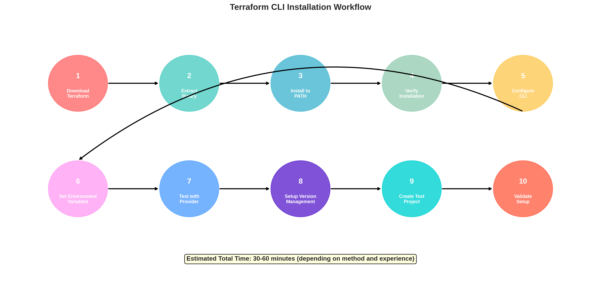
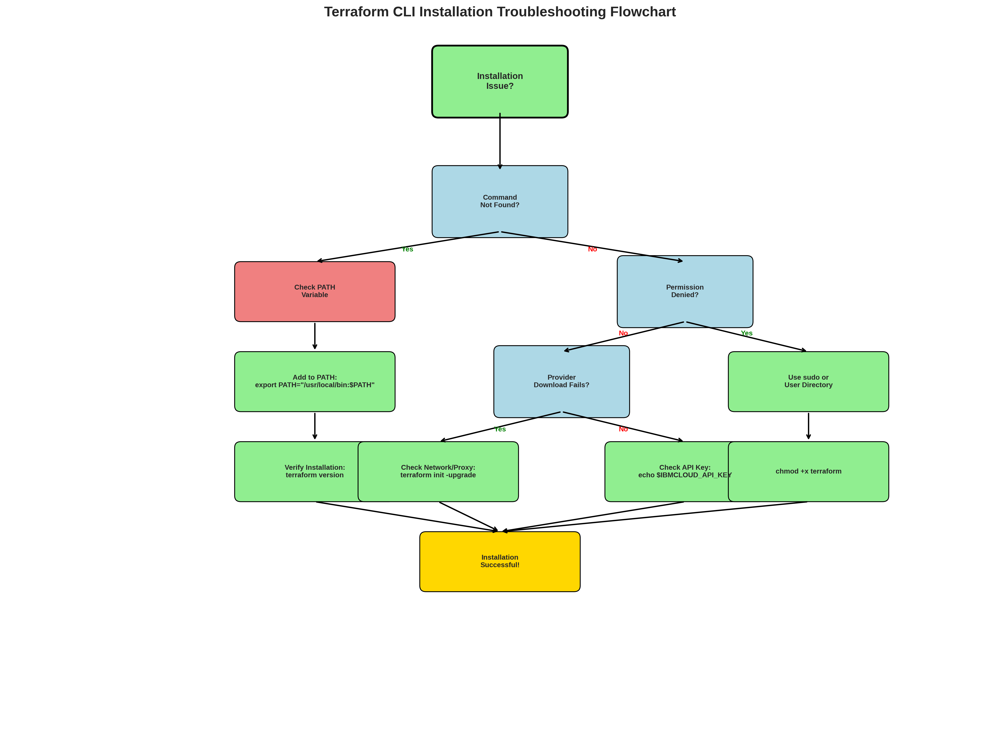

# Lab 2.1: Terraform CLI Installation and Configuration

## Lab Information
- **Lab ID**: LAB-2.1-001
- **Duration**: 90 minutes
- **Difficulty**: Beginner
- **Prerequisites**: 
  - Administrative access to your local machine
  - Internet connectivity for downloading packages
  - Basic command line familiarity

## Learning Objectives

### Primary Objective
Successfully install and configure Terraform CLI on your operating system, verify the installation, and prepare the environment for IBM Cloud infrastructure automation.

### Secondary Objectives
- Install Terraform CLI using multiple methods appropriate for your operating system
- Configure Terraform CLI for optimal performance and team collaboration
- Set up version management for consistent development environments
- Verify installation through practical testing with IBM Cloud provider
- Implement enterprise-grade configuration and security practices

### Success Criteria
By the end of this lab, you will have:
- [ ] Successfully installed Terraform CLI with version 1.5.0 or higher
- [ ] Configured Terraform CLI with appropriate settings for IBM Cloud
- [ ] Verified installation by initializing a test project with IBM Cloud provider
- [ ] Set up plugin caching for improved performance
- [ ] Documented your installation process and configuration
- [ ] Implemented version management strategy for team consistency

## Lab Environment Setup

### Required Software
- **Operating System**: Windows 10+, macOS 10.15+, or Linux (Ubuntu 20.04+)
- **Internet Access**: For downloading Terraform binary and providers
- **Command Line Tool**: PowerShell (Windows), Terminal (macOS/Linux)
- **Text Editor**: VS Code, vim, or any preferred editor

### Pre-Lab Checklist
- [ ] Verify administrative privileges on your machine
- [ ] Ensure internet connectivity and proxy settings (if applicable)
- [ ] Have IBM Cloud API key ready (from previous labs)
- [ ] Backup existing Terraform installation (if any)

## Part 1: Terraform CLI Installation (30 minutes)


*Figure 1: Complete Terraform CLI installation workflow with step-by-step progression and time estimates*

### Step 1: Choose Installation Method Based on Your OS

#### For Windows Users (Choose One Method)

**Method A: Manual Binary Installation**
1. **Download Terraform Binary**:
   ```powershell
   # Open PowerShell as Administrator
   $terraformVersion = "1.6.0"
   $downloadUrl = "https://releases.hashicorp.com/terraform/${terraformVersion}/terraform_${terraformVersion}_windows_amd64.zip"
   
   # Create installation directory
   New-Item -ItemType Directory -Force -Path "C:\terraform"
   
   # Download Terraform
   Invoke-WebRequest -Uri $downloadUrl -OutFile "C:\terraform\terraform.zip"
   ```

2. **Extract and Configure**:
   ```powershell
   # Extract the binary
   Expand-Archive -Path "C:\terraform\terraform.zip" -DestinationPath "C:\terraform" -Force
   
   # Add to PATH
   $currentPath = [Environment]::GetEnvironmentVariable("PATH", [EnvironmentVariableTarget]::User)
   if ($currentPath -notlike "*C:\terraform*") {
       [Environment]::SetEnvironmentVariable("PATH", "$currentPath;C:\terraform", [EnvironmentVariableTarget]::User)
   }
   
   # Refresh environment variables
   $env:PATH = [Environment]::GetEnvironmentVariable("PATH", [EnvironmentVariableTarget]::User)
   ```

**Method B: Chocolatey Installation**
```powershell
# Install Chocolatey (if not already installed)
Set-ExecutionPolicy Bypass -Scope Process -Force
[System.Net.ServicePointManager]::SecurityProtocol = [System.Net.ServicePointManager]::SecurityProtocol -bor 3072
iex ((New-Object System.Net.WebClient).DownloadString('https://chocolatey.org/install.ps1'))

# Install Terraform
choco install terraform -y
```

#### For macOS Users (Choose One Method)

**Method A: Homebrew Installation (Recommended)**
```bash
# Install Homebrew (if not already installed)
/bin/bash -c "$(curl -fsSL https://raw.githubusercontent.com/Homebrew/install/HEAD/install.sh)"

# Add HashiCorp tap and install Terraform
brew tap hashicorp/tap
brew install hashicorp/tap/terraform
```

**Method B: Manual Binary Installation**
```bash
# Download and install Terraform manually
TERRAFORM_VERSION="1.6.0"
cd /tmp
curl -LO "https://releases.hashicorp.com/terraform/${TERRAFORM_VERSION}/terraform_${TERRAFORM_VERSION}_darwin_amd64.zip"

# Extract and install
unzip terraform_${TERRAFORM_VERSION}_darwin_amd64.zip
sudo mv terraform /usr/local/bin/

# Verify permissions
sudo chmod +x /usr/local/bin/terraform
```

#### For Linux Users (Choose One Method)

**Method A: Package Manager Installation (Ubuntu/Debian)**
```bash
# Add HashiCorp GPG key and repository
wget -O- https://apt.releases.hashicorp.com/gpg | gpg --dearmor | sudo tee /usr/share/keyrings/hashicorp-archive-keyring.gpg
echo "deb [signed-by=/usr/share/keyrings/hashicorp-archive-keyring.gpg] https://apt.releases.hashicorp.com $(lsb_release -cs) main" | sudo tee /etc/apt/sources.list.d/hashicorp.list

# Update and install
sudo apt update
sudo apt install terraform -y
```

**Method B: Manual Binary Installation**
```bash
# Download and install Terraform manually
TERRAFORM_VERSION="1.6.0"
cd /tmp
wget "https://releases.hashicorp.com/terraform/${TERRAFORM_VERSION}/terraform_${TERRAFORM_VERSION}_linux_amd64.zip"

# Extract and install
unzip terraform_${TERRAFORM_VERSION}_linux_amd64.zip
sudo mv terraform /usr/local/bin/
sudo chmod +x /usr/local/bin/terraform
```

### Step 2: Verify Installation

**All Operating Systems:**
```bash
# Check Terraform version
terraform version

# Expected output:
# Terraform v1.6.0
# on [your_os]
```

**Troubleshooting Installation Issues:**
```bash
# If command not found, check PATH
echo $PATH  # Linux/macOS
echo $env:PATH  # Windows PowerShell

# Find Terraform binary location
which terraform  # Linux/macOS
where terraform  # Windows
```

## Part 2: Terraform CLI Configuration (25 minutes)

### Step 3: Create Terraform Configuration Directory

**Windows:**
```powershell
# Create Terraform data directory
$terraformDir = "$env:USERPROFILE\.terraform.d"
New-Item -ItemType Directory -Force -Path $terraformDir
New-Item -ItemType Directory -Force -Path "$terraformDir\plugin-cache"

# Create CLI configuration file
$terraformrc = @"
plugin_cache_dir = "$env:USERPROFILE\.terraform.d\plugin-cache"
disable_checkpoint = true
disable_checkpoint_signature = true
"@
$terraformrc | Out-File -FilePath "$env:APPDATA\terraform.rc" -Encoding UTF8
```

**macOS/Linux:**
```bash
# Create Terraform configuration directory
mkdir -p ~/.terraform.d/plugin-cache

# Create CLI configuration file
cat > ~/.terraformrc << EOF
plugin_cache_dir = "$HOME/.terraform.d/plugin-cache"
disable_checkpoint = true
disable_checkpoint_signature = true
EOF
```

### Step 4: Set Up Environment Variables

**Windows:**
```powershell
# Set Terraform environment variables
[Environment]::SetEnvironmentVariable("TF_PLUGIN_CACHE_DIR", "$env:USERPROFILE\.terraform.d\plugin-cache", [EnvironmentVariableTarget]::User)
[Environment]::SetEnvironmentVariable("TF_LOG", "INFO", [EnvironmentVariableTarget]::User)
[Environment]::SetEnvironmentVariable("TF_INPUT", "false", [EnvironmentVariableTarget]::User)

# Set IBM Cloud environment variables (replace with your API key)
[Environment]::SetEnvironmentVariable("IBMCLOUD_API_KEY", "your-api-key-here", [EnvironmentVariableTarget]::User)
```

**macOS:**
```bash
# Add to ~/.zshrc (or ~/.bash_profile for older macOS)
cat >> ~/.zshrc << EOF

# Terraform Configuration
export TF_PLUGIN_CACHE_DIR="$HOME/.terraform.d/plugin-cache"
export TF_LOG="INFO"
export TF_INPUT="false"

# IBM Cloud Configuration
export IBMCLOUD_API_KEY="your-api-key-here"
export IC_API_KEY="your-api-key-here"
export IBMCLOUD_REGION="us-south"
EOF

# Reload configuration
source ~/.zshrc
```

**Linux:**
```bash
# Add to ~/.bashrc
cat >> ~/.bashrc << EOF

# Terraform Configuration
export TF_PLUGIN_CACHE_DIR="$HOME/.terraform.d/plugin-cache"
export TF_LOG="INFO"
export TF_INPUT="false"
export TF_LOG_PATH="$HOME/.terraform.d/terraform.log"

# IBM Cloud Configuration
export IBMCLOUD_API_KEY="your-api-key-here"
export IC_API_KEY="your-api-key-here"
export IBMCLOUD_REGION="us-south"
EOF

# Reload configuration
source ~/.bashrc
```

### Step 5: Verify Configuration

```bash
# Check environment variables
terraform version
echo $TF_PLUGIN_CACHE_DIR  # Should show your cache directory
echo $IBMCLOUD_API_KEY     # Should show your API key (first few characters)

# Verify configuration file
cat ~/.terraformrc  # Linux/macOS
type %APPDATA%\terraform.rc  # Windows
```

## Part 3: Version Management Setup (20 minutes)

### Step 6: Install tfenv (Version Manager)

**macOS/Linux:**
```bash
# Install tfenv
git clone https://github.com/tfutils/tfenv.git ~/.tfenv

# Add to PATH
echo 'export PATH="$HOME/.tfenv/bin:$PATH"' >> ~/.bashrc  # Linux
echo 'export PATH="$HOME/.tfenv/bin:$PATH"' >> ~/.zshrc   # macOS

# Reload shell configuration
source ~/.bashrc  # Linux
source ~/.zshrc   # macOS

# Verify tfenv installation
tfenv --version
```

**Windows (Alternative: Manual Version Management)**
```powershell
# Create version management directory
New-Item -ItemType Directory -Force -Path "C:\terraform-versions"

# Function to switch Terraform versions (add to PowerShell profile)
function Set-TerraformVersion {
    param([string]$Version)
    $terraformPath = "C:\terraform-versions\terraform-$Version"
    if (Test-Path $terraformPath) {
        $env:PATH = "$terraformPath;" + ($env:PATH -replace "C:\\terraform-versions\\terraform-[^;]*;?", "")
        Write-Host "Switched to Terraform version $Version"
    } else {
        Write-Host "Terraform version $Version not found"
    }
}
```

### Step 7: Install Multiple Terraform Versions

**Using tfenv (macOS/Linux):**
```bash
# List available versions
tfenv list-remote | head -10

# Install specific versions
tfenv install 1.6.0
tfenv install 1.5.7

# List installed versions
tfenv list

# Use specific version
tfenv use 1.6.0

# Verify current version
terraform version
```

## Part 4: IBM Cloud Provider Testing (15 minutes)

### Step 8: Create Test Project

```bash
# Create test directory
mkdir terraform-cli-test
cd terraform-cli-test

# Create basic Terraform configuration
cat > main.tf << EOF
terraform {
  required_version = ">= 1.5.0"
  
  required_providers {
    ibm = {
      source  = "IBM-Cloud/ibm"
      version = "~> 1.58.0"
    }
  }
}

provider "ibm" {
  region = var.ibm_region
}

variable "ibm_region" {
  description = "IBM Cloud region"
  type        = string
  default     = "us-south"
}

data "ibm_resource_group" "default" {
  name = "default"
}

output "resource_group_info" {
  value = {
    id   = data.ibm_resource_group.default.id
    name = data.ibm_resource_group.default.name
  }
}
EOF
```

### Step 9: Test Terraform Workflow

```bash
# Initialize Terraform (this will download IBM Cloud provider)
terraform init

# Validate configuration
terraform validate

# Plan the configuration
terraform plan

# Expected output should show data source read operation
```

### Step 10: Performance Testing

```bash
# Test plugin cache performance
rm -rf .terraform  # Remove local plugins

# Time the initialization with cache
time terraform init

# Verify plugin cache usage
ls -la ~/.terraform.d/plugin-cache  # Should contain IBM provider
```

## Expected Outcomes and Deliverables

### Deliverable 1: Installation Documentation
Create `installation-log.md` with:
- Installation method used and rationale
- Step-by-step process followed
- Any issues encountered and solutions
- Performance benchmarks (initialization times)

### Deliverable 2: Configuration Files
Document your configuration setup:
- Terraform CLI configuration file location and contents
- Environment variables configured
- Version management setup (if applicable)

### Deliverable 3: Verification Report
Create `verification-report.md` including:
- Terraform version information
- Provider installation test results
- Performance metrics (plugin cache effectiveness)
- Environment variable verification

## Validation Methods

### Technical Validation
1. **Version Check**:
   ```bash
   terraform version
   # Should show Terraform v1.5.0 or higher
   ```

2. **Provider Installation Test**:
   ```bash
   cd terraform-cli-test
   terraform providers
   # Should show IBM Cloud provider
   ```

3. **Configuration Validation**:
   ```bash
   terraform validate
   # Should return "Success! The configuration is valid."
   ```

### Knowledge Validation
Answer these questions in your deliverables:
1. What installation method did you choose and why?
2. How does plugin caching improve Terraform performance?
3. What are the benefits of using version management for Terraform?
4. How do environment variables enhance Terraform security?

## Troubleshooting Guide


*Figure 2: Systematic troubleshooting flowchart for resolving common Terraform CLI installation issues*

### Common Issues

1. **Permission Denied Errors**:
   ```bash
   # Solution: Use appropriate permissions or user directories
   sudo chmod +x /usr/local/bin/terraform
   ```

2. **PATH Issues**:
   ```bash
   # Solution: Verify and update PATH
   export PATH="/usr/local/bin:$PATH"
   ```

3. **Provider Download Issues**:
   ```bash
   # Solution: Check network connectivity and proxy settings
   terraform init -upgrade
   ```

4. **API Key Authentication**:
   ```bash
   # Solution: Verify API key format and permissions
   echo $IBMCLOUD_API_KEY | wc -c  # Should be ~44 characters
   ```

## Extension Activities (Optional)

### Advanced Exercise 1: Automated Installation Script
Create a script that automates Terraform installation for your team:
- Detect operating system
- Install appropriate version
- Configure standard settings
- Verify installation

### Advanced Exercise 2: Enterprise Configuration
Set up enterprise-grade configuration:
- Configure provider mirrors
- Set up credential management
- Implement logging and monitoring
- Create team standards documentation

### Advanced Exercise 3: CI/CD Integration
Prepare Terraform for CI/CD pipeline usage:
- Container-based installation
- Automated version management
- Security scanning integration
- Performance optimization

## Cleanup Instructions

### Remove Test Environment
```bash
# Clean up test directory
cd ..
rm -rf terraform-cli-test

# Optional: Remove Terraform installation
# (Only if you want to start fresh)
```

### Preserve Configuration
Keep your Terraform configuration and environment variables for future labs.

## Assessment Questions

1. What are the advantages of using a package manager vs manual installation?
2. How does plugin caching reduce Terraform initialization time?
3. Why is version consistency important in team environments?
4. What security considerations apply to Terraform CLI configuration?
5. How would you troubleshoot a "terraform command not found" error?

## Next Steps

After completing this lab:
1. Proceed to Lab 2.2: Configuring IBM Cloud Provider
2. Explore Terraform CLI commands and options
3. Set up your development environment for IBM Cloud projects
4. Review team collaboration practices for Terraform
