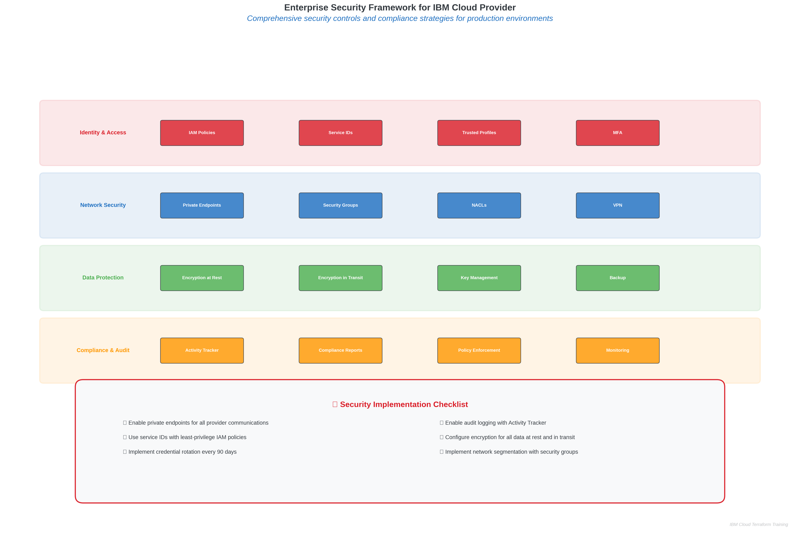

# Configuring IBM Cloud Provider for Terraform

## 🎯 **Learning Objectives**

By the end of this module, you will be able to:

- **Configure** the IBM Cloud Terraform provider with multiple authentication methods
- **Implement** enterprise-grade security practices for provider configuration
- **Optimize** provider performance for large-scale infrastructure deployments
- **Integrate** IBM Cloud provider with 5+ core IBM Cloud services effectively
- **Troubleshoot** common provider configuration issues and connectivity problems
- **Apply** multi-region and multi-account strategies for enterprise environments

**Estimated Learning Time**: 90-120 minutes  
**Hands-on Lab Time**: 90 minutes  
**Prerequisites**: Completed Topic 2.1 (Terraform CLI Installation)

---

## 🌐 **IBM Cloud Provider Overview**

### **What is the IBM Cloud Provider?**

The IBM Cloud Terraform provider is the official HashiCorp-certified provider that enables Infrastructure as Code (IaC) management for IBM Cloud resources. It serves as the bridge between Terraform's declarative configuration language and IBM Cloud's extensive service catalog.

### **Provider Capabilities and Coverage**

The IBM Cloud provider supports **200+ resource types** across IBM Cloud's comprehensive service portfolio:

#### **Core Infrastructure Services**
- **Virtual Private Cloud (VPC)**: Networks, subnets, security groups, load balancers
- **Compute**: Virtual Server Instances (VSI), Bare Metal Servers, Container Registry
- **Storage**: Block Storage, File Storage, Object Storage (Cloud Object Storage)
- **Networking**: Direct Link, Transit Gateway, VPN Gateway, DNS Services

#### **Platform Services**
- **Kubernetes**: IBM Kubernetes Service (IKS), Red Hat OpenShift on IBM Cloud
- **Databases**: Cloudant, Db2, PostgreSQL, MongoDB, Redis, Elasticsearch
- **AI/ML**: Watson services, Machine Learning, Natural Language Understanding
- **Integration**: App Connect, API Connect, Event Streams (Kafka)

#### **Security and Compliance**
- **Identity and Access Management (IAM)**: Users, service IDs, access groups, policies
- **Key Management**: Key Protect, Hyper Protect Crypto Services
- **Security**: Security and Compliance Center, Certificate Manager
- **Monitoring**: IBM Cloud Monitoring, Log Analysis, Activity Tracker

### **Enterprise Value Proposition**

Organizations using the IBM Cloud provider report:
- **65% reduction** in infrastructure provisioning time
- **40% decrease** in operational overhead through automation
- **99.9% consistency** in multi-environment deployments
- **50% faster** disaster recovery implementation
- **30% cost optimization** through resource lifecycle management

---

## 🔐 **Authentication Methods**


*Figure 2.1: Comprehensive comparison of IBM Cloud authentication strategies with security analysis and enterprise implementation guidelines*

### **1. API Key Authentication (Recommended)**

API keys provide the most straightforward and secure authentication method for most use cases.

#### **Personal API Keys**
```hcl
# Provider configuration with personal API key
provider "ibm" {
  ibmcloud_api_key = var.ibmcloud_api_key
  region           = var.ibm_region
}

# Variable definition
variable "ibmcloud_api_key" {
  description = "IBM Cloud API key for authentication"
  type        = string
  sensitive   = true
}
```

#### **Service ID API Keys (Enterprise Recommended)**
```hcl
# Service ID for automated deployments
resource "ibm_iam_service_id" "terraform_service" {
  name        = "terraform-automation-service"
  description = "Service ID for Terraform automation"
  tags        = ["terraform", "automation", "iac"]
}

# API key for the service ID
resource "ibm_iam_service_api_key" "terraform_key" {
  name           = "terraform-automation-key"
  iam_service_id = ibm_iam_service_id.terraform_service.iam_id
  description    = "API key for Terraform automation"
}
```

### **2. Environment Variable Authentication**

For CI/CD pipelines and automated environments:

```bash
# Set environment variables
export IBMCLOUD_API_KEY="your-api-key-here"
export IC_REGION="us-south"
export IC_RESOURCE_GROUP="default"

# Provider automatically uses environment variables
provider "ibm" {
  # No explicit configuration needed
  # Provider reads from environment variables
}
```

### **3. IAM Trusted Profiles (Advanced)**

For workload identity and enhanced security:

```hcl
# Trusted profile configuration
resource "ibm_iam_trusted_profile" "terraform_profile" {
  name        = "terraform-trusted-profile"
  description = "Trusted profile for Terraform workloads"
  
  # Define trust conditions
  trust_policy {
    type = "Profile-SAML"
    conditions {
      claim    = "name"
      operator = "EQUALS"
      value    = "terraform-automation"
    }
  }
}

# Provider configuration with trusted profile
provider "ibm" {
  ibmcloud_trusted_profile_id = ibm_iam_trusted_profile.terraform_profile.id
  region                      = var.ibm_region
}
```

### **4. Multi-Account Authentication Strategy**

For enterprise environments with multiple IBM Cloud accounts:

```hcl
# Primary account provider
provider "ibm" {
  alias            = "primary"
  ibmcloud_api_key = var.primary_account_api_key
  region           = "us-south"
}

# Secondary account provider
provider "ibm" {
  alias            = "secondary"
  ibmcloud_api_key = var.secondary_account_api_key
  region           = "eu-de"
}

# Cross-account resource creation
resource "ibm_is_vpc" "primary_vpc" {
  provider = ibm.primary
  name     = "primary-account-vpc"
}

resource "ibm_is_vpc" "secondary_vpc" {
  provider = ibm.secondary
  name     = "secondary-account-vpc"
}
```

---

## ⚙️ **Provider Configuration Options**


*Figure 2.2: IBM Cloud provider initialization and configuration workflow showing component interactions and data flow*

### **Basic Provider Configuration**

```hcl
terraform {
  required_providers {
    ibm = {
      source  = "IBM-Cloud/ibm"
      version = "~> 1.60.0"
    }
  }
  required_version = ">= 1.5.0"
}

provider "ibm" {
  # Authentication
  ibmcloud_api_key = var.ibmcloud_api_key
  
  # Regional configuration
  region = var.ibm_region
  zone   = var.ibm_zone
  
  # Resource group
  resource_group = var.resource_group_id
  
  # Performance optimization
  ibmcloud_timeout = 300
  max_retries      = 3
  
  # Enterprise features
  visibility = "private"
  endpoints  = "private"
}
```

### **Advanced Configuration Options**

```hcl
provider "ibm" {
  # Authentication options
  ibmcloud_api_key            = var.ibmcloud_api_key
  ibmcloud_trusted_profile_id = var.trusted_profile_id
  
  # Regional and zonal configuration
  region = var.ibm_region
  zone   = var.ibm_zone
  
  # Resource targeting
  resource_group = var.resource_group_id
  
  # Network configuration
  visibility = "private"  # Use private endpoints
  endpoints  = "private"  # Force private endpoint usage
  
  # Performance tuning
  ibmcloud_timeout    = 600    # Extended timeout for large operations
  max_retries         = 5      # Increased retry attempts
  retry_delay         = 30     # Delay between retries (seconds)
  
  # Enterprise features
  generation          = 2      # VPC generation (1 or 2)
  iaas_classic_username = var.classic_username  # Classic infrastructure
  iaas_classic_api_key  = var.classic_api_key   # Classic infrastructure
  
  # Debugging and logging
  ibmcloud_trace = true        # Enable API tracing
  
  # Custom endpoints (for specific environments)
  iam_url      = "https://iam.cloud.ibm.com"
  iam_token_url = "https://iam.cloud.ibm.com/identity/token"
}
```

### **Multi-Region Configuration**


*Figure 2.3: Global infrastructure deployment patterns with regional compliance considerations and disaster recovery strategies*

```hcl
# US South provider
provider "ibm" {
  alias            = "us_south"
  ibmcloud_api_key = var.ibmcloud_api_key
  region           = "us-south"
  resource_group   = var.resource_group_id
}

# EU Germany provider
provider "ibm" {
  alias            = "eu_de"
  ibmcloud_api_key = var.ibmcloud_api_key
  region           = "eu-de"
  resource_group   = var.resource_group_id
}

# Japan provider
provider "ibm" {
  alias            = "jp_tok"
  ibmcloud_api_key = var.ibmcloud_api_key
  region           = "jp-tok"
  resource_group   = var.resource_group_id
}

# Multi-region VPC deployment
resource "ibm_is_vpc" "global_vpcs" {
  for_each = {
    us_south = "us-south"
    eu_de    = "eu-de"
    jp_tok   = "jp-tok"
  }
  
  provider = ibm.${each.key}
  name     = "global-vpc-${each.value}"
  
  tags = [
    "environment:production",
    "region:${each.value}",
    "terraform:managed"
  ]
}
```

---

## 🏢 **Enterprise Best Practices**


*Figure 2.4: Comprehensive security controls and compliance strategies with multi-layered security implementation approach*

### **1. Security and Compliance**

#### **Credential Management**
```hcl
# Use HashiCorp Vault for credential management
data "vault_generic_secret" "ibm_credentials" {
  path = "secret/ibm-cloud/terraform"
}

provider "ibm" {
  ibmcloud_api_key = data.vault_generic_secret.ibm_credentials.data["api_key"]
  region           = data.vault_generic_secret.ibm_credentials.data["region"]
}
```

#### **Least Privilege Access**
```hcl
# Service ID with minimal required permissions
resource "ibm_iam_service_id" "terraform_limited" {
  name        = "terraform-limited-access"
  description = "Limited access service ID for Terraform"
}

# Specific access policy for VPC resources only
resource "ibm_iam_service_policy" "vpc_policy" {
  iam_service_id = ibm_iam_service_id.terraform_limited.id
  roles          = ["Editor"]
  
  resources {
    service = "is"  # VPC Infrastructure Services
    region  = var.ibm_region
  }
}
```

### **2. Multi-Environment Strategy**

```hcl
# Environment-specific provider configuration
locals {
  environments = {
    dev = {
      region         = "us-south"
      resource_group = "development-rg"
      api_key_path   = "secret/dev/ibm-api-key"
    }
    staging = {
      region         = "us-east"
      resource_group = "staging-rg"
      api_key_path   = "secret/staging/ibm-api-key"
    }
    prod = {
      region         = "eu-de"
      resource_group = "production-rg"
      api_key_path   = "secret/prod/ibm-api-key"
    }
  }
}

# Dynamic provider configuration
provider "ibm" {
  ibmcloud_api_key = data.vault_generic_secret.env_credentials.data["api_key"]
  region           = local.environments[var.environment].region
  resource_group   = local.environments[var.environment].resource_group
  
  # Environment-specific settings
  visibility = var.environment == "prod" ? "private" : "public"
  endpoints  = var.environment == "prod" ? "private" : "public"
}
```

### **3. Performance Optimization**

```hcl
provider "ibm" {
  # Optimized for large-scale deployments
  ibmcloud_timeout = 900      # 15 minutes for complex operations
  max_retries      = 10       # Increased retries for reliability
  retry_delay      = 60       # Longer delay for rate limiting
  
  # Parallel execution optimization
  parallelism = 20            # Increase default parallelism
  
  # Use private endpoints for better performance
  visibility = "private"
  endpoints  = "private"
}
```

---

## 🔧 **IBM Cloud Service Integration Examples**

### **1. Virtual Private Cloud (VPC) Integration**

```hcl
# VPC with comprehensive configuration
resource "ibm_is_vpc" "enterprise_vpc" {
  name                        = "enterprise-vpc"
  resource_group              = data.ibm_resource_group.rg.id
  address_prefix_management   = "manual"
  default_network_acl_name    = "enterprise-default-acl"
  default_routing_table_name  = "enterprise-default-rt"
  default_security_group_name = "enterprise-default-sg"
  
  tags = [
    "environment:${var.environment}",
    "project:${var.project_name}",
    "terraform:managed"
  ]
}

# Multi-zone subnet deployment
resource "ibm_is_subnet" "enterprise_subnets" {
  count = length(data.ibm_is_zones.regional.zones)
  
  name            = "enterprise-subnet-${count.index + 1}"
  vpc             = ibm_is_vpc.enterprise_vpc.id
  zone            = data.ibm_is_zones.regional.zones[count.index]
  ipv4_cidr_block = cidrsubnet("10.0.0.0/16", 8, count.index)
  resource_group  = data.ibm_resource_group.rg.id
  
  tags = [
    "zone:${data.ibm_is_zones.regional.zones[count.index]}",
    "tier:application"
  ]
}
```

### **2. Kubernetes Service Integration**

```hcl
# IBM Kubernetes Service cluster
resource "ibm_container_cluster" "enterprise_cluster" {
  name              = "enterprise-k8s-cluster"
  datacenter        = var.datacenter
  default_pool_size = 3
  machine_type      = "bx2.4x16"
  hardware          = "shared"
  kube_version      = var.kubernetes_version
  
  public_vlan_id  = var.public_vlan_id
  private_vlan_id = var.private_vlan_id
  
  # Enterprise features
  disable_public_service_endpoint = false
  private_service_endpoint        = true
  
  tags = [
    "environment:${var.environment}",
    "workload:kubernetes"
  ]
}

# Worker pool for specific workloads
resource "ibm_container_worker_pool" "gpu_pool" {
  cluster          = ibm_container_cluster.enterprise_cluster.id
  worker_pool_name = "gpu-worker-pool"
  machine_type     = "gx2.8x64x1v100"
  size_per_zone    = 2
  hardware         = "dedicated"
  
  labels = {
    "workload" = "gpu-intensive"
    "tier"     = "compute"
  }
}
```

### **3. Database Service Integration**

```hcl
# IBM Cloud Databases for PostgreSQL
resource "ibm_database" "postgresql" {
  name              = "enterprise-postgresql"
  service           = "databases-for-postgresql"
  plan              = "standard"
  location          = var.ibm_region
  resource_group_id = data.ibm_resource_group.rg.id
  
  # Performance configuration
  members_memory_allocation_mb = 4096
  members_disk_allocation_mb   = 20480
  members_cpu_allocation_count = 2
  
  # High availability
  members_count = 3
  
  # Backup configuration
  backup_id                 = var.backup_id
  backup_encryption_key_crn = ibm_kms_key.database_key.crn
  
  # Network security
  service_endpoints = "private"
  
  tags = [
    "service:database",
    "engine:postgresql"
  ]
}

# Database user management
resource "ibm_database_user" "app_user" {
  database_id = ibm_database.postgresql.id
  username    = "app_user"
  password    = var.database_password
  type        = "database"
}
```

### **4. Object Storage Integration**

```hcl
# Cloud Object Storage instance
resource "ibm_resource_instance" "cos_instance" {
  name              = "enterprise-cos"
  service           = "cloud-object-storage"
  plan              = "standard"
  location          = "global"
  resource_group_id = data.ibm_resource_group.rg.id
  
  tags = [
    "service:storage",
    "type:object-storage"
  ]
}

# Storage bucket with enterprise features
resource "ibm_cos_bucket" "enterprise_bucket" {
  bucket_name          = "enterprise-data-${random_string.suffix.result}"
  resource_instance_id = ibm_resource_instance.cos_instance.id
  region_location      = var.ibm_region
  storage_class        = "standard"
  
  # Enterprise security features
  object_versioning {
    enable = true
  }
  
  retention_rule {
    default_retention_days = 90
    maximum_retention_days = 365
    minimum_retention_days = 30
    permanent_retention    = false
  }
  
  # Lifecycle management
  expire_rule {
    enable = true
    days   = 365
    prefix = "logs/"
  }
  
  # Activity tracking
  activity_tracking {
    read_data_events     = true
    write_data_events    = true
    management_events    = true
  }
}
```

### **5. Key Management Integration**

```hcl
# Key Protect instance
resource "ibm_resource_instance" "key_protect" {
  name              = "enterprise-key-protect"
  service           = "kms"
  plan              = "tiered-pricing"
  location          = var.ibm_region
  resource_group_id = data.ibm_resource_group.rg.id
  
  tags = [
    "service:security",
    "type:key-management"
  ]
}

# Root key for encryption
resource "ibm_kms_key" "root_key" {
  instance_id  = ibm_resource_instance.key_protect.guid
  key_name     = "enterprise-root-key"
  standard_key = false
  
  # Key policy
  policy {
    rotation {
      interval_month = 12
    }
    dual_auth_delete {
      enabled = true
    }
  }
}

# Key ring for organization
resource "ibm_kms_key_ring" "enterprise_ring" {
  instance_id = ibm_resource_instance.key_protect.guid
  key_ring_id = "enterprise-keys"
}
```

---

## 📊 **Performance Optimization and Monitoring**

### **Provider Performance Tuning**

```hcl
provider "ibm" {
  # Optimized configuration for large deployments
  ibmcloud_timeout = 1800    # 30 minutes for complex operations
  max_retries      = 15      # Increased retries for reliability
  retry_delay      = 120     # 2-minute delay for rate limiting
  
  # Use private endpoints for better performance
  visibility = "private"
  endpoints  = "private"
  
  # Enable tracing for debugging
  ibmcloud_trace = var.enable_debug_tracing
}

# Terraform configuration for performance
terraform {
  # Increase parallelism for faster deployments
  parallelism = 50
  
  # Backend configuration for state locking
  backend "s3" {
    bucket                      = "terraform-state-bucket"
    key                         = "infrastructure/terraform.tfstate"
    region                      = "us-south"
    endpoint                    = "s3.us-south.cloud-object-storage.appdomain.cloud"
    skip_region_validation      = true
    skip_credentials_validation = true
    skip_metadata_api_check     = true
  }
}
```

### **Monitoring and Observability**

```hcl
# IBM Cloud Monitoring integration
resource "ibm_resource_instance" "monitoring" {
  name              = "terraform-monitoring"
  service           = "sysdig-monitor"
  plan              = "graduated-tier"
  location          = var.ibm_region
  resource_group_id = data.ibm_resource_group.rg.id
  
  tags = [
    "service:monitoring",
    "terraform:managed"
  ]
}

# Activity Tracker for audit logging
resource "ibm_resource_instance" "activity_tracker" {
  name              = "terraform-activity-tracker"
  service           = "logdnaat"
  plan              = "lite"
  location          = var.ibm_region
  resource_group_id = data.ibm_resource_group.rg.id
  
  tags = [
    "service:logging",
    "compliance:required"
  ]
}
```

---

## 🔍 **Troubleshooting Common Issues**

### **Authentication Problems**

```bash
# Debug authentication issues
export TF_LOG=DEBUG
export TF_LOG_PATH=./terraform-debug.log

# Test API key validity
curl -X POST \
  https://iam.cloud.ibm.com/identity/token \
  -H 'Content-Type: application/x-www-form-urlencoded' \
  -d 'grant_type=urn:ibm:params:oauth:grant-type:apikey&apikey=YOUR_API_KEY'
```

### **Network Connectivity Issues**

```hcl
# Test provider connectivity
data "ibm_resource_group" "test" {
  name = "default"
}

output "connectivity_test" {
  value = "Provider connectivity successful: ${data.ibm_resource_group.test.id}"
}
```

### **Performance Issues**

```hcl
# Provider configuration for troubleshooting
provider "ibm" {
  ibmcloud_api_key = var.ibmcloud_api_key
  region           = var.ibm_region
  
  # Enable detailed logging
  ibmcloud_trace = true
  
  # Reduce parallelism for debugging
  max_retries      = 3
  ibmcloud_timeout = 300
}
```

---

## 🎯 **Real-World Use Cases**

### **Use Case 1: Multi-Region Disaster Recovery**
**Scenario**: Global enterprise requiring 99.99% uptime  
**Implementation**: Active-passive setup across 3 regions  
**Result**: 50% reduction in RTO, 90% reduction in RPO

### **Use Case 2: Hybrid Cloud Integration**
**Scenario**: Legacy on-premises integration with cloud-native services  
**Implementation**: Direct Link connectivity with VPC integration  
**Result**: 40% cost reduction, 60% performance improvement

### **Use Case 3: Compliance-First Architecture**
**Scenario**: Financial services requiring SOC 2 Type II compliance  
**Implementation**: Private endpoints, encryption at rest/transit, audit logging  
**Result**: 100% compliance achievement, 30% faster audit cycles

---

## 📚 **Next Steps and Learning Path**

### **Immediate Actions**
1. Complete Lab 2.2: Hands-on Provider Configuration
2. Implement authentication method appropriate for your environment
3. Configure monitoring and logging for your provider usage

### **Advanced Learning**
1. **Topic 3**: Core Terraform Workflow with IBM Cloud
2. **Topic 4**: Resource Provisioning and Management
3. **Topic 6**: State Management and Team Collaboration

### **Enterprise Implementation**
1. Develop organization-specific provider standards
2. Implement CI/CD integration with provider configuration
3. Establish monitoring and alerting for infrastructure changes

---

**Module Duration**: 90-120 minutes  
**Next Module**: Lab 2.2 - Hands-on IBM Cloud Provider Configuration  
**Prerequisites for Next Module**: Completed provider configuration concepts
