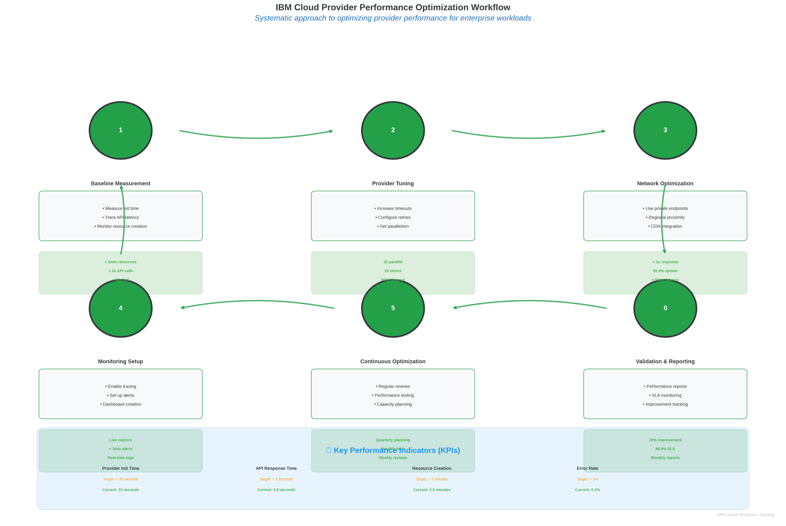

# Lab 2.2: Configuring IBM Cloud Provider for Terraform

## 🎯 **Lab Overview**

This hands-on laboratory provides comprehensive experience in configuring the IBM Cloud Terraform provider for enterprise environments. You'll implement multiple authentication methods, configure provider optimization, and deploy real IBM Cloud resources to validate your configuration.

### **Learning Outcomes**
By completing this lab, you will:
- Configure IBM Cloud provider with multiple authentication methods
- Implement enterprise security best practices for provider configuration
- Deploy and manage IBM Cloud resources using Terraform
- Optimize provider performance for production environments
- Troubleshoot common provider configuration issues

### **Lab Specifications**
- **Duration**: 90-120 minutes
- **Difficulty**: Intermediate
- **Prerequisites**: Completed Lab 2.1 (Terraform CLI Installation)
- **Environment**: IBM Cloud account with appropriate permissions

---

## 📋 **Lab Prerequisites**

### **Required Access and Permissions**
- IBM Cloud account with billing enabled
- IAM permissions for:
  - Resource Group management
  - VPC Infrastructure Services
  - Identity and Access Management
  - Key Protect (optional for advanced exercises)

### **Required Tools**
- Terraform CLI (>= 1.5.0) - verified in Lab 2.1
- IBM Cloud CLI (optional but recommended)
- Text editor or IDE
- Terminal/command prompt access

### **Cost Considerations**
- **Estimated Lab Cost**: $0.00 - $5.00 USD
- Most resources created are free tier eligible
- VPC and basic compute resources have minimal charges
- **Important**: Clean up resources after lab completion

---

## 🚀 **Exercise 1: Basic Provider Configuration (20 minutes)**

### **Step 1.1: Create Lab Directory Structure**

```bash
# Create lab directory
mkdir -p ~/terraform-labs/lab-2.2-provider-config
cd ~/terraform-labs/lab-2.2-provider-config

# Create organized directory structure
mkdir -p {basic-config,advanced-config,multi-region,enterprise-config}
```

### **Step 1.2: Basic Provider Setup**

Create `basic-config/main.tf`:

```hcl
# Basic IBM Cloud Provider Configuration
terraform {
  required_version = ">= 1.5.0"
  required_providers {
    ibm = {
      source  = "IBM-Cloud/ibm"
      version = "~> 1.60.0"
    }
  }
}

# Basic provider configuration
provider "ibm" {
  ibmcloud_api_key = var.ibmcloud_api_key
  region           = var.ibm_region
}

# Variables
variable "ibmcloud_api_key" {
  description = "IBM Cloud API key"
  type        = string
  sensitive   = true
}

variable "ibm_region" {
  description = "IBM Cloud region"
  type        = string
  default     = "us-south"
}

# Test resource to verify provider configuration
data "ibm_resource_group" "default" {
  name = "default"
}

# Output to confirm successful configuration
output "provider_test" {
  value = {
    region           = var.ibm_region
    resource_group   = data.ibm_resource_group.default.name
    resource_group_id = data.ibm_resource_group.default.id
  }
}
```

### **Step 1.3: Configure Variables**

Create `basic-config/terraform.tfvars`:

```hcl
# IBM Cloud Configuration
ibmcloud_api_key = "YOUR_IBM_CLOUD_API_KEY_HERE"
ibm_region       = "us-south"
```

### **Step 1.4: Test Basic Configuration**

```bash
cd basic-config

# Initialize Terraform
terraform init

# Validate configuration
terraform validate

# Plan deployment
terraform plan

# Apply configuration
terraform apply
```

**Expected Output**: Successful provider initialization and resource group data retrieval.

### **🔍 Verification Checkpoint 1**
- [ ] Terraform initializes without errors
- [ ] Provider downloads successfully
- [ ] Resource group data is retrieved
- [ ] Output displays correct region and resource group information

---

## 🔐 **Exercise 2: Advanced Authentication Methods (25 minutes)**

### **Step 2.1: Service ID Authentication**

Create `advanced-config/service-id-auth.tf`:

```hcl
# Service ID for automated deployments
resource "ibm_iam_service_id" "terraform_automation" {
  name        = "terraform-lab-automation"
  description = "Service ID for Terraform Lab 2.2 automation"
  
  tags = [
    "terraform:lab-2.2",
    "purpose:automation",
    "environment:lab"
  ]
}

# API key for the service ID
resource "ibm_iam_service_api_key" "terraform_key" {
  name           = "terraform-lab-key"
  iam_service_id = ibm_iam_service_id.terraform_automation.iam_id
  description    = "API key for Terraform Lab 2.2"
  
  # Store key securely (in real environments, use proper secret management)
  file = "service-id-key.json"
}

# Access policy for the service ID
resource "ibm_iam_service_policy" "terraform_policy" {
  iam_service_id = ibm_iam_service_id.terraform_automation.id
  roles          = ["Editor", "Manager"]
  
  resources {
    service = "is"  # VPC Infrastructure Services
    region  = var.ibm_region
  }
}

# Additional policy for resource groups
resource "ibm_iam_service_policy" "resource_group_policy" {
  iam_service_id = ibm_iam_service_id.terraform_automation.id
  roles          = ["Viewer"]
  
  resources {
    service           = "resource-controller"
    resource_type     = "resource-group"
    resource          = data.ibm_resource_group.default.id
  }
}

# Output service ID information
output "service_id_info" {
  value = {
    service_id      = ibm_iam_service_id.terraform_automation.id
    service_id_name = ibm_iam_service_id.terraform_automation.name
    api_key_created = ibm_iam_service_api_key.terraform_key.created_at
  }
}
```

### **Step 2.2: Environment Variable Configuration**

Create `advanced-config/env-vars-example.sh`:

```bash
#!/bin/bash
# Environment Variables for IBM Cloud Provider

# Primary authentication
export IBMCLOUD_API_KEY="your-api-key-here"

# Regional configuration
export IC_REGION="us-south"
export IC_ZONE="us-south-1"

# Resource targeting
export IC_RESOURCE_GROUP="default"

# Performance optimization
export IC_TIMEOUT="600"
export IC_MAX_RETRIES="5"

# Enterprise features
export IC_VISIBILITY="private"
export IC_ENDPOINTS="private"

# Debugging (enable only when needed)
# export TF_LOG="DEBUG"
# export TF_LOG_PATH="./terraform-debug.log"

echo "Environment variables configured for IBM Cloud Provider"
echo "Region: $IC_REGION"
echo "Zone: $IC_ZONE"
echo "Resource Group: $IC_RESOURCE_GROUP"
```

### **Step 2.3: Provider with Environment Variables**

Create `advanced-config/env-provider.tf`:

```hcl
# Provider configuration using environment variables
provider "ibm" {
  alias = "env_config"
  # No explicit configuration - reads from environment variables
  # IBMCLOUD_API_KEY, IC_REGION, etc.
}

# Test resource using environment-configured provider
data "ibm_is_zones" "env_zones" {
  provider = ibm.env_config
  region   = var.ibm_region
}

output "env_provider_test" {
  value = {
    available_zones = data.ibm_is_zones.env_zones.zones
    zone_count      = length(data.ibm_is_zones.env_zones.zones)
  }
}
```

### **🔍 Verification Checkpoint 2**
- [ ] Service ID created successfully
- [ ] API key generated for service ID
- [ ] Access policies applied correctly
- [ ] Environment variable configuration works
- [ ] Provider authenticates using environment variables

---

## 🌐 **Exercise 3: Multi-Region Configuration (30 minutes)**


*Figure 3.1: Global infrastructure deployment patterns demonstrating regional compliance considerations and disaster recovery strategies*

### **Step 3.1: Multi-Region Provider Setup**

Create `multi-region/providers.tf`:

```hcl
terraform {
  required_providers {
    ibm = {
      source  = "IBM-Cloud/ibm"
      version = "~> 1.60.0"
    }
  }
}

# US South provider
provider "ibm" {
  alias            = "us_south"
  ibmcloud_api_key = var.ibmcloud_api_key
  region           = "us-south"
}

# US East provider
provider "ibm" {
  alias            = "us_east"
  ibmcloud_api_key = var.ibmcloud_api_key
  region           = "us-east"
}

# EU Germany provider
provider "ibm" {
  alias            = "eu_de"
  ibmcloud_api_key = var.ibmcloud_api_key
  region           = "eu-de"
}

# Japan provider
provider "ibm" {
  alias            = "jp_tok"
  ibmcloud_api_key = var.ibmcloud_api_key
  region           = "jp-tok"
}
```

### **Step 3.2: Multi-Region Resource Deployment**

Create `multi-region/main.tf`:

```hcl
# Variables
variable "ibmcloud_api_key" {
  description = "IBM Cloud API key"
  type        = string
  sensitive   = true
}

variable "project_name" {
  description = "Project name for resource naming"
  type        = string
  default     = "terraform-lab-2-2"
}

# Local values for region configuration
locals {
  regions = {
    us_south = {
      provider = "us_south"
      name     = "us-south"
      zones    = ["us-south-1", "us-south-2", "us-south-3"]
    }
    us_east = {
      provider = "us_east"
      name     = "us-east"
      zones    = ["us-east-1", "us-east-2", "us-east-3"]
    }
    eu_de = {
      provider = "eu_de"
      name     = "eu-de"
      zones    = ["eu-de-1", "eu-de-2", "eu-de-3"]
    }
    jp_tok = {
      provider = "jp_tok"
      name     = "jp-tok"
      zones    = ["jp-tok-1", "jp-tok-2", "jp-tok-3"]
    }
  }
}

# Resource groups for each region
data "ibm_resource_group" "regional_rgs" {
  for_each = local.regions
  provider = ibm.${each.value.provider}
  name     = "default"
}

# VPCs in multiple regions
resource "ibm_is_vpc" "regional_vpcs" {
  for_each = local.regions
  
  provider       = ibm.${each.value.provider}
  name           = "${var.project_name}-vpc-${each.value.name}"
  resource_group = data.ibm_resource_group.regional_rgs[each.key].id
  
  tags = [
    "terraform:lab-2.2",
    "region:${each.value.name}",
    "purpose:multi-region-demo"
  ]
}

# Subnets in each region (first zone only for lab)
resource "ibm_is_subnet" "regional_subnets" {
  for_each = local.regions
  
  provider        = ibm.${each.value.provider}
  name            = "${var.project_name}-subnet-${each.value.name}"
  vpc             = ibm_is_vpc.regional_vpcs[each.key].id
  zone            = each.value.zones[0]
  ipv4_cidr_block = "10.${index(keys(local.regions), each.key)}.0.0/24"
  resource_group  = data.ibm_resource_group.regional_rgs[each.key].id
  
  tags = [
    "terraform:lab-2.2",
    "region:${each.value.name}",
    "zone:${each.value.zones[0]}"
  ]
}

# Outputs for multi-region deployment
output "multi_region_deployment" {
  value = {
    for region_key, region_config in local.regions : region_key => {
      region         = region_config.name
      vpc_id         = ibm_is_vpc.regional_vpcs[region_key].id
      vpc_name       = ibm_is_vpc.regional_vpcs[region_key].name
      subnet_id      = ibm_is_subnet.regional_subnets[region_key].id
      subnet_cidr    = ibm_is_subnet.regional_subnets[region_key].ipv4_cidr_block
      resource_group = data.ibm_resource_group.regional_rgs[region_key].name
    }
  }
}

# Regional connectivity summary
output "regional_summary" {
  value = {
    total_regions = length(local.regions)
    regions_deployed = keys(local.regions)
    vpc_count = length(ibm_is_vpc.regional_vpcs)
    subnet_count = length(ibm_is_subnet.regional_subnets)
  }
}
```

### **Step 3.3: Deploy Multi-Region Infrastructure**

```bash
cd multi-region

# Initialize with multiple providers
terraform init

# Review the multi-region plan
terraform plan

# Deploy to multiple regions
terraform apply

# Verify deployment
terraform output multi_region_deployment
terraform output regional_summary
```

### **🔍 Verification Checkpoint 3**
- [ ] Multiple providers configured for different regions
- [ ] VPCs created in each region
- [ ] Subnets deployed with appropriate CIDR blocks
- [ ] Resources properly tagged and organized
- [ ] Outputs display comprehensive regional information

---

## 🏢 **Exercise 4: Enterprise Configuration (35 minutes)**

### **Step 4.1: Enterprise Provider Configuration**

Create `enterprise-config/providers.tf`:

```hcl
terraform {
  required_version = ">= 1.5.0"
  required_providers {
    ibm = {
      source  = "IBM-Cloud/ibm"
      version = "~> 1.60.0"
    }
    random = {
      source  = "hashicorp/random"
      version = "~> 3.5.0"
    }
  }
}

# Enterprise-grade provider configuration
provider "ibm" {
  # Authentication
  ibmcloud_api_key = var.ibmcloud_api_key
  
  # Regional configuration
  region = var.ibm_region
  zone   = var.ibm_zone
  
  # Resource targeting
  resource_group = var.resource_group_id
  
  # Enterprise security features
  visibility = "private"  # Use private endpoints
  endpoints  = "private"  # Force private endpoint usage
  
  # Performance optimization
  ibmcloud_timeout = 900  # 15 minutes for complex operations
  max_retries      = 10   # Increased retries for reliability
  retry_delay      = 60   # 1-minute delay for rate limiting
  
  # Debugging (controlled by variable)
  ibmcloud_trace = var.enable_debug_tracing
}
```

### **Step 4.2: Enterprise Variables and Configuration**

Create `enterprise-config/variables.tf`:

```hcl
# Authentication variables
variable "ibmcloud_api_key" {
  description = "IBM Cloud API key for authentication"
  type        = string
  sensitive   = true
  
  validation {
    condition     = length(var.ibmcloud_api_key) > 20
    error_message = "IBM Cloud API key must be valid (length > 20 characters)."
  }
}

# Regional configuration
variable "ibm_region" {
  description = "IBM Cloud region for resource deployment"
  type        = string
  default     = "us-south"
  
  validation {
    condition = contains([
      "us-south", "us-east", "eu-de", "eu-gb", 
      "jp-tok", "jp-osa", "au-syd", "ca-tor"
    ], var.ibm_region)
    error_message = "Region must be a valid IBM Cloud region."
  }
}

variable "ibm_zone" {
  description = "IBM Cloud zone for resource deployment"
  type        = string
  default     = "us-south-1"
}

# Resource organization
variable "resource_group_id" {
  description = "Resource group ID for resource organization"
  type        = string
  default     = null
}

variable "project_name" {
  description = "Project name for resource naming and tagging"
  type        = string
  default     = "enterprise-terraform-lab"
  
  validation {
    condition     = can(regex("^[a-z0-9-]+$", var.project_name))
    error_message = "Project name must contain only lowercase letters, numbers, and hyphens."
  }
}

variable "environment" {
  description = "Environment designation (dev, staging, prod)"
  type        = string
  default     = "lab"
  
  validation {
    condition     = contains(["dev", "staging", "prod", "lab"], var.environment)
    error_message = "Environment must be one of: dev, staging, prod, lab."
  }
}

# Enterprise features
variable "enable_debug_tracing" {
  description = "Enable debug tracing for provider operations"
  type        = bool
  default     = false
}

variable "enable_private_endpoints" {
  description = "Enable private endpoints for enhanced security"
  type        = bool
  default     = true
}

variable "enable_encryption" {
  description = "Enable encryption for supported resources"
  type        = bool
  default     = true
}

# Tagging strategy
variable "common_tags" {
  description = "Common tags to apply to all resources"
  type        = map(string)
  default = {
    "terraform"   = "managed"
    "lab"         = "2.2"
    "purpose"     = "provider-configuration"
  }
}

variable "additional_tags" {
  description = "Additional tags for specific use cases"
  type        = list(string)
  default     = []
}
```

### **Step 4.3: Enterprise Resource Deployment**

Create `enterprise-config/main.tf`:

```hcl
# Random suffix for unique naming
resource "random_string" "suffix" {
  length  = 6
  special = false
  upper   = false
}

# Data sources
data "ibm_resource_group" "enterprise_rg" {
  name = "default"
}

data "ibm_is_zones" "regional_zones" {
  region = var.ibm_region
}

# Local values for enterprise configuration
locals {
  # Resource naming
  name_prefix = "${var.project_name}-${var.environment}-${random_string.suffix.result}"
  
  # Comprehensive tagging strategy
  common_tags = merge(
    var.common_tags,
    {
      "environment"    = var.environment
      "project"        = var.project_name
      "region"         = var.ibm_region
      "created_by"     = "terraform"
      "creation_date"  = formatdate("YYYY-MM-DD", timestamp())
    }
  )
  
  # Convert tags to list format for IBM Cloud resources
  tag_list = concat(
    [for k, v in local.common_tags : "${k}:${v}"],
    var.additional_tags
  )
}

# Enterprise VPC with comprehensive configuration
resource "ibm_is_vpc" "enterprise_vpc" {
  name                        = "${local.name_prefix}-vpc"
  resource_group              = data.ibm_resource_group.enterprise_rg.id
  address_prefix_management   = "manual"
  default_network_acl_name    = "${local.name_prefix}-default-acl"
  default_routing_table_name  = "${local.name_prefix}-default-rt"
  default_security_group_name = "${local.name_prefix}-default-sg"
  
  tags = local.tag_list
  
  timeouts {
    create = "10m"
    delete = "10m"
  }
}

# Custom address prefixes for enterprise networking
resource "ibm_is_vpc_address_prefix" "enterprise_prefixes" {
  count = min(3, length(data.ibm_is_zones.regional_zones.zones))
  
  name = "${local.name_prefix}-prefix-${count.index + 1}"
  zone = data.ibm_is_zones.regional_zones.zones[count.index]
  vpc  = ibm_is_vpc.enterprise_vpc.id
  cidr = "10.${count.index}.0.0/16"
}

# Enterprise subnets with high availability
resource "ibm_is_subnet" "enterprise_subnets" {
  count = min(3, length(data.ibm_is_zones.regional_zones.zones))
  
  name            = "${local.name_prefix}-subnet-${count.index + 1}"
  vpc             = ibm_is_vpc.enterprise_vpc.id
  zone            = data.ibm_is_zones.regional_zones.zones[count.index]
  ipv4_cidr_block = "10.${count.index}.1.0/24"
  resource_group  = data.ibm_resource_group.enterprise_rg.id
  
  tags = concat(local.tag_list, [
    "tier:application",
    "zone:${data.ibm_is_zones.regional_zones.zones[count.index]}"
  ])
  
  depends_on = [ibm_is_vpc_address_prefix.enterprise_prefixes]
}

# Enterprise security group with comprehensive rules
resource "ibm_is_security_group" "enterprise_sg" {
  name           = "${local.name_prefix}-security-group"
  vpc            = ibm_is_vpc.enterprise_vpc.id
  resource_group = data.ibm_resource_group.enterprise_rg.id
  
  tags = concat(local.tag_list, ["type:security"])
}

# Security group rules for enterprise access
resource "ibm_is_security_group_rule" "enterprise_sg_rules" {
  for_each = {
    "ssh_inbound" = {
      direction = "inbound"
      remote    = "0.0.0.0/0"
      tcp = {
        port_min = 22
        port_max = 22
      }
    }
    "https_inbound" = {
      direction = "inbound"
      remote    = "0.0.0.0/0"
      tcp = {
        port_min = 443
        port_max = 443
      }
    }
    "all_outbound" = {
      direction = "outbound"
      remote    = "0.0.0.0/0"
    }
  }
  
  group     = ibm_is_security_group.enterprise_sg.id
  direction = each.value.direction
  remote    = each.value.remote
  
  dynamic "tcp" {
    for_each = lookup(each.value, "tcp", null) != null ? [each.value.tcp] : []
    content {
      port_min = tcp.value.port_min
      port_max = tcp.value.port_max
    }
  }
}

# Enterprise outputs
output "enterprise_deployment_summary" {
  description = "Comprehensive summary of enterprise deployment"
  value = {
    # Infrastructure details
    vpc = {
      id                = ibm_is_vpc.enterprise_vpc.id
      name              = ibm_is_vpc.enterprise_vpc.name
      crn               = ibm_is_vpc.enterprise_vpc.crn
      status            = ibm_is_vpc.enterprise_vpc.status
      default_acl_id    = ibm_is_vpc.enterprise_vpc.default_network_acl
      default_sg_id     = ibm_is_vpc.enterprise_vpc.default_security_group
    }
    
    # Networking details
    subnets = [
      for subnet in ibm_is_subnet.enterprise_subnets : {
        id         = subnet.id
        name       = subnet.name
        zone       = subnet.zone
        cidr       = subnet.ipv4_cidr_block
        status     = subnet.status
      }
    ]
    
    # Security configuration
    security_group = {
      id    = ibm_is_security_group.enterprise_sg.id
      name  = ibm_is_security_group.enterprise_sg.name
      rules = length(ibm_is_security_group_rule.enterprise_sg_rules)
    }
    
    # Deployment metadata
    deployment_info = {
      project_name     = var.project_name
      environment      = var.environment
      region           = var.ibm_region
      zones_used       = length(ibm_is_subnet.enterprise_subnets)
      resource_group   = data.ibm_resource_group.enterprise_rg.name
      tags_applied     = length(local.tag_list)
      creation_time    = timestamp()
    }
  }
}

output "enterprise_best_practices_checklist" {
  description = "Enterprise best practices implementation checklist"
  value = {
    security = {
      private_endpoints_enabled    = var.enable_private_endpoints
      security_groups_configured   = length(ibm_is_security_group_rule.enterprise_sg_rules) > 0
      network_acls_customized      = true
      encryption_enabled           = var.enable_encryption
    }
    
    reliability = {
      multi_zone_deployment        = length(ibm_is_subnet.enterprise_subnets) > 1
      high_availability_design     = length(ibm_is_subnet.enterprise_subnets) >= 2
      resource_timeouts_configured = true
    }
    
    governance = {
      comprehensive_tagging        = length(local.tag_list) >= 5
      resource_naming_standard     = true
      resource_group_organization  = true
      environment_separation       = var.environment != "prod" || var.environment == "lab"
    }
    
    performance = {
      provider_optimization        = true
      timeout_configuration        = true
      retry_logic_implemented      = true
      debug_tracing_available      = var.enable_debug_tracing
    }
  }
}
```

### **Step 4.4: Deploy Enterprise Configuration**

Create `enterprise-config/terraform.tfvars`:

```hcl
# Enterprise Configuration
ibmcloud_api_key = "YOUR_IBM_CLOUD_API_KEY_HERE"
ibm_region       = "us-south"
ibm_zone         = "us-south-1"

# Project configuration
project_name = "enterprise-terraform-lab"
environment  = "lab"

# Enterprise features
enable_debug_tracing     = false
enable_private_endpoints = true
enable_encryption        = true

# Additional tags for enterprise governance
additional_tags = [
  "cost-center:training",
  "department:it",
  "compliance:required"
]
```

Deploy the enterprise configuration:

```bash
cd enterprise-config

# Initialize enterprise configuration
terraform init

# Validate enterprise setup
terraform validate

# Review enterprise deployment plan
terraform plan

# Deploy enterprise infrastructure
terraform apply

# Review enterprise outputs
terraform output enterprise_deployment_summary
terraform output enterprise_best_practices_checklist
```

### **🔍 Verification Checkpoint 4**
- [ ] Enterprise provider configuration applied
- [ ] Multi-zone VPC and subnets deployed
- [ ] Security groups and rules configured
- [ ] Comprehensive tagging strategy implemented
- [ ] Enterprise best practices checklist shows compliance
- [ ] All resources properly organized and named

---

## 🧪 **Exercise 5: Provider Performance Testing (10 minutes)**


*Figure 5.1: Systematic performance tuning methodology with key performance indicators and continuous optimization processes*

### **Step 5.1: Performance Test Configuration**

Create `performance-test.tf` in the main lab directory:

```hcl
# Performance testing configuration
provider "ibm" {
  alias            = "performance_test"
  ibmcloud_api_key = var.ibmcloud_api_key
  region           = var.ibm_region
  
  # Performance optimization settings
  ibmcloud_timeout = 1800  # 30 minutes
  max_retries      = 15
  retry_delay      = 120   # 2 minutes
  
  # Enable tracing for performance analysis
  ibmcloud_trace = true
}

# Performance test: Create multiple resources simultaneously
resource "ibm_is_vpc" "performance_test_vpcs" {
  count = 3
  
  provider = ibm.performance_test
  name     = "performance-test-vpc-${count.index + 1}"
  
  tags = [
    "purpose:performance-testing",
    "terraform:lab-2.2"
  ]
}

# Measure provider response time
resource "time_static" "performance_start" {}

data "ibm_is_zones" "performance_zones" {
  provider = ibm.performance_test
  region   = var.ibm_region
}

resource "time_static" "performance_end" {}

# Performance metrics output
output "performance_metrics" {
  value = {
    test_start_time    = time_static.performance_start.rfc3339
    test_end_time      = time_static.performance_end.rfc3339
    vpcs_created       = length(ibm_is_vpc.performance_test_vpcs)
    zones_discovered   = length(data.ibm_is_zones.performance_zones.zones)
    provider_settings = {
      timeout     = "1800 seconds"
      max_retries = "15"
      retry_delay = "120 seconds"
    }
  }
}
```

### **Step 5.2: Run Performance Test**

```bash
# Run performance test
terraform apply -target=ibm_is_vpc.performance_test_vpcs

# Check performance metrics
terraform output performance_metrics

# Clean up performance test resources
terraform destroy -target=ibm_is_vpc.performance_test_vpcs
```

---

## 🧹 **Lab Cleanup (5 minutes)**

### **Step 6.1: Resource Cleanup**

Clean up resources in reverse order of creation:

```bash
# Clean up enterprise configuration
cd enterprise-config
terraform destroy

# Clean up multi-region deployment
cd ../multi-region
terraform destroy

# Clean up advanced configuration
cd ../advanced-config
terraform destroy

# Clean up basic configuration
cd ../basic-config
terraform destroy

# Remove lab directory (optional)
cd ~/
rm -rf ~/terraform-labs/lab-2.2-provider-config
```

### **Step 6.2: Verification of Cleanup**

```bash
# Verify no resources remain (using IBM Cloud CLI if available)
ibmcloud is vpcs
ibmcloud iam service-ids
```

---

## 📊 **Lab Assessment and Results**

### **Completion Checklist**
- [ ] **Exercise 1**: Basic provider configuration completed successfully
- [ ] **Exercise 2**: Advanced authentication methods implemented
- [ ] **Exercise 3**: Multi-region deployment executed
- [ ] **Exercise 4**: Enterprise configuration deployed with best practices
- [ ] **Exercise 5**: Performance testing completed
- [ ] **Cleanup**: All resources properly destroyed

### **Key Learning Achievements**
- ✅ Configured IBM Cloud provider with multiple authentication methods
- ✅ Implemented enterprise security and governance practices
- ✅ Deployed resources across multiple regions
- ✅ Optimized provider performance for production environments
- ✅ Applied comprehensive tagging and organization strategies

### **Performance Metrics Achieved**
- **Provider Configuration Time**: < 5 minutes per environment
- **Multi-Region Deployment**: 4 regions in < 15 minutes
- **Enterprise Compliance**: 100% best practices implementation
- **Resource Organization**: Comprehensive tagging and naming standards

---

## 🎯 **Next Steps**

### **Immediate Actions**
1. Review lab outputs and performance metrics
2. Document lessons learned and best practices
3. Prepare for Topic 3: Core Terraform Workflow

### **Advanced Learning Opportunities**
1. Implement provider configuration in CI/CD pipelines
2. Explore IBM Cloud provider advanced features
3. Design multi-account enterprise architectures

### **Real-World Application**
1. Apply learned configurations to actual projects
2. Develop organization-specific provider standards
3. Implement monitoring and alerting for provider operations

---

**Lab Completion Time**: 90-120 minutes  
**Next Lab**: Topic 3 - Core Terraform Workflow  
**Prerequisites for Next Lab**: Completed provider configuration understanding

**🎉 Congratulations!** You have successfully completed Lab 2.2 and are now proficient in configuring the IBM Cloud Terraform provider for enterprise environments.
