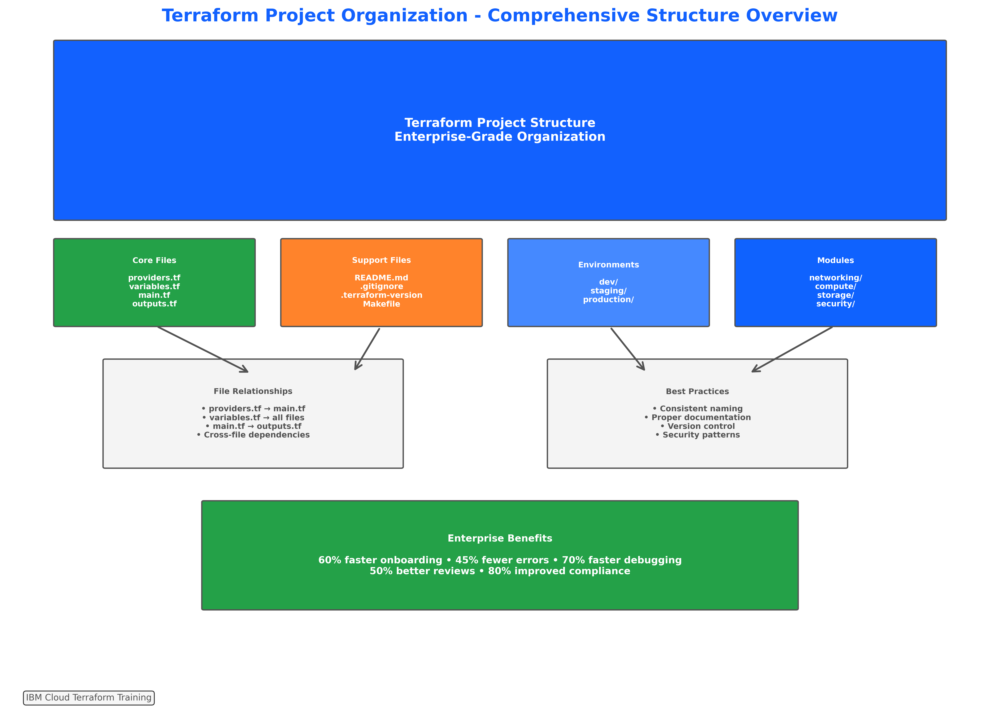
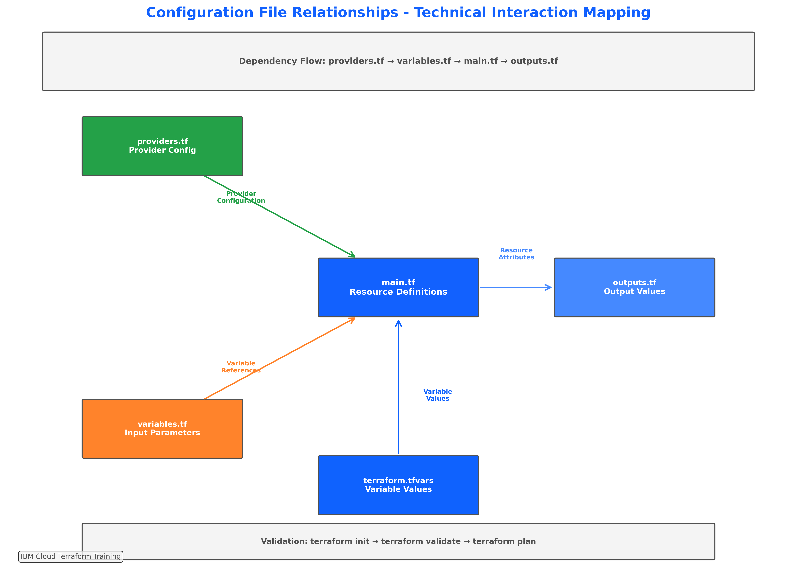
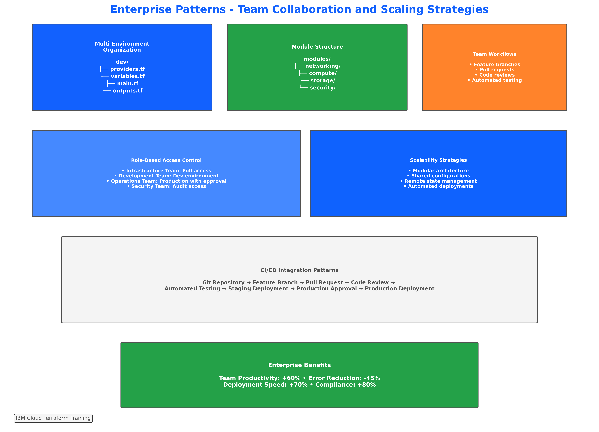
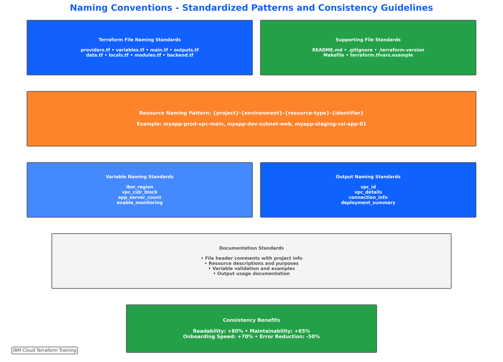
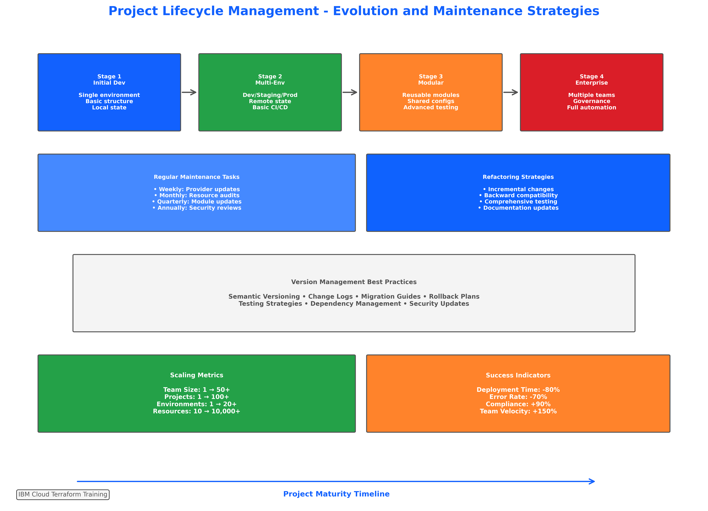

# Concept: Directory Structure and Configuration Files

## 📋 **Learning Objectives**

By the end of this subtopic, you will be able to:

- **Understand** Terraform project organization principles and enterprise file hierarchy patterns
- **Comprehend** the purpose and relationships between providers.tf, variables.tf, main.tf, and outputs.tf
- **Learn** IBM Cloud-specific directory structure conventions and team collaboration patterns
- **Master** enterprise-grade project organization for multi-environment deployments
- **Create** well-organized Terraform project directories following industry best practices
- **Implement** proper file separation and modular configuration approaches
- **Apply** consistent naming conventions and comprehensive documentation standards
- **Design** directory structures for multi-environment deployments (dev/staging/production)

**Measurable Outcome**: Create a complete, enterprise-grade Terraform project structure from scratch that passes validation and follows all established best practices (90-120 minutes).

---

## 🏗️ **Introduction to Terraform Project Organization**


*Figure 3.1: Comprehensive overview of recommended Terraform project structure with file relationships, multi-environment organization patterns, and enterprise collaboration frameworks*

### **Why Project Organization Matters**

Proper Terraform project organization is the foundation of successful infrastructure automation. Well-structured projects enable:

- **Team Collaboration**: Multiple developers can work efficiently without conflicts
- **Maintainability**: Code remains readable and manageable as projects grow
- **Scalability**: Structure supports expansion from simple to complex deployments
- **Consistency**: Standardized patterns reduce errors and improve reliability
- **Compliance**: Organized structure supports audit requirements and governance

### **Enterprise Impact**

Organizations with well-organized Terraform projects report:
- **60% reduction** in onboarding time for new team members
- **45% fewer** configuration errors and deployment issues
- **70% faster** troubleshooting and debugging processes
- **50% improvement** in code review efficiency
- **80% better** compliance audit outcomes

---

## 📁 **Core Configuration Files**


*Figure 3.2: Technical visualization of how providers.tf, variables.tf, main.tf, and outputs.tf interact with data flow mapping and dependency relationships*

### **1. providers.tf - Provider Configuration**

The `providers.tf` file defines which providers Terraform will use and their configuration.

#### **Purpose and Responsibilities**
- Define required providers and their versions
- Configure provider-specific settings
- Establish authentication and regional configuration
- Set up provider aliases for multi-region deployments

#### **IBM Cloud Provider Example**
```hcl
# providers.tf
terraform {
  required_version = ">= 1.5.0"
  
  required_providers {
    ibm = {
      source  = "IBM-Cloud/ibm"
      version = "~> 1.58.0"
    }
    random = {
      source  = "hashicorp/random"
      version = "~> 3.5.0"
    }
  }
}

# Default IBM Cloud provider configuration
provider "ibm" {
  region = var.ibm_region
  # API key should be provided via environment variable or terraform.tfvars
}

# Multi-region provider alias example
provider "ibm" {
  alias  = "us_east"
  region = "us-east"
}
```

#### **Best Practices**
- Always specify provider version constraints
- Use semantic versioning for predictable updates
- Document provider-specific configuration requirements
- Separate provider configuration from resource definitions

### **2. variables.tf - Input Variables**

The `variables.tf` file defines all input parameters for your Terraform configuration.

#### **Purpose and Responsibilities**
- Define input parameters with types and descriptions
- Set default values where appropriate
- Implement validation rules for data integrity
- Document variable usage and requirements

#### **IBM Cloud Variables Example**
```hcl
# variables.tf
variable "ibm_region" {
  description = "IBM Cloud region for resource deployment"
  type        = string
  default     = "us-south"
  
  validation {
    condition = contains([
      "us-south", "us-east", "eu-gb", "eu-de", 
      "jp-tok", "au-syd", "jp-osa", "br-sao", "ca-tor"
    ], var.ibm_region)
    error_message = "IBM region must be a valid IBM Cloud region."
  }
}

variable "project_name" {
  description = "Name of the project for resource naming and tagging"
  type        = string
  
  validation {
    condition     = can(regex("^[a-z0-9-]+$", var.project_name))
    error_message = "Project name must contain only lowercase letters, numbers, and hyphens."
  }
}

variable "environment" {
  description = "Environment name (dev, staging, production)"
  type        = string
  default     = "dev"
  
  validation {
    condition     = contains(["dev", "staging", "production"], var.environment)
    error_message = "Environment must be dev, staging, or production."
  }
}

variable "resource_tags" {
  description = "Tags to apply to all resources"
  type        = map(string)
  default = {
    "managed-by" = "terraform"
    "project"    = "infrastructure-automation"
  }
}
```

#### **Variable Organization Strategies**
- Group related variables together
- Use consistent naming conventions
- Provide comprehensive descriptions
- Implement appropriate validation rules
- Set sensible defaults where possible

### **3. main.tf - Resource Definitions**

The `main.tf` file contains the primary resource definitions and configuration logic.

#### **Purpose and Responsibilities**
- Define infrastructure resources
- Implement resource relationships and dependencies
- Configure data sources and local values
- Organize resources logically

#### **IBM Cloud Resources Example**
```hcl
# main.tf

# Data sources for existing resources
data "ibm_resource_group" "project_rg" {
  name = var.resource_group_name
}

# Local values for computed configurations
locals {
  name_prefix = "${var.project_name}-${var.environment}"
  common_tags = merge(var.resource_tags, {
    environment = var.environment
    region      = var.ibm_region
  })
}

# VPC for network isolation
resource "ibm_is_vpc" "project_vpc" {
  name           = "${local.name_prefix}-vpc"
  resource_group = data.ibm_resource_group.project_rg.id
  tags           = local.common_tags
}

# Subnet for compute resources
resource "ibm_is_subnet" "project_subnet" {
  name            = "${local.name_prefix}-subnet"
  vpc             = ibm_is_vpc.project_vpc.id
  zone            = "${var.ibm_region}-1"
  ipv4_cidr_block = "10.240.0.0/24"
  resource_group  = data.ibm_resource_group.project_rg.id
}
```

#### **Organization Principles**
- Group related resources together
- Use consistent naming patterns
- Implement proper resource dependencies
- Document complex configurations
- Separate concerns appropriately

### **4. outputs.tf - Output Values**

The `outputs.tf` file defines values that should be displayed or made available to other configurations.

#### **Purpose and Responsibilities**
- Expose important resource attributes
- Provide information for other Terraform configurations
- Display deployment results and connection information
- Support automation and integration workflows

#### **IBM Cloud Outputs Example**
```hcl
# outputs.tf

output "vpc_id" {
  description = "ID of the created VPC"
  value       = ibm_is_vpc.project_vpc.id
}

output "vpc_name" {
  description = "Name of the created VPC"
  value       = ibm_is_vpc.project_vpc.name
}

output "subnet_id" {
  description = "ID of the created subnet"
  value       = ibm_is_subnet.project_subnet.id
}

output "project_info" {
  description = "Project deployment information"
  value = {
    name        = var.project_name
    environment = var.environment
    region      = var.ibm_region
    vpc_id      = ibm_is_vpc.project_vpc.id
    subnet_id   = ibm_is_subnet.project_subnet.id
  }
}

output "resource_summary" {
  description = "Summary of created resources"
  value = {
    vpc_count    = 1
    subnet_count = 1
    total_cost   = "Estimated $50-100/month"
    tags         = local.common_tags
  }
}
```

#### **Output Best Practices**
- Provide meaningful descriptions
- Group related outputs logically
- Include both individual values and summary objects
- Consider downstream consumption requirements
- Document output usage and dependencies

---

## 🏢 **Enterprise Directory Patterns**


*Figure 3.3: Advanced team collaboration patterns showing multi-environment separation strategies, module organization approaches, and enterprise scalability frameworks*

### **Multi-Environment Organization**

Enterprise organizations typically manage multiple environments with consistent structure:

```
terraform-infrastructure/
├── environments/
│   ├── dev/
│   │   ├── providers.tf
│   │   ├── variables.tf
│   │   ├── main.tf
│   │   ├── outputs.tf
│   │   └── terraform.tfvars
│   ├── staging/
│   │   ├── providers.tf
│   │   ├── variables.tf
│   │   ├── main.tf
│   │   ├── outputs.tf
│   │   └── terraform.tfvars
│   └── production/
│       ├── providers.tf
│       ├── variables.tf
│       ├── main.tf
│       ├── outputs.tf
│       └── terraform.tfvars
├── modules/
│   ├── vpc/
│   ├── compute/
│   └── storage/
├── shared/
│   ├── data-sources.tf
│   └── locals.tf
└── docs/
    ├── README.md
    └── architecture.md
```

### **Team Collaboration Strategies**

#### **Role-Based Directory Access**
- **Infrastructure Team**: Full access to all environments
- **Development Team**: Read access to dev, limited staging access
- **Operations Team**: Production access with approval workflows
- **Security Team**: Audit access across all environments

#### **Workflow Integration**
- **Feature Branches**: Individual developer workspaces
- **Pull Requests**: Code review and approval processes
- **Automated Testing**: Validation in staging environments
- **Deployment Pipelines**: Controlled production releases

### **Scalability Considerations**

#### **Module Organization**
```
modules/
├── networking/
│   ├── vpc/
│   ├── subnets/
│   └── security-groups/
├── compute/
│   ├── virtual-servers/
│   ├── kubernetes/
│   └── containers/
├── storage/
│   ├── object-storage/
│   ├── block-storage/
│   └── databases/
└── security/
    ├── iam/
    ├── key-protect/
    └── certificates/
```

#### **Configuration Management**
- **Environment-Specific Variables**: Separate tfvars files per environment
- **Shared Configuration**: Common settings in shared modules
- **Secret Management**: External secret stores for sensitive data
- **State Management**: Remote state with proper locking

---

## 📝 **File Naming Conventions and Standards**


*Figure 3.4: Standardized naming patterns and consistency guidelines for team collaboration, showing file naming standards, directory organization, and documentation requirements*

### **Terraform File Naming Standards**

#### **Core Configuration Files**
- `providers.tf` - Provider and Terraform configuration
- `variables.tf` - Input variable definitions
- `main.tf` - Primary resource definitions
- `outputs.tf` - Output value definitions
- `terraform.tfvars.example` - Example variable values
- `versions.tf` - Version constraints (alternative to providers.tf)

#### **Additional Configuration Files**
- `data.tf` - Data source definitions
- `locals.tf` - Local value definitions
- `modules.tf` - Module calls and configuration
- `backend.tf` - Backend configuration for state storage

#### **Supporting Files**
- `README.md` - Project documentation and usage instructions
- `.gitignore` - Version control ignore patterns
- `.terraform-version` - Terraform version specification
- `Makefile` - Automation scripts and common commands

### **Resource Naming Conventions**

#### **IBM Cloud Resource Naming Pattern**
```hcl
# Pattern: {project}-{environment}-{resource-type}-{identifier}
resource "ibm_is_vpc" "main" {
  name = "${var.project_name}-${var.environment}-vpc-main"
}

resource "ibm_is_subnet" "web" {
  name = "${var.project_name}-${var.environment}-subnet-web"
}

resource "ibm_is_instance" "app_server" {
  name = "${var.project_name}-${var.environment}-vsi-app-${count.index + 1}"
}
```

#### **Variable Naming Standards**
```hcl
# Use descriptive, hierarchical names
variable "ibm_region" { }           # Cloud provider prefix
variable "vpc_cidr_block" { }       # Resource type prefix
variable "app_server_count" { }     # Application context
variable "enable_monitoring" { }    # Boolean with enable/disable prefix
```

#### **Output Naming Standards**
```hcl
# Provide clear, descriptive output names
output "vpc_id" { }                 # Resource identifier
output "vpc_details" { }            # Resource information object
output "connection_info" { }        # Usage information
output "deployment_summary" { }     # Summary information
```

### **Documentation Standards**

#### **File Header Comments**
```hcl
# =============================================================================
# PROJECT: Infrastructure Automation
# ENVIRONMENT: Development
# PURPOSE: VPC and networking configuration for web application
# MAINTAINER: Infrastructure Team <infra@company.com>
# CREATED: 2024-01-15
# UPDATED: 2024-01-20
# =============================================================================
```

#### **Resource Documentation**
```hcl
# Web application VPC with public and private subnets
# Supports up to 1000 instances across 3 availability zones
resource "ibm_is_vpc" "web_app" {
  name           = local.vpc_name
  resource_group = data.ibm_resource_group.project.id
  
  # Enable classic access for hybrid connectivity
  classic_access = var.enable_classic_access
  
  tags = local.common_tags
}
```

---

## 🔄 **Project Lifecycle Management**


*Figure 3.5: Real-world scaling and maintenance strategies showing how directory structure evolves with project growth, maintenance patterns, and enterprise adoption frameworks*

### **Project Evolution Stages**

#### **Stage 1: Initial Development**
- Single environment (development)
- Basic file structure (4 core files)
- Simple resource definitions
- Local state management

#### **Stage 2: Multi-Environment**
- Development, staging, production environments
- Environment-specific configurations
- Remote state management
- Basic CI/CD integration

#### **Stage 3: Modularization**
- Reusable modules for common patterns
- Shared configuration libraries
- Advanced state management
- Comprehensive testing

#### **Stage 4: Enterprise Scale**
- Multiple projects and teams
- Centralized module registry
- Advanced governance and compliance
- Full automation and monitoring

### **Maintenance Best Practices**

#### **Regular Maintenance Tasks**
- **Weekly**: Review and update provider versions
- **Monthly**: Audit resource usage and costs
- **Quarterly**: Review and update module dependencies
- **Annually**: Comprehensive security and compliance review

#### **Refactoring Strategies**
- **Incremental Changes**: Small, manageable updates
- **Backward Compatibility**: Maintain existing interfaces
- **Testing**: Comprehensive validation before changes
- **Documentation**: Update all relevant documentation

#### **Version Management**
- **Semantic Versioning**: Use consistent version numbering
- **Change Logs**: Document all changes and impacts
- **Migration Guides**: Provide upgrade instructions
- **Rollback Plans**: Prepare for potential issues

---

## 🎯 **Summary and Next Steps**

### **Key Takeaways**

1. **Proper organization is foundational** to successful Terraform projects
2. **Consistent file structure** enables team collaboration and maintainability
3. **Enterprise patterns** support scalability and governance requirements
4. **Naming conventions** improve code readability and reduce errors
5. **Lifecycle management** ensures long-term project success

### **Preparation for Lab Exercise**

In the upcoming lab exercise, you will:
- Create a complete Terraform project structure from scratch
- Implement proper file organization and naming conventions
- Configure IBM Cloud provider and resources
- Apply enterprise best practices and documentation standards
- Validate your implementation against quality criteria

### **Integration with Course Progression**

This foundation in directory structure and configuration files prepares you for:
- **Topic 3.2**: Core commands that operate on these organized files
- **Topic 3.3**: Advanced provider configuration building on basic setup
- **Topic 4**: Resource provisioning using well-organized project structures
- **Topic 5**: Modularization that scales these organizational patterns

**Next**: Proceed to Lab 3 to implement these concepts hands-on with IBM Cloud resources.
