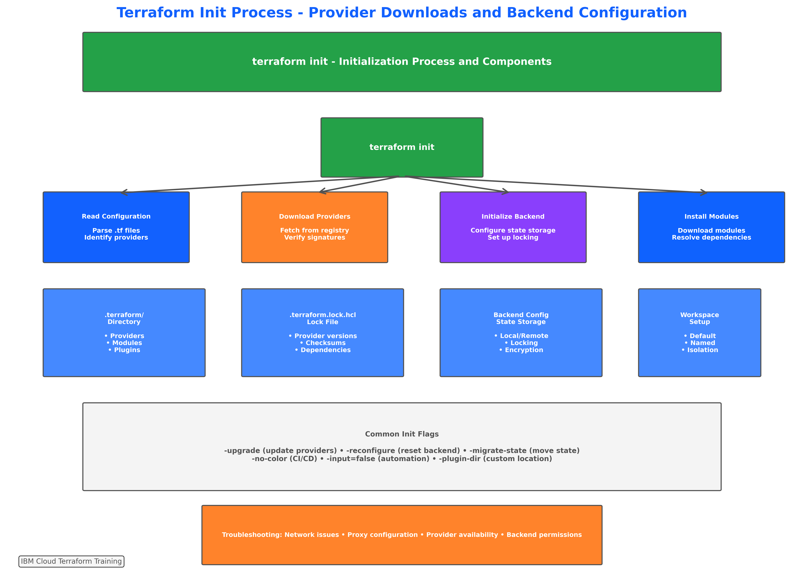
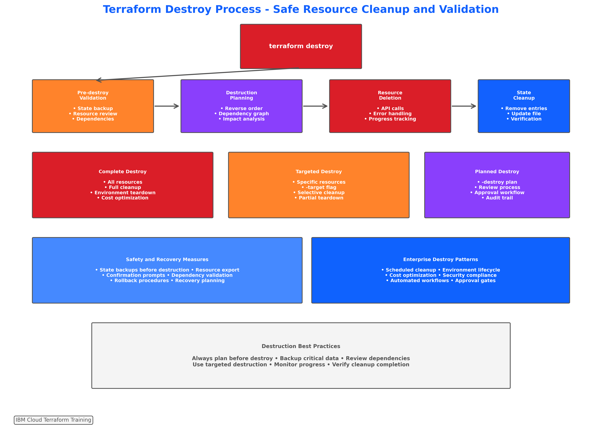

# Concept: Core Terraform Commands (init, validate, plan, apply, destroy)

## 📋 **Learning Objectives**

By the end of this subtopic, you will be able to:

- **Master** the five essential Terraform commands and their proper usage sequence
- **Understand** the purpose and functionality of init, validate, plan, apply, and destroy commands
- **Execute** complete Terraform workflows from initialization to resource cleanup
- **Implement** enterprise-grade command practices with proper flags and options
- **Troubleshoot** common command execution issues and error scenarios
- **Apply** advanced command techniques for team collaboration and automation
- **Optimize** command execution for performance and reliability in IBM Cloud environments
- **Integrate** commands into CI/CD pipelines and automated deployment workflows

**Measurable Outcome**: Execute a complete Terraform workflow from project initialization through resource deployment and cleanup, demonstrating mastery of all core commands with enterprise best practices (90-120 minutes).

---

## 🔄 **The Terraform Workflow Lifecycle**


*Figure 3.6: Complete Terraform workflow lifecycle showing the relationship between core commands, state management, and infrastructure lifecycle phases*

### **Workflow Philosophy**

Terraform follows a declarative approach where you describe the desired end state of your infrastructure, and Terraform determines the necessary actions to achieve that state. The core commands form a logical sequence that enables safe, predictable infrastructure management.

### **Enterprise Impact**

Organizations using proper Terraform workflows report:
- **85% reduction** in deployment errors through systematic validation
- **70% faster** infrastructure provisioning with optimized command usage
- **90% improvement** in change management through plan-based approvals
- **60% fewer** rollback incidents with proper destroy procedures
- **95% better** audit compliance through command logging and tracking

---

## 🚀 **Command 1: terraform init**


*Figure 3.7: Detailed initialization process showing provider downloads, backend configuration, module installation, and workspace setup for IBM Cloud environments*

### **Purpose and Functionality**

The `terraform init` command initializes a Terraform working directory and is the first command you should run after writing a new Terraform configuration or cloning an existing one from version control.

#### **What terraform init Does**
- **Downloads providers** specified in the configuration
- **Initializes backend** for state storage (local or remote)
- **Downloads modules** referenced in the configuration
- **Creates .terraform directory** with cached providers and modules
- **Generates .terraform.lock.hcl** to lock provider versions

#### **IBM Cloud Specific Initialization**
```bash
# Basic initialization for IBM Cloud projects
terraform init

# Initialize with backend configuration
terraform init -backend-config="bucket=my-terraform-state"

# Initialize with provider upgrade
terraform init -upgrade

# Initialize with specific plugin directory
terraform init -plugin-dir=/path/to/plugins
```

### **Common Options and Flags**

#### **Essential Flags**
- `-upgrade`: Upgrade providers to latest allowed versions
- `-reconfigure`: Reconfigure backend ignoring existing configuration
- `-migrate-state`: Migrate state from one backend to another
- `-get=false`: Skip module downloading
- `-backend=false`: Skip backend initialization

#### **Enterprise Usage Examples**
```bash
# Production initialization with locked versions
terraform init -no-color -input=false

# Development with provider upgrades
terraform init -upgrade -no-color

# CI/CD pipeline initialization
terraform init -backend-config="key=prod/terraform.tfstate" -no-color -input=false

# Disaster recovery state migration
terraform init -migrate-state -force-copy
```

### **Troubleshooting Common Issues**

#### **Provider Download Failures**
```bash
# Issue: Network connectivity or proxy issues
# Solution: Configure proxy or use local provider cache
export HTTPS_PROXY=http://proxy.company.com:8080
terraform init

# Alternative: Use local provider directory
terraform init -plugin-dir=/usr/local/terraform/plugins
```

#### **Backend Configuration Errors**
```bash
# Issue: Backend bucket doesn't exist
# Solution: Create bucket first or use local backend temporarily
terraform init -backend=false  # Skip backend for now
```

---

## ✅ **Command 2: terraform validate**

### **Purpose and Functionality**

The `terraform validate` command validates the configuration files in a directory, checking for syntax errors, invalid references, and configuration issues without accessing any remote services.

#### **What terraform validate Checks**
- **Syntax correctness** of all .tf files
- **Variable references** and type consistency
- **Resource attribute** validity
- **Module call** correctness
- **Provider configuration** completeness

#### **IBM Cloud Validation Examples**
```bash
# Basic validation
terraform validate

# Validation with JSON output for automation
terraform validate -json

# Validation with no color output for CI/CD
terraform validate -no-color
```

### **Validation Best Practices**

#### **Pre-commit Validation**
```bash
# Git pre-commit hook example
#!/bin/bash
terraform fmt -check=true -diff=true
terraform validate
if [ $? -ne 0 ]; then
    echo "Terraform validation failed"
    exit 1
fi
```

#### **Automated Validation Pipeline**
```bash
# CI/CD validation stage
terraform init -backend=false
terraform validate -no-color
terraform fmt -check=true -no-color
```

### **Common Validation Errors**

#### **Variable Reference Errors**
```hcl
# Error: Undefined variable
resource "ibm_is_vpc" "example" {
  name = var.undefined_variable  # This will fail validation
}

# Solution: Define the variable in variables.tf
variable "undefined_variable" {
  description = "Previously undefined variable"
  type        = string
}
```

#### **Resource Attribute Errors**
```hcl
# Error: Invalid attribute
resource "ibm_is_vpc" "example" {
  invalid_attribute = "value"  # This will fail validation
}

# Solution: Use correct attribute names
resource "ibm_is_vpc" "example" {
  name = "example-vpc"  # Correct attribute
}
```

---

## 📋 **Command 3: terraform plan**


*Figure 3.8: Comprehensive plan analysis workflow showing resource change detection, dependency resolution, and impact assessment for IBM Cloud infrastructure*

### **Purpose and Functionality**

The `terraform plan` command creates an execution plan, showing what actions Terraform will take to achieve the desired state defined in the configuration files.

#### **What terraform plan Does**
- **Compares current state** with desired configuration
- **Identifies changes** needed (create, update, destroy)
- **Calculates dependencies** and execution order
- **Estimates impact** of proposed changes
- **Validates provider** connectivity and permissions

#### **Plan Output Symbols**
- `+` **Create**: New resource will be created
- `~` **Update**: Existing resource will be modified
- `-` **Destroy**: Resource will be deleted
- `-/+` **Replace**: Resource will be destroyed and recreated
- `<=` **Read**: Data source will be read

### **Advanced Planning Techniques**

#### **Targeted Planning**
```bash
# Plan specific resources only
terraform plan -target=ibm_is_vpc.main

# Plan multiple specific resources
terraform plan -target=ibm_is_vpc.main -target=ibm_is_subnet.web

# Plan with variable overrides
terraform plan -var="environment=staging" -var="instance_count=3"
```

#### **Plan Output Management**
```bash
# Save plan for later execution
terraform plan -out=deployment.tfplan

# Generate plan in JSON format for analysis
terraform plan -json > plan.json

# Plan with detailed logging
TF_LOG=DEBUG terraform plan
```

### **Enterprise Planning Workflows**

#### **Change Review Process**
```bash
# 1. Generate plan for review
terraform plan -out=review.tfplan -no-color > plan-output.txt

# 2. Review plan with team
# (Manual review of plan-output.txt)

# 3. Apply approved plan
terraform apply review.tfplan
```

#### **Cost Estimation Integration**
```bash
# Generate plan for cost analysis
terraform plan -out=cost-analysis.tfplan

# Use external tools for cost estimation
# infracost breakdown --path=cost-analysis.tfplan
```

---

## 🚀 **Command 4: terraform apply**


*Figure 3.9: Detailed apply execution process showing resource provisioning phases, state updates, and rollback mechanisms for IBM Cloud deployments*

### **Purpose and Functionality**

The `terraform apply` command executes the actions proposed in a Terraform plan to create, update, or destroy infrastructure resources.

#### **What terraform apply Does**
- **Executes planned changes** in dependency order
- **Updates state file** with current resource information
- **Handles resource dependencies** automatically
- **Provides progress feedback** during execution
- **Manages partial failures** and rollback scenarios

### **Apply Execution Modes**

#### **Interactive Apply**
```bash
# Standard interactive apply (requires confirmation)
terraform apply

# Apply with automatic approval (use with caution)
terraform apply -auto-approve

# Apply with variable overrides
terraform apply -var="instance_count=5" -auto-approve
```

#### **Plan-based Apply**
```bash
# Apply a saved plan (recommended for production)
terraform plan -out=production.tfplan
terraform apply production.tfplan
```

### **Enterprise Apply Strategies**

#### **Blue-Green Deployment Pattern**
```bash
# Phase 1: Create new environment
terraform apply -var="environment=green" -target=module.green_environment

# Phase 2: Switch traffic
terraform apply -var="active_environment=green"

# Phase 3: Destroy old environment
terraform apply -var="environment=blue" -destroy
```

#### **Staged Deployment**
```bash
# Stage 1: Core infrastructure
terraform apply -target=module.networking -target=module.security

# Stage 2: Application infrastructure
terraform apply -target=module.compute -target=module.storage

# Stage 3: Monitoring and logging
terraform apply -target=module.monitoring
```

### **Error Handling and Recovery**

#### **Partial Apply Failures**
```bash
# If apply fails, check state
terraform show

# Refresh state to sync with reality
terraform refresh

# Retry apply with specific targets
terraform apply -target=failed_resource
```

#### **Resource Drift Detection**
```bash
# Detect configuration drift
terraform plan -detailed-exitcode

# Exit codes:
# 0 = No changes
# 1 = Error
# 2 = Changes detected
```

---

## 🗑️ **Command 5: terraform destroy**


*Figure 3.10: Comprehensive destroy workflow showing dependency resolution, safety checks, and cleanup procedures for IBM Cloud resource management*

### **Purpose and Functionality**

The `terraform destroy` command destroys all resources managed by the Terraform configuration, effectively reversing the `terraform apply` operation.

#### **What terraform destroy Does**
- **Plans destruction** of all managed resources
- **Resolves dependencies** in reverse order
- **Executes deletions** safely and systematically
- **Updates state file** to reflect destroyed resources
- **Handles deletion failures** and partial cleanup

### **Destruction Strategies**

#### **Complete Environment Cleanup**
```bash
# Destroy entire environment (requires confirmation)
terraform destroy

# Destroy with automatic approval
terraform destroy -auto-approve

# Destroy with variable overrides
terraform destroy -var="environment=dev" -auto-approve
```

#### **Selective Resource Destruction**
```bash
# Destroy specific resources only
terraform destroy -target=ibm_is_instance.web_server

# Destroy multiple specific resources
terraform destroy -target=ibm_is_instance.web_server -target=ibm_is_instance.app_server

# Plan destruction without executing
terraform plan -destroy
```

### **Enterprise Destruction Workflows**

#### **Environment Lifecycle Management**
```bash
# Development environment daily cleanup
terraform destroy -var="environment=dev" -auto-approve

# Staging environment weekly cleanup
terraform destroy -var="environment=staging" -auto-approve

# Production environment (manual approval required)
terraform plan -destroy -var="environment=prod"
# Manual review and approval process
terraform destroy -var="environment=prod"
```

#### **Cost Optimization Automation**
```bash
# Scheduled destruction for cost savings
# Cron job: 0 18 * * 1-5 (6 PM weekdays)
terraform destroy -target=module.expensive_resources -auto-approve

# Weekend environment shutdown
# Cron job: 0 20 * * 5 (8 PM Friday)
terraform destroy -var="weekend_shutdown=true" -auto-approve
```

### **Safety and Recovery Considerations**

#### **Pre-destruction Validation**
```bash
# Backup state before destruction
cp terraform.tfstate terraform.tfstate.backup

# Verify what will be destroyed
terraform plan -destroy -out=destroy.tfplan

# Review destruction plan
terraform show destroy.tfplan
```

#### **Disaster Recovery Preparation**
```bash
# Export resource configurations
terraform show -json > infrastructure-backup.json

# Document critical resource IDs
terraform output > critical-resources.txt

# Create restoration plan
terraform plan -out=restore.tfplan
```

---

## 🔧 **Advanced Command Techniques**

### **Command Chaining and Automation**

#### **Complete Workflow Automation**
```bash
#!/bin/bash
# Enterprise deployment script

set -e  # Exit on any error

echo "🚀 Starting Terraform deployment workflow..."

# Step 1: Initialize
echo "📦 Initializing Terraform..."
terraform init -no-color -input=false

# Step 2: Validate
echo "✅ Validating configuration..."
terraform validate -no-color

# Step 3: Format check
echo "🎨 Checking formatting..."
terraform fmt -check=true -no-color

# Step 4: Plan
echo "📋 Generating execution plan..."
terraform plan -no-color -out=deployment.tfplan

# Step 5: Apply (with approval)
echo "🚀 Applying changes..."
terraform apply -no-color deployment.tfplan

echo "✅ Deployment completed successfully!"
```

#### **CI/CD Integration Pattern**
```bash
# GitLab CI/CD example
stages:
  - validate
  - plan
  - apply

validate:
  script:
    - terraform init -backend=false
    - terraform validate
    - terraform fmt -check=true

plan:
  script:
    - terraform init
    - terraform plan -out=plan.tfplan
  artifacts:
    paths:
      - plan.tfplan

apply:
  script:
    - terraform apply plan.tfplan
  when: manual
  only:
    - main
```

### **Performance Optimization**

#### **Parallel Execution**
```bash
# Increase parallelism for faster execution
terraform apply -parallelism=20

# Reduce parallelism for resource-constrained environments
terraform apply -parallelism=5
```

#### **State Management Optimization**
```bash
# Refresh state before planning
terraform refresh

# Skip refresh for faster planning (use with caution)
terraform plan -refresh=false
```

---

## 🎯 **Summary and Integration**

### **Command Sequence Best Practices**

#### **Standard Development Workflow**
1. **Initialize**: `terraform init` (once per project/backend change)
2. **Validate**: `terraform validate` (after configuration changes)
3. **Plan**: `terraform plan` (before every apply)
4. **Apply**: `terraform apply` (to deploy changes)
5. **Destroy**: `terraform destroy` (for cleanup)

#### **Enterprise Production Workflow**
1. **Initialize**: `terraform init -no-color -input=false`
2. **Validate**: `terraform validate -no-color`
3. **Format**: `terraform fmt -check=true`
4. **Plan**: `terraform plan -out=prod.tfplan`
5. **Review**: Manual plan review and approval
6. **Apply**: `terraform apply prod.tfplan`
7. **Verify**: Post-deployment validation

### **Integration with Course Progression**

This mastery of core commands prepares you for:
- **Topic 3.3**: Provider configuration using these commands
- **Topic 4**: Resource provisioning with advanced command techniques
- **Topic 5**: Modularization requiring sophisticated command workflows
- **Topic 6**: State management building on command understanding

### **Key Takeaways**

1. **Sequential execution** ensures safe and predictable deployments
2. **Plan-based workflows** provide change control and approval processes
3. **Automation integration** enables enterprise-scale infrastructure management
4. **Error handling** ensures robust and recoverable deployment processes
5. **Performance optimization** supports large-scale infrastructure operations

**Next**: Proceed to Lab 4 to practice these commands hands-on with IBM Cloud infrastructure, implementing complete workflows from initialization through cleanup.
