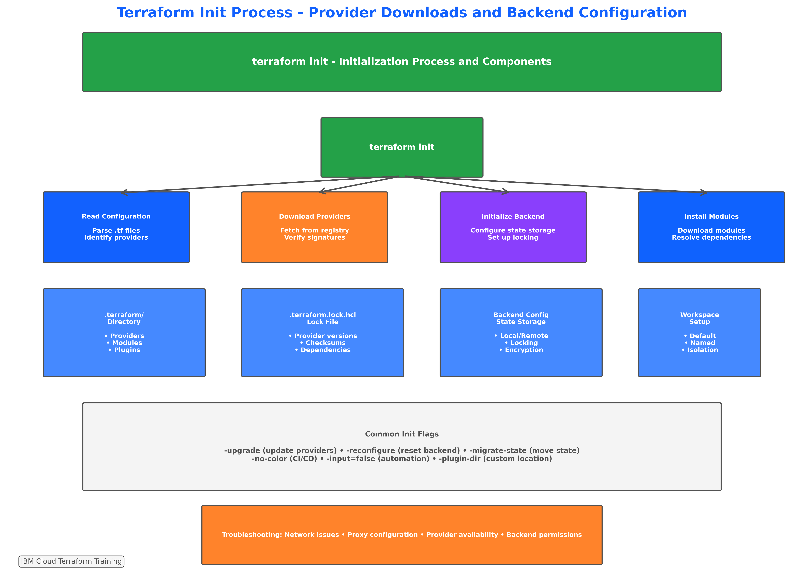
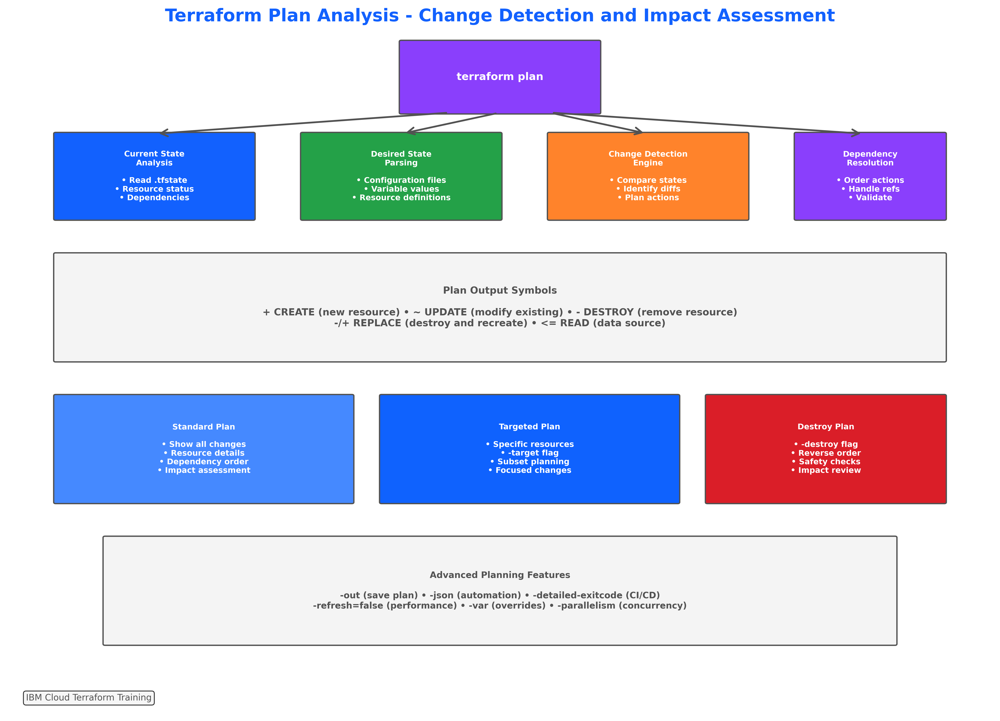
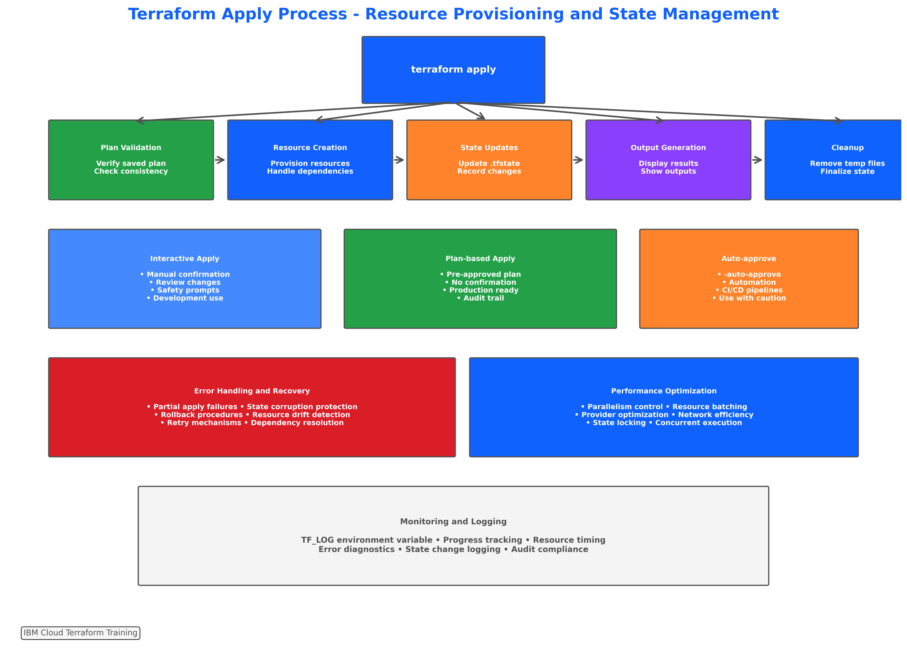
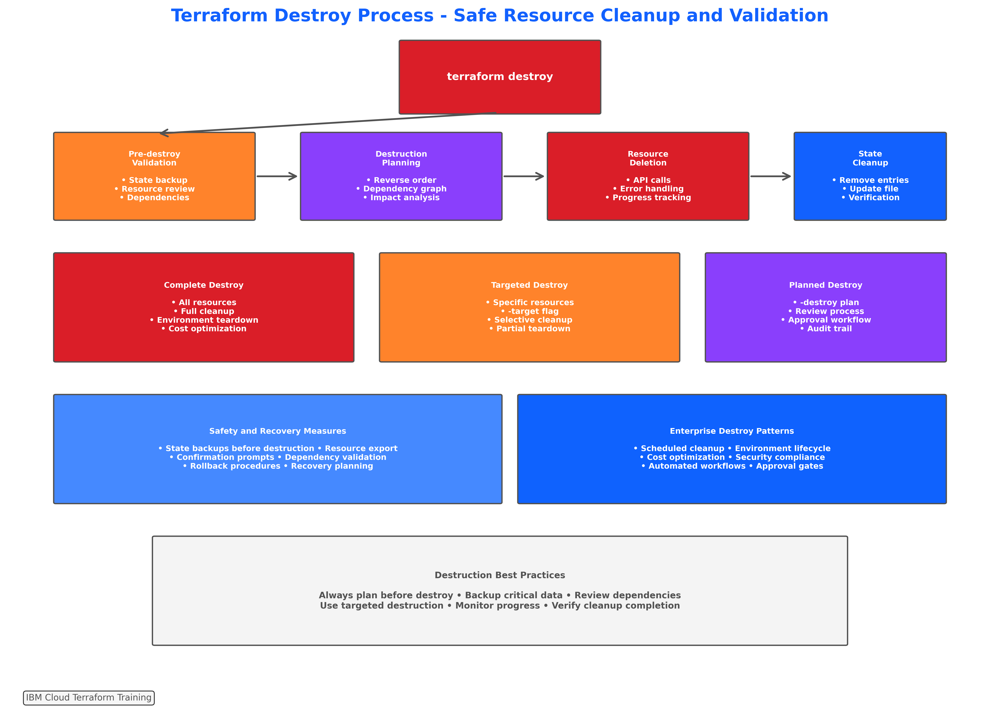

# Lab 4: Core Terraform Commands Practice

## 📋 **Lab Overview**

**Duration**: 90-120 minutes  
**Difficulty**: Intermediate  
**Prerequisites**: Completion of Lab 3 (Directory Structure and Configuration Files)

### **Learning Objectives**

By completing this lab, you will:
- Execute the complete Terraform workflow using all five core commands
- Master command-line options and flags for enterprise environments
- Implement proper error handling and troubleshooting techniques
- Practice plan-based deployment workflows for production readiness
- Demonstrate advanced command techniques for automation and CI/CD integration

### **Lab Scenario**

You are a DevOps engineer responsible for deploying and managing IBM Cloud infrastructure using Terraform. Your task is to implement a complete infrastructure deployment workflow that includes proper validation, planning, deployment, and cleanup procedures following enterprise best practices.

---

## 🎯 **Lab Environment Setup**

### **Prerequisites Verification**

Ensure your environment is properly configured:

```bash
# Verify Terraform installation and version
terraform version

# Should show Terraform v1.5.0 or higher
# IBM Provider v1.58.0 or compatible

# Verify IBM Cloud CLI (optional)
ibmcloud version

# Check environment variables
echo "IC_API_KEY: ${IC_API_KEY:0:10}..." # Shows first 10 chars
echo "TF_LOG: $TF_LOG"
```

### **Lab Directory Setup**

```bash
# Create lab working directory
mkdir -p ~/terraform-labs/lab-4-core-commands
cd ~/terraform-labs/lab-4-core-commands

# Copy configuration from previous lab
cp -r ~/terraform-labs/lab-3-directory-structure/terraform-ibm-infrastructure/* .

# Verify files are present
ls -la
```

**Expected Files**:
- `providers.tf`
- `variables.tf`
- `main.tf`
- `outputs.tf`
- `terraform.tfvars.example`
- `README.md`
- `.gitignore`

---

## 🚀 **Exercise 1: terraform init - Project Initialization (20 minutes)**


*Figure 3.7: Reference guide for the initialization process you'll execute in this exercise*

### **Step 1: Basic Initialization**

Start with a clean initialization:

```bash
# Remove any existing Terraform state
rm -rf .terraform/
rm -f .terraform.lock.hcl
rm -f terraform.tfstate*

# Perform basic initialization
terraform init
```

**Expected Output Analysis**:
```
Initializing the backend...
Initializing provider plugins...
- Finding ibm-cloud/ibm versions matching "~> 1.58.0"...
- Finding hashicorp/random versions matching "~> 3.5.0"...
- Finding hashicorp/time versions matching "~> 0.9.0"...
- Finding hashicorp/local versions matching "~> 2.4.0"...
```

### **Step 2: Examine Initialization Results**

Explore what `terraform init` created:

```bash
# Examine the .terraform directory structure
find .terraform -type f | head -10

# Check the lock file
cat .terraform.lock.hcl | head -20

# Verify provider installation
ls -la .terraform/providers/
```

### **Step 3: Advanced Initialization Options**

Practice enterprise initialization patterns:

```bash
# Initialize with no color output (CI/CD friendly)
terraform init -no-color

# Initialize with upgrade flag
terraform init -upgrade

# Initialize without input prompts
terraform init -input=false

# Combine flags for production use
terraform init -no-color -input=false -upgrade
```

### **Validation Checkpoint 1**

Verify successful initialization:

```bash
# Check initialization status
terraform version

# Verify providers are available
terraform providers

# Expected output should show:
# - provider[registry.terraform.io/ibm-cloud/ibm]
# - provider[registry.terraform.io/hashicorp/random]
# - provider[registry.terraform.io/hashicorp/time]
# - provider[registry.terraform.io/hashicorp/local]
```

---

## ✅ **Exercise 2: terraform validate - Configuration Validation (15 minutes)**

### **Step 4: Basic Validation**

Validate your configuration syntax:

```bash
# Basic validation
terraform validate

# Expected output: "Success! The configuration is valid."
```

### **Step 5: Validation with Different Outputs**

Practice validation for automation:

```bash
# Validation with JSON output
terraform validate -json

# Validation with no color (CI/CD friendly)
terraform validate -no-color

# Combine both for automation
terraform validate -json -no-color
```

### **Step 6: Intentional Error Testing**

Create and fix validation errors:

```bash
# Create a backup of variables.tf
cp variables.tf variables.tf.backup

# Introduce a syntax error
echo 'invalid_syntax = {' >> variables.tf

# Test validation (should fail)
terraform validate

# Fix the error
cp variables.tf.backup variables.tf

# Verify validation passes
terraform validate
```

### **Step 7: Advanced Validation Scenarios**

Test validation with missing files:

```bash
# Temporarily rename a file
mv providers.tf providers.tf.temp

# Test validation (should fail with provider errors)
terraform validate

# Restore the file
mv providers.tf.temp providers.tf

# Verify validation passes
terraform validate
```

### **Validation Checkpoint 2**

Create a validation script:

```bash
# Create validation script
cat > validate.sh << 'EOF'
#!/bin/bash
echo "🔍 Running Terraform validation..."

# Format check
echo "📝 Checking formatting..."
terraform fmt -check=true -diff=true

# Syntax validation
echo "✅ Validating syntax..."
terraform validate -no-color

if [ $? -eq 0 ]; then
    echo "✅ All validations passed!"
else
    echo "❌ Validation failed!"
    exit 1
fi
EOF

chmod +x validate.sh
./validate.sh
```

---

## 📋 **Exercise 3: terraform plan - Execution Planning (25 minutes)**


*Figure 3.8: Reference guide for plan analysis workflow you'll implement in this exercise*

### **Step 8: Configure Variables**

Set up your terraform.tfvars file:

```bash
# Copy example file
cp terraform.tfvars.example terraform.tfvars

# Edit with your values (use your preferred editor)
nano terraform.tfvars

# Required changes:
# - Set your IBM Cloud API key (or use environment variable)
# - Set project_name to "lab4-core-commands"
# - Set owner to your email
# - Adjust other values as needed
```

### **Step 9: Basic Planning**

Generate your first execution plan:

```bash
# Basic plan generation
terraform plan

# Analyze the output:
# - Look for the "Plan:" summary at the end
# - Count resources to be created
# - Identify resource types (VPC, subnets, security groups, etc.)
```

### **Step 10: Advanced Planning Techniques**

Practice enterprise planning workflows:

```bash
# Save plan to file for later execution
terraform plan -out=deployment.tfplan

# Generate plan with no color for automation
terraform plan -no-color

# Plan with variable overrides
terraform plan -var="environment=staging" -var="enable_public_gateway=false"

# Plan with detailed logging
TF_LOG=DEBUG terraform plan 2>&1 | head -50
```

### **Step 11: Plan Analysis and Review**

Examine plan details:

```bash
# Show saved plan in human-readable format
terraform show deployment.tfplan

# Show plan in JSON format for automation
terraform show -json deployment.tfplan > plan.json

# Analyze plan summary
grep -A 5 -B 5 "Plan:" plan.json || echo "Plan summary not found in JSON"

# Count resources by action
terraform show deployment.tfplan | grep -E "^\s*[+~-]" | sort | uniq -c
```

### **Step 12: Targeted Planning**

Practice selective planning:

```bash
# Plan only VPC resources
terraform plan -target=ibm_is_vpc.project_vpc

# Plan multiple specific resources
terraform plan -target=ibm_is_vpc.project_vpc -target=ibm_is_subnet.project_subnets

# Plan with refresh disabled (faster, but use with caution)
terraform plan -refresh=false
```

### **Validation Checkpoint 3**

Create a plan review process:

```bash
# Generate plan for review
terraform plan -out=review.tfplan -no-color > plan-review.txt

# Display plan summary
echo "📋 Plan Summary:"
tail -10 plan-review.txt

# Verify plan file exists and is valid
terraform show review.tfplan > /dev/null && echo "✅ Plan file is valid"
```

---

## 🚀 **Exercise 4: terraform apply - Infrastructure Deployment (30 minutes)**


*Figure 3.9: Reference guide for the apply execution process you'll implement in this exercise*

### **Step 13: Plan-Based Apply (Recommended)**

Execute infrastructure deployment using saved plan:

```bash
# Apply the previously saved plan
terraform apply deployment.tfplan

# Monitor the output:
# - Watch resource creation progress
# - Note the order of resource creation
# - Observe dependency handling
# - Check for any warnings or errors
```

**Expected Deployment Sequence**:
1. Random string generation
2. Time resources
3. VPC creation
4. Public gateway creation (if enabled)
5. Subnet creation
6. Security group creation
7. Security group rules
8. Local file generation

### **Step 14: Verify Deployment**

Confirm successful deployment:

```bash
# Check Terraform state
terraform show

# Display outputs
terraform output

# Verify specific outputs
terraform output project_info
terraform output resource_summary
terraform output connection_info

# Check generated files
ls -la deployment-summary.json
cat deployment-summary.json | jq '.' 2>/dev/null || cat deployment-summary.json
```

### **Step 15: State Management**

Explore Terraform state:

```bash
# List resources in state
terraform state list

# Show specific resource details
terraform state show ibm_is_vpc.project_vpc

# Check state file
ls -la terraform.tfstate
```

### **Step 16: Configuration Changes and Updates**

Practice infrastructure updates:

```bash
# Make a configuration change
# Edit terraform.tfvars to change a tag value
sed -i 's/"training-lab" = "directory-structure"/"training-lab" = "core-commands"/' terraform.tfvars

# Plan the update
terraform plan -out=update.tfplan

# Apply the update
terraform apply update.tfplan

# Verify the change
terraform output resource_summary
```

### **Validation Checkpoint 4**

Verify deployment success:

```bash
# Create deployment verification script
cat > verify-deployment.sh << 'EOF'
#!/bin/bash
echo "🔍 Verifying Terraform deployment..."

# Check if state file exists
if [ -f terraform.tfstate ]; then
    echo "✅ State file exists"
else
    echo "❌ State file missing"
    exit 1
fi

# Check resource count
RESOURCE_COUNT=$(terraform state list | wc -l)
echo "📊 Resources in state: $RESOURCE_COUNT"

# Verify key outputs exist
terraform output vpc_id > /dev/null && echo "✅ VPC output available"
terraform output project_info > /dev/null && echo "✅ Project info output available"

echo "✅ Deployment verification completed!"
EOF

chmod +x verify-deployment.sh
./verify-deployment.sh
```

---

## 🗑️ **Exercise 5: terraform destroy - Infrastructure Cleanup (20 minutes)**


*Figure 3.10: Reference guide for the destroy workflow you'll implement in this exercise*

### **Step 17: Plan Destruction**

Plan the destruction before executing:

```bash
# Plan destruction without executing
terraform plan -destroy

# Save destruction plan
terraform plan -destroy -out=destroy.tfplan

# Review destruction plan
terraform show destroy.tfplan
```

### **Step 18: Selective Destruction**

Practice targeted resource destruction:

```bash
# Destroy only security group rules (least impactful)
terraform destroy -target=ibm_is_security_group_rule.inbound_ssh -auto-approve

# Verify partial destruction
terraform state list | grep security_group_rule

# Plan to recreate destroyed resources
terraform plan
```

### **Step 19: Complete Environment Cleanup**

Perform full infrastructure cleanup:

```bash
# Apply the destruction plan
terraform apply destroy.tfplan

# Monitor destruction progress:
# - Note reverse dependency order
# - Watch for any deletion errors
# - Verify complete cleanup
```

### **Step 20: Post-Destruction Verification**

Confirm complete cleanup:

```bash
# Check state file (should be empty or minimal)
terraform show

# List remaining resources (should be empty)
terraform state list

# Verify no managed resources remain
echo "Remaining resources: $(terraform state list | wc -l)"

# Check for leftover files
ls -la *.tfplan *.json
```

### **Validation Checkpoint 5**

Create cleanup verification:

```bash
# Create cleanup verification script
cat > verify-cleanup.sh << 'EOF'
#!/bin/bash
echo "🧹 Verifying Terraform cleanup..."

# Check resource count
RESOURCE_COUNT=$(terraform state list | wc -l)
if [ $RESOURCE_COUNT -eq 0 ]; then
    echo "✅ All resources destroyed"
else
    echo "⚠️  $RESOURCE_COUNT resources remain in state"
    terraform state list
fi

# Check for plan files
PLAN_FILES=$(ls *.tfplan 2>/dev/null | wc -l)
echo "📁 Plan files remaining: $PLAN_FILES"

echo "✅ Cleanup verification completed!"
EOF

chmod +x verify-cleanup.sh
./verify-cleanup.sh
```

---

## 🔧 **Exercise 6: Advanced Command Workflows (10 minutes)**

### **Step 21: Complete Automation Script**

Create an enterprise-grade automation script:

```bash
cat > terraform-workflow.sh << 'EOF'
#!/bin/bash
set -e  # Exit on any error

# Colors for output
RED='\033[0;31m'
GREEN='\033[0;32m'
YELLOW='\033[1;33m'
BLUE='\033[0;34m'
NC='\033[0m' # No Color

print_status() {
    echo -e "${BLUE}[$(date '+%Y-%m-%d %H:%M:%S')] $1${NC}"
}

print_success() {
    echo -e "${GREEN}✅ $1${NC}"
}

print_error() {
    echo -e "${RED}❌ $1${NC}"
}

print_warning() {
    echo -e "${YELLOW}⚠️  $1${NC}"
}

# Main workflow
main() {
    local action=${1:-"deploy"}
    
    print_status "Starting Terraform workflow: $action"
    
    case $action in
        "deploy")
            deploy_infrastructure
            ;;
        "destroy")
            destroy_infrastructure
            ;;
        "plan")
            plan_infrastructure
            ;;
        *)
            echo "Usage: $0 [deploy|destroy|plan]"
            exit 1
            ;;
    esac
}

deploy_infrastructure() {
    print_status "🚀 Deploying infrastructure..."
    
    # Initialize
    print_status "📦 Initializing Terraform..."
    terraform init -no-color -input=false
    
    # Validate
    print_status "✅ Validating configuration..."
    terraform validate -no-color
    
    # Format check
    print_status "🎨 Checking formatting..."
    terraform fmt -check=true -no-color
    
    # Plan
    print_status "📋 Generating execution plan..."
    terraform plan -no-color -out=deployment.tfplan
    
    # Apply
    print_status "🚀 Applying changes..."
    terraform apply -no-color deployment.tfplan
    
    print_success "Deployment completed successfully!"
}

destroy_infrastructure() {
    print_status "🗑️  Destroying infrastructure..."
    
    # Plan destruction
    print_status "📋 Planning destruction..."
    terraform plan -destroy -no-color -out=destroy.tfplan
    
    # Destroy
    print_status "🗑️  Executing destruction..."
    terraform apply -no-color destroy.tfplan
    
    print_success "Infrastructure destroyed successfully!"
}

plan_infrastructure() {
    print_status "📋 Planning infrastructure changes..."
    
    # Initialize
    terraform init -no-color -input=false
    
    # Validate
    terraform validate -no-color
    
    # Plan
    terraform plan -no-color
    
    print_success "Planning completed!"
}

# Execute main function
main "$@"
EOF

chmod +x terraform-workflow.sh
```

### **Step 22: Test Automation Script**

Test your automation script:

```bash
# Test planning
./terraform-workflow.sh plan

# Test deployment
./terraform-workflow.sh deploy

# Test destruction
./terraform-workflow.sh destroy
```

---

## 📊 **Lab Assessment and Deliverables**

### **Deliverable Checklist**

Verify you have completed all exercises:

```bash
# Check created scripts
ls -la *.sh

# Expected scripts:
# - validate.sh
# - verify-deployment.sh
# - verify-cleanup.sh
# - terraform-workflow.sh

# Verify script permissions
ls -la *.sh | grep -c "rwx"  # Should show 4 executable scripts
```

### **Command Mastery Verification**

Test your command knowledge:

```bash
# Create command reference
cat > command-reference.md << 'EOF'
# Terraform Core Commands Reference

## terraform init
- Purpose: Initialize working directory
- Key flags: -upgrade, -no-color, -input=false
- When to use: First time, backend changes, provider updates

## terraform validate
- Purpose: Validate configuration syntax
- Key flags: -json, -no-color
- When to use: After configuration changes, in CI/CD

## terraform plan
- Purpose: Create execution plan
- Key flags: -out, -target, -var, -no-color
- When to use: Before every apply, for change review

## terraform apply
- Purpose: Execute planned changes
- Key flags: -auto-approve, -target, -parallelism
- When to use: Deploy infrastructure, apply changes

## terraform destroy
- Purpose: Destroy managed resources
- Key flags: -target, -auto-approve, -var
- When to use: Cleanup, environment teardown
EOF

echo "✅ Command reference created"
```

### **Assessment Criteria**

Your lab completion will be evaluated on:

1. **✅ Command Execution**: Successful execution of all five core commands
2. **✅ Workflow Understanding**: Proper command sequencing and dependencies
3. **✅ Error Handling**: Ability to troubleshoot and resolve issues
4. **✅ Automation**: Creation of reusable scripts and workflows
5. **✅ Best Practices**: Implementation of enterprise-grade patterns

### **Troubleshooting Common Issues**

**Issue**: `terraform init` fails with provider download errors
- **Solution**: Check internet connectivity, configure proxy if needed
- **Command**: `terraform init -plugin-dir=/path/to/cached/providers`

**Issue**: `terraform plan` fails with authentication errors
- **Solution**: Verify API key and permissions
- **Check**: `echo $IC_API_KEY` and IBM Cloud console access

**Issue**: `terraform apply` fails with quota errors
- **Solution**: Check IBM Cloud quotas and limits
- **Command**: `ibmcloud is quotas` (if IBM Cloud CLI is installed)

**Issue**: `terraform destroy` fails with dependency errors
- **Solution**: Use targeted destruction or manual cleanup
- **Command**: `terraform destroy -target=specific_resource`

---

## 🎯 **Lab Summary and Next Steps**

### **What You Accomplished**

✅ **Mastered all five core Terraform commands**  
✅ **Implemented complete infrastructure workflows**  
✅ **Created enterprise-grade automation scripts**  
✅ **Practiced error handling and troubleshooting**  
✅ **Demonstrated plan-based deployment processes**  

### **Key Learning Outcomes**

- **Command Sequencing**: Understanding proper workflow order and dependencies
- **Enterprise Patterns**: Implementation of production-ready command practices
- **Automation Skills**: Creation of reusable scripts for team collaboration
- **Error Resolution**: Troubleshooting and recovery techniques
- **Performance Optimization**: Advanced command options and techniques

### **Preparation for Next Topics**

This command mastery prepares you for:
- **Topic 3.3**: Provider configuration using advanced command techniques
- **Topic 4**: Resource provisioning with sophisticated workflows
- **Topic 5**: Modularization requiring complex command orchestration
- **Topic 6**: State management building on command expertise

### **Additional Practice**

To reinforce your learning:
1. Create custom automation scripts for your specific use cases
2. Practice command workflows in different environments
3. Experiment with advanced command flags and options
4. Integrate commands into CI/CD pipelines

**🎉 Congratulations!** You have successfully completed Lab 4 and mastered the core Terraform commands for enterprise-grade IBM Cloud infrastructure automation.
