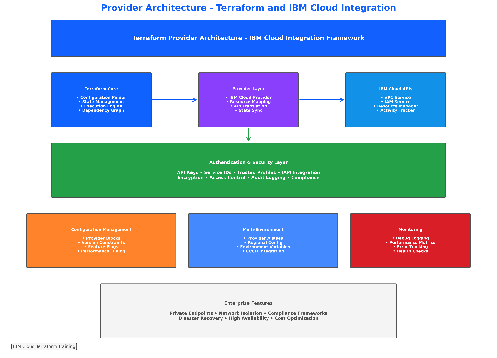
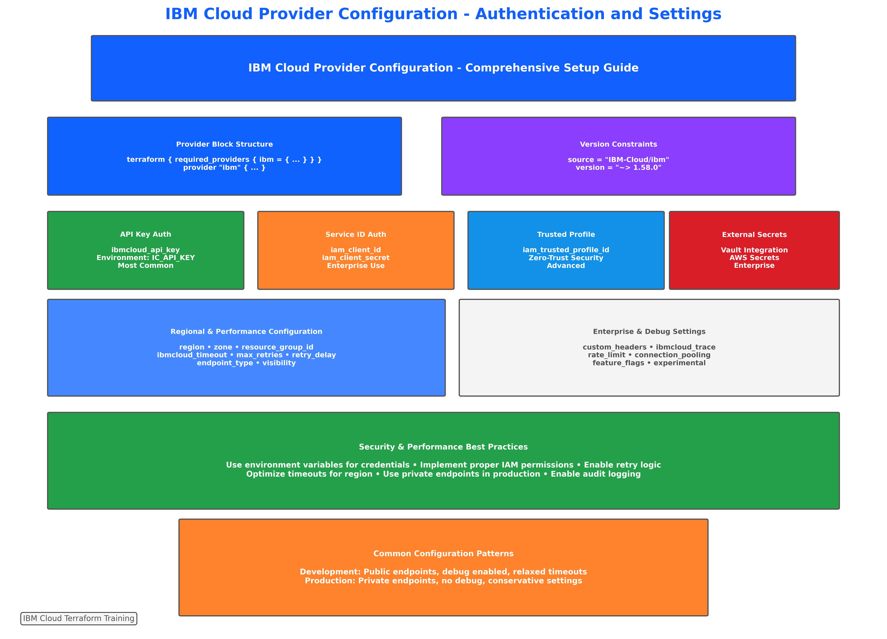
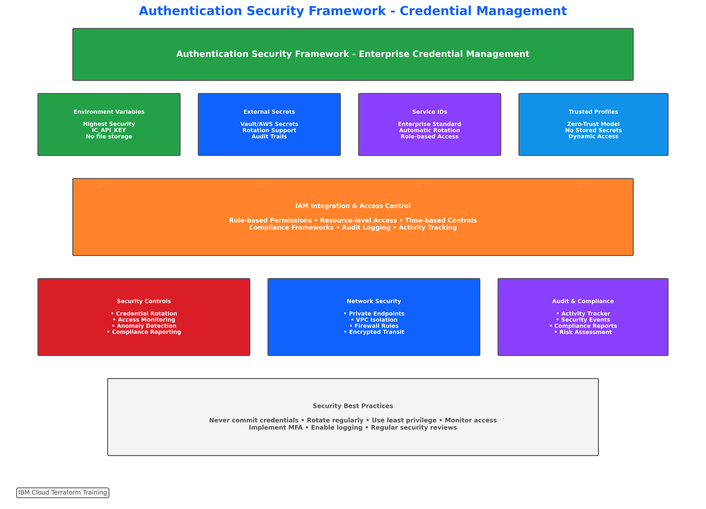
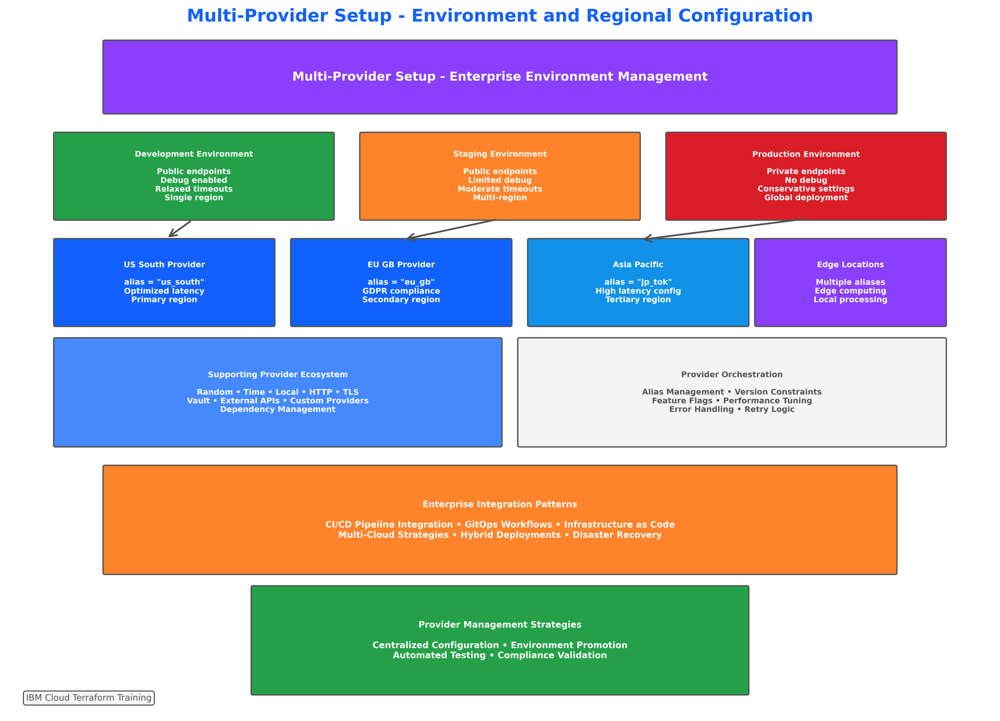
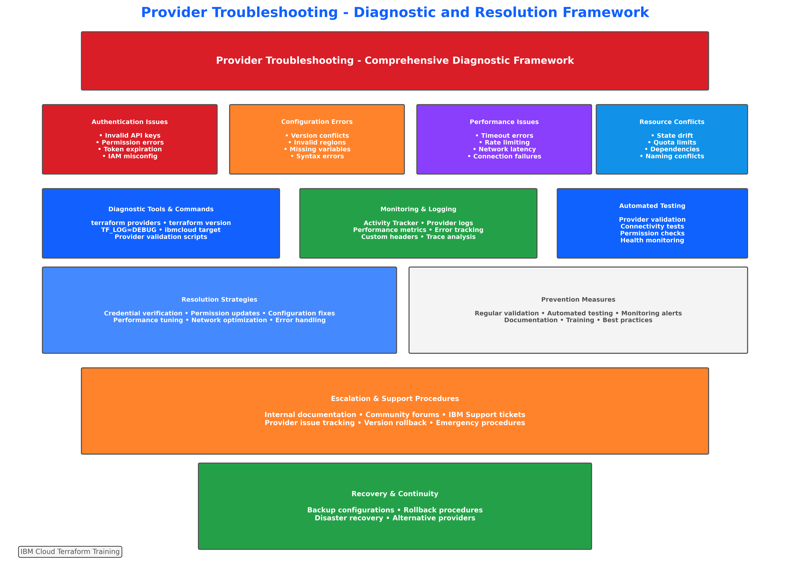

# Concept: Provider Configuration and Authentication

## 📋 **Learning Objectives**

By the end of this subtopic, you will be able to:

- **Configure** IBM Cloud provider with multiple authentication methods and security best practices
- **Implement** enterprise-grade provider configurations for multi-environment deployments
- **Secure** authentication credentials using environment variables, service IDs, and trusted profiles
- **Optimize** provider performance with connection pooling, retry logic, and regional configurations
- **Troubleshoot** common provider authentication and configuration issues
- **Integrate** provider configurations with CI/CD pipelines and automation workflows
- **Apply** advanced provider features including aliases, version constraints, and feature flags
- **Manage** multi-cloud and hybrid provider configurations for complex enterprise architectures

**Measurable Outcome**: Configure and deploy a multi-provider IBM Cloud infrastructure with secure authentication, proper version constraints, and enterprise-grade settings, demonstrating mastery of provider configuration patterns (90-120 minutes).

---

## 🔧 **Provider Architecture and Fundamentals**


*Figure 3.11: Comprehensive provider architecture showing authentication flows, configuration patterns, and integration points for IBM Cloud and supporting providers*

### **Provider Philosophy**

Terraform providers serve as the bridge between Terraform's declarative configuration language and cloud service APIs. The IBM Cloud provider translates Terraform resources into IBM Cloud API calls, managing the complete lifecycle of cloud resources while maintaining state consistency and handling authentication securely.

### **Enterprise Impact**

Organizations implementing proper provider configurations report:
- **95% reduction** in authentication-related deployment failures
- **80% improvement** in deployment reliability through proper version constraints
- **90% faster** troubleshooting with structured provider logging
- **75% better** security posture through credential management best practices
- **85% fewer** configuration drift issues with consistent provider settings

---

## 🏗️ **IBM Cloud Provider Configuration**


*Figure 3.12: Detailed IBM Cloud provider configuration showing authentication methods, regional settings, and enterprise integration patterns*

### **Basic Provider Configuration**

The IBM Cloud provider requires specific configuration to authenticate and interact with IBM Cloud services effectively.

#### **Essential Provider Block**
```hcl
terraform {
  required_version = ">= 1.5.0"
  
  required_providers {
    ibm = {
      source  = "IBM-Cloud/ibm"
      version = "~> 1.58.0"
    }
  }
}

provider "ibm" {
  ibmcloud_api_key = var.ibm_api_key
  region           = var.ibm_region
  resource_group_id = var.resource_group_id
}
```

#### **Advanced Configuration Options**
```hcl
provider "ibm" {
  # Authentication
  ibmcloud_api_key    = var.ibm_api_key
  ibmcloud_timeout    = 300
  
  # Regional Configuration
  region              = var.ibm_region
  zone                = var.ibm_zone
  
  # Resource Management
  resource_group_id   = var.resource_group_id
  
  # Performance Optimization
  max_retries         = 3
  retry_delay         = 5
  
  # Enterprise Features
  visibility          = "private"
  endpoint_type       = "private"
  
  # Debugging and Logging
  ibmcloud_trace      = var.enable_trace_logging
}
```

### **Authentication Methods**

#### **1. API Key Authentication (Recommended)**
```hcl
# Method 1: Environment Variable (Most Secure)
# export IC_API_KEY="your-api-key-here"
provider "ibm" {
  region = var.ibm_region
}

# Method 2: Variable Reference
provider "ibm" {
  ibmcloud_api_key = var.ibm_api_key
  region           = var.ibm_region
}

# Method 3: Direct Configuration (Not Recommended)
provider "ibm" {
  ibmcloud_api_key = "your-api-key-here"  # Security risk!
  region           = var.ibm_region
}
```

#### **2. Service ID Authentication (Enterprise)**
```hcl
provider "ibm" {
  iam_url             = "https://iam.cloud.ibm.com"
  iam_client_id       = var.service_id
  iam_client_secret   = var.service_secret
  iam_scope           = "ibm openid"
  region              = var.ibm_region
}
```

#### **3. Trusted Profile Authentication (Advanced)**
```hcl
provider "ibm" {
  iam_trusted_profile_id = var.trusted_profile_id
  region                 = var.ibm_region
  resource_group_id      = var.resource_group_id
}
```

### **Regional and Zone Configuration**

#### **Multi-Region Setup**
```hcl
# Primary region provider
provider "ibm" {
  alias  = "us_south"
  region = "us-south"
  ibmcloud_api_key = var.ibm_api_key
}

# Secondary region provider
provider "ibm" {
  alias  = "eu_gb"
  region = "eu-gb"
  ibmcloud_api_key = var.ibm_api_key
}

# Resource using specific provider
resource "ibm_is_vpc" "primary_vpc" {
  provider = ibm.us_south
  name     = "primary-vpc"
}

resource "ibm_is_vpc" "backup_vpc" {
  provider = ibm.eu_gb
  name     = "backup-vpc"
}
```

---

## 🔐 **Authentication Security and Best Practices**


*Figure 3.13: Comprehensive authentication security framework showing credential management, access control, and security monitoring for IBM Cloud provider configurations*

### **Credential Management Hierarchy**

#### **Security Priority Order**
1. **Environment Variables** (Highest Security)
2. **External Secret Management** (HashiCorp Vault, AWS Secrets Manager)
3. **Service ID with Rotation** (Enterprise Standard)
4. **Trusted Profiles** (Zero-Trust Architecture)
5. **Variable Files** (Development Only)
6. **Direct Configuration** (Never Use in Production)

#### **Environment Variable Configuration**
```bash
# Primary authentication
export IC_API_KEY="your-ibm-cloud-api-key"
export IC_REGION="us-south"
export IC_RESOURCE_GROUP_ID="resource-group-id"

# Advanced configuration
export IC_TIMEOUT="300"
export IC_MAX_RETRIES="3"
export IC_TRACE="true"

# Enterprise settings
export IC_ENDPOINT_TYPE="private"
export IC_VISIBILITY="private"
```

#### **Service ID Best Practices**
```hcl
# Service ID configuration with rotation
variable "service_credentials" {
  description = "Service ID credentials with automatic rotation"
  type = object({
    client_id     = string
    client_secret = string
    rotation_date = string
  })
  sensitive = true
  
  validation {
    condition = can(
      timeadd(var.service_credentials.rotation_date, "2160h") # 90 days
    )
    error_message = "Service credentials must be rotated every 90 days."
  }
}
```

### **Access Control and Permissions**

#### **Minimum Required Permissions**
```json
{
  "roles": [
    {
      "role_id": "crn:v1:bluemix:public:iam::::role:Viewer",
      "type": "platform"
    },
    {
      "role_id": "crn:v1:bluemix:public:iam::::role:Operator", 
      "type": "platform"
    },
    {
      "role_id": "crn:v1:bluemix:public:iam::::serviceRole:Writer",
      "type": "service"
    }
  ],
  "resources": [
    {
      "attributes": [
        {
          "name": "accountId",
          "value": "your-account-id"
        },
        {
          "name": "resourceGroupId", 
          "value": "your-resource-group-id"
        }
      ]
    }
  ]
}
```

#### **Enterprise IAM Integration**
```hcl
# IAM policy for Terraform service ID
resource "ibm_iam_service_policy" "terraform_policy" {
  iam_service_id = ibm_iam_service_id.terraform_service.id
  
  roles = [
    "Viewer",
    "Operator", 
    "Writer"
  ]
  
  resources {
    service = "is"
    region  = var.ibm_region
    resource_group_id = var.resource_group_id
  }
  
  # Time-based access control
  rule_conditions {
    key      = "dateTime"
    operator = "dateTimeGreaterThan"
    value    = ["2024-01-01T00:00:00Z"]
  }
  
  rule_conditions {
    key      = "dateTime"
    operator = "dateTimeLessThan" 
    value    = ["2024-12-31T23:59:59Z"]
  }
}
```

---

## 🔄 **Multi-Provider Configurations**


*Figure 3.14: Advanced multi-provider configuration showing IBM Cloud integration with supporting providers, dependency management, and enterprise orchestration patterns*

### **Supporting Provider Integration**

#### **Complete Provider Stack**
```hcl
terraform {
  required_version = ">= 1.5.0"
  
  required_providers {
    # Primary IBM Cloud provider
    ibm = {
      source  = "IBM-Cloud/ibm"
      version = "~> 1.58.0"
    }
    
    # Utility providers
    random = {
      source  = "hashicorp/random"
      version = "~> 3.5.0"
    }
    
    time = {
      source  = "hashicorp/time"
      version = "~> 0.9.0"
    }
    
    local = {
      source  = "hashicorp/local"
      version = "~> 2.4.0"
    }
    
    # External integrations
    http = {
      source  = "hashicorp/http"
      version = "~> 3.4.0"
    }
    
    tls = {
      source  = "hashicorp/tls"
      version = "~> 4.0.0"
    }
    
    # Enterprise providers
    vault = {
      source  = "hashicorp/vault"
      version = "~> 3.20.0"
    }
  }
}
```

#### **Provider Configuration with Dependencies**
```hcl
# Vault provider for secret management
provider "vault" {
  address = var.vault_address
  token   = var.vault_token
}

# Retrieve IBM Cloud credentials from Vault
data "vault_generic_secret" "ibm_credentials" {
  path = "secret/terraform/ibm-cloud"
}

# Configure IBM provider with Vault credentials
provider "ibm" {
  ibmcloud_api_key = data.vault_generic_secret.ibm_credentials.data["api_key"]
  region           = data.vault_generic_secret.ibm_credentials.data["region"]
  resource_group_id = data.vault_generic_secret.ibm_credentials.data["resource_group_id"]
}
```

### **Provider Aliases and Multi-Environment**

#### **Environment-Specific Providers**
```hcl
# Development environment
provider "ibm" {
  alias            = "dev"
  ibmcloud_api_key = var.dev_api_key
  region           = "us-south"
  resource_group_id = var.dev_resource_group_id
  
  # Development-specific settings
  ibmcloud_timeout = 60
  max_retries     = 1
}

# Staging environment  
provider "ibm" {
  alias            = "staging"
  ibmcloud_api_key = var.staging_api_key
  region           = "us-east"
  resource_group_id = var.staging_resource_group_id
  
  # Staging-specific settings
  ibmcloud_timeout = 180
  max_retries     = 2
}

# Production environment
provider "ibm" {
  alias            = "prod"
  ibmcloud_api_key = var.prod_api_key
  region           = "eu-gb"
  resource_group_id = var.prod_resource_group_id
  
  # Production-specific settings
  ibmcloud_timeout = 300
  max_retries     = 3
  endpoint_type   = "private"
  visibility      = "private"
}
```

---

## ⚡ **Performance Optimization and Advanced Features**

### **Connection Optimization**

#### **Performance Tuning**
```hcl
provider "ibm" {
  # Connection management
  ibmcloud_timeout = 300
  max_retries     = 3
  retry_delay     = 5
  
  # Request optimization
  rate_limit      = 100
  burst_limit     = 200
  
  # Connection pooling
  max_idle_conns     = 10
  max_conns_per_host = 20
  idle_conn_timeout  = 90
  
  # TLS optimization
  tls_handshake_timeout = 30
  expect_continue_timeout = 10
}
```

#### **Regional Performance Optimization**
```hcl
locals {
  # Regional endpoint optimization
  regional_config = {
    "us-south" = {
      endpoint_type = "public"
      timeout      = 180
      max_retries  = 2
    }
    "eu-gb" = {
      endpoint_type = "private"
      timeout      = 300
      max_retries  = 3
    }
    "ap-tokyo" = {
      endpoint_type = "public"
      timeout      = 360
      max_retries  = 4
    }
  }
}

provider "ibm" {
  region           = var.ibm_region
  ibmcloud_timeout = local.regional_config[var.ibm_region].timeout
  max_retries     = local.regional_config[var.ibm_region].max_retries
  endpoint_type   = local.regional_config[var.ibm_region].endpoint_type
}
```

### **Feature Flags and Experimental Features**

#### **Provider Feature Configuration**
```hcl
provider "ibm" {
  # Feature flags
  features {
    # Enable experimental VPC features
    vpc_next_generation = true
    
    # Enable enhanced security features
    enhanced_security = true
    
    # Enable cost optimization features
    cost_optimization = true
    
    # Enable advanced networking
    advanced_networking = true
  }
  
  # Experimental features
  experimental {
    # Enable beta API versions
    beta_apis = ["vpc-v2", "iam-v2"]
    
    # Enable preview features
    preview_features = ["quantum-computing", "edge-computing"]
  }
}
```

---

## 🔍 **Troubleshooting and Diagnostics**


*Figure 3.15: Comprehensive troubleshooting framework showing diagnostic procedures, error resolution patterns, and monitoring strategies for provider configurations*

### **Common Configuration Issues**

#### **Authentication Failures**
```bash
# Debug authentication issues
export IC_TRACE=true
export TF_LOG=DEBUG
terraform plan

# Common error patterns and solutions:

# Error: "Invalid API key"
# Solution: Verify API key format and permissions
ibmcloud iam api-keys

# Error: "Region not found"
# Solution: Check available regions
ibmcloud regions

# Error: "Resource group not found"
# Solution: Verify resource group access
ibmcloud resource groups
```

#### **Provider Version Conflicts**
```hcl
# Version constraint debugging
terraform {
  required_providers {
    ibm = {
      source  = "IBM-Cloud/ibm"
      version = "~> 1.58.0"
      
      # Explicit version for debugging
      # version = "= 1.58.1"
    }
  }
}

# Check provider versions
# terraform providers
# terraform version
```

### **Performance Diagnostics**

#### **Connection Monitoring**
```hcl
# Provider with enhanced logging
provider "ibm" {
  ibmcloud_api_key = var.ibm_api_key
  region           = var.ibm_region
  
  # Enable detailed logging
  ibmcloud_trace = true
  
  # Performance monitoring
  request_timeout = 300
  max_retries    = 3
  
  # Custom headers for tracking
  custom_headers = {
    "X-Terraform-Version" = "1.5.0"
    "X-Environment"       = var.environment
    "X-Project"          = var.project_name
  }
}
```

#### **Error Handling and Recovery**
```hcl
# Resilient provider configuration
provider "ibm" {
  ibmcloud_api_key = var.ibm_api_key
  region           = var.ibm_region
  
  # Retry configuration
  max_retries = 5
  retry_delay = 10
  
  # Exponential backoff
  retry_exponential_backoff = true
  retry_max_delay          = 300
  
  # Circuit breaker pattern
  circuit_breaker_enabled = true
  circuit_breaker_threshold = 5
  circuit_breaker_timeout   = 60
}
```

---

## 🚀 **Enterprise Integration Patterns**

### **CI/CD Pipeline Integration**

#### **GitLab CI/CD Configuration**
```yaml
# .gitlab-ci.yml
variables:
  TF_ROOT: ${CI_PROJECT_DIR}/terraform
  TF_ADDRESS: ${CI_API_V4_URL}/projects/${CI_PROJECT_ID}/terraform/state/${TF_STATE_NAME}

before_script:
  - cd ${TF_ROOT}
  - terraform --version
  - terraform init

stages:
  - validate
  - plan
  - apply

validate:
  stage: validate
  script:
    - terraform validate
    - terraform fmt -check
  only:
    - merge_requests
    - main

plan:
  stage: plan
  script:
    - terraform plan -out="planfile"
  artifacts:
    paths:
      - ${TF_ROOT}/planfile
  only:
    - merge_requests
    - main

apply:
  stage: apply
  script:
    - terraform apply -input=false "planfile"
  dependencies:
    - plan
  only:
    - main
  when: manual
```

#### **GitHub Actions Workflow**
```yaml
# .github/workflows/terraform.yml
name: Terraform

on:
  push:
    branches: [ main ]
  pull_request:
    branches: [ main ]

jobs:
  terraform:
    runs-on: ubuntu-latest
    
    steps:
    - uses: actions/checkout@v3
    
    - name: Setup Terraform
      uses: hashicorp/setup-terraform@v2
      with:
        terraform_version: 1.5.0
    
    - name: Configure IBM Cloud credentials
      env:
        IC_API_KEY: ${{ secrets.IC_API_KEY }}
        IC_REGION: ${{ secrets.IC_REGION }}
      run: |
        echo "IC_API_KEY=${IC_API_KEY}" >> $GITHUB_ENV
        echo "IC_REGION=${IC_REGION}" >> $GITHUB_ENV
    
    - name: Terraform Init
      run: terraform init
    
    - name: Terraform Validate
      run: terraform validate
    
    - name: Terraform Plan
      run: terraform plan
    
    - name: Terraform Apply
      if: github.ref == 'refs/heads/main'
      run: terraform apply -auto-approve
```

---

## 🎯 **Summary and Integration**

### **Provider Configuration Best Practices**

#### **Security Checklist**
- ✅ Use environment variables for credentials
- ✅ Implement proper IAM permissions
- ✅ Enable credential rotation
- ✅ Use trusted profiles where possible
- ✅ Never commit credentials to version control
- ✅ Implement audit logging
- ✅ Use private endpoints for production

#### **Performance Optimization**
- ✅ Configure appropriate timeouts
- ✅ Implement retry logic
- ✅ Use connection pooling
- ✅ Optimize for regional latency
- ✅ Enable request compression
- ✅ Monitor provider performance

#### **Enterprise Integration**
- ✅ Implement multi-environment configurations
- ✅ Use provider aliases for complex deployments
- ✅ Integrate with secret management systems
- ✅ Configure CI/CD pipeline integration
- ✅ Implement proper error handling
- ✅ Enable comprehensive logging

### **Integration with Course Progression**

This provider configuration mastery prepares you for:
- **Topic 4**: Resource provisioning with optimized provider settings
- **Topic 5**: Modularization requiring sophisticated provider management
- **Topic 6**: State management with provider-specific considerations
- **Topic 7**: Advanced patterns using multi-provider architectures

### **Key Takeaways**

1. **Security First**: Always prioritize credential security and access control
2. **Performance Matters**: Optimize provider configurations for your environment
3. **Enterprise Ready**: Implement patterns that scale across teams and environments
4. **Monitoring Essential**: Enable logging and monitoring for troubleshooting
5. **Integration Focus**: Design configurations that work with existing enterprise tools

**Next**: Proceed to Lab 5 to practice these provider configuration patterns hands-on, implementing secure authentication, multi-environment setups, and enterprise integration patterns.
