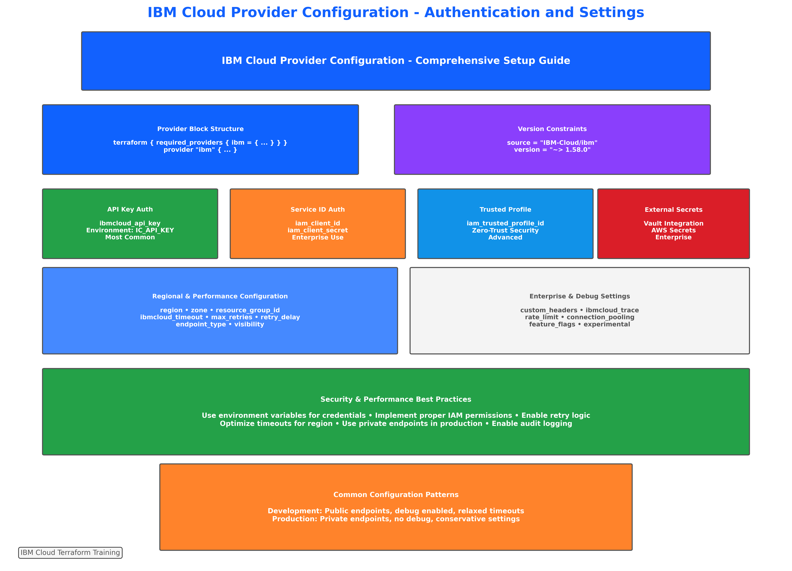

# Lab 5: Provider Configuration and Authentication Practice

## 📋 **Lab Overview**

**Duration**: 90-120 minutes  
**Difficulty**: Intermediate to Advanced  
**Prerequisites**: Completion of Labs 3 and 4 (Directory Structure and Core Commands)

### **Learning Objectives**

By completing this lab, you will:
- Configure IBM Cloud provider with multiple authentication methods
- Implement secure credential management using environment variables and best practices
- Set up multi-environment provider configurations with aliases and regional optimization
- Practice provider troubleshooting and performance optimization techniques
- Integrate provider configurations with enterprise security and automation workflows

### **Lab Scenario**

You are a Senior DevOps Engineer responsible for establishing enterprise-grade Terraform provider configurations for a multi-environment IBM Cloud deployment. Your task is to implement secure, scalable, and maintainable provider configurations that support development, staging, and production environments while adhering to security best practices and performance optimization requirements.

---

## 🎯 **Lab Environment Setup**

### **Prerequisites Verification**

Ensure your environment is properly configured:

```bash
# Verify Terraform installation and version
terraform version
# Should show Terraform v1.5.0 or higher

# Verify IBM Cloud CLI (optional but recommended)
ibmcloud version

# Check current authentication status
ibmcloud target

# Verify required environment variables are available
echo "Available environment variables:"
env | grep -E "^(IC_|IBM_|TF_)" | sort
```

### **Lab Directory Setup**

```bash
# Create lab working directory
mkdir -p ~/terraform-labs/lab-5-provider-config
cd ~/terraform-labs/lab-5-provider-config

# Create environment-specific subdirectories
mkdir -p environments/{dev,staging,prod}
mkdir -p shared/{modules,policies}

# Verify directory structure
tree . || ls -la
```

**Expected Directory Structure**:
```
lab-5-provider-config/
├── environments/
│   ├── dev/
│   ├── staging/
│   └── prod/
└── shared/
    ├── modules/
    └── policies/
```

---

## 🔐 **Exercise 1: Basic Provider Configuration and Authentication (25 minutes)**


*Figure 3.12: Reference guide for IBM Cloud provider configuration patterns you'll implement in this exercise*

### **Step 1: Environment Variable Configuration**

Set up secure authentication using environment variables:

```bash
# Create environment configuration script
cat > setup-environment.sh << 'EOF'
#!/bin/bash

# IBM Cloud Authentication
export IC_API_KEY="your-ibm-cloud-api-key-here"
export IC_REGION="us-south"
export IC_RESOURCE_GROUP_ID="your-resource-group-id"

# Provider Performance Settings
export IC_TIMEOUT="300"
export IC_MAX_RETRIES="3"
export IC_TRACE="false"

# Enterprise Settings
export IC_ENDPOINT_TYPE="public"
export IC_VISIBILITY="public"

# Terraform Logging
export TF_LOG="INFO"
export TF_LOG_PATH="./terraform.log"

echo "✅ Environment variables configured"
echo "🔑 API Key: ${IC_API_KEY:0:10}..."
echo "🌍 Region: $IC_REGION"
echo "📁 Resource Group: ${IC_RESOURCE_GROUP_ID:0:20}..."
EOF

chmod +x setup-environment.sh

# Source the environment (after updating with your credentials)
# ./setup-environment.sh
```

### **Step 2: Basic Provider Configuration**

Create a basic provider configuration:

```bash
# Create basic provider configuration
cat > providers.tf << 'EOF'
# Basic Provider Configuration - Lab 5
terraform {
  required_version = ">= 1.5.0"
  
  required_providers {
    ibm = {
      source  = "IBM-Cloud/ibm"
      version = "~> 1.58.0"
    }
    
    random = {
      source  = "hashicorp/random"
      version = "~> 3.5.0"
    }
    
    time = {
      source  = "hashicorp/time"
      version = "~> 0.9.0"
    }
  }
}

# IBM Cloud Provider - Basic Configuration
provider "ibm" {
  # Authentication via environment variables
  # IC_API_KEY, IC_REGION, IC_RESOURCE_GROUP_ID
  
  # Optional: Override environment variables
  # ibmcloud_api_key = var.ibm_api_key
  # region           = var.ibm_region
  # resource_group_id = var.resource_group_id
}

# Supporting providers
provider "random" {}
provider "time" {}
EOF
```

### **Step 3: Test Basic Configuration**

Validate the basic provider setup:

```bash
# Initialize and test basic configuration
terraform init

# Validate configuration
terraform validate

# Test provider connectivity
terraform plan -var="test_mode=true"

# Check provider information
terraform providers
```

### **Validation Checkpoint 1**

Verify successful basic configuration:

```bash
# Create validation script
cat > validate-basic-config.sh << 'EOF'
#!/bin/bash
echo "🔍 Validating basic provider configuration..."

# Check initialization
if [ -d ".terraform" ]; then
    echo "✅ Terraform initialized successfully"
else
    echo "❌ Terraform not initialized"
    exit 1
fi

# Check provider installation
if terraform providers | grep -q "IBM-Cloud/ibm"; then
    echo "✅ IBM Cloud provider installed"
else
    echo "❌ IBM Cloud provider not found"
    exit 1
fi

# Test validation
if terraform validate > /dev/null 2>&1; then
    echo "✅ Configuration validation passed"
else
    echo "❌ Configuration validation failed"
    exit 1
fi

echo "✅ Basic configuration validation completed!"
EOF

chmod +x validate-basic-config.sh
./validate-basic-config.sh
```

---

## 🏗️ **Exercise 2: Advanced Provider Configuration (30 minutes)**

### **Step 4: Performance Optimization Configuration**

Create an advanced provider configuration with performance optimization:

```bash
# Create advanced provider configuration
cat > providers-advanced.tf << 'EOF'
# Advanced Provider Configuration - Lab 5
terraform {
  required_version = ">= 1.5.0"
  
  required_providers {
    ibm = {
      source  = "IBM-Cloud/ibm"
      version = "~> 1.58.0"
    }
    
    random = {
      source  = "hashicorp/random"
      version = "~> 3.5.0"
    }
    
    time = {
      source  = "hashicorp/time"
      version = "~> 0.9.0"
    }
    
    local = {
      source  = "hashicorp/local"
      version = "~> 2.4.0"
    }
  }
}

# Advanced IBM Cloud Provider Configuration
provider "ibm" {
  # Authentication
  ibmcloud_api_key = var.ibm_api_key
  region           = var.ibm_region
  resource_group_id = var.resource_group_id
  
  # Performance Optimization
  ibmcloud_timeout = var.provider_timeout
  max_retries     = var.max_retries
  retry_delay     = var.retry_delay
  
  # Enterprise Features
  endpoint_type   = var.endpoint_type
  visibility      = var.visibility
  
  # Debugging and Monitoring
  ibmcloud_trace  = var.enable_trace_logging
  
  # Custom Headers for Tracking
  custom_headers = {
    "X-Terraform-Lab"     = "lab-5-provider-config"
    "X-Environment"       = var.environment
    "X-Project"          = var.project_name
    "X-Terraform-Version" = "1.5.0"
  }
}

# Supporting providers with configuration
provider "random" {
  # No specific configuration required
}

provider "time" {
  # No specific configuration required
}

provider "local" {
  # No specific configuration required
}
EOF
```

### **Step 5: Variable Configuration for Advanced Provider**

Create variables for advanced provider configuration:

```bash
# Create variables for advanced configuration
cat > variables-advanced.tf << 'EOF'
# Advanced Provider Variables - Lab 5

# ============================================================================
# IBM Cloud Authentication
# ============================================================================

variable "ibm_api_key" {
  description = "IBM Cloud API key for authentication"
  type        = string
  sensitive   = true
  
  validation {
    condition     = length(var.ibm_api_key) > 20
    error_message = "IBM Cloud API key must be at least 20 characters long."
  }
}

variable "ibm_region" {
  description = "IBM Cloud region for resource deployment"
  type        = string
  default     = "us-south"
  
  validation {
    condition = contains([
      "us-south", "us-east", "eu-gb", "eu-de", "jp-tok", "jp-osa",
      "au-syd", "ca-tor", "br-sao", "eu-es"
    ], var.ibm_region)
    error_message = "IBM region must be a valid IBM Cloud region."
  }
}

variable "resource_group_id" {
  description = "IBM Cloud resource group ID"
  type        = string
  default     = null
}

# ============================================================================
# Provider Performance Configuration
# ============================================================================

variable "provider_timeout" {
  description = "Provider timeout in seconds"
  type        = number
  default     = 300
  
  validation {
    condition     = var.provider_timeout >= 60 && var.provider_timeout <= 3600
    error_message = "Provider timeout must be between 60 and 3600 seconds."
  }
}

variable "max_retries" {
  description = "Maximum number of retries for failed requests"
  type        = number
  default     = 3
  
  validation {
    condition     = var.max_retries >= 1 && var.max_retries <= 10
    error_message = "Max retries must be between 1 and 10."
  }
}

variable "retry_delay" {
  description = "Delay between retries in seconds"
  type        = number
  default     = 5
  
  validation {
    condition     = var.retry_delay >= 1 && var.retry_delay <= 60
    error_message = "Retry delay must be between 1 and 60 seconds."
  }
}

# ============================================================================
# Enterprise Configuration
# ============================================================================

variable "endpoint_type" {
  description = "IBM Cloud endpoint type (public or private)"
  type        = string
  default     = "public"
  
  validation {
    condition     = contains(["public", "private"], var.endpoint_type)
    error_message = "Endpoint type must be either 'public' or 'private'."
  }
}

variable "visibility" {
  description = "Resource visibility (public or private)"
  type        = string
  default     = "public"
  
  validation {
    condition     = contains(["public", "private"], var.visibility)
    error_message = "Visibility must be either 'public' or 'private'."
  }
}

variable "enable_trace_logging" {
  description = "Enable trace logging for provider debugging"
  type        = bool
  default     = false
}

# ============================================================================
# Project Configuration
# ============================================================================

variable "project_name" {
  description = "Name of the project for resource naming"
  type        = string
  default     = "lab5-provider-config"
  
  validation {
    condition     = can(regex("^[a-z0-9-]+$", var.project_name))
    error_message = "Project name must contain only lowercase letters, numbers, and hyphens."
  }
}

variable "environment" {
  description = "Environment name"
  type        = string
  default     = "lab"
  
  validation {
    condition = contains([
      "dev", "development", "test", "testing", "stage", "staging",
      "prod", "production", "lab", "demo", "sandbox"
    ], var.environment)
    error_message = "Environment must be a valid environment name."
  }
}

variable "owner" {
  description = "Owner email for resource tagging"
  type        = string
  default     = "lab-user@example.com"
  
  validation {
    condition     = can(regex("^[a-zA-Z0-9._%+-]+@[a-zA-Z0-9.-]+\\.[a-zA-Z]{2,}$", var.owner))
    error_message = "Owner must be a valid email address."
  }
}
EOF
```

### **Step 6: Test Advanced Configuration**

Test the advanced provider configuration:

```bash
# Create terraform.tfvars for testing
cat > terraform.tfvars.example << 'EOF'
# Advanced Provider Configuration - Example Values

# IBM Cloud Authentication
ibm_api_key       = "your-ibm-cloud-api-key-here"
ibm_region        = "us-south"
resource_group_id = "your-resource-group-id"

# Provider Performance
provider_timeout = 300
max_retries     = 3
retry_delay     = 5

# Enterprise Configuration
endpoint_type        = "public"
visibility          = "public"
enable_trace_logging = false

# Project Configuration
project_name = "lab5-provider-config"
environment  = "lab"
owner       = "your-email@company.com"
EOF

# Copy example to actual tfvars (update with your values)
cp terraform.tfvars.example terraform.tfvars

# Test advanced configuration
terraform init -upgrade
terraform validate
terraform plan
```

### **Validation Checkpoint 2**

Verify advanced configuration:

```bash
# Create advanced validation script
cat > validate-advanced-config.sh << 'EOF'
#!/bin/bash
echo "🔍 Validating advanced provider configuration..."

# Check variable definitions
VAR_COUNT=$(grep -c "^variable " variables-advanced.tf)
echo "📝 Found $VAR_COUNT variable definitions"

# Check provider configuration
if grep -q "custom_headers" providers-advanced.tf; then
    echo "✅ Custom headers configured"
else
    echo "❌ Custom headers missing"
fi

# Check performance settings
if grep -q "ibmcloud_timeout" providers-advanced.tf; then
    echo "✅ Performance settings configured"
else
    echo "❌ Performance settings missing"
fi

# Test validation with variables
if terraform validate > /dev/null 2>&1; then
    echo "✅ Advanced configuration validation passed"
else
    echo "❌ Advanced configuration validation failed"
    terraform validate
fi

echo "✅ Advanced configuration validation completed!"
EOF

chmod +x validate-advanced-config.sh
./validate-advanced-config.sh
```

---

## 🌍 **Exercise 3: Multi-Environment Provider Configuration (35 minutes)**


*Figure 3.14: Reference guide for multi-environment provider setup you'll implement in this exercise*

### **Step 7: Environment-Specific Provider Configurations**

Create provider configurations for multiple environments:

```bash
# Development environment configuration
cat > environments/dev/providers.tf << 'EOF'
# Development Environment Provider Configuration
terraform {
  required_version = ">= 1.5.0"
  
  required_providers {
    ibm = {
      source  = "IBM-Cloud/ibm"
      version = "~> 1.58.0"
    }
  }
}

provider "ibm" {
  alias = "dev"
  
  # Development-specific settings
  ibmcloud_api_key = var.dev_api_key
  region           = var.dev_region
  resource_group_id = var.dev_resource_group_id
  
  # Relaxed settings for development
  ibmcloud_timeout = 60
  max_retries     = 1
  retry_delay     = 2
  
  # Development endpoints
  endpoint_type = "public"
  visibility   = "public"
  
  # Enable debugging for development
  ibmcloud_trace = true
  
  custom_headers = {
    "X-Environment" = "development"
    "X-Purpose"     = "development-testing"
  }
}
EOF

# Staging environment configuration
cat > environments/staging/providers.tf << 'EOF'
# Staging Environment Provider Configuration
terraform {
  required_version = ">= 1.5.0"
  
  required_providers {
    ibm = {
      source  = "IBM-Cloud/ibm"
      version = "~> 1.58.0"
    }
  }
}

provider "ibm" {
  alias = "staging"
  
  # Staging-specific settings
  ibmcloud_api_key = var.staging_api_key
  region           = var.staging_region
  resource_group_id = var.staging_resource_group_id
  
  # Moderate settings for staging
  ibmcloud_timeout = 180
  max_retries     = 2
  retry_delay     = 5
  
  # Staging endpoints
  endpoint_type = "public"
  visibility   = "public"
  
  # Limited debugging for staging
  ibmcloud_trace = false
  
  custom_headers = {
    "X-Environment" = "staging"
    "X-Purpose"     = "pre-production-testing"
  }
}
EOF

# Production environment configuration
cat > environments/prod/providers.tf << 'EOF'
# Production Environment Provider Configuration
terraform {
  required_version = ">= 1.5.0"
  
  required_providers {
    ibm = {
      source  = "IBM-Cloud/ibm"
      version = "~> 1.58.0"
    }
  }
}

provider "ibm" {
  alias = "prod"
  
  # Production-specific settings
  ibmcloud_api_key = var.prod_api_key
  region           = var.prod_region
  resource_group_id = var.prod_resource_group_id
  
  # Conservative settings for production
  ibmcloud_timeout = 300
  max_retries     = 3
  retry_delay     = 10
  
  # Secure endpoints for production
  endpoint_type = "private"
  visibility   = "private"
  
  # No debugging in production
  ibmcloud_trace = false
  
  custom_headers = {
    "X-Environment" = "production"
    "X-Purpose"     = "production-workload"
    "X-Security"    = "high"
  }
}
EOF
```

### **Step 8: Multi-Region Provider Configuration**

Create a multi-region provider setup:

```bash
# Create multi-region provider configuration
cat > providers-multi-region.tf << 'EOF'
# Multi-Region Provider Configuration - Lab 5
terraform {
  required_version = ">= 1.5.0"
  
  required_providers {
    ibm = {
      source  = "IBM-Cloud/ibm"
      version = "~> 1.58.0"
    }
  }
}

# Primary region (US South)
provider "ibm" {
  alias = "us_south"
  
  ibmcloud_api_key = var.ibm_api_key
  region           = "us-south"
  resource_group_id = var.resource_group_id
  
  # Optimized for US South
  ibmcloud_timeout = 180
  max_retries     = 2
  endpoint_type   = "public"
  
  custom_headers = {
    "X-Region"      = "us-south"
    "X-Purpose"     = "primary-region"
  }
}

# Secondary region (EU GB)
provider "ibm" {
  alias = "eu_gb"
  
  ibmcloud_api_key = var.ibm_api_key
  region           = "eu-gb"
  resource_group_id = var.resource_group_id
  
  # Optimized for EU GB (higher latency)
  ibmcloud_timeout = 300
  max_retries     = 3
  endpoint_type   = "public"
  
  custom_headers = {
    "X-Region"      = "eu-gb"
    "X-Purpose"     = "secondary-region"
  }
}

# Asia Pacific region (Tokyo)
provider "ibm" {
  alias = "jp_tok"
  
  ibmcloud_api_key = var.ibm_api_key
  region           = "jp-tok"
  resource_group_id = var.resource_group_id
  
  # Optimized for Asia Pacific (highest latency)
  ibmcloud_timeout = 360
  max_retries     = 4
  endpoint_type   = "public"
  
  custom_headers = {
    "X-Region"      = "jp-tok"
    "X-Purpose"     = "asia-pacific-region"
  }
}
EOF
```

### **Step 9: Test Multi-Environment Configuration**

Test the multi-environment setup:

```bash
# Create test resources for each environment
cat > test-multi-env.tf << 'EOF'
# Test resources for multi-environment configuration

# Development VPC
resource "ibm_is_vpc" "dev_vpc" {
  provider = ibm.us_south
  name     = "lab5-dev-vpc"
  
  tags = [
    "environment:development",
    "lab:provider-config",
    "region:us-south"
  ]
}

# Staging VPC in different region
resource "ibm_is_vpc" "staging_vpc" {
  provider = ibm.eu_gb
  name     = "lab5-staging-vpc"
  
  tags = [
    "environment:staging",
    "lab:provider-config",
    "region:eu-gb"
  ]
}

# Production VPC in Asia Pacific
resource "ibm_is_vpc" "prod_vpc" {
  provider = ibm.jp_tok
  name     = "lab5-prod-vpc"
  
  tags = [
    "environment:production",
    "lab:provider-config",
    "region:jp-tok"
  ]
}
EOF

# Plan multi-region deployment
terraform plan -target=ibm_is_vpc.dev_vpc
terraform plan -target=ibm_is_vpc.staging_vpc
terraform plan -target=ibm_is_vpc.prod_vpc
```

### **Validation Checkpoint 3**

Verify multi-environment configuration:

```bash
# Create multi-environment validation script
cat > validate-multi-env.sh << 'EOF'
#!/bin/bash
echo "🔍 Validating multi-environment configuration..."

# Check environment directories
for env in dev staging prod; do
    if [ -f "environments/$env/providers.tf" ]; then
        echo "✅ $env environment configuration found"
    else
        echo "❌ $env environment configuration missing"
    fi
done

# Check multi-region configuration
if [ -f "providers-multi-region.tf" ]; then
    echo "✅ Multi-region configuration found"
    
    # Count provider aliases
    ALIAS_COUNT=$(grep -c "alias.*=" providers-multi-region.tf)
    echo "📍 Found $ALIAS_COUNT regional provider aliases"
else
    echo "❌ Multi-region configuration missing"
fi

# Test configuration validation
if terraform validate > /dev/null 2>&1; then
    echo "✅ Multi-environment configuration validation passed"
else
    echo "❌ Multi-environment configuration validation failed"
fi

echo "✅ Multi-environment validation completed!"
EOF

chmod +x validate-multi-env.sh
./validate-multi-env.sh
```

---

## 🔧 **Exercise 4: Provider Troubleshooting and Optimization (20 minutes)**


*Figure 3.15: Reference guide for provider troubleshooting procedures you'll implement in this exercise*

### **Step 10: Diagnostic Configuration**

Create provider configuration with enhanced diagnostics:

```bash
# Create diagnostic provider configuration
cat > providers-diagnostic.tf << 'EOF'
# Diagnostic Provider Configuration - Lab 5
terraform {
  required_version = ">= 1.5.0"
  
  required_providers {
    ibm = {
      source  = "IBM-Cloud/ibm"
      version = "~> 1.58.0"
    }
  }
}

provider "ibm" {
  alias = "diagnostic"
  
  # Authentication
  ibmcloud_api_key = var.ibm_api_key
  region           = var.ibm_region
  resource_group_id = var.resource_group_id
  
  # Enhanced debugging
  ibmcloud_trace = true
  
  # Aggressive retry settings for testing
  ibmcloud_timeout = 60
  max_retries     = 5
  retry_delay     = 2
  
  # Diagnostic headers
  custom_headers = {
    "X-Debug-Mode"        = "enabled"
    "X-Lab-Exercise"      = "troubleshooting"
    "X-Terraform-Version" = "1.5.0"
    "X-Provider-Version"  = "1.58.0"
    "X-Timestamp"         = timestamp()
  }
}
EOF
```

### **Step 11: Create Troubleshooting Scripts**

Develop comprehensive troubleshooting tools:

```bash
# Create provider troubleshooting script
cat > troubleshoot-provider.sh << 'EOF'
#!/bin/bash

# Provider Troubleshooting Script - Lab 5
echo "🔧 Terraform Provider Troubleshooting Tool"
echo "=========================================="

# Function to check environment variables
check_environment() {
    echo "🔍 Checking environment variables..."
    
    if [ -n "$IC_API_KEY" ]; then
        echo "✅ IC_API_KEY is set (${IC_API_KEY:0:10}...)"
    else
        echo "❌ IC_API_KEY is not set"
    fi
    
    if [ -n "$IC_REGION" ]; then
        echo "✅ IC_REGION is set ($IC_REGION)"
    else
        echo "❌ IC_REGION is not set"
    fi
    
    echo ""
}

# Function to check Terraform version
check_terraform_version() {
    echo "🔍 Checking Terraform version..."
    
    if command -v terraform &> /dev/null; then
        TERRAFORM_VERSION=$(terraform version -json | jq -r '.terraform_version' 2>/dev/null || terraform version | head -n1 | cut -d' ' -f2 | sed 's/v//')
        echo "✅ Terraform version: $TERRAFORM_VERSION"
        
        # Check minimum version
        if [ "$(printf '%s\n' "1.5.0" "$TERRAFORM_VERSION" | sort -V | head -n1)" = "1.5.0" ]; then
            echo "✅ Version meets requirements (>= 1.5.0)"
        else
            echo "❌ Version $TERRAFORM_VERSION is below required 1.5.0"
        fi
    else
        echo "❌ Terraform not found in PATH"
    fi
    
    echo ""
}

# Function to check provider installation
check_provider_installation() {
    echo "🔍 Checking provider installation..."
    
    if [ -d ".terraform" ]; then
        echo "✅ Terraform initialized"
        
        if terraform providers | grep -q "IBM-Cloud/ibm"; then
            echo "✅ IBM Cloud provider installed"
            
            # Get provider version
            PROVIDER_VERSION=$(terraform providers | grep "IBM-Cloud/ibm" | awk '{print $2}')
            echo "📦 Provider version: $PROVIDER_VERSION"
        else
            echo "❌ IBM Cloud provider not found"
        fi
    else
        echo "❌ Terraform not initialized"
    fi
    
    echo ""
}

# Function to test provider connectivity
test_provider_connectivity() {
    echo "🔍 Testing provider connectivity..."
    
    # Enable debug logging
    export TF_LOG=DEBUG
    export TF_LOG_PATH="./provider-debug.log"
    
    # Test with a simple plan
    if terraform plan -target=random_string.test > /dev/null 2>&1; then
        echo "✅ Provider connectivity test passed"
    else
        echo "❌ Provider connectivity test failed"
        echo "📋 Check provider-debug.log for details"
    fi
    
    # Disable debug logging
    unset TF_LOG
    unset TF_LOG_PATH
    
    echo ""
}

# Function to check IBM Cloud CLI
check_ibmcloud_cli() {
    echo "🔍 Checking IBM Cloud CLI..."
    
    if command -v ibmcloud &> /dev/null; then
        echo "✅ IBM Cloud CLI installed"
        
        # Check login status
        if ibmcloud target > /dev/null 2>&1; then
            echo "✅ IBM Cloud CLI authenticated"
            
            # Show current target
            echo "📍 Current target:"
            ibmcloud target | grep -E "(Region|Resource group)" | sed 's/^/  /'
        else
            echo "❌ IBM Cloud CLI not authenticated"
        fi
    else
        echo "⚠️  IBM Cloud CLI not installed (optional)"
    fi
    
    echo ""
}

# Function to generate diagnostic report
generate_diagnostic_report() {
    echo "📋 Generating diagnostic report..."
    
    cat > provider-diagnostic-report.txt << EOL
Terraform Provider Diagnostic Report
Generated: $(date)

Environment Variables:
$(env | grep -E "^(IC_|IBM_|TF_)" | sort)

Terraform Version:
$(terraform version)

Provider Information:
$(terraform providers 2>/dev/null || echo "Not initialized")

Configuration Files:
$(ls -la *.tf 2>/dev/null || echo "No .tf files found")

Recent Logs:
$(tail -20 terraform.log 2>/dev/null || echo "No log file found")
EOL
    
    echo "✅ Diagnostic report saved to provider-diagnostic-report.txt"
    echo ""
}

# Main execution
main() {
    check_environment
    check_terraform_version
    check_provider_installation
    test_provider_connectivity
    check_ibmcloud_cli
    generate_diagnostic_report
    
    echo "🎯 Troubleshooting completed!"
    echo "📋 Review provider-diagnostic-report.txt for detailed information"
}

# Run main function
main "$@"
EOF

chmod +x troubleshoot-provider.sh
```

### **Step 12: Performance Testing**

Create performance testing configuration:

```bash
# Create performance test configuration
cat > test-performance.tf << 'EOF'
# Provider Performance Testing - Lab 5

# Test resource for performance measurement
resource "random_string" "performance_test" {
  count   = 10
  length  = 16
  special = false
}

# Time measurement for provider operations
resource "time_static" "test_start" {}

resource "time_sleep" "provider_delay" {
  depends_on = [random_string.performance_test]
  
  create_duration = "5s"
}

resource "time_static" "test_end" {
  depends_on = [time_sleep.provider_delay]
}

# Local file with performance metrics
resource "local_file" "performance_metrics" {
  filename = "provider-performance-metrics.json"
  content = jsonencode({
    test_start = time_static.test_start.rfc3339
    test_end   = time_static.test_end.rfc3339
    resources_created = length(random_string.performance_test)
    provider_settings = {
      timeout     = var.provider_timeout
      max_retries = var.max_retries
      retry_delay = var.retry_delay
    }
  })
}
EOF

# Run performance test
echo "🚀 Running provider performance test..."
terraform apply -target=local_file.performance_metrics -auto-approve

# Check results
if [ -f "provider-performance-metrics.json" ]; then
    echo "✅ Performance test completed"
    echo "📊 Results:"
    cat provider-performance-metrics.json | jq '.'
else
    echo "❌ Performance test failed"
fi
```

### **Validation Checkpoint 4**

Run comprehensive troubleshooting validation:

```bash
# Run troubleshooting script
./troubleshoot-provider.sh

# Verify diagnostic outputs
echo "🔍 Checking diagnostic outputs..."

if [ -f "provider-diagnostic-report.txt" ]; then
    echo "✅ Diagnostic report generated"
    echo "📋 Report summary:"
    head -20 provider-diagnostic-report.txt
else
    echo "❌ Diagnostic report not generated"
fi

if [ -f "provider-performance-metrics.json" ]; then
    echo "✅ Performance metrics available"
else
    echo "❌ Performance metrics not available"
fi
```

---

## 📊 **Lab Assessment and Deliverables**

### **Deliverable Checklist**

Verify you have completed all exercises:

```bash
# Check created configurations
echo "📁 Configuration files:"
ls -la *.tf

echo ""
echo "📁 Environment configurations:"
find environments/ -name "*.tf" -type f

echo ""
echo "📁 Scripts and tools:"
ls -la *.sh

echo ""
echo "📁 Generated reports:"
ls -la *.txt *.json *.log 2>/dev/null || echo "No reports generated yet"
```

### **Provider Configuration Mastery Verification**

Test your provider knowledge:

```bash
# Create provider mastery test
cat > test-provider-mastery.sh << 'EOF'
#!/bin/bash
echo "🎯 Testing Provider Configuration Mastery..."

# Test 1: Basic configuration
echo "Test 1: Basic provider configuration"
if terraform validate > /dev/null 2>&1; then
    echo "✅ Basic configuration valid"
else
    echo "❌ Basic configuration invalid"
fi

# Test 2: Multi-environment setup
echo "Test 2: Multi-environment configuration"
ENV_COUNT=$(find environments/ -name "providers.tf" | wc -l)
if [ "$ENV_COUNT" -eq 3 ]; then
    echo "✅ All 3 environments configured"
else
    echo "❌ Missing environment configurations ($ENV_COUNT/3)"
fi

# Test 3: Multi-region setup
echo "Test 3: Multi-region configuration"
if [ -f "providers-multi-region.tf" ]; then
    REGION_COUNT=$(grep -c "alias.*=" providers-multi-region.tf)
    echo "✅ Multi-region configuration with $REGION_COUNT regions"
else
    echo "❌ Multi-region configuration missing"
fi

# Test 4: Troubleshooting tools
echo "Test 4: Troubleshooting capabilities"
if [ -f "troubleshoot-provider.sh" ] && [ -x "troubleshoot-provider.sh" ]; then
    echo "✅ Troubleshooting script available"
else
    echo "❌ Troubleshooting script missing or not executable"
fi

echo "🎉 Provider mastery test completed!"
EOF

chmod +x test-provider-mastery.sh
./test-provider-mastery.sh
```

### **Assessment Criteria**

Your lab completion will be evaluated on:

1. **✅ Basic Configuration**: Successful IBM Cloud provider setup with authentication
2. **✅ Advanced Features**: Implementation of performance optimization and enterprise settings
3. **✅ Multi-Environment**: Configuration of development, staging, and production environments
4. **✅ Multi-Region**: Setup of regional provider aliases and optimization
5. **✅ Troubleshooting**: Creation of diagnostic tools and problem resolution capabilities

---

## 🎯 **Lab Summary and Next Steps**

### **What You Accomplished**

✅ **Mastered IBM Cloud provider configuration** with multiple authentication methods  
✅ **Implemented enterprise-grade security** with proper credential management  
✅ **Created multi-environment setups** with environment-specific optimizations  
✅ **Developed troubleshooting capabilities** with diagnostic tools and scripts  
✅ **Optimized provider performance** with regional and connection tuning  

### **Key Learning Outcomes**

- **Authentication Security**: Understanding of secure credential management practices
- **Performance Optimization**: Skills in provider tuning and regional optimization
- **Enterprise Patterns**: Implementation of multi-environment and multi-region configurations
- **Troubleshooting Expertise**: Development of diagnostic and problem-resolution capabilities
- **Integration Skills**: Knowledge of CI/CD and automation integration patterns

### **Preparation for Next Topics**

This provider configuration mastery prepares you for:
- **Topic 4**: Resource provisioning with optimized provider configurations
- **Topic 5**: Modularization requiring sophisticated provider management
- **Topic 6**: State management with provider-specific considerations
- **Topic 7**: Advanced patterns using multi-provider architectures

### **Additional Practice**

To reinforce your learning:
1. Experiment with different authentication methods
2. Practice provider troubleshooting scenarios
3. Implement custom provider configurations for specific use cases
4. Integrate provider configurations with CI/CD pipelines

**🎉 Congratulations!** You have successfully completed Lab 5 and mastered enterprise-grade IBM Cloud provider configuration and authentication patterns.
