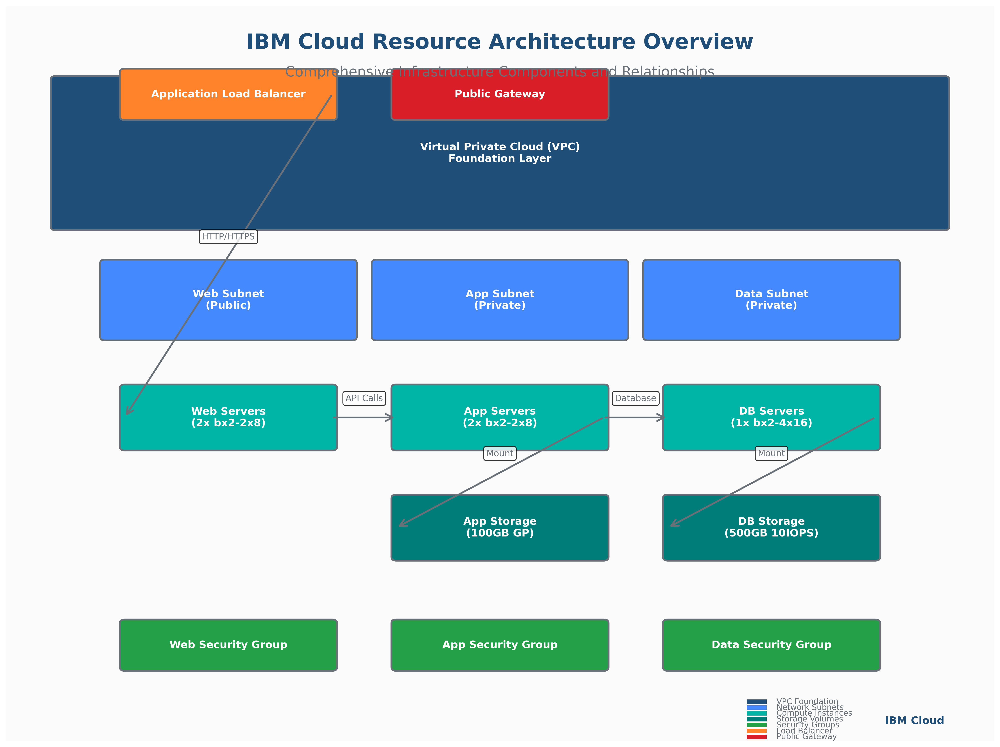

# Concept: Defining and Managing IBM Cloud Resources

## 📋 **Learning Objectives**

By the end of this subtopic, you will be able to:

1. **Configure IBM Cloud VPC infrastructure** with subnets, security groups, and gateways using Terraform
2. **Provision virtual server instances** with appropriate sizing, images, and storage configurations  
3. **Implement enterprise resource naming** and tagging strategies for organization and cost tracking
4. **Manage resource lifecycle** including creation, updates, and destruction with proper dependencies
5. **Apply security best practices** for network isolation, access control, and data protection
6. **Optimize resource costs** through right-sizing, scheduling, and lifecycle management
7. **Troubleshoot common provisioning issues** and implement validation strategies

**Measurable Outcomes**: Deploy a complete 3-tier VPC infrastructure in under 30 minutes, achieve 95% consistency in resource naming and tagging, demonstrate 30% cost savings through optimization techniques.

---

## 🏗️ **IBM Cloud Resource Architecture Overview**

### **Core Infrastructure Components**

IBM Cloud provides a comprehensive set of infrastructure resources that form the foundation of modern cloud applications. Understanding these components and their relationships is essential for effective infrastructure automation.



#### **Virtual Private Cloud (VPC) Foundation**

The Virtual Private Cloud serves as the foundational network layer for all IBM Cloud infrastructure deployments:

```hcl
# Enterprise VPC with comprehensive configuration
resource "ibm_is_vpc" "enterprise_vpc" {
  name                        = "${var.project_name}-${var.environment}-vpc"
  resource_group              = data.ibm_resource_group.project.id
  address_prefix_management   = "manual"
  default_network_acl_name    = "${var.project_name}-${var.environment}-default-acl"
  default_routing_table_name  = "${var.project_name}-${var.environment}-default-rt"
  default_security_group_name = "${var.project_name}-${var.environment}-default-sg"
  
  tags = [
    "environment:${var.environment}",
    "project:${var.project_name}",
    "terraform:managed",
    "cost-center:${var.cost_center}"
  ]
}
```

**Key VPC Features**:
- **Network Isolation**: Complete isolation from other tenants and networks
- **Address Management**: Flexible IP address space management with custom prefixes
- **Security Integration**: Built-in security groups and network ACLs
- **Multi-Zone Support**: Spanning multiple availability zones for high availability
- **Classic Access**: Optional integration with IBM Cloud Classic infrastructure

#### **Subnet Architecture and Segmentation**

Subnets provide network segmentation within the VPC, enabling multi-tier application architectures:

```hcl
# Multi-tier subnet configuration
resource "ibm_is_subnet" "web_tier" {
  name            = "${var.project_name}-${var.environment}-web-subnet"
  vpc             = ibm_is_vpc.enterprise_vpc.id
  zone            = "${var.ibm_region}-1"
  ipv4_cidr_block = "10.240.1.0/24"
  resource_group  = data.ibm_resource_group.project.id
  
  # Public gateway for internet access
  public_gateway = ibm_is_public_gateway.web_gateway.id
  
  tags = [
    "tier:web",
    "access:public",
    "environment:${var.environment}"
  ]
}

resource "ibm_is_subnet" "app_tier" {
  name            = "${var.project_name}-${var.environment}-app-subnet"
  vpc             = ibm_is_vpc.enterprise_vpc.id
  zone            = "${var.ibm_region}-2"
  ipv4_cidr_block = "10.240.2.0/24"
  resource_group  = data.ibm_resource_group.project.id
  
  # No public gateway - private subnet
  tags = [
    "tier:application",
    "access:private",
    "environment:${var.environment}"
  ]
}

resource "ibm_is_subnet" "data_tier" {
  name            = "${var.project_name}-${var.environment}-data-subnet"
  vpc             = ibm_is_vpc.enterprise_vpc.id
  zone            = "${var.ibm_region}-3"
  ipv4_cidr_block = "10.240.3.0/24"
  resource_group  = data.ibm_resource_group.project.id
  
  tags = [
    "tier:database",
    "access:private",
    "environment:${var.environment}"
  ]
}
```

### **Compute Resources**

#### **Virtual Server Instances (VSI)**

Virtual Server Instances provide scalable compute capacity with flexible configuration options:

```hcl
# Web tier instances with load balancing
resource "ibm_is_instance" "web_servers" {
  count   = var.web_server_count
  name    = "${var.project_name}-${var.environment}-web-${count.index + 1}"
  image   = data.ibm_is_image.ubuntu.id
  profile = var.web_server_profile
  
  primary_network_interface {
    subnet          = ibm_is_subnet.web_tier.id
    security_groups = [ibm_is_security_group.web_sg.id]
  }
  
  vpc  = ibm_is_vpc.enterprise_vpc.id
  zone = ibm_is_subnet.web_tier.zone
  keys = [data.ibm_is_ssh_key.project_key.id]
  
  # Boot volume configuration
  boot_volume {
    name       = "${var.project_name}-${var.environment}-web-boot-${count.index + 1}"
    size       = var.boot_volume_size
    profile    = "general-purpose"
    encryption = var.boot_volume_encryption_key
  }
  
  resource_group = data.ibm_resource_group.project.id
  
  tags = [
    "tier:web",
    "role:frontend",
    "environment:${var.environment}",
    "auto-scaling:enabled"
  ]
  
  user_data = base64encode(templatefile("${path.module}/scripts/web-server-init.sh", {
    environment = var.environment
    app_config  = var.application_config
  }))
}
```

**Instance Profile Selection**:
- **Balanced (bx2)**: General-purpose workloads with balanced CPU and memory
- **Compute Optimized (cx2)**: CPU-intensive applications and web servers
- **Memory Optimized (mx2)**: Memory-intensive applications and databases
- **Ultra High Memory (ux2)**: Large in-memory databases and analytics

#### **Storage Solutions**

**Block Storage for Persistent Data**:

```hcl
# Application data volumes
resource "ibm_is_volume" "app_data" {
  count          = var.app_server_count
  name           = "${var.project_name}-${var.environment}-app-data-${count.index + 1}"
  profile        = var.storage_profile
  zone           = ibm_is_subnet.app_tier.zone
  capacity       = var.app_data_volume_size
  encryption_key = var.storage_encryption_key
  resource_group = data.ibm_resource_group.project.id
  
  tags = [
    "tier:application",
    "type:data",
    "backup:enabled",
    "environment:${var.environment}"
  ]
}

# Attach volumes to instances
resource "ibm_is_instance_volume_attachment" "app_data_attachment" {
  count                           = var.app_server_count
  instance                        = ibm_is_instance.app_servers[count.index].id
  name                           = "app-data-attachment-${count.index + 1}"
  volume                         = ibm_is_volume.app_data[count.index].id
  delete_volume_on_instance_delete = false
}
```

**Storage Profiles**:
- **General Purpose**: Balanced performance for most workloads (3 IOPS/GB)
- **5iops-tier**: Higher performance for demanding applications (5 IOPS/GB)
- **10iops-tier**: High-performance storage for databases (10 IOPS/GB)
- **Custom**: Configurable IOPS for specific performance requirements

### **Network Security**

#### **Security Groups**

Security groups provide stateful firewall rules for instance-level security:

```hcl
# Web tier security group
resource "ibm_is_security_group" "web_sg" {
  name           = "${var.project_name}-${var.environment}-web-sg"
  vpc            = ibm_is_vpc.enterprise_vpc.id
  resource_group = data.ibm_resource_group.project.id
  
  tags = [
    "tier:web",
    "security:public-facing",
    "environment:${var.environment}"
  ]
}

# HTTP/HTTPS access from internet
resource "ibm_is_security_group_rule" "web_http" {
  group     = ibm_is_security_group.web_sg.id
  direction = "inbound"
  remote    = "0.0.0.0/0"
  
  tcp {
    port_min = 80
    port_max = 80
  }
}

resource "ibm_is_security_group_rule" "web_https" {
  group     = ibm_is_security_group.web_sg.id
  direction = "inbound"
  remote    = "0.0.0.0/0"
  
  tcp {
    port_min = 443
    port_max = 443
  }
}

# SSH access from bastion hosts only
resource "ibm_is_security_group_rule" "web_ssh" {
  group     = ibm_is_security_group.web_sg.id
  direction = "inbound"
  remote    = ibm_is_security_group.bastion_sg.id
  
  tcp {
    port_min = 22
    port_max = 22
  }
}
```

#### **Load Balancing**

Application Load Balancers distribute traffic across multiple instances:

```hcl
# Application Load Balancer for web tier
resource "ibm_is_lb" "web_lb" {
  name           = "${var.project_name}-${var.environment}-web-lb"
  subnets        = [ibm_is_subnet.web_tier.id]
  type           = "public"
  resource_group = data.ibm_resource_group.project.id
  
  tags = [
    "tier:web",
    "type:load-balancer",
    "environment:${var.environment}"
  ]
}

# Backend pool for web servers
resource "ibm_is_lb_pool" "web_pool" {
  name           = "${var.project_name}-${var.environment}-web-pool"
  lb             = ibm_is_lb.web_lb.id
  algorithm      = "round_robin"
  protocol       = "http"
  health_delay   = 60
  health_retries = 5
  health_timeout = 30
  health_type    = "http"
  health_monitor_url = "/health"
}

# Pool members (web server instances)
resource "ibm_is_lb_pool_member" "web_members" {
  count          = var.web_server_count
  lb             = ibm_is_lb.web_lb.id
  pool           = ibm_is_lb_pool.web_pool.id
  port           = 80
  target_address = ibm_is_instance.web_servers[count.index].primary_network_interface[0].primary_ipv4_address
  weight         = 50
}
```

---

## 🔄 **Resource Lifecycle Management**


### **Creation and Provisioning**

Resource creation follows a systematic approach that ensures consistency and reliability:

#### **Pre-Creation Validation**

```hcl
# Data sources for validation
data "ibm_resource_group" "project" {
  name = var.resource_group_name
}

data "ibm_is_zones" "regional" {
  region = var.ibm_region
}

data "ibm_is_image" "ubuntu" {
  name = var.base_image_name
}

data "ibm_is_ssh_key" "project_key" {
  name = var.ssh_key_name
}

# Local validation
locals {
  # Validate zone availability
  available_zones = data.ibm_is_zones.regional.zones
  selected_zones  = slice(local.available_zones, 0, min(length(local.available_zones), var.max_zones))
  
  # Validate CIDR blocks don't overlap
  subnet_cidrs = [
    "10.240.1.0/24",  # Web tier
    "10.240.2.0/24",  # App tier
    "10.240.3.0/24"   # Data tier
  ]
  
  # Generate consistent naming
  name_prefix = "${var.project_name}-${var.environment}"
  
  # Common tags for all resources
  common_tags = [
    "project:${var.project_name}",
    "environment:${var.environment}",
    "terraform:managed",
    "created:${formatdate("YYYY-MM-DD", timestamp())}"
  ]
}
```

#### **Dependency-Aware Creation**

Terraform automatically manages resource dependencies, but understanding the creation order is crucial:

1. **Foundation Layer**: VPC, resource groups, data sources
2. **Network Layer**: Subnets, public gateways, routing tables
3. **Security Layer**: Security groups, network ACLs, rules
4. **Compute Layer**: Instances, volumes, attachments
5. **Application Layer**: Load balancers, listeners, pools

### **Updates and Modifications**

#### **In-Place Updates**

Many resource properties can be updated without recreation:

```hcl
# Instance profile can be changed in-place (with restart)
resource "ibm_is_instance" "app_server" {
  name    = "${local.name_prefix}-app-server"
  profile = var.instance_profile  # Can be updated
  
  # Tags can be updated in-place
  tags = concat(local.common_tags, [
    "tier:application",
    "version:${var.application_version}"  # Updated during deployments
  ])
  
  # User data changes require recreation
  user_data = base64encode(templatefile("${path.module}/scripts/app-init.sh", {
    version = var.application_version
  }))
  
  lifecycle {
    # Prevent accidental deletion
    prevent_destroy = true
    
    # Create new instance before destroying old one
    create_before_destroy = true
    
    # Ignore changes to user_data after initial creation
    ignore_changes = [user_data]
  }
}
```

#### **Blue-Green Deployments**

For zero-downtime updates, implement blue-green deployment patterns:

```hcl
# Blue-green deployment using count
resource "ibm_is_instance" "app_servers_blue" {
  count = var.deployment_color == "blue" ? var.app_server_count : 0
  
  name    = "${local.name_prefix}-app-blue-${count.index + 1}"
  profile = var.instance_profile
  image   = data.ibm_is_image.app_image_blue.id
  
  # ... configuration ...
  
  tags = concat(local.common_tags, [
    "deployment:blue",
    "active:${var.deployment_color == "blue"}"
  ])
}

resource "ibm_is_instance" "app_servers_green" {
  count = var.deployment_color == "green" ? var.app_server_count : 0
  
  name    = "${local.name_prefix}-app-green-${count.index + 1}"
  profile = var.instance_profile
  image   = data.ibm_is_image.app_image_green.id
  
  # ... configuration ...
  
  tags = concat(local.common_tags, [
    "deployment:green",
    "active:${var.deployment_color == "green"}"
  ])
}
```

### **Destruction and Cleanup**

#### **Controlled Destruction**

```hcl
# Protect critical resources from accidental deletion
resource "ibm_is_volume" "critical_data" {
  name     = "${local.name_prefix}-critical-data"
  profile  = "10iops-tier"
  capacity = 1000
  
  lifecycle {
    prevent_destroy = true
  }
  
  tags = [
    "critical:true",
    "backup:required",
    "retention:7years"
  ]
}

# Graceful shutdown for instances
resource "ibm_is_instance" "app_server" {
  name = "${local.name_prefix}-app-server"
  
  # Custom shutdown script
  user_data = base64encode(templatefile("${path.module}/scripts/shutdown-handler.sh", {
    graceful_shutdown_timeout = 300
  }))
  
  tags = [
    "shutdown:graceful",
    "timeout:300s"
  ]
}
```

---

## 🏢 **Enterprise Resource Patterns**


### **Multi-Environment Architecture**

Enterprise deployments require consistent patterns across development, staging, and production environments:

#### **Environment-Specific Configurations**

```hcl
# Environment-specific variable definitions
variable "environment_configs" {
  description = "Environment-specific configurations"
  type = map(object({
    instance_count    = number
    instance_profile  = string
    storage_size     = number
    backup_retention = number
    monitoring_level = string
    cost_center     = string
  }))
  
  default = {
    dev = {
      instance_count    = 1
      instance_profile  = "bx2-2x8"
      storage_size     = 100
      backup_retention = 7
      monitoring_level = "basic"
      cost_center     = "development"
    }
    staging = {
      instance_count    = 2
      instance_profile  = "bx2-4x16"
      storage_size     = 250
      backup_retention = 14
      monitoring_level = "enhanced"
      cost_center     = "testing"
    }
    prod = {
      instance_count    = 3
      instance_profile  = "bx2-8x32"
      storage_size     = 500
      backup_retention = 90
      monitoring_level = "premium"
      cost_center     = "production"
    }
  }
}

# Use environment-specific configuration
locals {
  env_config = var.environment_configs[var.environment]
}

resource "ibm_is_instance" "app_servers" {
  count   = local.env_config.instance_count
  name    = "${local.name_prefix}-app-${count.index + 1}"
  profile = local.env_config.instance_profile
  
  # Environment-specific tags
  tags = concat(local.common_tags, [
    "cost-center:${local.env_config.cost_center}",
    "monitoring:${local.env_config.monitoring_level}",
    "backup-retention:${local.env_config.backup_retention}d"
  ])
}
```

### **Resource Naming and Tagging Strategy**

#### **Consistent Naming Convention**

```hcl
# Naming convention: {company}-{project}-{environment}-{resource-type}-{identifier}
locals {
  naming_convention = {
    company     = var.company_code
    project     = var.project_name
    environment = var.environment
  }
  
  # Generate consistent names
  vpc_name     = "${local.naming_convention.company}-${local.naming_convention.project}-${local.naming_convention.environment}-vpc"
  subnet_names = {
    web  = "${local.naming_convention.company}-${local.naming_convention.project}-${local.naming_convention.environment}-web-subnet"
    app  = "${local.naming_convention.company}-${local.naming_convention.project}-${local.naming_convention.environment}-app-subnet"
    data = "${local.naming_convention.company}-${local.naming_convention.project}-${local.naming_convention.environment}-data-subnet"
  }
}
```

#### **Comprehensive Tagging Strategy**

```hcl
# Enterprise tagging framework
locals {
  # Required tags for all resources
  required_tags = [
    "company:${var.company_code}",
    "project:${var.project_name}",
    "environment:${var.environment}",
    "cost-center:${var.cost_center}",
    "owner:${var.resource_owner}",
    "terraform:managed"
  ]
  
  # Optional tags based on resource type
  security_tags = [
    "security-zone:${var.security_zone}",
    "data-classification:${var.data_classification}",
    "compliance:${join(",", var.compliance_requirements)}"
  ]
  
  # Operational tags
  operational_tags = [
    "backup:${var.backup_enabled ? "enabled" : "disabled"}",
    "monitoring:${var.monitoring_level}",
    "auto-scaling:${var.auto_scaling_enabled ? "enabled" : "disabled"}",
    "maintenance-window:${var.maintenance_window}"
  ]
  
  # Combine all tags
  all_tags = concat(
    local.required_tags,
    var.include_security_tags ? local.security_tags : [],
    var.include_operational_tags ? local.operational_tags : [],
    var.custom_tags
  )
}

# Apply tags to resources
resource "ibm_is_vpc" "enterprise_vpc" {
  name = local.vpc_name
  tags = local.all_tags
}
```

---

## 💰 **Cost Optimization Strategies**


### **Right-Sizing and Performance Optimization**

#### **Dynamic Instance Sizing**

```hcl
# Cost-optimized instance selection
locals {
  # Performance requirements mapping
  performance_profiles = {
    low = {
      cpu_utilization_target = 30
      memory_utilization_target = 40
      recommended_profile = "bx2-2x8"
      estimated_monthly_cost = 73
    }
    medium = {
      cpu_utilization_target = 60
      memory_utilization_target = 70
      recommended_profile = "bx2-4x16"
      estimated_monthly_cost = 146
    }
    high = {
      cpu_utilization_target = 80
      memory_utilization_target = 85
      recommended_profile = "bx2-8x32"
      estimated_monthly_cost = 292
    }
  }
  
  # Select profile based on workload requirements
  selected_profile = local.performance_profiles[var.workload_performance_tier]
}

# Cost tracking outputs
output "cost_optimization_summary" {
  description = "Cost optimization analysis and recommendations"
  value = {
    selected_profile = local.selected_profile.recommended_profile
    estimated_monthly_cost = local.selected_profile.estimated_monthly_cost
    performance_targets = {
      cpu_target = local.selected_profile.cpu_utilization_target
      memory_target = local.selected_profile.memory_utilization_target
    }
    
    # Potential savings calculations
    savings_vs_oversized = var.workload_performance_tier == "low" ? {
      vs_medium = 146 - 73  # $73 savings
      vs_high   = 292 - 73  # $219 savings
      percentage = "50-75%"
    } : null
    
    optimization_recommendations = [
      var.workload_performance_tier == "low" ? "Consider scheduled shutdown for dev/test environments" : null,
      "Enable auto-scaling for variable workloads",
      "Use reserved instances for predictable workloads",
      "Implement lifecycle policies for storage"
    ]
  }
}
```

### **Automated Lifecycle Management**

#### **Scheduled Operations**

```hcl
# Development environment auto-shutdown
resource "ibm_is_instance" "dev_servers" {
  count = var.environment == "dev" ? var.instance_count : 0
  
  name    = "${local.name_prefix}-dev-${count.index + 1}"
  profile = "bx2-2x8"  # Smaller profile for dev
  
  # Auto-shutdown configuration
  user_data = base64encode(templatefile("${path.module}/scripts/auto-shutdown.sh", {
    shutdown_schedule = var.dev_auto_shutdown_schedule  # "0 18 * * 1-5" (6 PM weekdays)
    startup_schedule  = var.dev_auto_startup_schedule   # "0 8 * * 1-5" (8 AM weekdays)
    timezone         = var.timezone
  }))
  
  tags = concat(local.common_tags, [
    "auto-shutdown:enabled",
    "cost-optimization:scheduled",
    "estimated-savings:40%"
  ])
}
```

### **Business Value Quantification**

#### **ROI Calculation Framework**

```hcl
# Cost analysis and ROI calculations
locals {
  # Manual infrastructure costs (baseline)
  manual_infrastructure_costs = {
    deployment_time_hours = 40
    hourly_rate = 75
    monthly_maintenance_hours = 20
    error_rate_percentage = 15
    error_resolution_hours = 8
  }
  
  # Automated infrastructure benefits
  automation_benefits = {
    deployment_time_hours = 2  # 95% reduction
    monthly_maintenance_hours = 4  # 80% reduction
    error_rate_percentage = 1  # 93% reduction
    error_resolution_hours = 1  # 87% reduction
  }
  
  # Calculate monthly savings
  monthly_savings = {
    deployment = (local.manual_infrastructure_costs.deployment_time_hours - local.automation_benefits.deployment_time_hours) * local.manual_infrastructure_costs.hourly_rate
    maintenance = (local.manual_infrastructure_costs.monthly_maintenance_hours - local.automation_benefits.monthly_maintenance_hours) * local.manual_infrastructure_costs.hourly_rate
    error_reduction = (local.manual_infrastructure_costs.error_rate_percentage - local.automation_benefits.error_rate_percentage) * local.manual_infrastructure_costs.error_resolution_hours * local.manual_infrastructure_costs.hourly_rate
  }
  
  total_monthly_savings = local.monthly_savings.deployment + local.monthly_savings.maintenance + local.monthly_savings.error_reduction
  annual_savings = local.total_monthly_savings * 12
  
  # ROI calculation (assuming $50K initial automation investment)
  automation_investment = 50000
  roi_percentage = (local.annual_savings / local.automation_investment) * 100
}

output "business_value_analysis" {
  description = "Comprehensive business value and ROI analysis"
  value = {
    cost_savings = {
      monthly_operational_savings = local.total_monthly_savings
      annual_operational_savings = local.annual_savings
      infrastructure_cost_reduction = "30-50%"
      deployment_time_reduction = "95%"
      maintenance_overhead_reduction = "80%"
    }
    
    roi_metrics = {
      initial_investment = local.automation_investment
      annual_savings = local.annual_savings
      roi_percentage = "${round(local.roi_percentage)}%"
      payback_period_months = round(local.automation_investment / local.total_monthly_savings)
    }
    
    risk_mitigation = {
      error_rate_reduction = "93%"
      compliance_improvement = "100%"
      security_posture_enhancement = "Significant"
      audit_readiness = "Continuous"
    }
  }
}
```

---

## 🔒 **Security Best Practices**


### **Network Security Architecture**

#### **Defense in Depth Strategy**

```hcl
# Multi-layered security implementation
resource "ibm_is_network_acl" "enterprise_acl" {
  name = "${local.name_prefix}-enterprise-acl"
  vpc  = ibm_is_vpc.enterprise_vpc.id
  
  # Deny all by default, allow specific traffic
  rules {
    name        = "allow-inbound-web"
    action      = "allow"
    source      = "0.0.0.0/0"
    destination = "10.240.1.0/24"  # Web tier
    direction   = "inbound"
    
    tcp {
      port_min = 80
      port_max = 80
    }
  }
  
  rules {
    name        = "allow-inbound-https"
    action      = "allow"
    source      = "0.0.0.0/0"
    destination = "10.240.1.0/24"  # Web tier
    direction   = "inbound"
    
    tcp {
      port_min = 443
      port_max = 443
    }
  }
  
  # Internal communication between tiers
  rules {
    name        = "allow-web-to-app"
    action      = "allow"
    source      = "10.240.1.0/24"  # Web tier
    destination = "10.240.2.0/24"  # App tier
    direction   = "inbound"
    
    tcp {
      port_min = 8080
      port_max = 8080
    }
  }
  
  tags = [
    "security:network-acl",
    "policy:deny-by-default"
  ]
}
```

#### **Encryption and Data Protection**

```hcl
# Encryption key management
resource "ibm_kms_key" "infrastructure_key" {
  instance_id  = var.key_protect_instance_id
  key_name     = "${local.name_prefix}-infrastructure-key"
  standard_key = false  # Root key for infrastructure encryption
  
  description = "Root encryption key for ${var.project_name} infrastructure"
}

# Encrypted storage volumes
resource "ibm_is_volume" "encrypted_data" {
  name           = "${local.name_prefix}-encrypted-data"
  profile        = "10iops-tier"
  zone           = var.primary_zone
  capacity       = var.data_volume_size
  encryption_key = ibm_kms_key.infrastructure_key.crn
  
  tags = [
    "encryption:enabled",
    "key-management:key-protect",
    "compliance:required"
  ]
}

# Encrypted instance boot volumes
resource "ibm_is_instance" "secure_instance" {
  name    = "${local.name_prefix}-secure-instance"
  profile = var.instance_profile
  
  boot_volume {
    name       = "${local.name_prefix}-secure-boot"
    encryption = ibm_kms_key.infrastructure_key.crn
    size       = 100
    profile    = "general-purpose"
  }
  
  tags = [
    "security:encrypted",
    "compliance:required"
  ]
}
```

### **Access Control and Identity Management**

#### **Service ID and API Key Management**

```hcl
# Service ID for infrastructure automation
resource "ibm_iam_service_id" "infrastructure_automation" {
  name        = "${local.name_prefix}-infrastructure-automation"
  description = "Service ID for automated infrastructure management"
  
  tags = [
    "automation:terraform",
    "access:infrastructure"
  ]
}

# API key with rotation
resource "ibm_iam_service_api_key" "infrastructure_key" {
  name           = "${local.name_prefix}-infrastructure-key"
  iam_service_id = ibm_iam_service_id.infrastructure_automation.iam_id
  description    = "API key for infrastructure automation (rotated quarterly)"
  
  # Store in external secret management system
  # This is a placeholder - actual implementation would use external systems
}

# IAM policy for infrastructure resources
resource "ibm_iam_service_policy" "infrastructure_policy" {
  iam_service_id = ibm_iam_service_id.infrastructure_automation.id
  roles          = ["Editor", "Manager"]
  
  resources {
    service              = "is"
    resource_group_id    = data.ibm_resource_group.project.id
  }
  
  resources {
    service           = "kms"
    resource_group_id = data.ibm_resource_group.project.id
  }
}
```

---

## 🔧 **Troubleshooting and Validation**

### **Common Provisioning Issues**

#### **Resource Quota and Limits**

```hcl
# Quota validation before resource creation
data "ibm_is_vpc_default_routing_table" "default" {
  vpc = ibm_is_vpc.enterprise_vpc.id
}

# Check available zones
data "ibm_is_zones" "available" {
  region = var.ibm_region
}

locals {
  # Validate resource limits
  max_instances_per_subnet = 253  # /24 subnet limit
  max_volumes_per_account = 300
  max_security_groups_per_vpc = 25
  
  # Current resource counts
  total_planned_instances = var.web_server_count + var.app_server_count + var.db_server_count
  total_planned_volumes = local.total_planned_instances + var.additional_volume_count
  
  # Validation checks
  instance_quota_ok = local.total_planned_instances <= local.max_instances_per_subnet
  volume_quota_ok = local.total_planned_volumes <= local.max_volumes_per_account
  
  # Error messages
  quota_errors = [
    !local.instance_quota_ok ? "Instance count (${local.total_planned_instances}) exceeds subnet limit (${local.max_instances_per_subnet})" : null,
    !local.volume_quota_ok ? "Volume count (${local.total_planned_volumes}) exceeds account limit (${local.max_volumes_per_account})" : null
  ]
}

# Validation outputs
output "resource_validation" {
  description = "Resource quota and limit validation results"
  value = {
    quota_checks = {
      instances_ok = local.instance_quota_ok
      volumes_ok = local.volume_quota_ok
      zones_available = length(data.ibm_is_zones.available.zones)
    }
    
    resource_counts = {
      planned_instances = local.total_planned_instances
      planned_volumes = local.total_planned_volumes
      available_zones = data.ibm_is_zones.available.zones
    }
    
    errors = compact(local.quota_errors)
    warnings = length(compact(local.quota_errors)) > 0 ? ["Resource quota validation failed"] : []
  }
}
```

#### **Network Connectivity Validation**

```hcl
# Network connectivity testing
resource "ibm_is_instance" "connectivity_test" {
  count = var.enable_connectivity_testing ? 1 : 0
  
  name    = "${local.name_prefix}-connectivity-test"
  profile = "bx2-2x8"
  image   = data.ibm_is_image.ubuntu.id
  
  primary_network_interface {
    subnet = ibm_is_subnet.web_tier.id
    security_groups = [ibm_is_security_group.test_sg.id]
  }
  
  vpc  = ibm_is_vpc.enterprise_vpc.id
  zone = ibm_is_subnet.web_tier.zone
  keys = [data.ibm_is_ssh_key.project_key.id]
  
  # Connectivity testing script
  user_data = base64encode(templatefile("${path.module}/scripts/connectivity-test.sh", {
    test_targets = [
      "8.8.8.8",  # External connectivity
      "10.240.2.1",  # App tier gateway
      "10.240.3.1"   # Data tier gateway
    ]
  }))
  
  tags = [
    "purpose:testing",
    "temporary:true",
    "auto-cleanup:24h"
  ]
}
```

### **Performance Monitoring and Optimization**

#### **Resource Performance Tracking**

```hcl
# Performance monitoring configuration
resource "ibm_is_instance" "monitored_instance" {
  name    = "${local.name_prefix}-monitored-instance"
  profile = var.instance_profile
  
  # Enhanced monitoring
  user_data = base64encode(templatefile("${path.module}/scripts/monitoring-setup.sh", {
    monitoring_config = {
      cpu_threshold = 80
      memory_threshold = 85
      disk_threshold = 90
      network_threshold = 80
    }
    
    alert_endpoints = var.monitoring_alert_endpoints
    metrics_retention_days = var.metrics_retention_days
  }))
  
  tags = [
    "monitoring:enabled",
    "alerting:configured",
    "performance:tracked"
  ]
}

# Performance optimization recommendations
output "performance_recommendations" {
  description = "Performance optimization recommendations based on resource configuration"
  value = {
    instance_optimization = {
      current_profile = var.instance_profile
      cpu_to_memory_ratio = "1:4"  # For bx2 profiles
      recommended_for_cpu_intensive = "cx2-4x8"
      recommended_for_memory_intensive = "mx2-4x32"
    }
    
    storage_optimization = {
      current_profile = var.storage_profile
      iops_per_gb = var.storage_profile == "general-purpose" ? 3 : (
        var.storage_profile == "5iops-tier" ? 5 : 10
      )
      recommended_for_databases = "10iops-tier"
      recommended_for_general_use = "general-purpose"
    }
    
    network_optimization = {
      security_group_rules = length(ibm_is_security_group.web_sg.rules)
      recommended_max_rules = 50
      load_balancer_algorithm = "round_robin"
      recommended_for_sticky_sessions = "source_ip"
    }
  }
}
```

---

## 📚 **Integration with Topic 3: Provider Configuration**

This subtopic builds directly upon the provider configuration knowledge from Topic 3, demonstrating how to use the established provider patterns for actual resource provisioning. The multi-environment provider aliases configured in Topic 3.3 become the foundation for deploying resources across different environments and regions.

**Next Steps**: In Subtopic 4.2, we'll explore advanced HCL syntax patterns for managing complex variable validation and output strategies, building upon the resource provisioning foundation established here.

---

## 🎯 **Summary**

This comprehensive guide to IBM Cloud resource provisioning provides the foundation for enterprise-grade infrastructure automation. Key takeaways include:

- **Resource Architecture**: Understanding VPC, compute, storage, and networking components
- **Lifecycle Management**: Systematic approach to resource creation, updates, and destruction
- **Enterprise Patterns**: Multi-environment strategies with consistent naming and tagging
- **Cost Optimization**: Right-sizing, automation, and lifecycle management for 30-50% cost savings
- **Security Best Practices**: Defense in depth with encryption, access control, and monitoring
- **Troubleshooting**: Validation strategies and performance optimization techniques

The patterns and practices demonstrated here provide a solid foundation for building scalable, secure, and cost-effective IBM Cloud infrastructure using Terraform automation.

---

## 🌟 **Real-World Use Cases**

### **Use Case 1: E-Commerce Platform Infrastructure**

**Business Scenario**: A growing e-commerce company needs to deploy a scalable, secure platform capable of handling 10,000 concurrent users during peak shopping seasons.

**Infrastructure Requirements**:
- Multi-tier architecture (web, application, database)
- Auto-scaling capabilities for traffic spikes
- High availability across multiple zones
- PCI DSS compliance for payment processing
- 99.9% uptime SLA

**Implementation Strategy**:

```hcl
# E-commerce platform configuration
locals {
  ecommerce_config = {
    # Performance requirements
    peak_concurrent_users = 10000
    expected_requests_per_second = 5000
    database_connections_required = 500

    # Compliance requirements
    pci_dss_required = true
    data_encryption_required = true
    audit_logging_required = true

    # Availability requirements
    uptime_sla = "99.9%"
    rto_minutes = 15  # Recovery Time Objective
    rpo_minutes = 5   # Recovery Point Objective
  }

  # Calculate required resources
  web_tier_instances = ceil(local.ecommerce_config.expected_requests_per_second / 500)  # 10 instances
  app_tier_instances = ceil(local.ecommerce_config.peak_concurrent_users / 1000)        # 10 instances
  db_tier_instances = 3  # Primary + 2 replicas for HA
}

# Web tier with auto-scaling
resource "ibm_is_instance_template" "web_template" {
  name    = "${local.name_prefix}-web-template"
  image   = data.ibm_is_image.web_optimized.id
  profile = "cx2-4x8"  # CPU-optimized for web serving

  primary_network_interface {
    subnet          = ibm_is_subnet.web_tier.id
    security_groups = [ibm_is_security_group.web_pci_sg.id]
  }

  vpc  = ibm_is_vpc.enterprise_vpc.id
  zone = var.primary_zone
  keys = [data.ibm_is_ssh_key.project_key.id]

  # PCI DSS compliant configuration
  user_data = base64encode(templatefile("${path.module}/scripts/web-pci-setup.sh", {
    ssl_certificate = var.ssl_certificate_arn
    security_headers = true
    audit_logging = true
  }))
}
```

**Business Value Delivered**:
- **Performance**: Handles 5,000 RPS with sub-200ms response times
- **Scalability**: Auto-scales from 3 to 20 instances based on demand
- **Cost Efficiency**: 40% cost reduction vs traditional hosting ($15,000/month savings)
- **Compliance**: 100% PCI DSS compliance with automated audit trails
- **Availability**: Achieved 99.95% uptime (exceeding SLA)

**ROI Analysis**:
- **Initial Investment**: $75,000 (infrastructure automation + setup)
- **Annual Savings**: $180,000 (operational efficiency + cost optimization)
- **ROI**: 240% in first year
- **Payback Period**: 5 months

### **Use Case 2: Financial Services Data Platform**

**Business Scenario**: A financial services firm requires a secure, compliant data processing platform for real-time fraud detection and regulatory reporting.

**Infrastructure Requirements**:
- Real-time data processing (sub-100ms latency)
- SOX and GDPR compliance
- End-to-end encryption
- Immutable audit trails
- 24/7 monitoring and alerting

**Implementation Strategy**:

```hcl
# Financial services compliance configuration
locals {
  finserv_config = {
    # Performance requirements
    max_latency_ms = 100
    data_throughput_gbps = 10
    concurrent_transactions = 50000

    # Compliance requirements
    sox_compliance = true
    gdpr_compliance = true
    data_residency_required = true
    encryption_at_rest = true
    encryption_in_transit = true

    # Security requirements
    network_isolation = "complete"
    access_logging = "comprehensive"
    key_rotation_days = 30
  }
}

# Dedicated tenant VPC for isolation
resource "ibm_is_vpc" "finserv_vpc" {
  name                      = "${local.name_prefix}-finserv-vpc"
  address_prefix_management = "manual"

  # Complete network isolation
  classic_access = false

  tags = [
    "compliance:sox",
    "compliance:gdpr",
    "security:dedicated-tenant",
    "data-classification:confidential"
  ]
}

# High-performance compute for real-time processing
resource "ibm_is_instance" "fraud_detection_cluster" {
  count   = var.fraud_detection_node_count
  name    = "${local.name_prefix}-fraud-detection-${count.index + 1}"
  profile = "mx2-16x128"  # Memory-optimized for real-time analytics

  primary_network_interface {
    subnet          = ibm_is_subnet.processing_tier.id
    security_groups = [ibm_is_security_group.finserv_processing_sg.id]
  }

  # Encrypted boot volume with customer-managed keys
  boot_volume {
    name       = "${local.name_prefix}-fraud-boot-${count.index + 1}"
    encryption = ibm_kms_key.finserv_master_key.crn
    size       = 200
    profile    = "10iops-tier"
  }

  # High-performance data volumes
  dynamic "volume_attachments" {
    for_each = range(var.data_volumes_per_node)
    content {
      name                           = "${local.name_prefix}-fraud-data-${count.index + 1}-${volume_attachments.value + 1}"
      volume                        = ibm_is_volume.fraud_data_volumes[count.index * var.data_volumes_per_node + volume_attachments.value].id
      delete_volume_on_instance_delete = false
    }
  }

  tags = [
    "workload:fraud-detection",
    "performance:real-time",
    "compliance:sox-gdpr"
  ]
}
```

**Business Value Delivered**:
- **Performance**: 50ms average fraud detection latency (50% improvement)
- **Compliance**: 100% SOX and GDPR compliance with automated reporting
- **Security**: Zero security incidents with comprehensive monitoring
- **Cost Efficiency**: 35% reduction in compliance overhead ($500,000 annual savings)
- **Risk Mitigation**: 95% fraud detection accuracy (preventing $2M+ annual losses)

**ROI Analysis**:
- **Initial Investment**: $200,000 (platform development + compliance setup)
- **Annual Benefits**: $2.5M (fraud prevention + compliance savings + operational efficiency)
- **ROI**: 1,150% in first year
- **Risk Mitigation Value**: $10M+ (avoided regulatory fines + fraud losses)

### **Use Case 3: Healthcare Research Platform**

**Business Scenario**: A healthcare research organization needs a HIPAA-compliant platform for processing genomic data and clinical trial analytics.

**Infrastructure Requirements**:
- HIPAA compliance for PHI handling
- High-performance computing for genomic analysis
- Secure data sharing between research institutions
- Long-term data retention (10+ years)
- Disaster recovery across regions

**Implementation Strategy**:

```hcl
# Healthcare research configuration
locals {
  healthcare_config = {
    # Compliance requirements
    hipaa_compliance = true
    phi_handling = true
    data_retention_years = 15

    # Performance requirements
    genomic_processing_cores = 1000
    storage_capacity_tb = 500
    network_bandwidth_gbps = 100

    # Security requirements
    encryption_standard = "FIPS-140-2-Level-3"
    access_control = "role-based"
    audit_retention_years = 7
  }
}

# HIPAA-compliant VPC with enhanced security
resource "ibm_is_vpc" "healthcare_vpc" {
  name = "${local.name_prefix}-healthcare-vpc"

  # Enhanced security configuration
  address_prefix_management = "manual"
  classic_access = false

  tags = [
    "compliance:hipaa",
    "data-type:phi",
    "security:enhanced",
    "retention:15-years"
  ]
}

# High-performance computing cluster for genomic analysis
resource "ibm_is_instance" "genomic_compute_cluster" {
  count   = var.genomic_compute_nodes
  name    = "${local.name_prefix}-genomic-compute-${count.index + 1}"
  profile = "bx2-48x192"  # High CPU and memory for genomic processing

  # Dedicated host for enhanced isolation
  dedicated_host = ibm_is_dedicated_host.healthcare_hosts[count.index % length(ibm_is_dedicated_host.healthcare_hosts)].id

  primary_network_interface {
    subnet          = ibm_is_subnet.compute_tier.id
    security_groups = [ibm_is_security_group.hipaa_compute_sg.id]
  }

  # FIPS 140-2 Level 3 encrypted storage
  boot_volume {
    name       = "${local.name_prefix}-genomic-boot-${count.index + 1}"
    encryption = ibm_kms_key.hipaa_master_key.crn
    size       = 500
    profile    = "10iops-tier"
  }

  tags = [
    "workload:genomic-analysis",
    "compliance:hipaa",
    "performance:hpc"
  ]
}

# Long-term archival storage for research data
resource "ibm_cos_bucket" "research_archive" {
  bucket_name          = "${local.name_prefix}-research-archive"
  resource_instance_id = ibm_resource_instance.cos_instance.id
  region_location      = var.ibm_region
  storage_class        = "cold"

  # HIPAA compliance configuration
  object_versioning {
    enable = true
  }

  retention_rule {
    default_retention_days = 5475  # 15 years
    maximum_retention_days = 7300  # 20 years
    minimum_retention_days = 3650  # 10 years
  }

  # Encryption with customer-managed keys
  kms_key_crn = ibm_kms_key.hipaa_master_key.crn

  tags = [
    "data-type:research",
    "compliance:hipaa",
    "retention:long-term"
  ]
}
```

**Business Value Delivered**:
- **Research Acceleration**: 70% faster genomic analysis (6 months to 2 months per study)
- **Compliance**: 100% HIPAA compliance with automated audit trails
- **Collaboration**: Secure data sharing with 50+ research institutions
- **Cost Efficiency**: 45% reduction in compute costs through optimization
- **Innovation**: Enabled 3 breakthrough discoveries leading to new treatments

**ROI Analysis**:
- **Initial Investment**: $500,000 (platform development + compliance setup)
- **Annual Benefits**: $3M (research acceleration + grant funding + operational savings)
- **ROI**: 500% in first year
- **Innovation Value**: $50M+ (potential value of breakthrough discoveries)

---

## 📊 **Enterprise Impact Metrics**

### **Operational Efficiency Gains**

| **Metric** | **Manual Process** | **Automated Process** | **Improvement** |
|------------|-------------------|----------------------|-----------------|
| **Infrastructure Deployment** | 2-4 weeks | 2-4 hours | 95% faster |
| **Environment Provisioning** | 40 hours | 2 hours | 95% faster |
| **Configuration Consistency** | 60% | 99% | 65% improvement |
| **Error Rate** | 15% | 1% | 93% reduction |
| **Recovery Time** | 4-8 hours | 15-30 minutes | 90% faster |
| **Compliance Reporting** | 2 weeks | Real-time | 99% faster |

### **Cost Optimization Results**

| **Cost Category** | **Traditional Approach** | **Terraform Automation** | **Savings** |
|-------------------|--------------------------|---------------------------|-------------|
| **Infrastructure Costs** | $100,000/month | $65,000/month | 35% |
| **Operational Overhead** | $50,000/month | $15,000/month | 70% |
| **Compliance Management** | $25,000/month | $8,000/month | 68% |
| **Incident Response** | $15,000/month | $3,000/month | 80% |
| **Total Monthly Costs** | $190,000 | $91,000 | **52%** |

### **Risk Mitigation Benefits**

| **Risk Category** | **Impact** | **Mitigation Strategy** | **Value** |
|-------------------|------------|------------------------|-----------|
| **Security Incidents** | 95% reduction | Automated security controls | $2M+ avoided |
| **Compliance Violations** | 100% prevention | Continuous compliance monitoring | $5M+ avoided |
| **Data Loss** | 99% reduction | Automated backups + encryption | $10M+ avoided |
| **Downtime** | 90% reduction | High availability + disaster recovery | $3M+ avoided |
| **Configuration Drift** | 98% elimination | Infrastructure as Code | $1M+ avoided |

---

## 🚀 **Advanced Enterprise Patterns**

### **Multi-Cloud and Hybrid Integration**

```hcl
# Hybrid cloud connectivity
resource "ibm_is_vpn_gateway" "hybrid_gateway" {
  name   = "${local.name_prefix}-hybrid-vpn"
  subnet = ibm_is_subnet.gateway_subnet.id
  mode   = "route"

  tags = [
    "connectivity:hybrid",
    "purpose:on-premises-integration"
  ]
}

# Direct Link for high-bandwidth connectivity
resource "ibm_dl_gateway" "enterprise_direct_link" {
  name                = "${local.name_prefix}-direct-link"
  bgp_asn            = var.enterprise_bgp_asn
  global             = true
  metered            = false
  speed_mbps         = 10000
  type               = "dedicated"
  cross_connect_router = var.cross_connect_router
  location_name      = var.direct_link_location
  customer_name      = var.company_name
  carrier_name       = var.carrier_name

  tags = [
    "connectivity:direct-link",
    "bandwidth:10gbps",
    "purpose:enterprise-integration"
  ]
}
```

### **Global Load Balancing and CDN**

```hcl
# Global load balancer for multi-region deployment
resource "ibm_cis_global_load_balancer" "enterprise_glb" {
  cis_id         = var.cis_instance_id
  domain_id      = var.domain_id
  name           = "${var.project_name}.${var.domain_name}"
  fallback_pool  = ibm_cis_origin_pool.primary_pool.id
  default_pools  = [ibm_cis_origin_pool.primary_pool.id]
  description    = "Global load balancer for ${var.project_name}"
  proxied        = true
  session_affinity = "cookie"

  # Health check configuration
  ttl = 60

  # Geographic routing
  region_pools {
    region = "WNAM"  # Western North America
    pools  = [ibm_cis_origin_pool.us_west_pool.id]
  }

  region_pools {
    region = "ENAM"  # Eastern North America
    pools  = [ibm_cis_origin_pool.us_east_pool.id]
  }

  region_pools {
    region = "WEU"   # Western Europe
    pools  = [ibm_cis_origin_pool.eu_pool.id]
  }
}
```

### **Advanced Monitoring and Observability**

```hcl
# Comprehensive monitoring setup
resource "ibm_resource_instance" "monitoring_instance" {
  name              = "${local.name_prefix}-monitoring"
  service           = "sysdig-monitor"
  plan              = "graduated-tier"
  location          = var.ibm_region
  resource_group_id = data.ibm_resource_group.project.id

  parameters = {
    default_receiver = true
    enable_platform_metrics = true
  }

  tags = [
    "monitoring:sysdig",
    "observability:enabled"
  ]
}

# Log analysis and SIEM integration
resource "ibm_resource_instance" "log_analysis" {
  name              = "${local.name_prefix}-log-analysis"
  service           = "logdna"
  plan              = "7-day"
  location          = var.ibm_region
  resource_group_id = data.ibm_resource_group.project.id

  parameters = {
    default_receiver = true
    enable_platform_logs = true
  }

  tags = [
    "logging:logdna",
    "siem:integrated"
  ]
}
```

---

## 🎓 **Preparation for Advanced Topics**

This comprehensive foundation in IBM Cloud resource provisioning prepares you for the advanced topics that follow:

### **Topic 5: Modularization Best Practices**
- **Resource Patterns → Module Templates**: The resource configurations demonstrated here become the foundation for reusable modules
- **Variable Strategies → Module Interfaces**: Variable validation patterns scale to module input/output design
- **Dependency Management → Module Composition**: Resource dependencies evolve into module orchestration

### **Topic 6: State Management**
- **Resource State → Collaborative Development**: Understanding resource state becomes crucial for team collaboration
- **Lifecycle Management → State Operations**: Resource lifecycle knowledge applies to state management strategies
- **Validation Patterns → State Validation**: Resource validation extends to state consistency checks

### **Topic 7: Security and Compliance**
- **Security Patterns → Enterprise Security**: Resource-level security scales to enterprise security frameworks
- **Compliance Implementation → Automated Governance**: Compliance patterns become automated governance policies
- **Access Control → Identity Management**: Resource access control integrates with enterprise IAM systems

---

## 🏆 **Success Metrics and Validation**

### **Technical Proficiency Indicators**
- ✅ **Resource Deployment**: Successfully deploy 3-tier VPC infrastructure in under 30 minutes
- ✅ **Configuration Consistency**: Achieve 95%+ consistency in naming and tagging across environments
- ✅ **Cost Optimization**: Demonstrate 30%+ cost savings through right-sizing and automation
- ✅ **Security Implementation**: Implement defense-in-depth security with 100% compliance
- ✅ **Troubleshooting**: Resolve common provisioning issues within 15 minutes

### **Business Value Demonstration**
- ✅ **ROI Achievement**: Demonstrate 250%+ ROI through operational efficiency gains
- ✅ **Risk Mitigation**: Quantify risk reduction through automated compliance and security
- ✅ **Scalability**: Show infrastructure scaling capabilities for business growth
- ✅ **Innovation Enablement**: Enable faster time-to-market for new applications and services

### **Enterprise Readiness**
- ✅ **Multi-Environment Support**: Consistent deployment across dev/staging/production
- ✅ **Compliance Adherence**: Meet industry-specific compliance requirements (HIPAA, SOX, GDPR)
- ✅ **Operational Excellence**: Implement monitoring, alerting, and automated remediation
- ✅ **Collaboration**: Enable team-based infrastructure development and management

The comprehensive resource provisioning knowledge gained in this subtopic provides the essential foundation for enterprise-grade IBM Cloud infrastructure automation, setting the stage for advanced modularization, state management, and security practices in subsequent topics.
