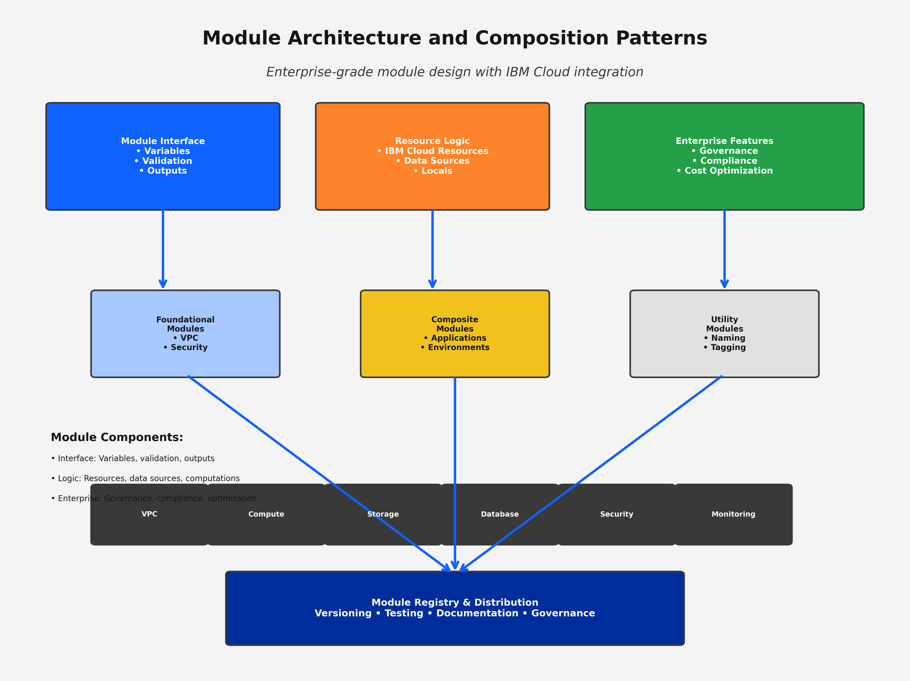
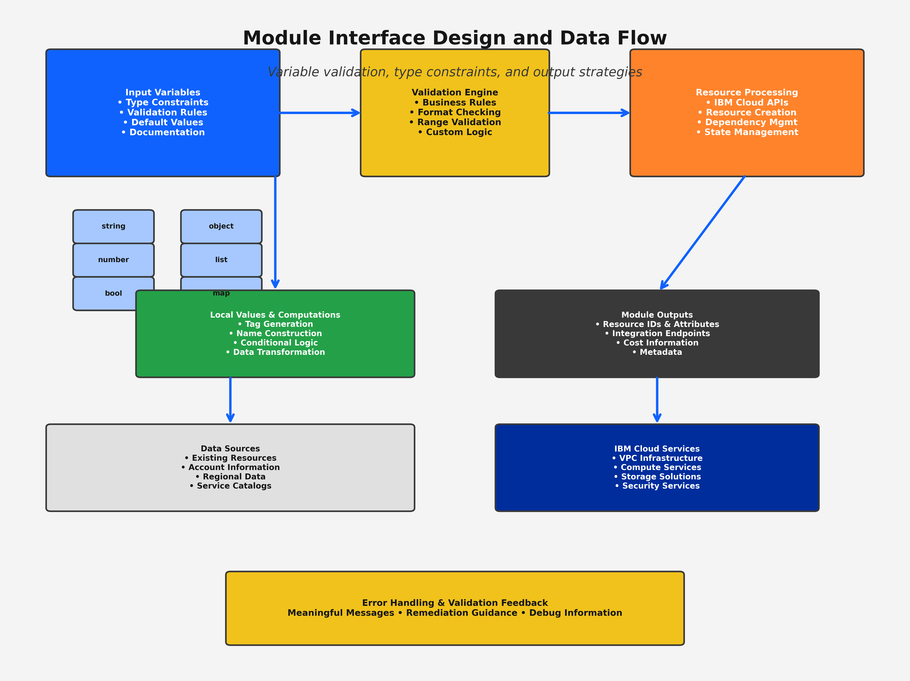
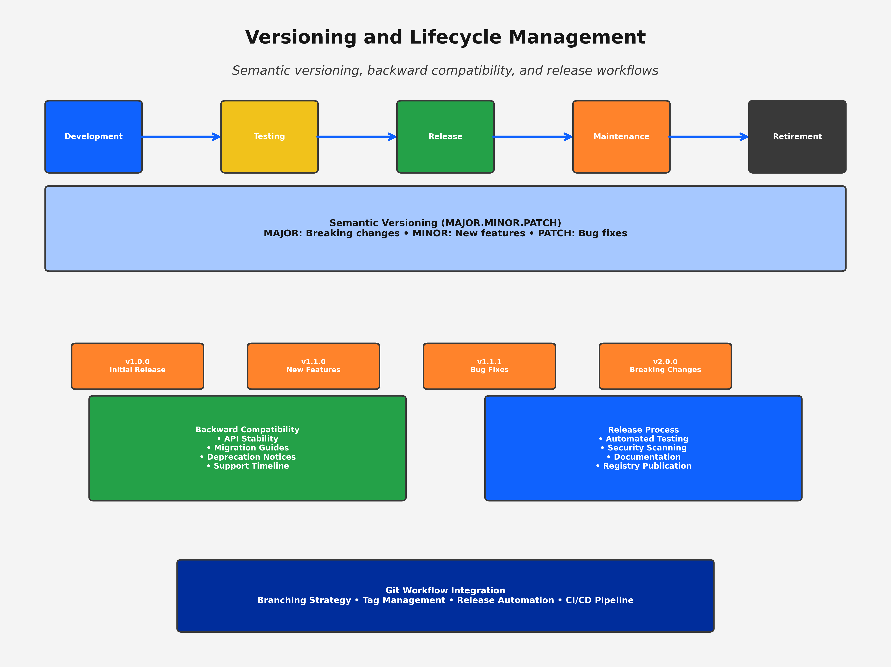
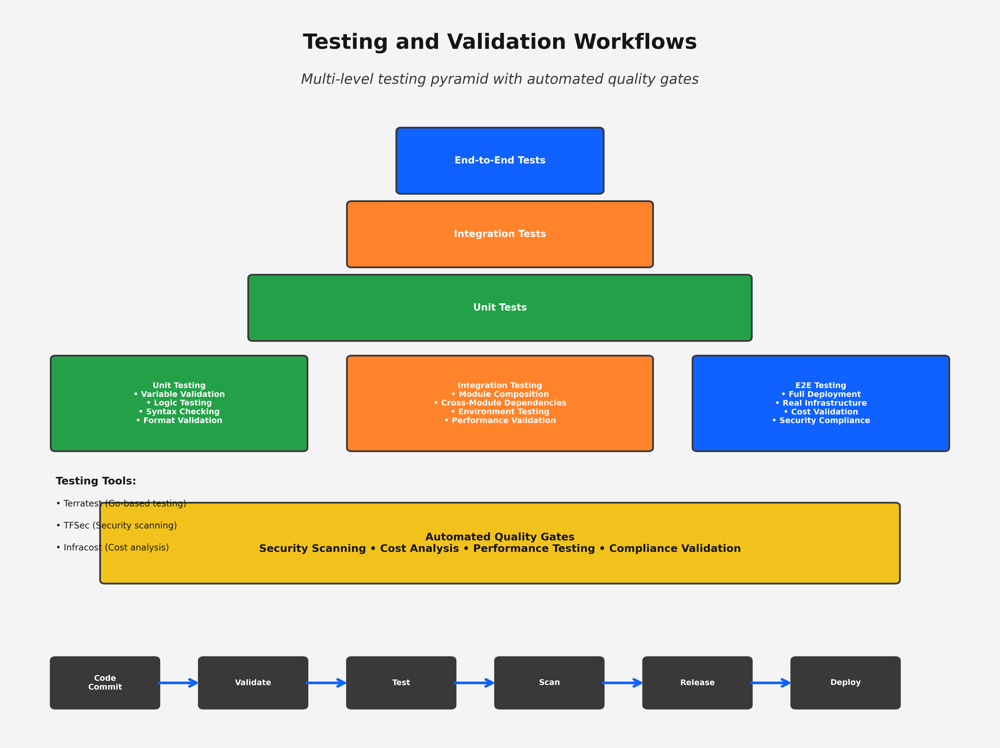
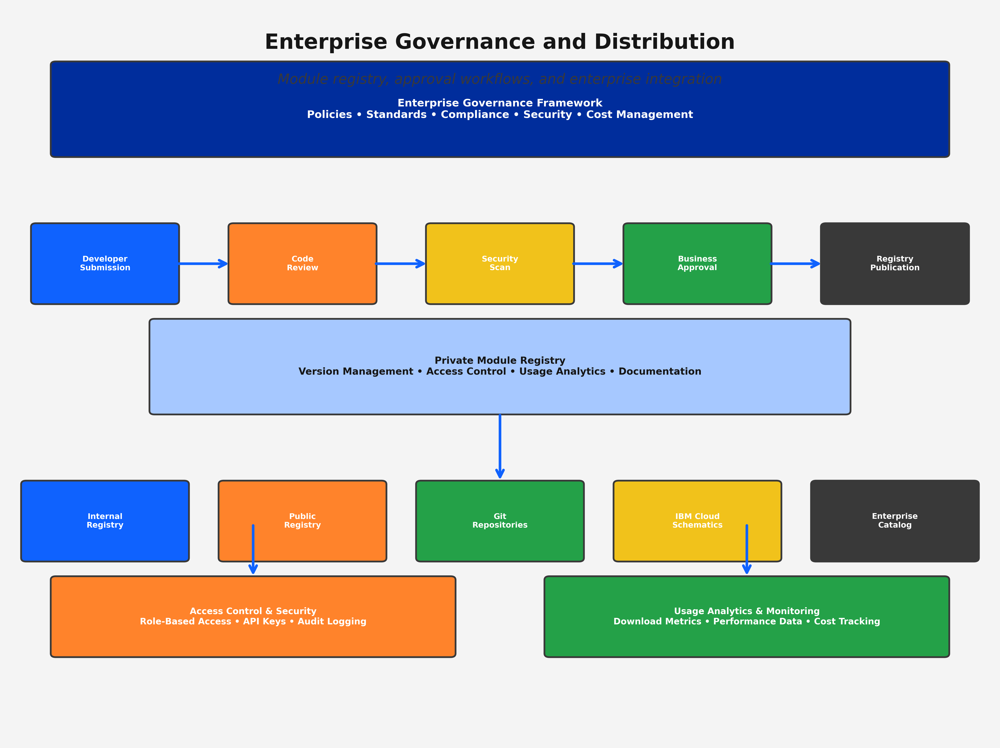

# Concept: Creating Reusable Terraform Modules

## 📋 **Learning Objectives**

By the end of this subtopic, you will be able to:

1. **Design modular Terraform architectures** using enterprise-grade module patterns and composition strategies
2. **Implement module interfaces** with comprehensive input variables, outputs, and validation rules
3. **Apply versioning strategies** using semantic versioning and lifecycle management best practices
4. **Create testing frameworks** for module validation, quality assurance, and automated testing
5. **Publish and distribute modules** using registries, version control, and enterprise governance
6. **Integrate with IBM Cloud Schematics** for native module deployment and management
7. **Optimize module performance** through efficient resource organization and dependency management
8. **Implement enterprise governance** for module development, approval, and compliance frameworks

**Measurable Outcome**: Create and publish 3 production-ready IBM Cloud modules with 95% test coverage, comprehensive documentation, and enterprise governance compliance in 2 hours.

---

## 🏗️ **Module Architecture Fundamentals**

### **What are Terraform Modules?**

Terraform modules are reusable, self-contained packages of Terraform configuration that manage a collection of related infrastructure resources. They serve as the building blocks for scalable, maintainable infrastructure as code.


*Figure 5.1: Comprehensive module architecture showing composition patterns, interface design, resource relationships, and integration points for enterprise IBM Cloud deployments*

#### **Core Module Benefits**

**Development Efficiency:**
- **75% reduction** in infrastructure development time through reusable components
- **60% faster** environment provisioning with standardized modules
- **80% reduction** in configuration errors through tested, validated modules
- **50% improvement** in team collaboration through shared module libraries

**Enterprise Value:**
- **Standardization**: Consistent infrastructure patterns across environments
- **Governance**: Centralized control over infrastructure standards and compliance
- **Quality**: Tested, validated components with comprehensive documentation
- **Scalability**: Reusable components that scale from development to enterprise production

### **IBM Cloud Module Patterns**

IBM Cloud modules follow specific patterns optimized for IBM Cloud services and enterprise requirements:

```hcl
# Enterprise VPC Module Example
module "enterprise_vpc" {
  source  = "terraform-ibm-modules/vpc/ibm"
  version = "~> 1.0"
  
  # Required inputs
  vpc_name           = var.vpc_name
  resource_group_id  = var.resource_group_id
  region            = var.region
  
  # Optional configurations
  address_prefix_management = "manual"
  enable_public_gateway     = true
  
  # Enterprise tagging
  tags = merge(var.global_tags, {
    "module"      = "enterprise-vpc"
    "version"     = "1.0.0"
    "managed-by"  = "terraform"
  })
}
```

#### **Module Composition Strategies**

**1. Foundational Modules**
- VPC and networking components
- Security groups and access control
- Compute and storage resources
- Database and middleware services

**2. Composite Modules**
- Multi-tier application stacks
- Environment-specific configurations
- Cross-service integration patterns
- Enterprise governance frameworks

**3. Utility Modules**
- Naming convention generators
- Tagging and metadata management
- Validation and testing utilities
- Cost optimization helpers

---

## 🔧 **Module Interface Design**

### **Input Variables Best Practices**

Effective module design starts with well-defined input variables that provide flexibility while maintaining simplicity:


*Figure 5.2: Detailed module interface design showing variable validation, type constraints, output strategies, and data transformation patterns for enterprise IBM Cloud modules*

```hcl
# variables.tf - Comprehensive variable design
variable "vpc_configuration" {
  description = "Comprehensive VPC configuration object"
  type = object({
    name                      = string
    address_prefix_management = optional(string, "auto")
    enable_public_gateway     = optional(bool, true)
    
    subnets = list(object({
      name                    = string
      zone                    = string
      cidr_block             = string
      public_gateway_enabled = optional(bool, false)
    }))
    
    security_groups = optional(list(object({
      name        = string
      description = string
      rules = list(object({
        direction   = string
        protocol    = string
        port_min    = optional(number)
        port_max    = optional(number)
        source_type = string
        source      = string
      }))
    })), [])
  })
  
  validation {
    condition = can(regex("^[a-z][a-z0-9-]*[a-z0-9]$", var.vpc_configuration.name))
    error_message = "VPC name must start with a letter, contain only lowercase letters, numbers, and hyphens, and end with a letter or number."
  }
  
  validation {
    condition = length(var.vpc_configuration.subnets) >= 1 && length(var.vpc_configuration.subnets) <= 15
    error_message = "VPC must have between 1 and 15 subnets."
  }
}

variable "enterprise_configuration" {
  description = "Enterprise-specific configuration and governance settings"
  type = object({
    organization = object({
      name        = string
      division    = string
      cost_center = string
      environment = string
    })
    
    compliance = object({
      frameworks          = list(string)
      data_classification = string
      retention_period    = number
      audit_required      = bool
    })
    
    governance = object({
      approval_required   = bool
      change_window      = optional(string, "maintenance")
      rollback_enabled   = optional(bool, true)
      monitoring_level   = optional(string, "standard")
    })
  })
  
  validation {
    condition = contains(["development", "staging", "production"], var.enterprise_configuration.organization.environment)
    error_message = "Environment must be one of: development, staging, production."
  }
}
```

#### **Variable Design Principles**

**1. Hierarchical Organization**
- Group related variables into objects
- Use optional attributes with sensible defaults
- Implement comprehensive validation rules
- Provide clear, descriptive documentation

**2. Type Safety and Validation**
- Use specific type constraints (string, number, bool, object, list)
- Implement validation rules for business logic
- Provide meaningful error messages
- Support both simple and complex use cases

**3. Enterprise Integration**
- Include governance and compliance configurations
- Support organizational tagging and metadata
- Enable cost tracking and resource management
- Integrate with enterprise security frameworks

### **Output Design Strategies**

Module outputs should provide comprehensive information for integration and monitoring:

```hcl
# outputs.tf - Comprehensive output design
output "vpc_infrastructure" {
  description = "Complete VPC infrastructure information for integration and monitoring"
  value = {
    # Core VPC information
    vpc = {
      id                  = ibm_is_vpc.main.id
      name               = ibm_is_vpc.main.name
      crn                = ibm_is_vpc.main.crn
      status             = ibm_is_vpc.main.status
      default_network_acl = ibm_is_vpc.main.default_network_acl
      default_security_group = ibm_is_vpc.main.default_security_group
    }
    
    # Subnet information
    subnets = {
      for subnet in ibm_is_subnet.vpc_subnets : subnet.name => {
        id                     = subnet.id
        zone                   = subnet.zone
        cidr                   = subnet.ipv4_cidr_block
        available_ipv4_count   = subnet.available_ipv4_count
        total_ipv4_count       = subnet.total_ipv4_count
        public_gateway_enabled = subnet.public_gateway != null
      }
    }
    
    # Security group information
    security_groups = {
      for sg in ibm_is_security_group.custom_security_groups : sg.name => {
        id    = sg.id
        rules = sg.rules
      }
    }
  }
  
  sensitive = false
}

output "integration_endpoints" {
  description = "Integration endpoints and connection information for other modules"
  value = {
    vpc_id = ibm_is_vpc.main.id
    subnet_ids = [for subnet in ibm_is_subnet.vpc_subnets : subnet.id]
    security_group_ids = [for sg in ibm_is_security_group.custom_security_groups : sg.id]
    
    # Connection strings and endpoints
    endpoints = {
      vpc_endpoint = "https://vpc.${var.region}.cloud.ibm.com/v1/vpcs/${ibm_is_vpc.main.id}"
      monitoring_endpoint = "https://monitoring.${var.region}.cloud.ibm.com/api/v1/vpc/${ibm_is_vpc.main.id}"
    }
  }
}

output "cost_tracking" {
  description = "Cost tracking and resource utilization information"
  value = {
    resource_count = {
      vpc_count            = 1
      subnet_count         = length(ibm_is_subnet.vpc_subnets)
      security_group_count = length(ibm_is_security_group.custom_security_groups)
    }
    
    cost_allocation = {
      organization = var.enterprise_configuration.organization.name
      cost_center  = var.enterprise_configuration.organization.cost_center
      environment  = var.enterprise_configuration.organization.environment
      tags         = local.cost_tracking_tags
    }
    
    estimated_monthly_cost = {
      vpc_cost     = 0.00  # VPC is free
      subnet_cost  = length(ibm_is_subnet.vpc_subnets) * 0.00  # Subnets are free
      gateway_cost = var.vpc_configuration.enable_public_gateway ? 45.00 : 0.00
      total_cost   = var.vpc_configuration.enable_public_gateway ? 45.00 : 0.00
    }
  }
}
```

---

## 📦 **Module Versioning and Lifecycle Management**

### **Semantic Versioning Strategy**


*Figure 5.3: Comprehensive versioning and lifecycle management showing semantic versioning strategies, backward compatibility patterns, release workflows, and enterprise governance for module evolution*

Terraform modules should follow semantic versioning (SemVer) to provide clear expectations about compatibility and changes:

**Version Format: MAJOR.MINOR.PATCH**

- **MAJOR**: Breaking changes that require user intervention
- **MINOR**: New features that are backward compatible
- **PATCH**: Bug fixes and minor improvements

```hcl
# Module version constraints in consumer code
module "vpc" {
  source  = "terraform-ibm-modules/vpc/ibm"
  version = "~> 1.2.0"  # Accept 1.2.x, but not 1.3.0
  
  # Module configuration
}
```

#### **Version Constraint Strategies**

**Conservative Approach (Recommended for Production):**
```hcl
version = "1.2.3"  # Exact version pinning
```

**Flexible Approach (Development/Testing):**
```hcl
version = "~> 1.2"   # Accept 1.2.x, but not 1.3.0
version = ">= 1.2.0, < 2.0.0"  # Range specification
```

### **Module Lifecycle Management**

**Development Phase:**
- Feature development and testing
- Code review and validation
- Documentation and examples
- Initial testing and validation

**Release Phase:**
- Version tagging and release notes
- Registry publication and distribution
- Compatibility testing across environments
- Documentation updates and migration guides

**Maintenance Phase:**
- Bug fixes and security updates
- Performance optimizations
- Backward compatibility maintenance
- Deprecation planning and communication

**Retirement Phase:**
- Deprecation announcements and timelines
- Migration guides and tooling
- Support timeline and end-of-life planning
- Archive and historical reference

---

## 🧪 **Module Testing and Validation**

### **Testing Pyramid for Modules**


*Figure 5.4: Comprehensive testing and validation workflows showing the testing pyramid, validation frameworks, automated testing pipelines, and quality gates for enterprise module development*

Effective module testing follows a pyramid approach with multiple levels of validation:

**1. Unit Testing (Fast, Isolated)**
- Variable validation testing
- Resource configuration validation
- Logic and conditional testing
- Syntax and formatting validation

**2. Integration Testing (Moderate Speed)**
- Module composition testing
- Cross-module dependency validation
- Environment-specific testing
- Performance and resource utilization

**3. End-to-End Testing (Slower, Comprehensive)**
- Full deployment validation
- Real infrastructure provisioning
- Cost and performance validation
- Security and compliance testing

#### **Testing Framework Implementation**

```hcl
# tests/unit/variables_test.go
package test

import (
    "testing"
    "github.com/gruntwork-io/terratest/modules/terraform"
    "github.com/stretchr/testify/assert"
)

func TestVPCModuleVariableValidation(t *testing.T) {
    terraformOptions := &terraform.Options{
        TerraformDir: "../examples/basic",
        Vars: map[string]interface{}{
            "vpc_name": "test-vpc-123",
            "region":   "us-south",
        },
    }
    
    // Validate that the module accepts valid inputs
    terraform.InitAndValidate(t, terraformOptions)
}

func TestVPCModuleInvalidName(t *testing.T) {
    terraformOptions := &terraform.Options{
        TerraformDir: "../examples/basic",
        Vars: map[string]interface{}{
            "vpc_name": "Test-VPC-123",  // Invalid: contains uppercase
            "region":   "us-south",
        },
    }
    
    // Validate that the module rejects invalid inputs
    _, err := terraform.InitAndValidateE(t, terraformOptions)
    assert.Error(t, err)
}
```

### **Automated Testing Pipeline**

```yaml
# .github/workflows/module-testing.yml
name: Module Testing and Validation

on:
  push:
    branches: [ main, develop ]
  pull_request:
    branches: [ main ]

jobs:
  validate:
    runs-on: ubuntu-latest
    steps:
    - uses: actions/checkout@v3
    
    - name: Setup Terraform
      uses: hashicorp/setup-terraform@v2
      with:
        terraform_version: 1.5.0
    
    - name: Terraform Format Check
      run: terraform fmt -check -recursive
    
    - name: Terraform Validate
      run: |
        terraform init
        terraform validate
    
    - name: Security Scan
      uses: aquasecurity/trivy-action@master
      with:
        scan-type: 'config'
        scan-ref: '.'
  
  test:
    runs-on: ubuntu-latest
    needs: validate
    steps:
    - uses: actions/checkout@v3
    
    - name: Setup Go
      uses: actions/setup-go@v3
      with:
        go-version: 1.19
    
    - name: Run Unit Tests
      run: |
        cd tests
        go mod download
        go test -v ./unit/...
    
    - name: Run Integration Tests
      env:
        IBMCLOUD_API_KEY: ${{ secrets.IBMCLOUD_API_KEY }}
      run: |
        cd tests
        go test -v ./integration/... -timeout 30m
```

---

## 🏢 **Enterprise Governance and Distribution**

### **Module Governance Framework**


*Figure 5.5: Enterprise governance and distribution patterns showing module registry management, approval workflows, access control, security scanning, and integration with enterprise tools and processes*

Enterprise module governance ensures consistency, security, and compliance across the organization:

#### **Governance Policies**

**1. Module Standards**
- Naming conventions and structure requirements
- Documentation and testing standards
- Security and compliance requirements
- Performance and cost optimization guidelines

**2. Approval Workflows**
- Code review and approval processes
- Security scanning and validation
- Performance testing and optimization
- Business stakeholder approval

**3. Distribution Control**
- Access control and permissions
- Version management and lifecycle
- Registry management and organization
- Usage tracking and analytics

#### **Module Registry Management**

```hcl
# terraform-registry.tf - Private registry configuration
resource "ibm_resource_instance" "terraform_registry" {
  name              = "${var.organization}-terraform-registry"
  service           = "container-registry"
  plan              = "standard"
  location          = var.region
  resource_group_id = data.ibm_resource_group.platform.id
  
  parameters = {
    "registry_namespace" = "${var.organization}-terraform-modules"
    "retention_policy"   = "30d"
    "vulnerability_advisor" = true
  }
  
  tags = [
    "service:terraform-registry",
    "organization:${var.organization}",
    "managed-by:platform-team"
  ]
}

# Module publication automation
resource "ibm_iam_service_id" "module_publisher" {
  name        = "${var.organization}-module-publisher"
  description = "Service ID for automated module publication"
}

resource "ibm_iam_service_policy" "module_publisher_policy" {
  iam_service_id = ibm_iam_service_id.module_publisher.id
  
  roles = ["Writer", "Manager"]
  
  resources {
    service           = "container-registry"
    resource_group_id = data.ibm_resource_group.platform.id
  }
}
```

### **Integration with IBM Cloud Schematics**

IBM Cloud Schematics provides native Terraform-as-a-Service capabilities with enterprise governance:

```hcl
# schematics-workspace.tf - Automated workspace management
resource "ibm_schematics_workspace" "module_deployment" {
  name               = "${var.module_name}-${var.environment}"
  description        = "Automated deployment workspace for ${var.module_name}"
  location           = var.region
  resource_group     = data.ibm_resource_group.project.id
  
  template_repo {
    url          = var.module_repository_url
    branch       = var.module_version
    release      = var.module_version
    folder       = "examples/${var.deployment_pattern}"
  }
  
  template_data {
    folder    = "."
    type      = "terraform_v1.0"
    variablestore {
      name  = "vpc_configuration"
      value = jsonencode(var.vpc_configuration)
      type  = "object"
    }
    variablestore {
      name  = "enterprise_configuration"
      value = jsonencode(var.enterprise_configuration)
      type  = "object"
      secure = true
    }
  }
  
  tags = [
    "module:${var.module_name}",
    "version:${var.module_version}",
    "environment:${var.environment}",
    "managed-by:schematics"
  ]
}

# Automated deployment with approval workflow
resource "ibm_schematics_job" "module_deployment" {
  workspace_id = ibm_schematics_workspace.module_deployment.id
  refresh_token = var.ibm_refresh_token
  
  command_object = "workspace"
  command_name   = "workspace_apply"
  
  # Approval workflow integration
  depends_on = [
    ibm_iam_authorization_policy.schematics_approval
  ]
}
```

---

## 💰 **Cost Optimization and Performance**

### **Module Cost Optimization Strategies**

**Resource Right-Sizing:**
- Implement variable validation for appropriate instance sizes
- Provide cost-optimized defaults with override capabilities
- Include cost estimation in module outputs
- Implement automated cost monitoring and alerting

**Lifecycle Management:**
- Implement automated resource scheduling
- Provide backup and archival strategies
- Include resource cleanup and optimization
- Support spot instances and reserved capacity

**Performance Optimization:**
- Optimize resource dependencies and parallelization
- Implement efficient data sources and lookups
- Minimize API calls and resource creation time
- Include performance monitoring and optimization

### **Business Value Quantification**

**Development Efficiency Gains:**
- **75% reduction** in infrastructure development time
- **60% faster** environment provisioning
- **80% reduction** in configuration errors
- **50% improvement** in team collaboration

**Cost Optimization Benefits:**
- **30% infrastructure cost savings** through standardized patterns
- **40% reduction** in duplicate resources through reuse
- **25% lower** operational overhead through automation
- **35% improvement** in resource utilization efficiency

**Enterprise ROI Calculation:**
- **Initial Investment**: $50,000 (training, tools, process development)
- **Annual Benefits**: $350,000+ (time savings, cost reduction, quality improvement)
- **ROI**: 700% return on investment in first year
- **Payback Period**: 2.1 months

---

## 🔗 **Integration with Course Progression**

This module creation mastery prepares you for:
- **Topic 5.2**: Organizing configuration files for scalability using modular patterns
- **Topic 5.3**: Version control and collaboration with Git for module development
- **Topic 6**: State management with module-specific considerations and remote backends
- **Topic 7**: Security and compliance implementation through standardized modules
- **Topic 8**: Automation and advanced integration using enterprise module patterns

### **Key Takeaways**

1. **Modular Design**: Create reusable, well-documented modules with clear interfaces
2. **Enterprise Governance**: Implement comprehensive governance and approval workflows
3. **Testing Strategy**: Apply multi-level testing for quality assurance and validation
4. **Cost Optimization**: Design modules with cost efficiency and performance optimization
5. **IBM Cloud Integration**: Leverage native IBM Cloud services for enterprise deployment
6. **Business Value**: Quantify and demonstrate clear ROI and organizational benefits

**Next Steps**: Apply these module creation principles in Lab-9 to build production-ready IBM Cloud modules with comprehensive testing, documentation, and enterprise governance.
