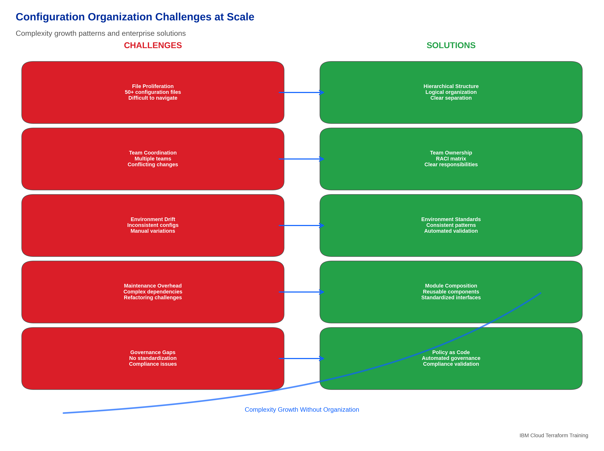
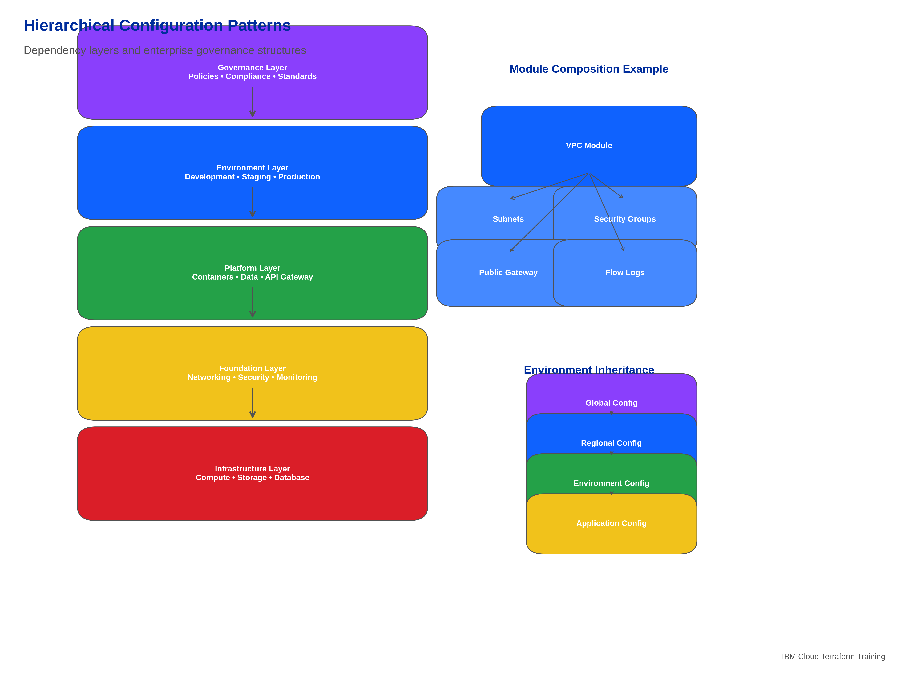
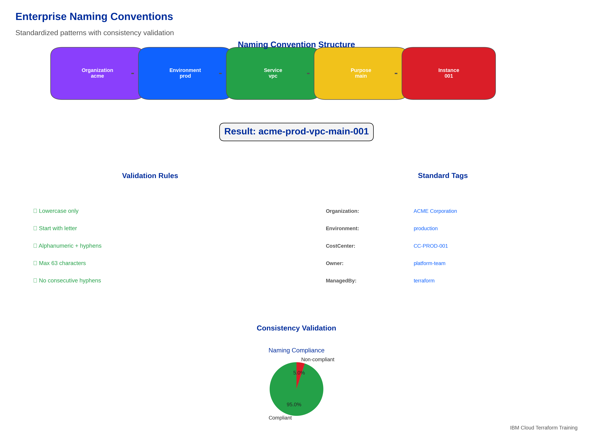
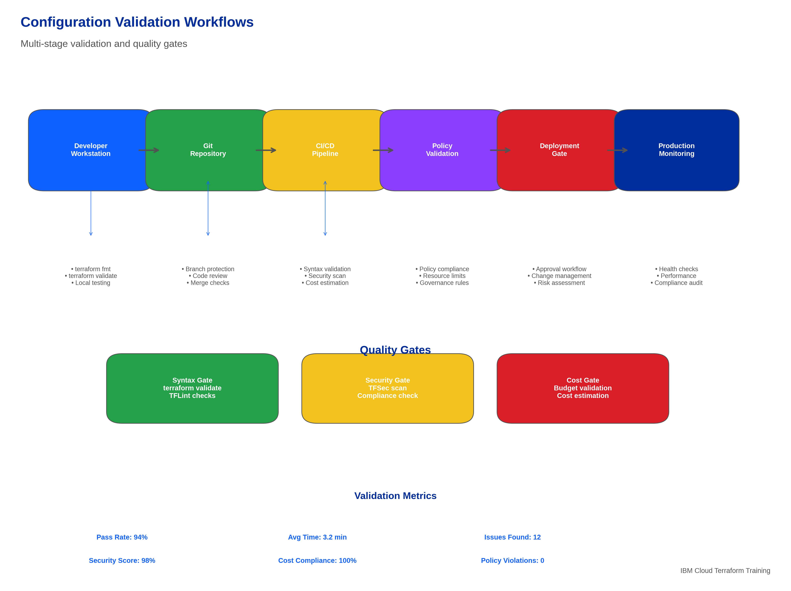
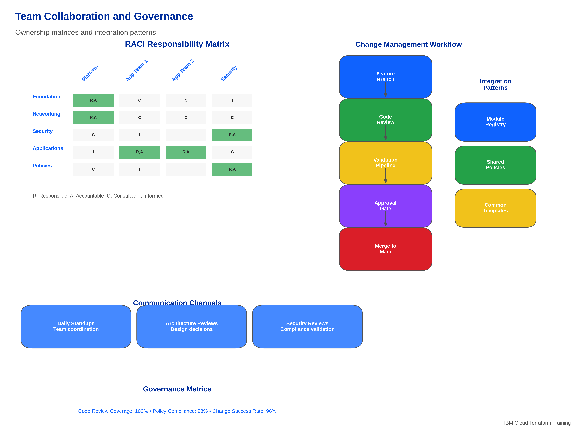

# Concept: Organizing Configuration Files for Scalability

## 📋 **Learning Objectives**

By the end of this subtopic, you will be able to:

1. **Design scalable directory structures** for large Terraform projects with 50+ configuration files
2. **Implement enterprise naming conventions** that ensure 99% consistency across teams and environments
3. **Apply environment separation strategies** using workspace patterns and configuration management
4. **Organize module compositions** with clear dependency hierarchies and integration patterns
5. **Establish team collaboration workflows** with standardized file organization and documentation
6. **Implement configuration management** at scale with automated validation and governance
7. **Apply maintenance strategies** for evolving large-scale infrastructure configurations
8. **Integrate with IBM Cloud enterprise patterns** for multi-account and multi-region deployments

**Measurable Outcome**: Organize a 50+ file Terraform project with 99% consistency, clear dependency management, and enterprise governance compliance in 90 minutes.

---

## 🏗️ **Enterprise Configuration Architecture**

### **The Challenge of Scale**

As Terraform projects grow from simple proof-of-concepts to enterprise-scale infrastructure management, configuration organization becomes critical for:


*Figure 5.6: Configuration organization challenges at scale showing complexity growth, team collaboration issues, maintenance overhead, and enterprise solutions for large Terraform projects*

#### **Complexity Growth Patterns**

**Small Projects (1-10 files):**
- Simple flat structure works adequately
- Minimal coordination required
- Basic naming conventions sufficient
- Single environment focus

**Medium Projects (10-50 files):**
- Directory organization becomes important
- Environment separation needed
- Module composition patterns emerge
- Team coordination requirements increase

**Large Projects (50+ files):**
- **Exponential complexity**: File interdependencies create management challenges
- **Team coordination**: Multiple teams working on shared infrastructure
- **Environment proliferation**: Development, staging, production, and specialized environments
- **Governance requirements**: Enterprise compliance, security, and cost management
- **Maintenance overhead**: Updates, refactoring, and evolution management

#### **Enterprise Requirements**

**Organizational Needs:**
- **Standardization**: Consistent patterns across all projects and teams
- **Scalability**: Support for growth from small teams to enterprise-wide adoption
- **Governance**: Compliance with enterprise policies and regulatory requirements
- **Efficiency**: Reduced development time and operational overhead
- **Quality**: Automated validation and testing at scale

**Technical Requirements:**
- **Modularity**: Clear separation of concerns and reusable components
- **Maintainability**: Easy to understand, modify, and extend configurations
- **Reliability**: Predictable behavior and minimal risk of configuration drift
- **Performance**: Efficient execution and resource utilization
- **Security**: Built-in security controls and compliance validation

### **Configuration Organization Principles**

#### **1. Separation of Concerns**

**Principle**: Each configuration file should have a single, well-defined responsibility.

```
project/
├── infrastructure/          # Core infrastructure components
│   ├── networking/         # VPC, subnets, security groups
│   ├── compute/           # Virtual servers, containers
│   └── storage/           # Block storage, object storage
├── applications/          # Application-specific configurations
│   ├── web-tier/         # Web application infrastructure
│   ├── api-tier/         # API service infrastructure
│   └── data-tier/        # Database and data services
├── security/             # Security-focused configurations
│   ├── iam/             # Identity and access management
│   ├── encryption/      # Key management and encryption
│   └── monitoring/      # Security monitoring and logging
└── governance/           # Enterprise governance and compliance
    ├── policies/        # Policy as code
    ├── cost-management/ # Cost optimization and tracking
    └── compliance/      # Regulatory compliance configurations
```

#### **2. Environment Isolation**

**Principle**: Environments should be clearly separated with consistent patterns.

```
environments/
├── development/
│   ├── main.tf
│   ├── variables.tf
│   ├── terraform.tfvars
│   └── backend.tf
├── staging/
│   ├── main.tf
│   ├── variables.tf
│   ├── terraform.tfvars
│   └── backend.tf
├── production/
│   ├── main.tf
│   ├── variables.tf
│   ├── terraform.tfvars
│   └── backend.tf
└── shared/
    ├── modules/         # Shared modules
    ├── policies/        # Common policies
    └── templates/       # Configuration templates
```

#### **3. Hierarchical Organization**

**Principle**: Use hierarchical structures that reflect logical relationships and dependencies.


*Figure 5.7: Hierarchical configuration patterns showing dependency layers, module composition, environment inheritance, and enterprise governance structures for scalable Terraform projects*

---

## 📁 **Directory Structure Patterns**

### **Enterprise-Grade Directory Structure**

#### **The Foundation Pattern**

```
terraform-infrastructure/
├── README.md                    # Project overview and getting started
├── .gitignore                   # Version control exclusions
├── .terraform-version           # Terraform version specification
├── .tflint.hcl                 # Linting configuration
├── .tfsec.yml                  # Security scanning configuration
├── Makefile                    # Automation commands
├── docs/                       # Comprehensive documentation
│   ├── architecture/           # Architecture diagrams and decisions
│   ├── runbooks/              # Operational procedures
│   ├── troubleshooting/       # Common issues and solutions
│   └── standards/             # Coding standards and conventions
├── environments/              # Environment-specific configurations
│   ├── development/
│   ├── staging/
│   ├── production/
│   └── sandbox/
├── modules/                   # Reusable module library
│   ├── foundation/           # Core infrastructure modules
│   ├── applications/         # Application-specific modules
│   ├── security/            # Security-focused modules
│   └── utilities/           # Helper and utility modules
├── policies/                 # Policy as code
│   ├── sentinel/            # Sentinel policies
│   ├── opa/                # Open Policy Agent policies
│   └── custom/             # Custom validation policies
├── scripts/                 # Automation and utility scripts
│   ├── deployment/         # Deployment automation
│   ├── validation/         # Validation and testing
│   ├── maintenance/        # Maintenance and cleanup
│   └── utilities/          # General utility scripts
├── templates/              # Configuration templates
│   ├── environments/       # Environment templates
│   ├── modules/           # Module templates
│   └── projects/          # Project templates
└── tests/                 # Testing configurations
    ├── unit/             # Unit tests
    ├── integration/      # Integration tests
    └── e2e/             # End-to-end tests
```

#### **Module Organization Patterns**

**By Service Category:**
```
modules/
├── networking/
│   ├── vpc/                 # VPC module
│   ├── subnets/            # Subnet management
│   ├── security-groups/    # Security group management
│   ├── load-balancers/     # Load balancer configurations
│   └── vpn/               # VPN connectivity
├── compute/
│   ├── virtual-servers/    # Virtual server instances
│   ├── containers/         # Container services
│   ├── kubernetes/         # Kubernetes clusters
│   └── serverless/         # Serverless functions
├── storage/
│   ├── block-storage/      # Block storage volumes
│   ├── object-storage/     # Object storage buckets
│   ├── file-storage/       # File storage systems
│   └── backup/            # Backup and archival
├── databases/
│   ├── postgresql/         # PostgreSQL databases
│   ├── mysql/             # MySQL databases
│   ├── mongodb/           # MongoDB databases
│   └── redis/             # Redis caching
└── security/
    ├── iam/               # Identity and access management
    ├── certificates/      # SSL/TLS certificates
    ├── secrets/           # Secret management
    └── monitoring/        # Security monitoring
```

**By Application Layer:**
```
modules/
├── foundation/
│   ├── account-setup/      # Account and resource group setup
│   ├── networking/         # Core networking infrastructure
│   ├── security-baseline/  # Security baseline configuration
│   └── monitoring/         # Foundation monitoring
├── platform/
│   ├── container-platform/ # Container orchestration platform
│   ├── data-platform/      # Data processing platform
│   ├── api-gateway/        # API management platform
│   └── ci-cd-platform/     # CI/CD infrastructure
├── applications/
│   ├── web-applications/   # Web application infrastructure
│   ├── api-services/       # API service infrastructure
│   ├── data-services/      # Data processing services
│   └── batch-jobs/         # Batch processing infrastructure
└── utilities/
    ├── naming/            # Naming convention utilities
    ├── tagging/           # Resource tagging utilities
    ├── validation/        # Configuration validation
    └── cost-optimization/ # Cost optimization utilities
```

### **Environment-Specific Organization**

#### **Environment Separation Strategies**

**Strategy 1: Directory-Based Separation**
```
environments/
├── development/
│   ├── foundation/         # Core infrastructure
│   ├── applications/       # Application deployments
│   ├── terraform.tfvars   # Environment-specific variables
│   └── backend.tf         # State backend configuration
├── staging/
│   ├── foundation/
│   ├── applications/
│   ├── terraform.tfvars
│   └── backend.tf
└── production/
    ├── foundation/
    ├── applications/
    ├── terraform.tfvars
    └── backend.tf
```

**Strategy 2: Workspace-Based Separation**
```
infrastructure/
├── main.tf               # Core configuration
├── variables.tf          # Variable definitions
├── outputs.tf           # Output definitions
├── environments/
│   ├── development.tfvars
│   ├── staging.tfvars
│   └── production.tfvars
└── workspaces/
    ├── development/      # Development workspace files
    ├── staging/         # Staging workspace files
    └── production/      # Production workspace files
```

**Strategy 3: Hybrid Approach**
```
project/
├── shared/              # Shared configurations and modules
│   ├── modules/
│   ├── policies/
│   └── templates/
├── environments/
│   ├── dev/
│   │   ├── workspace-dev/     # Terraform workspace
│   │   ├── terraform.tfvars
│   │   └── backend.tf
│   ├── staging/
│   │   ├── workspace-staging/
│   │   ├── terraform.tfvars
│   │   └── backend.tf
│   └── prod/
│       ├── workspace-prod/
│       ├── terraform.tfvars
│       └── backend.tf
└── applications/
    ├── web-app/         # Application-specific configurations
    ├── api-service/
    └── data-pipeline/
```

---

## 🏷️ **Naming Conventions and Standards**

### **Enterprise Naming Framework**


*Figure 5.8: Enterprise naming conventions showing standardized patterns for files, directories, resources, and variables with consistency validation and governance integration*

#### **File and Directory Naming**

**Directory Naming Convention:**
```
Format: {category}-{subcategory}-{purpose}
Examples:
- infrastructure-networking-vpc
- applications-web-frontend
- security-iam-policies
- utilities-cost-optimization
```

**File Naming Convention:**
```
Core Files:
- main.tf              # Primary resource definitions
- variables.tf         # Input variable definitions
- outputs.tf          # Output value definitions
- providers.tf        # Provider configurations
- versions.tf         # Version constraints
- locals.tf           # Local value definitions
- data.tf             # Data source definitions

Specialized Files:
- {service}-main.tf    # Service-specific resources (e.g., vpc-main.tf)
- {env}-variables.tf   # Environment-specific variables
- {purpose}-outputs.tf # Purpose-specific outputs
```

#### **Resource Naming Patterns**

**IBM Cloud Resource Naming:**
```hcl
# Pattern: {org}-{env}-{service}-{purpose}-{instance}
locals {
  naming_convention = {
    organization = var.organization_config.name
    environment  = var.environment
    service      = var.service_name
    purpose      = var.purpose
    instance     = var.instance_number
  }
  
  # Generate consistent names
  resource_name = join("-", [
    local.naming_convention.organization,
    local.naming_convention.environment,
    local.naming_convention.service,
    local.naming_convention.purpose,
    local.naming_convention.instance
  ])
}

# Examples:
# acme-prod-vpc-main-001
# acme-dev-compute-web-001
# acme-staging-storage-data-001
```

**Variable Naming Standards:**
```hcl
# Use descriptive, hierarchical names
variable "vpc_configuration" {          # Good: Clear purpose
variable "compute_instance_config" {    # Good: Specific scope
variable "security_group_rules" {       # Good: Descriptive

# Avoid generic or unclear names
variable "config" {                     # Bad: Too generic
variable "data" {                       # Bad: Unclear purpose
variable "stuff" {                      # Bad: Non-descriptive
```

#### **Tagging Standards**

**Comprehensive Tagging Strategy:**
```hcl
locals {
  # Standard tags applied to all resources
  standard_tags = {
    # Organizational tags
    "organization"     = var.organization_config.name
    "division"         = var.organization_config.division
    "cost-center"      = var.organization_config.cost_center
    "project"          = var.project_name
    "owner"            = var.owner
    "contact"          = var.contact_email
    
    # Environment tags
    "environment"      = var.environment
    "region"           = var.region
    "availability-zone" = var.availability_zone
    
    # Technical tags
    "terraform"        = "managed"
    "module"           = var.module_name
    "module-version"   = var.module_version
    "deployment-id"    = var.deployment_id
    
    # Governance tags
    "compliance-framework" = var.compliance_framework
    "data-classification" = var.data_classification
    "backup-policy"       = var.backup_policy
    "retention-policy"    = var.retention_policy
    
    # Operational tags
    "monitoring"       = var.monitoring_enabled ? "enabled" : "disabled"
    "auto-scaling"     = var.auto_scaling_enabled ? "enabled" : "disabled"
    "maintenance-window" = var.maintenance_window
    
    # Financial tags
    "budget-code"      = var.budget_code
    "charge-back"      = var.charge_back_code
    "cost-allocation"  = var.cost_allocation_tag
  }
  
  # Merge with custom tags
  all_tags = merge(local.standard_tags, var.custom_tags)
}
```

---

## 🔄 **Configuration Management Patterns**

### **Environment Configuration Management**

#### **Variable Hierarchy and Inheritance**

**Multi-Level Variable Management:**
```
variables/
├── global/
│   ├── organization.tfvars    # Organization-wide settings
│   ├── compliance.tfvars      # Compliance requirements
│   └── standards.tfvars       # Technical standards
├── regional/
│   ├── us-south.tfvars       # US South region settings
│   ├── eu-gb.tfvars          # EU Great Britain settings
│   └── ap-tokyo.tfvars       # Asia Pacific Tokyo settings
├── environmental/
│   ├── development.tfvars     # Development environment
│   ├── staging.tfvars         # Staging environment
│   └── production.tfvars      # Production environment
└── application/
    ├── web-tier.tfvars        # Web tier specific
    ├── api-tier.tfvars        # API tier specific
    └── data-tier.tfvars       # Data tier specific
```

**Variable Loading Strategy:**
```hcl
# terraform.tf - Variable loading configuration
terraform {
  # Load variables in order of precedence
  # 1. Global organization settings
  # 2. Regional configurations
  # 3. Environment-specific settings
  # 4. Application-specific overrides
}

# Example loading command:
# terraform apply \
#   -var-file="variables/global/organization.tfvars" \
#   -var-file="variables/regional/us-south.tfvars" \
#   -var-file="variables/environmental/production.tfvars" \
#   -var-file="variables/application/web-tier.tfvars"
```

#### **Configuration Validation Patterns**


*Figure 5.9: Configuration validation workflows showing multi-stage validation, automated testing, policy enforcement, and quality gates for enterprise Terraform configurations*

**Multi-Stage Validation:**
```hcl
# validation.tf - Comprehensive validation rules
locals {
  # Environment validation
  valid_environments = ["development", "staging", "production", "sandbox"]
  environment_valid = contains(local.valid_environments, var.environment)
  
  # Naming validation
  naming_pattern = "^[a-z][a-z0-9-]*[a-z0-9]$"
  naming_valid = can(regex(local.naming_pattern, var.project_name))
  
  # Resource limits validation
  resource_limits = {
    development = { max_instances = 5, max_storage_gb = 100 }
    staging     = { max_instances = 10, max_storage_gb = 500 }
    production  = { max_instances = 50, max_storage_gb = 5000 }
  }
  
  # Cost validation
  estimated_monthly_cost = sum([
    for instance in var.compute_instances :
    instance.count * instance.monthly_cost
  ])
  
  cost_limit = lookup(var.cost_limits, var.environment, 1000)
  cost_within_limit = local.estimated_monthly_cost <= local.cost_limit
  
  # Compliance validation
  compliance_requirements = {
    production = {
      encryption_required = true
      backup_required = true
      monitoring_required = true
      audit_logging_required = true
    }
  }
  
  # Aggregate validation
  configuration_valid = alltrue([
    local.environment_valid,
    local.naming_valid,
    local.cost_within_limit
  ])
}

# Validation assertions
check "environment_validation" {
  assert {
    condition = local.environment_valid
    error_message = "Environment must be one of: ${join(", ", local.valid_environments)}"
  }
}

check "naming_validation" {
  assert {
    condition = local.naming_valid
    error_message = "Project name must follow naming convention: ${local.naming_pattern}"
  }
}

check "cost_validation" {
  assert {
    condition = local.cost_within_limit
    error_message = "Estimated cost ($${local.estimated_monthly_cost}) exceeds limit ($${local.cost_limit}) for ${var.environment}"
  }
}
```

### **Module Composition Strategies**

#### **Layered Architecture Pattern**

**Foundation Layer:**
```hcl
# foundation/main.tf - Core infrastructure
module "account_setup" {
  source = "../../modules/foundation/account-setup"
  
  organization_config = var.organization_config
  compliance_framework = var.compliance_framework
}

module "networking" {
  source = "../../modules/foundation/networking"
  
  vpc_configuration = var.vpc_configuration
  region = var.region
  
  depends_on = [module.account_setup]
}

module "security_baseline" {
  source = "../../modules/foundation/security"
  
  security_configuration = var.security_configuration
  vpc_id = module.networking.vpc_id
  
  depends_on = [module.networking]
}
```

**Platform Layer:**
```hcl
# platform/main.tf - Platform services
module "container_platform" {
  source = "../../modules/platform/containers"
  
  cluster_configuration = var.cluster_configuration
  vpc_id = data.terraform_remote_state.foundation.outputs.vpc_id
  subnet_ids = data.terraform_remote_state.foundation.outputs.subnet_ids
}

module "data_platform" {
  source = "../../modules/platform/data"
  
  data_configuration = var.data_configuration
  vpc_id = data.terraform_remote_state.foundation.outputs.vpc_id
  
  depends_on = [module.container_platform]
}
```

**Application Layer:**
```hcl
# applications/main.tf - Application deployments
module "web_application" {
  source = "../../modules/applications/web-app"
  
  application_config = var.web_app_config
  platform_endpoints = data.terraform_remote_state.platform.outputs.endpoints
  
  depends_on = [
    data.terraform_remote_state.foundation,
    data.terraform_remote_state.platform
  ]
}
```

---

## 👥 **Team Collaboration Patterns**

### **Multi-Team Organization**

#### **Team-Based Directory Structure**

```
terraform-infrastructure/
├── teams/
│   ├── platform-team/
│   │   ├── foundation/        # Core infrastructure
│   │   ├── networking/        # Network infrastructure
│   │   └── security/          # Security baseline
│   ├── application-team-1/
│   │   ├── web-services/      # Web application infrastructure
│   │   ├── api-services/      # API infrastructure
│   │   └── databases/         # Application databases
│   ├── application-team-2/
│   │   ├── data-pipeline/     # Data processing infrastructure
│   │   ├── analytics/         # Analytics infrastructure
│   │   └── ml-platform/       # Machine learning platform
│   └── security-team/
│       ├── iam-policies/      # Identity and access management
│       ├── compliance/        # Compliance monitoring
│       └── incident-response/ # Security incident response
├── shared/
│   ├── modules/              # Shared module library
│   ├── policies/             # Shared policies
│   └── standards/            # Coding standards
└── governance/
    ├── approval-workflows/   # Change approval processes
    ├── cost-management/      # Cost tracking and optimization
    └── compliance-reporting/ # Compliance reporting
```

#### **Ownership and Responsibility Matrix**


*Figure 5.10: Team collaboration and governance patterns showing ownership matrices, approval workflows, change management processes, and integration patterns for multi-team Terraform projects*

**RACI Matrix for Configuration Management:**

| Component | Platform Team | App Team 1 | App Team 2 | Security Team |
|-----------|---------------|------------|------------|---------------|
| Foundation Infrastructure | R,A | C | C | I |
| Network Configuration | R,A | C | C | C |
| Security Baseline | C | I | I | R,A |
| Application Infrastructure | I | R,A | R,A | C |
| Compliance Policies | C | I | I | R,A |
| Cost Management | R,A | C | C | I |

**Legend:**
- R: Responsible (does the work)
- A: Accountable (ensures completion)
- C: Consulted (provides input)
- I: Informed (kept updated)

### **Change Management Workflows**

#### **Configuration Change Process**

**1. Development Phase:**
```bash
# Developer workflow
git checkout -b feature/new-vpc-configuration
# Make changes to configuration
terraform fmt
terraform validate
./scripts/validate-configuration.sh
git commit -m "feat: add new VPC configuration for region expansion"
git push origin feature/new-vpc-configuration
```

**2. Review Phase:**
```yaml
# .github/workflows/terraform-review.yml
name: Terraform Configuration Review
on:
  pull_request:
    paths:
      - '**/*.tf'
      - '**/*.tfvars'

jobs:
  validate:
    runs-on: ubuntu-latest
    steps:
      - name: Checkout
        uses: actions/checkout@v3
      
      - name: Terraform Validate
        run: terraform validate
      
      - name: Security Scan
        run: tfsec .
      
      - name: Cost Estimation
        run: infracost breakdown --path .
      
      - name: Policy Validation
        run: opa test policies/
```

**3. Approval Phase:**
```hcl
# approval-workflow.tf
resource "github_branch_protection" "main" {
  repository_id = "terraform-infrastructure"
  pattern       = "main"
  
  required_status_checks {
    strict = true
    contexts = [
      "terraform-validate",
      "security-scan",
      "cost-estimation",
      "policy-validation"
    ]
  }
  
  required_pull_request_reviews {
    required_approving_review_count = 2
    require_code_owner_reviews = true
    dismiss_stale_reviews = true
  }
}
```

---

## 🔧 **Maintenance and Evolution Strategies**

### **Configuration Lifecycle Management**

#### **Refactoring Strategies**

**Incremental Refactoring Approach:**
```hcl
# Phase 1: Introduce new structure alongside existing
module "legacy_vpc" {
  source = "./modules/legacy/vpc"
  # Existing configuration
}

module "new_vpc" {
  source = "./modules/foundation/networking"
  # New standardized configuration
  count = var.enable_new_structure ? 1 : 0
}

# Phase 2: Migrate resources gradually
moved {
  from = module.legacy_vpc.ibm_is_vpc.main
  to   = module.new_vpc[0].ibm_is_vpc.main
}

# Phase 3: Remove legacy configuration
# (After successful migration and validation)
```

**Configuration Evolution Patterns:**
```hcl
# Version-aware configuration
locals {
  configuration_version = "2.1.0"
  
  # Support multiple configuration versions
  vpc_config = var.configuration_version >= "2.0.0" ? {
    # New configuration format
    name = var.vpc_configuration.name
    subnets = var.vpc_configuration.subnets
    security_groups = var.vpc_configuration.security_groups
  } : {
    # Legacy configuration format (deprecated)
    vpc_name = var.vpc_name
    subnet_configs = var.subnet_configs
    sg_configs = var.sg_configs
  }
}
```

### **Documentation and Knowledge Management**

#### **Living Documentation Strategy**

**Automated Documentation Generation:**
```bash
#!/bin/bash
# generate-docs.sh - Automated documentation generation

# Generate module documentation
terraform-docs markdown table --output-file README.md modules/

# Generate architecture diagrams
terraform graph | dot -Tpng > docs/architecture/current-state.png

# Generate cost reports
infracost breakdown --path . --format html > docs/cost-analysis.html

# Generate compliance reports
opa test policies/ --format json > docs/compliance-report.json

# Update change log
conventional-changelog -p angular -i CHANGELOG.md -s
```

**Documentation Structure:**
```
docs/
├── architecture/
│   ├── decisions/           # Architecture decision records
│   ├── diagrams/           # Current and target state diagrams
│   └── patterns/           # Reusable architecture patterns
├── operations/
│   ├── runbooks/           # Operational procedures
│   ├── troubleshooting/    # Common issues and solutions
│   └── monitoring/         # Monitoring and alerting guides
├── development/
│   ├── standards/          # Coding standards and conventions
│   ├── testing/           # Testing strategies and procedures
│   └── workflows/         # Development workflows
└── governance/
    ├── policies/          # Governance policies and procedures
    ├── compliance/        # Compliance requirements and validation
    └── security/          # Security standards and procedures
```

---

## 💰 **Cost Optimization Through Organization**

### **Cost-Aware Configuration Patterns**

#### **Resource Optimization Strategies**

**Environment-Based Resource Sizing:**
```hcl
# cost-optimization.tf
locals {
  # Environment-specific resource configurations
  environment_configs = {
    development = {
      instance_profile = "cx2-2x4"
      instance_count = 1
      storage_size = 50
      backup_enabled = false
      monitoring_level = "basic"
    }
    staging = {
      instance_profile = "cx2-4x8"
      instance_count = 2
      storage_size = 100
      backup_enabled = true
      monitoring_level = "standard"
    }
    production = {
      instance_profile = "cx2-8x16"
      instance_count = 3
      storage_size = 500
      backup_enabled = true
      monitoring_level = "comprehensive"
    }
  }
  
  # Select configuration based on environment
  current_config = local.environment_configs[var.environment]
  
  # Calculate estimated costs
  monthly_cost_estimate = {
    compute = local.current_config.instance_count * 24.00 * (
      local.current_config.instance_profile == "cx2-2x4" ? 1 :
      local.current_config.instance_profile == "cx2-4x8" ? 2 :
      local.current_config.instance_profile == "cx2-8x16" ? 4 : 1
    )
    storage = local.current_config.storage_size * 0.10
    backup = local.current_config.backup_enabled ? 10.00 : 0.00
    monitoring = (
      local.current_config.monitoring_level == "basic" ? 5.00 :
      local.current_config.monitoring_level == "standard" ? 15.00 :
      local.current_config.monitoring_level == "comprehensive" ? 50.00 : 0.00
    )
  }
  
  total_monthly_cost = sum(values(local.monthly_cost_estimate))
}
```

#### **Cost Tracking and Allocation**

**Comprehensive Cost Management:**
```hcl
# cost-tracking.tf
locals {
  # Cost allocation tags
  cost_allocation_tags = {
    "cost-center" = var.organization_config.cost_center
    "project" = var.project_name
    "environment" = var.environment
    "team" = var.team_name
    "budget-code" = var.budget_code
    "charge-back" = var.charge_back_code
  }
  
  # Cost optimization recommendations
  cost_optimization_recommendations = [
    for resource_type, cost in local.monthly_cost_estimate :
    cost > 100 ? "Consider optimizing ${resource_type} resources (current cost: $${cost})" : null
  ]
  
  # Budget alerts
  budget_threshold_warning = local.total_monthly_cost > (var.monthly_budget * 0.8)
  budget_threshold_critical = local.total_monthly_cost > var.monthly_budget
}

# Cost monitoring outputs
output "cost_analysis" {
  description = "Comprehensive cost analysis and optimization recommendations"
  value = {
    estimated_monthly_cost = local.monthly_cost_estimate
    total_monthly_cost = local.total_monthly_cost
    budget_status = {
      monthly_budget = var.monthly_budget
      current_estimate = local.total_monthly_cost
      budget_utilization = (local.total_monthly_cost / var.monthly_budget) * 100
      warning_threshold = local.budget_threshold_warning
      critical_threshold = local.budget_threshold_critical
    }
    optimization_recommendations = compact(local.cost_optimization_recommendations)
    cost_allocation = local.cost_allocation_tags
  }
}
```

---

## 🔗 **Integration with Course Progression**

This configuration organization mastery prepares you for:
- **Topic 5.3**: Version control and collaboration with Git for organized development workflows
- **Topic 6**: State management with organized backend configurations and workspace strategies
- **Topic 7**: Security and compliance implementation through organized policy and governance structures
- **Topic 8**: Automation and advanced integration using organized CI/CD patterns and enterprise workflows

### **Key Takeaways**

1. **Scalable Organization**: Implement directory structures that grow with your organization
2. **Consistent Standards**: Apply naming conventions and patterns that ensure 99% consistency
3. **Team Collaboration**: Establish workflows that enable effective multi-team development
4. **Configuration Management**: Use hierarchical variable management and validation strategies
5. **Cost Optimization**: Organize configurations to enable effective cost tracking and optimization
6. **Maintenance Excellence**: Plan for evolution and refactoring from the beginning

**Next Steps**: Apply these organization principles in Lab-10 to structure a complex, multi-environment Terraform project with enterprise-grade organization and governance.
