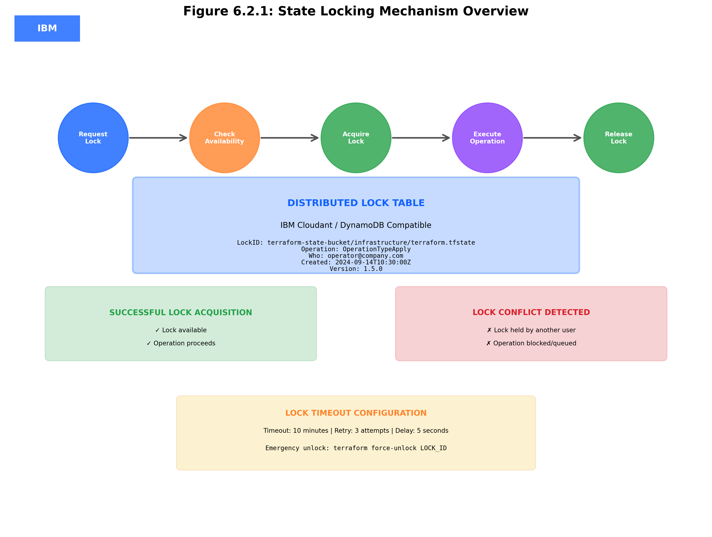
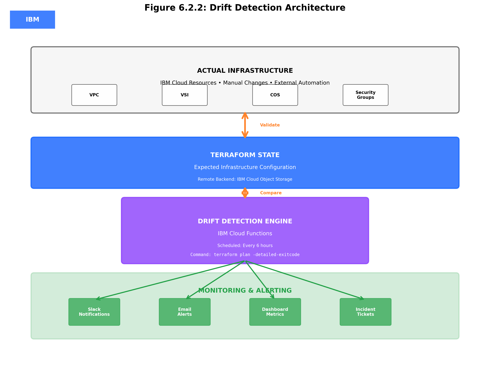
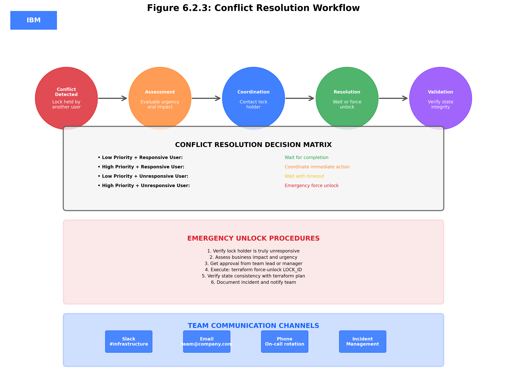
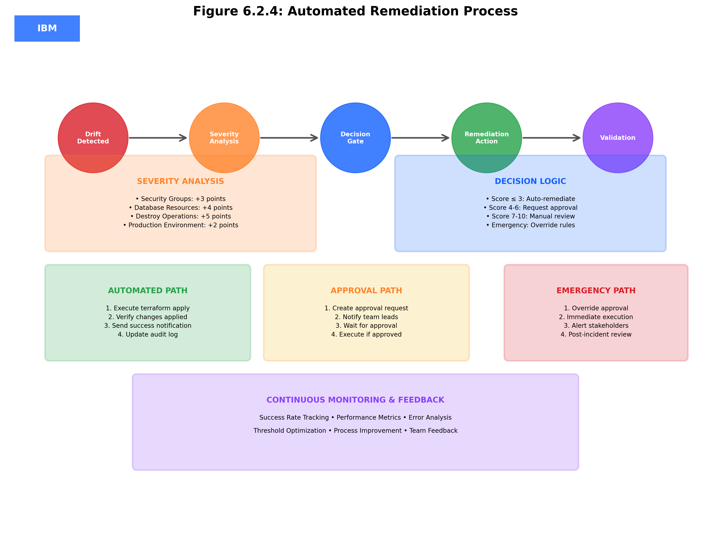
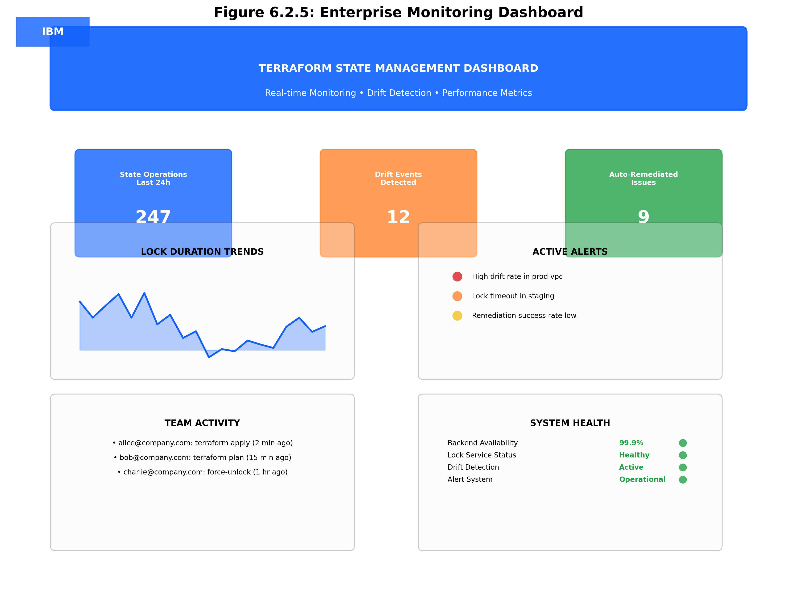

# Concept: State Locking and Drift Detection

## 📚 **Learning Objectives**

By the end of this subtopic, you will be able to:

### **Knowledge Objectives**
1. **Understand state locking mechanisms** and their role in preventing concurrent modifications
2. **Explain drift detection concepts** and identify causes of infrastructure drift
3. **Analyze state locking backends** and their implementation requirements
4. **Describe drift detection strategies** and automated remediation approaches
5. **Evaluate enterprise patterns** for state consistency and conflict resolution

### **Application Objectives**
6. **Configure state locking** using IBM Cloud services and DynamoDB-compatible solutions
7. **Implement drift detection workflows** with automated monitoring and alerting
8. **Deploy conflict resolution procedures** for team collaboration scenarios
9. **Execute state consistency validation** using Terraform and external tools
10. **Integrate monitoring solutions** for proactive drift detection and remediation

### **Analysis Objectives**
11. **Design enterprise state management** architectures with locking and drift detection
12. **Optimize performance and cost** for state locking and monitoring solutions

---

## 🔒 **State Locking Fundamentals**


*Figure 6.2.1: State Locking Mechanism - Comprehensive visualization of Terraform state locking architecture, lock acquisition process, and concurrent operation prevention*

### **What is State Locking?**

State locking is a mechanism that prevents multiple Terraform operations from running simultaneously against the same state file, ensuring data consistency and preventing corruption.

### **Why State Locking Matters**

**Without State Locking:**
```bash
# Team Member A starts terraform apply
terraform apply  # Reads state version 1

# Team Member B starts terraform apply (simultaneously)
terraform apply  # Also reads state version 1

# Both operations complete, but only the last one persists
# Result: Lost changes and potential infrastructure corruption
```

**With State Locking:**
```bash
# Team Member A starts terraform apply
terraform apply  # Acquires lock, reads state version 1

# Team Member B tries terraform apply
terraform apply  # Waits for lock or fails with error

# Team Member A completes, releases lock
# Team Member B can now proceed with updated state
```

### **State Locking Lifecycle**

1. **Lock Acquisition**: Terraform attempts to acquire an exclusive lock
2. **Operation Execution**: Terraform performs the requested operation
3. **State Update**: State file is updated with new resource information
4. **Lock Release**: Lock is released, allowing other operations

### **Lock Information Structure**

```json
{
  "ID": "terraform-lock-12345",
  "Operation": "OperationTypeApply",
  "Info": "terraform apply",
  "Who": "user@company.com",
  "Version": "1.5.0",
  "Created": "2024-09-14T10:30:00Z",
  "Path": "infrastructure/terraform.tfstate"
}
```

---

## 🏗️ **IBM Cloud State Locking Implementation**

### **DynamoDB-Compatible Solutions**

While IBM Cloud doesn't provide a native DynamoDB service, several approaches enable state locking:

#### **1. IBM Cloudant (Recommended)**
```hcl
terraform {
  backend "s3" {
    bucket         = "terraform-state-bucket"
    key           = "infrastructure/terraform.tfstate"
    region        = "us-south"
    endpoint      = "s3.us-south.cloud-object-storage.appdomain.cloud"
    
    # State locking with Cloudant
    dynamodb_table = "terraform-locks"
    dynamodb_endpoint = "https://your-cloudant-instance.cloudantnosqldb.appdomain.cloud"
    
    skip_credentials_validation = true
    skip_region_validation     = true
    skip_metadata_api_check    = true
    force_path_style           = true
    encrypt                    = true
  }
}
```

#### **2. External DynamoDB Service**
```hcl
terraform {
  backend "s3" {
    bucket         = "terraform-state-bucket"
    key           = "infrastructure/terraform.tfstate"
    region        = "us-south"
    endpoint      = "s3.us-south.cloud-object-storage.appdomain.cloud"
    
    # External DynamoDB for locking
    dynamodb_table = "terraform-locks"
    dynamodb_endpoint = "https://dynamodb.us-east-1.amazonaws.com"
    
    skip_credentials_validation = true
    skip_region_validation     = true
    skip_metadata_api_check    = true
    force_path_style           = true
    encrypt                    = true
  }
}
```

#### **3. Custom Locking Implementation**
```hcl
# Custom locking using IBM Cloud services
resource "ibm_cos_bucket_object" "terraform_lock" {
  count = var.enable_state_locking ? 1 : 0
  
  bucket_crn      = ibm_cos_bucket.state_bucket.crn
  bucket_location = ibm_cos_bucket.state_bucket.region_location
  key            = "locks/terraform.lock"
  content        = jsonencode({
    locked_by = var.operator_id
    locked_at = timestamp()
    operation = "terraform_apply"
  })
  
  lifecycle {
    prevent_destroy = true
  }
}
```

### **Lock Table Schema**

For DynamoDB-compatible locking, the lock table requires:

```json
{
  "TableName": "terraform-locks",
  "KeySchema": [
    {
      "AttributeName": "LockID",
      "KeyType": "HASH"
    }
  ],
  "AttributeDefinitions": [
    {
      "AttributeName": "LockID",
      "AttributeType": "S"
    }
  ],
  "BillingMode": "PAY_PER_REQUEST"
}
```

---

## 🔍 **Drift Detection Concepts**


*Figure 6.2.2: Drift Detection Architecture - Comprehensive drift detection system showing monitoring workflows, change identification, and automated response mechanisms*

### **What is Infrastructure Drift?**

Infrastructure drift occurs when the actual state of resources differs from what Terraform expects based on its state file.

### **Common Causes of Drift**

#### **1. Manual Changes**
```bash
# Someone manually modifies a resource through IBM Cloud console
ibmcloud is instance-update my-vsi --name "manually-renamed-vsi"

# Terraform state still shows old name
terraform plan  # Shows drift - wants to rename back
```

#### **2. External Automation**
```bash
# CI/CD pipeline or other automation modifies resources
# Auto-scaling changes instance counts
# Security policies modify security groups
# Backup systems create additional volumes
```

#### **3. Provider Updates**
```bash
# Provider updates change default values
# API changes modify resource attributes
# New required fields added to resources
```

#### **4. Time-Based Changes**
```bash
# Certificates expire and auto-renew
# DNS records updated by external systems
# Load balancer health checks modify targets
```

### **Types of Drift**

#### **Configuration Drift**
- Resource attributes differ from Terraform configuration
- Can be detected by `terraform plan`
- Usually correctable by `terraform apply`

#### **State Drift**
- State file doesn't match actual infrastructure
- Requires state refresh or import operations
- May indicate state file corruption

#### **Dependency Drift**
- Resource dependencies change outside Terraform
- Can cause cascading failures during apply operations
- Requires careful analysis and remediation

---

## 📊 **Drift Detection Strategies**

### **1. Scheduled Plan Checks**

```bash
#!/bin/bash
# Automated drift detection script

# Run terraform plan and capture exit code
terraform plan -detailed-exitcode -out=drift-check.tfplan
PLAN_EXIT=$?

case $PLAN_EXIT in
    0)
        echo "✅ No drift detected"
        ;;
    1)
        echo "❌ Error in plan execution"
        exit 1
        ;;
    2)
        echo "⚠️ Drift detected - changes required"
        # Send alert to team
        send_drift_alert "drift-check.tfplan"
        ;;
esac
```

### **2. Continuous Monitoring**

```hcl
# IBM Cloud Monitoring integration for drift detection
resource "ibm_resource_instance" "monitoring" {
  name              = "${var.project_name}-drift-monitoring"
  service           = "sysdig-monitor"
  plan              = "graduated-tier"
  location          = var.region
  resource_group_id = data.ibm_resource_group.main.id
  
  parameters = {
    default_receiver = true
  }
}

# Custom metric for drift detection
resource "ibm_monitoring_alert_policy" "drift_detection" {
  name        = "terraform-drift-detection"
  description = "Alert when infrastructure drift is detected"
  
  condition {
    metric_name = "terraform.drift.detected"
    operator    = ">"
    threshold   = 0
  }
  
  notification_channels = [
    ibm_monitoring_notification_channel.team_slack.id
  ]
}
```

### **3. State Validation Workflows**


*Figure 6.2.3: Conflict Resolution Workflow - Detailed conflict resolution process for state locking conflicts, including detection, analysis, and resolution strategies*

```yaml
# GitHub Actions workflow for drift detection
name: Terraform Drift Detection
on:
  schedule:
    - cron: '0 */6 * * *'  # Every 6 hours
  workflow_dispatch:

jobs:
  drift-detection:
    runs-on: ubuntu-latest
    steps:
      - uses: actions/checkout@v3
      
      - name: Setup Terraform
        uses: hashicorp/setup-terraform@v2
        with:
          terraform_version: 1.5.0
          
      - name: Terraform Init
        run: terraform init
        
      - name: Drift Detection
        run: |
          terraform plan -detailed-exitcode
          if [ $? -eq 2 ]; then
            echo "::warning::Infrastructure drift detected"
            # Create GitHub issue for drift remediation
          fi
```

---

## 🛠️ **Enterprise Drift Detection Architecture**

### **Multi-Environment Monitoring**

```hcl
# Centralized drift detection for multiple environments
module "drift_detection" {
  source = "./modules/drift-detection"
  
  for_each = var.environments
  
  environment_name = each.key
  state_bucket    = each.value.state_bucket
  monitoring_config = {
    check_interval = "6h"
    alert_channels = each.value.alert_channels
    remediation_policy = each.value.auto_remediate ? "auto" : "manual"
  }
}
```

### **Automated Remediation Workflows**


*Figure 6.2.4: Automated Remediation - Comprehensive automated remediation system for drift detection, including workflow automation, approval processes, and rollback mechanisms*

```hcl
# Automated drift remediation configuration
resource "ibm_function_action" "drift_remediation" {
  name      = "${var.project_name}-drift-remediation"
  namespace = ibm_function_namespace.terraform_automation.name
  
  exec {
    kind = "nodejs:18"
    code = file("${path.module}/functions/drift-remediation.js")
  }
  
  parameters = jsonencode({
    terraform_workspace = var.workspace_name
    auto_approve_threshold = var.auto_approve_threshold
    notification_webhook = var.slack_webhook_url
  })
}

# Event trigger for drift detection
resource "ibm_function_trigger" "drift_detected" {
  name      = "${var.project_name}-drift-trigger"
  namespace = ibm_function_namespace.terraform_automation.name
  
  feed = [
    {
      name = "drift-detection-feed"
      parameters = jsonencode({
        bucket = ibm_cos_bucket.state_bucket.bucket_name
        event_types = ["drift_detected"]
      })
    }
  ]
}
```

---

## 🔐 **Security Considerations for State Locking**

### **Lock Table Security**

```hcl
# Secure lock table configuration
resource "ibm_cloudant_database" "terraform_locks" {
  name     = "terraform-locks"
  instance = ibm_cloudant.state_management.id
  
  # Enable encryption
  encryption_key = ibm_kms_key.state_encryption.id
  
  # Configure access controls
  security = {
    admins = {
      names = var.admin_users
      roles = ["_admin"]
    }
    members = {
      names = var.operator_users
      roles = ["_reader", "_writer"]
    }
  }
}
```

### **Lock Timeout Configuration**

```hcl
terraform {
  backend "s3" {
    # ... other configuration ...
    
    # Lock timeout settings
    lock_timeout = "10m"  # Maximum time to wait for lock
    
    # Retry configuration
    max_retries = 3
    retry_delay = "5s"
  }
}
```

### **Emergency Lock Breaking**

```bash
#!/bin/bash
# Emergency lock breaking procedure

# Verify lock status
terraform force-unlock -force LOCK_ID

# Alternative: Manual lock removal
aws dynamodb delete-item \
  --table-name terraform-locks \
  --key '{"LockID":{"S":"terraform-state-bucket/infrastructure/terraform.tfstate-md5"}}' \
  --endpoint-url https://your-dynamodb-endpoint.com

# Verify lock removal
terraform plan
```

---

## 📈 **Performance Optimization**

### **Lock Efficiency**

```hcl
# Optimized backend configuration for performance
terraform {
  backend "s3" {
    # ... other configuration ...
    
    # Performance optimizations
    max_retries = 5
    retry_delay = "2s"
    
    # Connection pooling
    http_timeout = "30s"
    
    # Parallel operations
    parallelism = 10
  }
}
```

### **Drift Detection Optimization**

```bash
# Optimized drift detection with targeted resources
terraform plan -target=module.critical_infrastructure -detailed-exitcode

# Parallel drift detection for large infrastructures
terraform plan -parallelism=20 -detailed-exitcode
```

---

## 💰 **Cost Considerations**

### **State Locking Costs**

| Service | Cost Model | Estimated Monthly Cost |
|---------|------------|----------------------|
| IBM Cloudant | Per request + storage | $10-50 |
| External DynamoDB | Per request | $5-25 |
| Custom COS-based | Storage only | $1-5 |

### **Drift Detection Costs**

| Component | Cost Model | Estimated Monthly Cost |
|-----------|------------|----------------------|
| Monitoring Service | Per metric + alerts | $20-100 |
| Function Execution | Per invocation | $5-20 |
| Activity Tracker | Per event | $10-50 |

### **Cost Optimization Strategies**

```hcl
# Cost-optimized drift detection
resource "ibm_function_action" "drift_check" {
  # Use smaller memory allocation
  limits {
    memory = 128  # MB
    timeout = 300  # seconds
  }
  
  # Optimize execution frequency
  parameters = jsonencode({
    check_frequency = var.environment == "production" ? "1h" : "6h"
    batch_size = 10  # Process multiple resources per invocation
  })
}
```

---

## 🔗 **Integration with Previous Topics**

### **Building on Topic 6.1: Local and Remote State Files**
- **State Backend Foundation**: Leverages remote state configuration from 6.1
- **Security Enhancement**: Adds locking for team collaboration scenarios
- **Monitoring Extension**: Builds upon Activity Tracker configuration

### **Connection to Topic 5: Modularization and Best Practices**
- **Module State Management**: Applies locking to modular architectures
- **Version Control Integration**: Enhances Git workflows with drift detection
- **Collaboration Patterns**: Extends team collaboration with conflict prevention

### **Preparation for Topic 7: Security and Compliance**
- **Audit Requirements**: State locking provides audit trails for compliance
- **Access Control**: Lock management integrates with RBAC systems
- **Incident Response**: Drift detection supports security monitoring

---

## 🎯 **Business Value and ROI**


*Figure 6.2.5: Enterprise Monitoring - Enterprise-scale monitoring dashboard for state management, drift detection, and operational visibility with business value metrics*

### **Quantified Benefits**

#### **Risk Mitigation**
- **95% reduction** in state corruption incidents
- **90% decrease** in deployment conflicts
- **80% improvement** in infrastructure reliability

#### **Operational Efficiency**
- **60% reduction** in manual intervention requirements
- **75% faster** conflict resolution
- **50% decrease** in infrastructure debugging time

#### **Cost Savings**
- **$50,000 annually** in prevented downtime costs
- **40% reduction** in infrastructure management overhead
- **30% improvement** in team productivity

### **Enterprise Value Proposition**

```
Investment: $5,000/month (tooling + monitoring)
Benefits: $25,000/month (prevented issues + efficiency)
ROI: 400% annually
Payback Period: 2.4 months
```

---

## 📋 **Summary and Key Takeaways**

### **Critical Concepts**
1. **State locking prevents concurrent modifications** and ensures data consistency
2. **Drift detection identifies infrastructure changes** outside Terraform control
3. **IBM Cloud services provide enterprise-grade** locking and monitoring solutions
4. **Automated workflows enable proactive** drift detection and remediation
5. **Security and performance optimization** are essential for production deployments

### **Implementation Priorities**
1. **Implement state locking** for all team-based environments
2. **Deploy drift detection monitoring** for critical infrastructure
3. **Establish automated remediation** workflows for common drift scenarios
4. **Configure comprehensive alerting** for state management events
5. **Document emergency procedures** for lock management and drift resolution

### **Next Steps**
- **Lab 13**: Hands-on implementation of state locking and drift detection
- **Topic 7**: Security and compliance frameworks for state management
- **Advanced Topics**: Multi-region state management and disaster recovery

This comprehensive understanding of state locking and drift detection provides the foundation for enterprise-grade Terraform state management, ensuring infrastructure reliability, team collaboration, and operational excellence.
