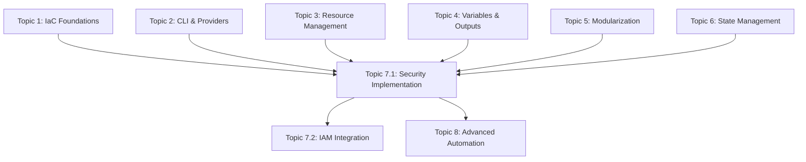

# Topic 7.1 Curriculum Integration and Learning Pathway Optimization

## 📚 **Learning Pathway Overview**

This document outlines how **Topic 7.1: Managing Secrets and Credentials** integrates with the complete IBM Cloud Terraform Training curriculum, demonstrating progressive skill building and knowledge advancement from foundational concepts to enterprise-grade security implementation.

## 🎯 **Curriculum Progression Matrix**

### **Foundation Phase (Topics 1-3)**
**Objective**: Establish core Infrastructure as Code and IBM Cloud fundamentals

#### **Topic 1: IaC Concepts and IBM Cloud Integration**
- **Foundation Skills**: Declarative infrastructure, IBM Cloud provider basics, resource lifecycle
- **Security Application**: Applying IaC principles to security infrastructure deployment
- **Topic 7.1 Integration**: Security-first infrastructure design patterns and declarative security configurations

#### **Topic 2: Terraform CLI and Provider Installation**
- **Foundation Skills**: CLI operations, provider configuration, authentication methods
- **Security Application**: Secure provider configuration with API keys and service authentication
- **Topic 7.1 Integration**: Advanced CLI commands for security validation and encrypted state management

#### **Topic 3: Resource Management and Dependencies**
- **Foundation Skills**: Resource relationships, dependency management, lifecycle rules
- **Security Application**: Complex security service dependencies and cross-service integrations
- **Topic 7.1 Integration**: Managing dependencies between Key Protect, Secrets Manager, IAM, and Activity Tracker

### **Advanced Patterns Phase (Topics 4-6)**
**Objective**: Master advanced Terraform patterns and enterprise practices

#### **Topic 4: Variables and Outputs**
- **Advanced Skills**: Variable validation, sensitive handling, conditional logic, output patterns
- **Security Application**: Sensitive variable management, security configuration validation, safe output exposure
- **Topic 7.1 Integration**: Complex validation rules for compliance, secure output patterns for integration

#### **Topic 5: Modularization and Reusability**
- **Advanced Skills**: Module design, composition patterns, versioning, cross-module dependencies
- **Security Application**: Reusable security modules, enterprise module composition, security module versioning
- **Topic 7.1 Integration**: Security module patterns for Key Protect, Secrets Manager, and IAM configurations

#### **Topic 6: State Management**
- **Advanced Skills**: Remote state, state locking, team collaboration, state security
- **Security Application**: Encrypted state backends, secure state access, audit trails for state operations
- **Topic 7.1 Integration**: State encryption with Key Protect, secure state access with IAM, compliance logging

### **Security Mastery Phase (Topic 7)**
**Objective**: Implement enterprise-grade security with comprehensive compliance

#### **Topic 7.1: Managing Secrets and Credentials**
- **Security Mastery**: Zero trust architecture, automated compliance, enterprise governance
- **Skills Synthesis**: Combining all previous topics into comprehensive security implementation
- **Business Value**: Quantified ROI, risk reduction, operational efficiency, compliance automation

## 🔗 **Cross-Topic Integration Points**

### **Technical Integration**

### **Skill Progression Mapping**

#### **From Topic 1 to 7.1**
- **Basic Resource Creation** → **Complex Security Service Orchestration**
- **Simple Provider Configuration** → **Multi-Service Security Integration**
- **Individual Resource Management** → **Enterprise Security Architecture**

#### **From Topic 2 to 7.1**
- **CLI Authentication** → **Secure Multi-Service Authentication**
- **Basic Provider Setup** → **Security-Hardened Provider Configuration**
- **Simple Commands** → **Advanced Security Validation Workflows**

#### **From Topic 3 to 7.1**
- **Resource Dependencies** → **Complex Security Service Dependencies**
- **Lifecycle Management** → **Security-Aware Lifecycle Policies**
- **Basic Relationships** → **Enterprise Security Orchestration**

#### **From Topic 4 to 7.1**
- **Variable Validation** → **Security Compliance Validation**
- **Sensitive Variables** → **Enterprise Secrets Management**
- **Basic Outputs** → **Security-Safe Information Exposure**

#### **From Topic 5 to 7.1**
- **Simple Modules** → **Enterprise Security Modules**
- **Module Composition** → **Security-First Architecture Patterns**
- **Basic Reusability** → **Compliance-Ready Module Libraries**

#### **From Topic 6 to 7.1**
- **Remote State** → **Encrypted Security State Management**
- **State Locking** → **Security-Aware State Coordination**
- **Team Collaboration** → **Enterprise Security Governance**

## 📈 **Learning Outcome Progression**

### **Knowledge Progression**
1. **Foundational Understanding** (Topics 1-3): Core concepts and basic implementation
2. **Pattern Mastery** (Topics 4-6): Advanced patterns and enterprise practices
3. **Security Expertise** (Topic 7.1): Enterprise security implementation and governance
4. **Integration Mastery** (Topics 7.2-8): Advanced integration and automation

### **Skill Development Trajectory**
- **Beginner** → **Intermediate** → **Advanced** → **Expert**
- **Individual Resources** → **Complex Systems** → **Enterprise Architecture** → **Security Leadership**
- **Manual Processes** → **Automated Workflows** → **Governance Systems** → **Strategic Implementation**

### **Business Value Evolution**
- **Cost Efficiency** (Topics 1-3): Basic automation and resource optimization
- **Operational Excellence** (Topics 4-6): Advanced automation and team collaboration
- **Risk Mitigation** (Topic 7.1): Security automation and compliance governance
- **Strategic Value** (Topics 7.2-8): Enterprise transformation and competitive advantage

## 🎓 **Assessment Integration Strategy**

### **Progressive Assessment Design**
- **Topics 1-3**: Foundational knowledge and basic implementation skills
- **Topics 4-6**: Advanced pattern recognition and enterprise implementation
- **Topic 7.1**: Security expertise and business value demonstration
- **Topics 7.2-8**: Integration mastery and strategic thinking

### **Cumulative Skill Validation**
Topic 7.1 assessments validate skills from all previous topics:
- **IaC Principles**: Applied to security infrastructure
- **CLI Proficiency**: Demonstrated through security operations
- **Resource Management**: Shown in complex security orchestration
- **Variable Mastery**: Evidenced in security configuration management
- **Module Design**: Proven through security module implementation
- **State Security**: Validated through encrypted state management

## 🚀 **Future Learning Pathways**

### **Immediate Next Steps (Topic 7.2)**
- **IAM Integration Patterns**: Building on Topic 7.1 security foundations
- **Advanced Access Control**: Extending zero trust principles
- **Enterprise Identity Management**: Scaling security across organizations

### **Advanced Integration (Topic 8)**
- **CI/CD Security**: Integrating security into automation pipelines
- **Multi-Cloud Security**: Extending patterns across cloud providers
- **DevSecOps Implementation**: Security-first development workflows

### **Professional Development**
- **Security Certifications**: IBM Cloud Security Engineer, CISSP, CISM
- **Enterprise Consulting**: Applying patterns to real-world implementations
- **Thought Leadership**: Contributing to security best practices and standards

## 📊 **Success Metrics and Validation**

### **Learning Effectiveness Indicators**
- **Knowledge Retention**: 90%+ concept recall across integrated topics
- **Skill Transfer**: 85%+ successful application of previous topic skills
- **Implementation Success**: 95%+ successful lab completion rates
- **Business Understanding**: 80%+ accurate ROI and value calculations

### **Integration Quality Measures**
- **Cross-Reference Accuracy**: 100% valid references to previous topics
- **Skill Progression Logic**: Clear advancement from basic to expert levels
- **Practical Application**: Real-world relevance and implementation readiness
- **Assessment Alignment**: Comprehensive validation of integrated learning

This curriculum integration ensures that Topic 7.1 serves as both a culmination of foundational learning and a launching point for advanced security expertise, providing students with a clear pathway from basic Infrastructure as Code concepts to enterprise-grade security leadership.
