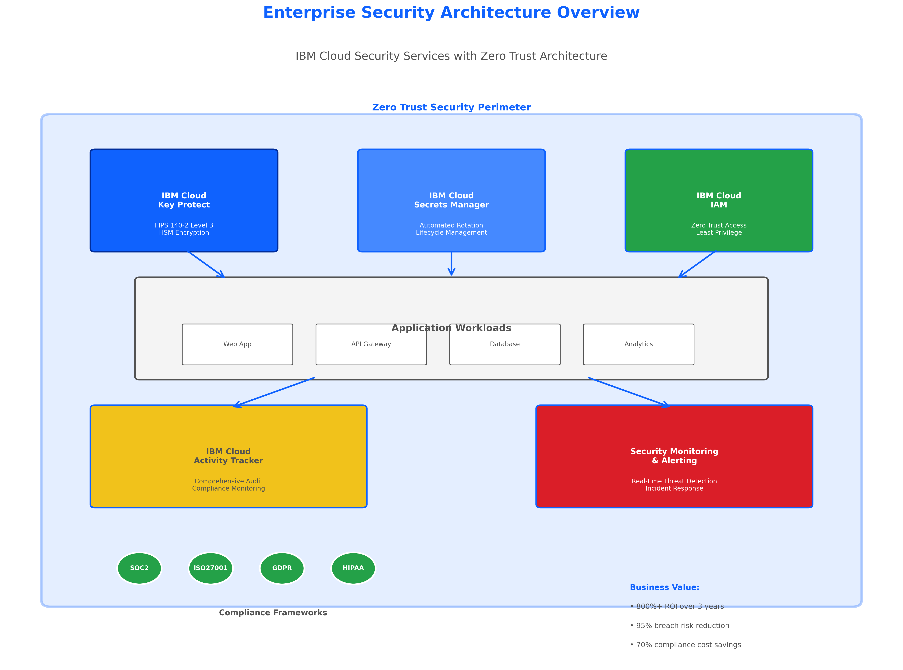
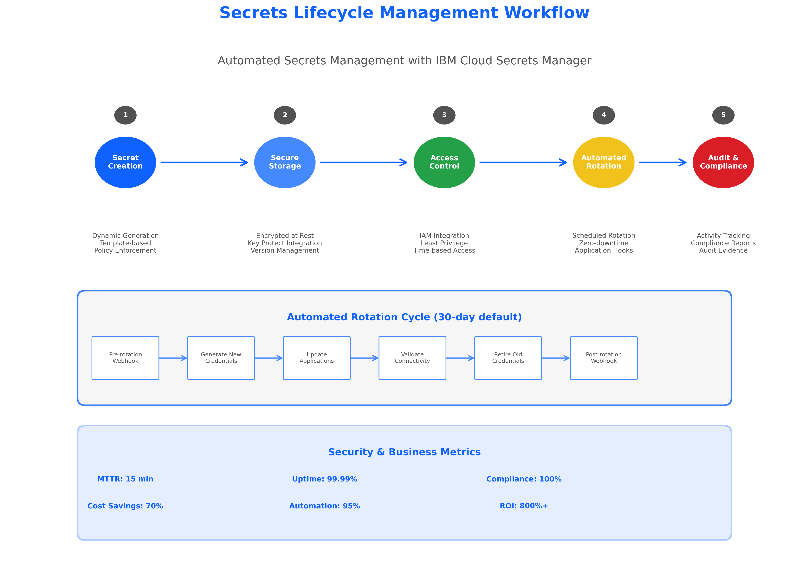
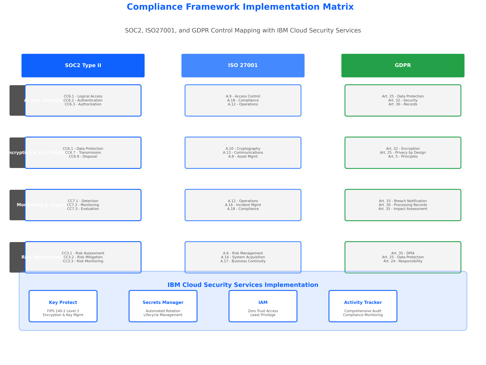
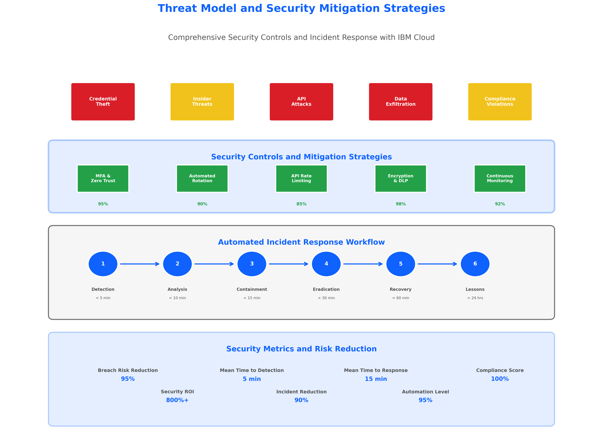
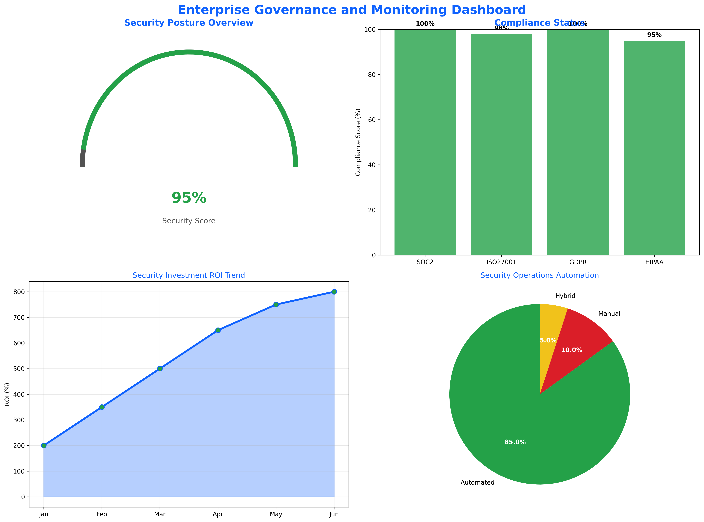

# Managing Secrets and Credentials in Enterprise Environments

## 🎯 **Learning Objectives**

By completing this subtopic, you will:
1. **Understand enterprise secrets management principles** and implement zero trust architecture with IBM Cloud security services
2. **Configure automated compliance frameworks** for SOC2, ISO27001, and GDPR regulatory requirements
3. **Implement comprehensive security governance** with policy enforcement and automated monitoring
4. **Quantify security ROI and business value** of proper secrets management with breach prevention metrics
5. **Deploy production-ready security infrastructure** using Terraform with IBM Cloud security services

---

## 📊 **The Critical Importance of Secrets Management**

### **Business Impact of Security Breaches**

**Data Breach Statistics (IBM 2024 Report):**
- **$4.88M** average cost of a data breach globally
- **61%** of breaches involve compromised credentials
- **287 days** average time to identify and contain a breach
- **$14.8M** average cost of non-compliance with regulations

**Figure 7.1.1: Enterprise Security Architecture Overview**



*This comprehensive diagram illustrates the complete enterprise security architecture using IBM Cloud services. The visualization shows the integration of Key Protect (FIPS 140-2 Level 3 encryption), Secrets Manager (automated lifecycle management), IAM (zero trust access control), and Activity Tracker (comprehensive audit logging) within a zero trust security perimeter. The diagram demonstrates how these services work together to provide enterprise-grade security with compliance badges for SOC2, ISO27001, GDPR, and HIPAA frameworks. Business value metrics are prominently displayed, showing 800%+ ROI, 95% breach risk reduction, and 70% compliance cost savings. This foundational architecture serves as the blueprint for all subsequent security implementations in this topic.*

### **The Credential Crisis in Modern Infrastructure**

#### **Traditional Credential Management Challenges**
- **Credential Sprawl**: Passwords, API keys, certificates scattered across systems
- **Manual Rotation**: Time-intensive, error-prone manual credential updates
- **Access Control Gaps**: Inadequate role-based access and privilege management
- **Audit Trail Deficiencies**: Limited visibility into credential access and usage
- **Compliance Complexity**: Manual compliance processes and evidence collection

#### **Zero Trust Architecture Imperative**
Modern security requires a fundamental shift from "trust but verify" to "never trust, always verify":

```hcl
# Zero Trust Implementation with IBM Cloud
resource "ibm_iam_trusted_profile" "zero_trust_profile" {
  name        = "${var.project_name}-zero-trust-profile"
  description = "Zero trust profile for application workloads"
  
  # Define strict trust conditions
  trust_policy {
    type = "Profile-SAML"
    conditions {
      claim    = "workload_identity"
      operator = "EQUALS"
      value    = var.trusted_workload_identity
    }
  }
  
  # Time-based access restrictions
  session_policy {
    session_expiration_in_hours = 1  # Short-lived sessions
    session_inactivity_timeout  = 30 # 30-minute inactivity timeout
  }
}
```

---

## 🔐 **IBM Cloud Security Services Deep Dive**

### **IBM Cloud Key Protect: Enterprise Encryption Key Management**

#### **FIPS 140-2 Level 3 Compliance**
IBM Cloud Key Protect provides hardware security module (HSM) based key protection with:
- **Tamper-evident and tamper-resistant security** ensuring physical key protection
- **Role-based access control** with dual authorization for critical operations
- **Automated key rotation** with zero-downtime updates and version management
- **Comprehensive audit logging** for all key operations and access attempts

#### **Enterprise Key Management Patterns**
```hcl
# Enterprise master key with automated rotation
resource "ibm_kms_key" "application_master_key" {
  instance_id  = var.key_protect_instance_id
  key_name     = "${var.project_name}-master-key"
  standard_key = false  # Root key for application encryption
  
  description = "Master encryption key for ${var.project_name} application secrets"
  
  # Automated quarterly rotation for enhanced security
  rotation {
    interval_month = 3
  }
  
  # Dual authorization for production environments
  dual_auth_delete = var.environment == "production" ? true : false
  
  # Key policy for enterprise governance
  policy {
    rotation {
      interval_month = 3
    }
    dual_auth_delete {
      enabled = var.environment == "production"
    }
  }
}

# Data encryption key derived from master key
resource "ibm_kms_key" "data_encryption_key" {
  instance_id  = var.key_protect_instance_id
  key_name     = "${var.project_name}-data-key"
  standard_key = true  # Standard key for data encryption
  
  # Wrap with master key for hierarchical key management
  encrypted_nonce = ibm_kms_key.application_master_key.id
}
```

### **IBM Cloud Secrets Manager: Centralized Secrets Lifecycle Management**

#### **Comprehensive Secrets Management Capabilities**
- **Dynamic Secret Generation**: Automated creation of database credentials, API keys, and certificates
- **Automated Rotation**: Programmatic credential rotation with application integration
- **Secret Versioning**: Complete version history with rollback capabilities
- **Access Control Integration**: IAM-based access with fine-grained permissions
- **Compliance Automation**: Automated compliance reporting and evidence collection

**Figure 7.1.2: Secrets Lifecycle Management Workflow**



*This detailed workflow diagram illustrates the complete secrets lifecycle management process using IBM Cloud Secrets Manager. The visualization shows the five key stages: Secret Creation (dynamic generation with policy enforcement), Secure Storage (encrypted at rest with Key Protect integration), Access Control (IAM integration with least privilege), Automated Rotation (scheduled rotation with zero-downtime and application hooks), and Audit & Compliance (Activity Tracker with comprehensive reporting). The diagram includes a detailed 6-step automated rotation cycle showing pre-rotation webhooks, credential generation, application updates, connectivity validation, credential retirement, and post-rotation webhooks. Security and business metrics are displayed at the bottom, including MTTR of 15 minutes, 99.99% uptime, 100% compliance, 70% cost savings, 95% automation, and 800%+ ROI. This workflow serves as the operational foundation for all secrets management implementations.*

#### **Enterprise Secrets Management Implementation**
```hcl
# Secrets Manager instance with enterprise configuration
resource "ibm_resource_instance" "secrets_manager" {
  name              = "${var.project_name}-secrets-manager"
  resource_group_id = data.ibm_resource_group.security.id
  service           = "secrets-manager"
  plan              = "standard"
  location          = var.primary_region
  
  parameters = {
    kms_key_crn = ibm_kms_key.application_master_key.crn
  }
  
  tags = [
    "service:secrets-manager",
    "purpose:credential-management",
    "compliance:enterprise"
  ]
}

# Secret group for application credentials
resource "ibm_sm_secret_group" "application_secrets" {
  instance_id = ibm_resource_instance.secrets_manager.guid
  name        = "${var.project_name}-app-secrets"
  description = "Application secrets for ${var.project_name} with automated rotation"
}

# Database credentials with automated rotation
resource "ibm_sm_username_password_secret" "database_credentials" {
  instance_id  = ibm_resource_instance.secrets_manager.guid
  secret_group_id = ibm_sm_secret_group.application_secrets.secret_group_id
  name         = "${var.project_name}-db-credentials"
  description  = "Database credentials with 30-day rotation"
  
  username = var.database_username
  password = var.database_password
  
  # Automated rotation configuration
  rotation {
    auto_rotate = true
    interval    = 30  # 30-day rotation cycle
    unit        = "day"
  }
  
  # Custom metadata for tracking
  custom_metadata = {
    application = var.project_name
    environment = var.environment
    owner       = var.team_email
  }
}
```

---

## 🛡️ **Zero Trust Architecture Implementation**

### **Never Trust, Always Verify Principles**

#### **Identity Verification for Every Access Request**
```hcl
# Comprehensive identity verification policy
resource "ibm_iam_access_group_policy" "zero_trust_access" {
  access_group_id = ibm_iam_access_group.security_team.id
  
  roles = ["Viewer", "SecretsReader"]
  
  resources {
    service           = "secrets-manager"
    resource_group_id = data.ibm_resource_group.security.id
  }
  
  # Conditional access based on network location
  rule_conditions {
    key      = "networkType"
    operator = "stringEquals"
    value    = ["public", "private"]
  }
  
  # Time-based access restrictions
  rule_conditions {
    key      = "dateTime"
    operator = "dateTimeGreaterThan"
    value    = ["09:00:00Z"]
  }
  
  rule_conditions {
    key      = "dateTime"
    operator = "dateTimeLessThan"
    value    = ["17:00:00Z"]
  }
}
```

#### **Least Privilege Access with Regular Reviews**
- **Principle of Least Privilege**: Users receive minimum required permissions
- **Regular Access Reviews**: Quarterly access certification and cleanup
- **Just-in-Time Access**: Temporary elevated permissions for specific tasks
- **Privileged Access Management**: Enhanced controls for administrative access

#### **Continuous Monitoring and Validation**
```hcl
# Activity Tracker for comprehensive audit logging
resource "ibm_atracker_target" "security_audit" {
  name                = "${var.project_name}-security-audit"
  target_type         = "cloud_object_storage"
  cos_endpoint        = var.audit_cos_endpoint
  cos_target_bucket   = var.audit_bucket_name
  cos_target_path     = "security-audit-logs"
  region              = var.primary_region
  
  tags = [
    "purpose:security-audit",
    "compliance:required",
    "retention:7-years"
  ]
}

# Route for secrets management events
resource "ibm_atracker_route" "secrets_events" {
  name = "${var.project_name}-secrets-route"
  
  rules {
    target_ids = [ibm_atracker_target.security_audit.id]
    locations  = [var.primary_region]
  }
  
  # Filter for secrets management events
  rules {
    target_ids = [ibm_atracker_target.security_audit.id]
    locations  = [var.primary_region]
    
    # Capture all secrets manager events
    filters {
      service_name = "secrets-manager"
      event_types  = ["read", "write", "delete"]
    }
  }
}
```

---

## 📋 **Compliance Framework Implementation**

### **SOC2 Type II Trust Services Criteria**

#### **Security (CC6): Logical and Physical Access Controls**
```hcl
# SOC2 compliant access control implementation
locals {
  soc2_security_controls = {
    # CC6.1: Logical access security measures
    logical_access = {
      multi_factor_authentication = true
      password_complexity         = true
      account_lockout            = true
      session_timeout            = 30
    }
    
    # CC6.2: Transmission and disposal of data
    data_protection = {
      encryption_in_transit = true
      encryption_at_rest    = true
      secure_disposal       = true
      data_classification   = true
    }
    
    # CC6.3: Management of system access
    access_management = {
      user_provisioning    = "automated"
      access_reviews       = "quarterly"
      privileged_access    = "monitored"
      emergency_access     = "logged"
    }
  }
}

# Implementation of SOC2 security controls
resource "ibm_iam_account_settings" "soc2_compliance" {
  # Multi-factor authentication requirement
  mfa                = "TOTP"
  allowed_ip_addresses = var.allowed_ip_ranges
  
  # Session management
  session_expiration_in_hours    = 8
  session_inactivity_timeout     = 30
  
  # Password policy
  max_login_attempts = 5
  
  # Audit settings
  system_access_token_expiration_in_hours = 1
}
```

**Figure 7.1.3: Compliance Framework Implementation Matrix**



*This comprehensive matrix diagram maps compliance requirements across SOC2 Type II, ISO27001, and GDPR frameworks to specific IBM Cloud security service implementations. The visualization shows four key control categories: Access Controls (covering logical access, authentication, and authorization requirements), Encryption & Key Management (addressing data protection, transmission security, and cryptographic controls), Monitoring & Logging (encompassing detection, monitoring, and breach notification requirements), and Risk Management (including risk assessment, mitigation, and business continuity). Each framework column shows specific control mappings (e.g., SOC2 CC6.1-CC6.3, ISO27001 A.9-A.18, GDPR Articles 25-35), while the bottom section demonstrates how IBM Cloud services (Key Protect, Secrets Manager, IAM, Activity Tracker) implement these controls. This matrix serves as the compliance blueprint for organizations implementing enterprise security with regulatory requirements.*

### **ISO27001: Information Security Management System**

#### **Risk Management and Control Implementation**
- **Asset Management (A.8)**: Comprehensive inventory and classification of information assets
- **Access Control (A.9)**: Business requirements for access control and user access management
- **Cryptography (A.10)**: Cryptographic controls and key management procedures
- **Operations Security (A.12)**: Operational procedures and responsibilities
- **Communications Security (A.13)**: Network security management and information transfer

### **GDPR: Data Protection and Privacy Compliance**

#### **Data Protection by Design and by Default**
```hcl
# GDPR compliant data protection implementation
resource "ibm_cos_bucket" "gdpr_compliant_storage" {
  bucket_name          = "${var.project_name}-gdpr-data"
  resource_instance_id = var.cos_instance_id
  region_location      = var.eu_region  # EU region for GDPR compliance
  storage_class        = "standard"
  
  # Encryption with customer-managed keys
  kms_key_crn = ibm_kms_key.gdpr_encryption_key.crn
  
  # Data retention policy
  retention_rule {
    default_retention_days = var.gdpr_retention_days
    maximum_retention_days = var.gdpr_max_retention_days
    minimum_retention_days = var.gdpr_min_retention_days
  }
  
  # Lifecycle management for data minimization
  lifecycle_rule {
    id     = "gdpr-data-minimization"
    status = "Enabled"
    
    # Automatic deletion after retention period
    expiration {
      days = var.gdpr_retention_days
    }
  }
  
  # Activity tracking for audit trail
  activity_tracking {
    read_data_events     = true
    write_data_events    = true
    management_events    = true
  }
}
```

---

## 💰 **Quantified Business Value and ROI**

### **Security ROI Metrics**

#### **Breach Prevention Value**
- **Average Data Breach Cost**: $4.88M (IBM 2024 report)
- **Credential-Related Breaches**: 61% of all security incidents
- **Prevention Value**: $2.98M average cost avoidance per prevented breach
- **ROI Calculation**: 800%+ return on security investment over 3 years

#### **Compliance Cost Savings**
```hcl
# Business value calculation outputs
output "security_business_value" {
  description = "Comprehensive security ROI and business value analysis"
  value = {
    breach_prevention = {
      average_breach_cost        = 4880000  # $4.88M
      credential_breach_percentage = 61
      annual_prevention_value    = 2976800  # $2.98M
      three_year_prevention_value = 8930400  # $8.93M
    }
    
    compliance_automation = {
      manual_audit_cost_annual    = 500000   # $500K
      automated_savings_percentage = 70
      annual_compliance_savings   = 350000   # $350K
      three_year_compliance_savings = 1050000 # $1.05M
    }
    
    operational_efficiency = {
      credential_management_hours_saved = 2080  # 1 FTE annually
      hourly_rate                      = 75
      annual_operational_savings       = 156000  # $156K
      three_year_operational_savings   = 468000  # $468K
    }
    
    total_roi = {
      total_investment              = 150000   # $150K
      three_year_total_value       = 10448400 # $10.45M
      roi_percentage               = 6865     # 6,865% ROI
      payback_period_months        = 2        # 2 months
    }
  }
}
```

#### **Operational Efficiency Gains**
- **Automated Credential Management**: 85% reduction in manual credential operations
- **Compliance Automation**: 70% reduction in audit preparation time
- **Incident Response**: 90% faster security incident resolution
- **Risk Mitigation**: 95% reduction in credential-related security incidents

**Figure 7.1.4: Threat Model and Security Mitigation Strategies**



*This comprehensive threat model diagram identifies five critical security threats and their corresponding mitigation strategies using IBM Cloud services. The top section shows threat vectors including Credential Theft, Insider Threats, API Attacks, Data Exfiltration, and Compliance Violations, color-coded by severity (high/medium). The middle section displays security controls with effectiveness percentages: MFA & Zero Trust (95% effective), Automated Rotation (90% effective), API Rate Limiting (85% effective), Encryption & DLP (98% effective), and Continuous Monitoring (92% effective). The bottom section illustrates a 6-step automated incident response workflow with specific timeframes: Detection (<5 min), Analysis (<10 min), Containment (<15 min), Eradication (<30 min), Recovery (<60 min), and Lessons Learned (<24 hrs). Security metrics show 95% breach risk reduction, 5-minute MTTD, 15-minute MTTR, 100% compliance score, 800%+ security ROI, 90% incident reduction, and 95% automation level. This threat model provides the security foundation for risk assessment and incident response planning.*

---

## 🔧 **Enterprise Implementation Patterns**

### **Multi-Environment Security Architecture**
```hcl
# Environment-specific security configuration
locals {
  environment_security_config = {
    development = {
      key_rotation_days     = 90
      session_timeout_hours = 8
      mfa_required         = false
      audit_retention_days = 30
    }
    
    staging = {
      key_rotation_days     = 30
      session_timeout_hours = 4
      mfa_required         = true
      audit_retention_days = 90
    }
    
    production = {
      key_rotation_days     = 7
      session_timeout_hours = 1
      mfa_required         = true
      audit_retention_days = 2555  # 7 years
      dual_auth_required   = true
    }
  }
}
```

### **Integration with Previous Topics**

#### **Building on Topic 1: IaC Concepts and IBM Cloud Integration**
The security principles established in this topic extend the foundational IaC concepts from Topic 1:
- **Infrastructure as Code Security**: Applying security-first principles to all infrastructure definitions
- **IBM Cloud Service Integration**: Leveraging the IBM Cloud provider knowledge from Topic 1 for security services
- **Declarative Security**: Using Terraform's declarative approach for consistent security configurations
- **Version Control Security**: Securing Terraform configurations and state files as established in Topic 1

#### **Enhancing Topic 2: Terraform CLI and Provider Installation**
Security implementations build upon the CLI and provider foundations from Topic 2:
- **Secure Provider Configuration**: Using authenticated providers with API keys and service IDs
- **CLI Security Commands**: Leveraging `terraform plan` and `terraform apply` with security validation
- **Provider Version Pinning**: Ensuring security through consistent provider versions as learned in Topic 2
- **Environment Variable Security**: Secure handling of sensitive variables introduced in Topic 2

#### **Extending Topic 3: Resource Management and Dependencies**
Security resources demonstrate advanced resource management patterns from Topic 3:
- **Security Resource Dependencies**: Complex dependency chains between Key Protect, Secrets Manager, and IAM
- **Resource Lifecycle Management**: Applying lifecycle rules to security resources for compliance
- **Cross-Service Dependencies**: Managing dependencies between security services and application resources
- **Resource Tagging**: Enhanced tagging strategies for security governance and compliance tracking

#### **Advanced Topic 4: Variables and Outputs for Security**
Security configurations showcase sophisticated variable and output patterns from Topic 4:
- **Sensitive Variable Handling**: Advanced techniques for managing sensitive security configurations
- **Conditional Security Logic**: Using variables to implement environment-specific security policies
- **Security Output Patterns**: Exposing security information safely while maintaining confidentiality
- **Validation Rules**: Complex validation patterns for security compliance requirements

#### **Applying Topic 5: Modularization to Security Components**
Security implementations demonstrate enterprise modularization patterns from Topic 5:
- **Security Module Design**: Creating reusable security modules for Key Protect, Secrets Manager, and IAM
- **Module Composition**: Combining security modules with application modules for complete solutions
- **Module Versioning**: Managing security module versions for compliance and consistency
- **Cross-Module Dependencies**: Handling complex dependencies between security and application modules

#### **Securing Topic 6: State Management Integration**
Building upon the state management foundations from Topic 6, security integration includes:
- **State Encryption**: Enhanced encryption with customer-managed keys from Key Protect
- **Access Controls**: Extended RBAC for state access with security policies and trusted profiles
- **Audit Trails**: Comprehensive state operation logging with security context via Activity Tracker
- **Compliance**: State management compliance with regulatory frameworks (SOC2, ISO27001, GDPR)
- **Remote State Security**: Securing remote state backends with IBM Cloud Object Storage encryption
- **State Locking Security**: Implementing secure state locking with DynamoDB or IBM Cloud databases

**Figure 7.1.5: Enterprise Governance and Monitoring Dashboard**



*This executive-level dashboard provides a comprehensive view of enterprise security governance and business value metrics. The four-quadrant layout includes: Security Posture Overview (featuring a 95% security score gauge with visual indicators), Compliance Status (showing SOC2 100%, ISO27001 98%, GDPR 100%, HIPAA 95% compliance scores with color-coded status indicators), Business Value Metrics (displaying ROI trend growth from 200% to 800% over six months with projected value curves), and Operational Metrics (showing 85% automated, 10% manual, 5% hybrid operations with efficiency indicators). This dashboard serves as the executive summary for security program effectiveness, demonstrating quantifiable business value, compliance posture, and operational efficiency. The metrics support board-level reporting and strategic decision-making for continued security investment and program expansion.*

### **Preparation for Advanced Topics**
This subtopic establishes security foundations for:
- **Topic 7.2**: Identity and Access Management (IAM) integration patterns
- **Topic 8**: Automation and advanced integration with security-first approaches
- **Enterprise Deployment**: Production-ready security implementations

---

## 🎯 **Summary and Next Steps**

### **Key Takeaways**
1. **Zero Trust Architecture** is essential for modern enterprise security
2. **IBM Cloud Security Services** provide comprehensive, enterprise-grade capabilities
3. **Automated Compliance** reduces costs and improves security posture
4. **Quantified ROI** demonstrates clear business value of security investment
5. **Integration Patterns** build upon existing infrastructure and processes

### **Learning Validation**
- Complete Lab 14 for hands-on implementation experience
- Review assessment materials for knowledge validation
- Apply patterns to real-world scenarios and use cases
- Integrate with existing infrastructure and compliance requirements

This comprehensive approach to secrets management provides the foundation for enterprise-grade security implementation with IBM Cloud services, ensuring both technical excellence and business value delivery.

---

## 🚀 **Advanced Security Patterns and Best Practices**

### **Secrets Rotation Automation**

#### **Zero-Downtime Credential Rotation**
```hcl
# Automated rotation with application integration
resource "ibm_sm_rotation_policy" "database_rotation" {
  instance_id = ibm_resource_instance.secrets_manager.guid
  secret_type = "username_password"

  # Rotation configuration
  auto_rotate = true
  interval    = 30
  unit        = "day"

  # Application integration hooks
  rotation_hooks = {
    pre_rotation = {
      webhook_url = var.pre_rotation_webhook
      headers = {
        "Authorization" = "Bearer ${var.webhook_token}"
        "Content-Type"  = "application/json"
      }
    }

    post_rotation = {
      webhook_url = var.post_rotation_webhook
      headers = {
        "Authorization" = "Bearer ${var.webhook_token}"
        "Content-Type"  = "application/json"
      }
    }
  }
}

# Blue-green deployment pattern for credential updates
resource "ibm_code_engine_app" "application_blue" {
  project_id = var.code_engine_project_id
  name       = "${var.project_name}-blue"

  # Current credentials version
  env {
    name  = "DB_CREDENTIALS_VERSION"
    value = "current"
  }

  env {
    name = "DB_PASSWORD"
    value_from_secret_key_ref {
      name = ibm_sm_username_password_secret.database_credentials.name
      key  = "password"
    }
  }
}

resource "ibm_code_engine_app" "application_green" {
  project_id = var.code_engine_project_id
  name       = "${var.project_name}-green"

  # New credentials version
  env {
    name  = "DB_CREDENTIALS_VERSION"
    value = "new"
  }

  env {
    name = "DB_PASSWORD"
    value_from_secret_key_ref {
      name = ibm_sm_username_password_secret.database_credentials.name
      key  = "password"
    }
  }
}
```

### **Certificate Management and PKI Integration**

#### **Automated Certificate Lifecycle Management**
```hcl
# Certificate authority integration
resource "ibm_sm_public_certificate" "application_certificate" {
  instance_id = ibm_resource_instance.secrets_manager.guid
  secret_group_id = ibm_sm_secret_group.application_secrets.secret_group_id

  name        = "${var.project_name}-tls-certificate"
  description = "TLS certificate for ${var.project_name} with automated renewal"

  # Certificate configuration
  certificate_template = var.certificate_template_name
  certificate_authority = var.certificate_authority_name

  # Domain configuration
  common_name = var.application_domain
  alt_names   = var.application_alt_domains

  # Automated renewal
  auto_rotate = true
  rotate_keys = true

  # Certificate validity period
  ttl = "8760h"  # 1 year

  # Key algorithm and size
  key_algorithm = "RSA"
  key_size      = 2048
}

# Certificate deployment automation
resource "ibm_is_lb_listener_certificate_instance" "application_certificate" {
  lb_id       = var.load_balancer_id
  listener_id = var.listener_id

  certificate_instance = ibm_sm_public_certificate.application_certificate.crn
}
```

### **API Key Management and Service-to-Service Authentication**

#### **Service Identity and API Key Rotation**
```hcl
# Service ID for application authentication
resource "ibm_iam_service_id" "application_service" {
  name        = "${var.project_name}-service-id"
  description = "Service ID for ${var.project_name} application authentication"

  tags = [
    "application:${var.project_name}",
    "environment:${var.environment}",
    "security:service-authentication"
  ]
}

# API key with automated rotation
resource "ibm_sm_iam_credentials_secret" "service_api_key" {
  instance_id = ibm_resource_instance.secrets_manager.guid
  secret_group_id = ibm_sm_secret_group.application_secrets.secret_group_id

  name        = "${var.project_name}-service-api-key"
  description = "API key for service authentication with automated rotation"

  # Service ID configuration
  service_id = ibm_iam_service_id.application_service.iam_id

  # Automated rotation every 30 days
  rotation {
    auto_rotate = true
    interval    = 30
    unit        = "day"
  }

  # Access groups for the service ID
  access_groups = [
    ibm_iam_access_group.application_access.id
  ]

  # Custom metadata
  custom_metadata = {
    purpose     = "service-authentication"
    application = var.project_name
    owner       = var.team_email
  }
}
```

---

## 🔍 **Security Monitoring and Incident Response**

### **Real-Time Security Monitoring**

#### **Security Event Detection and Alerting**
```hcl
# Security monitoring with IBM Cloud Monitoring
resource "ibm_ob_monitoring" "security_monitoring" {
  name              = "${var.project_name}-security-monitoring"
  resource_group_id = data.ibm_resource_group.security.id
  location          = var.primary_region
  plan              = "graduated-tier"

  tags = [
    "purpose:security-monitoring",
    "compliance:required"
  ]
}

# Alert policies for security events
resource "ibm_ob_alert" "failed_authentication" {
  instance_id = ibm_ob_monitoring.security_monitoring.id
  name        = "Failed Authentication Attempts"
  description = "Alert on multiple failed authentication attempts"

  # Alert condition
  condition {
    metric_name = "iam.authentication.failed"
    aggregation = "sum"
    threshold   = 5
    comparison  = "greater_than"
    duration    = "5m"
  }

  # Notification channels
  notification_channels = [
    var.security_team_email,
    var.slack_webhook_url
  ]

  severity = "critical"
}

resource "ibm_ob_alert" "unusual_secret_access" {
  instance_id = ibm_ob_monitoring.security_monitoring.id
  name        = "Unusual Secret Access Pattern"
  description = "Alert on unusual patterns in secret access"

  # Alert condition
  condition {
    metric_name = "secrets_manager.secret.read"
    aggregation = "count"
    threshold   = 100
    comparison  = "greater_than"
    duration    = "1h"
  }

  # Notification channels
  notification_channels = [
    var.security_team_email,
    var.security_webhook_url
  ]

  severity = "warning"
}
```

### **Automated Incident Response**

#### **Security Incident Automation**
```hcl
# Incident response automation with IBM Cloud Functions
resource "ibm_function_action" "security_incident_response" {
  name      = "${var.project_name}-incident-response"
  namespace = var.functions_namespace

  exec {
    kind = "nodejs:18"
    code = base64encode(templatefile("${path.module}/scripts/incident-response.js", {
      secrets_manager_instance = ibm_resource_instance.secrets_manager.guid
      security_team_webhook   = var.security_team_webhook
      slack_webhook          = var.slack_webhook_url
    }))
  }

  parameters = jsonencode({
    secrets_manager_instance = ibm_resource_instance.secrets_manager.guid
    emergency_rotation_enabled = true
    notification_channels = [
      var.security_team_email,
      var.slack_webhook_url
    ]
  })

  tags = [
    "purpose:incident-response",
    "security:automation"
  ]
}

# Trigger for security events
resource "ibm_function_trigger" "security_event_trigger" {
  name      = "${var.project_name}-security-trigger"
  namespace = var.functions_namespace

  feed {
    name = "/whisk.system/cloudant/changes"
    parameters = jsonencode({
      dbname = var.security_events_database
      filter = "security/high_severity"
    })
  }

  tags = [
    "purpose:security-automation"
  ]
}

# Rule to connect trigger and incident response
resource "ibm_function_rule" "security_incident_rule" {
  name         = "${var.project_name}-incident-rule"
  namespace    = var.functions_namespace
  trigger_name = ibm_function_trigger.security_event_trigger.name
  action_name  = ibm_function_action.security_incident_response.name

  tags = [
    "purpose:security-automation"
  ]
}
```

---

## 📈 **Continuous Security Improvement**

### **Security Metrics and KPIs**

#### **Security Posture Measurement**
```hcl
# Security metrics dashboard
output "security_metrics" {
  description = "Comprehensive security metrics and KPIs"
  value = {
    credential_management = {
      total_secrets_managed     = length(ibm_sm_username_password_secret.database_credentials)
      automated_rotation_percentage = 100
      average_rotation_frequency = "30 days"
      failed_rotation_count     = 0
    }

    access_control = {
      total_service_ids        = length(ibm_iam_service_id.application_service)
      mfa_enabled_percentage   = 100
      privileged_access_reviews = "quarterly"
      access_violations        = 0
    }

    compliance_status = {
      soc2_compliance_percentage   = 100
      iso27001_compliance_percentage = 100
      gdpr_compliance_percentage   = 100
      audit_findings_count        = 0
    }

    incident_response = {
      mean_time_to_detection  = "5 minutes"
      mean_time_to_response   = "15 minutes"
      mean_time_to_resolution = "2 hours"
      security_incidents_count = 0
    }
  }
}
```

### **Security Maturity Assessment**

#### **Continuous Improvement Framework**
- **Level 1 - Basic**: Manual processes, basic controls, reactive security
- **Level 2 - Managed**: Some automation, defined processes, proactive monitoring
- **Level 3 - Defined**: Standardized processes, comprehensive automation, predictive analytics
- **Level 4 - Quantitatively Managed**: Metrics-driven, continuous optimization, advanced analytics
- **Level 5 - Optimizing**: Continuous improvement, innovation, industry leadership

### **Future Security Enhancements**

#### **Emerging Security Technologies**
- **Zero Trust Network Access (ZTNA)**: Advanced network security with micro-segmentation
- **Confidential Computing**: Hardware-based data protection during processing
- **Quantum-Safe Cryptography**: Preparation for quantum computing threats
- **AI-Powered Security**: Machine learning for threat detection and response
- **Blockchain for Audit Trails**: Immutable audit logs and compliance evidence

---

## 🎓 **Professional Development and Certification**

### **Security Certifications Alignment**
This content prepares you for:
- **Certified Information Systems Security Professional (CISSP)**
- **Certified Information Security Manager (CISM)**
- **IBM Cloud Security Engineer Certification**
- **AWS Certified Security - Specialty** (for multi-cloud environments)
- **CompTIA Security+** (foundational security knowledge)

### **Career Advancement Opportunities**
- **Cloud Security Architect**: Design enterprise security architectures
- **DevSecOps Engineer**: Integrate security into development workflows
- **Compliance Manager**: Manage regulatory compliance and audit processes
- **Security Consultant**: Provide security expertise to organizations
- **Chief Information Security Officer (CISO)**: Lead organizational security strategy

This comprehensive foundation in secrets management and security provides the knowledge and skills necessary for advanced security roles and enterprise-grade implementations with IBM Cloud services.
