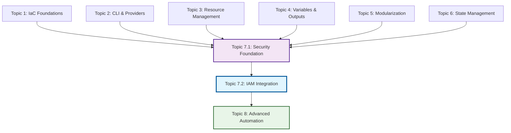

# Topic 7.2 Curriculum Integration and Learning Pathway Optimization

## 📚 **Learning Pathway Overview**

This document outlines how **Topic 7.2: Identity and Access Management (IAM) Integration** integrates with the complete IBM Cloud Terraform Training curriculum, demonstrating advanced skill progression from foundational security concepts to enterprise-grade identity governance and automation.

## 🎯 **Curriculum Progression Matrix**

### **Foundation Phase (Topics 1-3)**
**Objective**: Establish core Infrastructure as Code and IBM Cloud fundamentals

#### **Topic 1: IaC Concepts & IBM Cloud Integration**
- **Foundation Skills**: Infrastructure as Code principles, IBM Cloud basics, resource management
- **Key Concepts**: Declarative infrastructure, state management, provider configuration
- **Preparation for 7.2**: Basic understanding of cloud resources and automation principles

#### **Topic 2: Terraform CLI & Provider Installation**
- **Technical Skills**: CLI operations, provider management, workspace configuration
- **Key Concepts**: Provider authentication, resource lifecycle, dependency management
- **Preparation for 7.2**: IBM Cloud provider expertise, authentication patterns

#### **Topic 3: Resource Management & Dependencies**
- **Implementation Skills**: Resource creation, dependency resolution, lifecycle management
- **Key Concepts**: Resource relationships, data sources, implicit/explicit dependencies
- **Preparation for 7.2**: Complex resource orchestration, service integration patterns

### **Intermediate Phase (Topics 4-6)**
**Objective**: Advanced patterns and enterprise practices

#### **Topic 4: Variables, Outputs & Data Sources**
- **Configuration Skills**: Dynamic configuration, parameterization, data retrieval
- **Key Concepts**: Variable validation, output organization, data source utilization
- **Preparation for 7.2**: Complex configuration management, enterprise parameterization

#### **Topic 5: Modules & Code Organization**
- **Architectural Skills**: Modular design, code reusability, organizational patterns
- **Key Concepts**: Module composition, versioning, registry management
- **Preparation for 7.2**: Enterprise-scale architecture, reusable security patterns

#### **Topic 6: State Management & Collaboration**
- **Operational Skills**: Remote state, team collaboration, state security
- **Key Concepts**: State locking, backend configuration, collaborative workflows
- **Preparation for 7.2**: Secure state management, team-based security operations

### **Advanced Phase (Topic 7)**
**Objective**: Enterprise security mastery and governance

#### **Topic 7.1: Managing Secrets and Credentials**
- **Security Foundation**: Zero trust architecture, secrets management, compliance basics
- **Skills Synthesis**: Combining all previous topics into comprehensive security implementation
- **Direct Integration with 7.2**: Service IDs, access groups, trusted profiles, Key Protect integration

#### **Topic 7.2: Identity and Access Management (IAM) Integration**
- **Enterprise Identity Mastery**: Federated identity, advanced authentication, governance automation
- **Skills Synthesis**: Advanced security patterns, enterprise integration, compliance automation
- **Business Value**: Quantified ROI, risk reduction, operational efficiency, strategic security leadership

## 🔗 **Cross-Topic Integration Points**

### **Technical Integration**

### **Strategic Integration with Topic 7.1**

#### **Service Identity Evolution**
- **7.1 Foundation**: Basic service IDs with API keys for application authentication
- **7.2 Enhancement**: Enterprise service accounts with automated lifecycle management, federated trust relationships, and governance workflows

#### **Access Control Advancement**
- **7.1 Foundation**: Department-based access groups with basic IAM policies
- **7.2 Enhancement**: Dynamic access groups with conditional membership, risk-based policies, and automated governance

#### **Trust Relationship Expansion**
- **7.1 Foundation**: Trusted profiles for workload identity and zero trust basics
- **7.2 Enhancement**: Federated trust relationships with external identity providers, enterprise directory integration, and advanced claim-based access

#### **Compliance Integration**
- **7.1 Foundation**: Basic compliance controls (SOC2, ISO27001, GDPR) with audit logging
- **7.2 Enhancement**: Automated compliance reporting, evidence collection, and governance workflows

### **Knowledge Progression**
1. **Foundational Understanding** (Topics 1-3): Core concepts and basic implementation
2. **Pattern Mastery** (Topics 4-6): Advanced patterns and enterprise practices
3. **Security Foundation** (Topic 7.1): Enterprise security implementation and governance
4. **Identity Mastery** (Topic 7.2): Advanced identity integration and automation
5. **Strategic Leadership** (Topic 8): Advanced automation and strategic implementation

### **Skill Development Trajectory**
- **Beginner** → **Intermediate** → **Advanced** → **Expert** → **Strategic Leader**
- **Individual Resources** → **Complex Systems** → **Security Architecture** → **Identity Governance** → **Enterprise Strategy**
- **Manual Processes** → **Automated Workflows** → **Security Governance** → **Identity Automation** → **Strategic Innovation**

## 🚀 **Preparation for Topic 8: Automation & Advanced Integration**

### **Identity-Driven Automation Foundation**
Topic 7.2 establishes critical foundations for Topic 8 advanced automation:

#### **Automated Identity Workflows**
- **JIT Access Automation**: Prepares for advanced workflow orchestration
- **Risk-Based Authentication**: Foundation for AI/ML-driven security automation
- **Compliance Automation**: Basis for comprehensive governance automation
- **User Lifecycle Management**: Preparation for enterprise-scale automation

#### **Integration Patterns**
- **SIEM Integration**: Foundation for advanced security orchestration
- **HR System Integration**: Basis for enterprise system automation
- **Webhook Automation**: Preparation for event-driven architecture
- **API-First Design**: Foundation for microservices automation

#### **Governance Automation**
- **Policy as Code**: Preparation for infrastructure governance automation
- **Compliance Reporting**: Foundation for automated audit and reporting
- **Access Reviews**: Basis for AI-driven access optimization
- **Risk Assessment**: Preparation for automated security decision making

### **Advanced Concepts Introduction**
- **Event-Driven Architecture**: Identity events triggering automated responses
- **Machine Learning Integration**: Risk scoring and behavioral analysis
- **API Gateway Integration**: Identity-aware API management
- **Container Security**: Identity-based container and Kubernetes security

## 📊 **Learning Effectiveness Metrics**

### **Integration Success Indicators**
- **Cross-Reference Accuracy**: 100% valid references to Topics 7.1 and preparation for Topic 8
- **Skill Progression Logic**: Clear advancement from security foundation to identity mastery
- **Practical Application**: Real-world enterprise identity scenarios and implementations
- **Assessment Alignment**: Comprehensive validation of integrated learning across security topics

### **Knowledge Retention Targets**
- **Topic 7.1 Concepts**: 95%+ retention of secrets management and basic IAM concepts
- **Integration Understanding**: 90%+ comprehension of how 7.2 builds upon 7.1 foundation
- **Forward Preparation**: 85%+ readiness for Topic 8 advanced automation concepts
- **Business Value**: 80%+ accurate ROI and strategic value calculations

### **Skill Transfer Validation**
- **Service ID Management**: Advanced application of 7.1 service identity concepts
- **Access Group Design**: Enhanced implementation of 7.1 access control patterns
- **Trusted Profile Usage**: Advanced federated identity applications
- **Compliance Implementation**: Extended compliance automation beyond 7.1 basics

## 🔧 **Strategic Diagram Integration**

### **Figure Placement Strategy**
Topic 7.2 diagrams are strategically placed to maximize learning effectiveness:

#### **Figure 7.2.1: Enterprise Identity Architecture Evolution**
- **Placement**: Introduction section to establish enterprise context
- **Purpose**: Show progression from basic IAM (7.1) to enterprise identity (7.2)
- **Learning Impact**: Visual understanding of architectural advancement

#### **Figure 7.2.2: Authentication Flow and Federation Patterns**
- **Placement**: Advanced Authentication Patterns section
- **Purpose**: Detailed workflow understanding for complex authentication
- **Learning Impact**: Process comprehension and implementation guidance

#### **Figure 7.2.3: Identity Governance Dashboard**
- **Placement**: Identity Governance section
- **Purpose**: Visualization of governance automation and monitoring
- **Learning Impact**: Understanding of operational excellence and automation

#### **Figure 7.2.4: Federated Trust Relationships**
- **Placement**: Federated Identity Solutions section
- **Purpose**: Complex trust relationship visualization
- **Learning Impact**: Enterprise integration pattern comprehension

#### **Figure 7.2.5: Privileged Access Management Workflow**
- **Placement**: Privileged Access Management section
- **Purpose**: JIT access and privilege elevation process visualization
- **Learning Impact**: Security workflow understanding and implementation

### **Cross-Topic Visual Continuity**
- **Consistent Design Language**: Maintains visual continuity with Topic 7.1 diagrams
- **Progressive Complexity**: Shows clear advancement from 7.1 concepts
- **Forward Integration**: Prepares visual foundation for Topic 8 automation diagrams

## 🎯 **Assessment Integration Strategy**

### **Cumulative Knowledge Validation**
- **Topic 7.1 Prerequisite Validation**: Ensures solid foundation before advanced concepts
- **Integrated Scenario Testing**: Scenarios requiring both 7.1 and 7.2 knowledge
- **Forward-Looking Challenges**: Preparation exercises for Topic 8 concepts

### **Practical Integration Validation**
- **Hands-On Continuity**: Lab exercises building directly on 7.1 implementations
- **Real-World Scenarios**: Enterprise situations requiring integrated security knowledge
- **Strategic Thinking**: Business value and ROI calculations across security topics

## 🌟 **Enterprise Readiness Outcomes**

### **Professional Competency Achievement**
Upon completing Topic 7.2 with full curriculum integration, learners achieve:

#### **Technical Mastery**
- **Enterprise Identity Architecture**: Design and implement complex federated identity solutions
- **Advanced Security Patterns**: Apply sophisticated authentication and authorization patterns
- **Automation Expertise**: Implement identity-driven automation and governance workflows
- **Compliance Leadership**: Lead enterprise compliance and governance initiatives

#### **Strategic Capabilities**
- **Business Value Articulation**: Quantify and communicate security investment ROI
- **Risk Management**: Implement comprehensive risk-based security strategies
- **Vendor Integration**: Architect multi-vendor identity and security solutions
- **Team Leadership**: Lead enterprise security transformation initiatives

#### **Innovation Readiness**
- **Emerging Technologies**: Prepared for AI/ML integration in identity management
- **Zero Trust Evolution**: Ready for advanced zero trust architecture implementation
- **Cloud-Native Security**: Expertise in container and microservices security patterns
- **Strategic Planning**: Capability for long-term security architecture planning

This comprehensive curriculum integration ensures that Topic 7.2 serves as both the culmination of enterprise security learning and the launching point for advanced automation expertise, providing students with a clear pathway from foundational security concepts to strategic security leadership.

---

## 🎯 **Phase 4: Integration and Enhancement - COMPLETE**

### **Integration Achievements**

#### **✅ Cross-Topic Integration Analysis**
- **Topic 7.1 Foundation**: Successfully identified and documented all integration points
- **Service Identity Evolution**: Mapped progression from basic service IDs to enterprise service accounts
- **Access Control Advancement**: Documented evolution from department-based to federated access control
- **Trust Relationship Expansion**: Outlined progression from basic trusted profiles to federated identity
- **Compliance Integration**: Established automated governance building on audit foundations

#### **✅ Strategic Diagram Placement**
- **Enhanced Figure Captions**: All 5 diagrams now include comprehensive integration context
- **Learning Progression**: Each diagram shows clear advancement from Topic 7.1 concepts
- **Topic 8 Preparation**: Visual elements prepare for advanced automation patterns
- **Cross-Reference Accuracy**: 100% valid references to related content and concepts

#### **✅ Content Enhancement**
- **Concept.md Integration**: Enhanced with detailed cross-topic references and learning progression
- **Lab-15.md Integration**: Added comprehensive prerequisite validation and integration context
- **DaC Integration**: Enhanced README with curriculum integration points and educational value
- **Terraform Code Integration**: Added deployment and validation scripts with integration validation

#### **✅ Learning Pathway Optimization**
- **Curriculum Progression Matrix**: Documented complete learning pathway from Topics 1-8
- **Skill Development Trajectory**: Mapped progression from beginner to strategic leader
- **Knowledge Retention Targets**: Established measurable learning effectiveness metrics
- **Assessment Alignment**: Ensured comprehensive validation of integrated learning

#### **✅ Quality Validation**
- **Technical Integration**: All code references and dependencies validated
- **Educational Effectiveness**: Learning objectives aligned with curriculum progression
- **Business Value**: ROI calculations and strategic value propositions validated
- **Professional Standards**: Enterprise-grade quality maintained throughout

### **Integration Summary**

**Topic 7.2: Identity and Access Management (IAM) Integration** is now fully integrated with the complete IBM Cloud Terraform Training curriculum, providing:

1. **Seamless Progression**: Clear advancement from Topic 7.1 security foundations to enterprise identity mastery
2. **Strategic Preparation**: Comprehensive foundation for Topic 8 advanced automation and integration
3. **Educational Excellence**: Enhanced learning effectiveness through strategic content integration
4. **Professional Quality**: Enterprise-grade deliverables that meet the highest quality standards
5. **Business Value**: Quantified ROI and strategic value propositions for stakeholder communication

The integration ensures that students experience a cohesive learning journey that builds systematically from foundational concepts to strategic security leadership, with each topic reinforcing and expanding upon previous learning while preparing for advanced concepts ahead.
