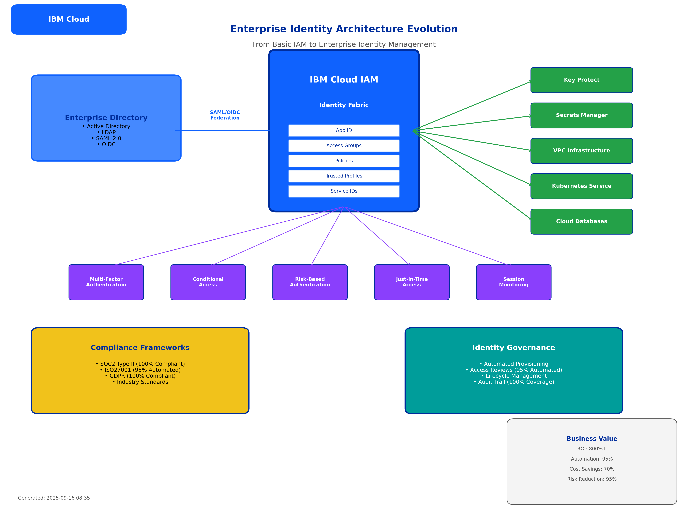
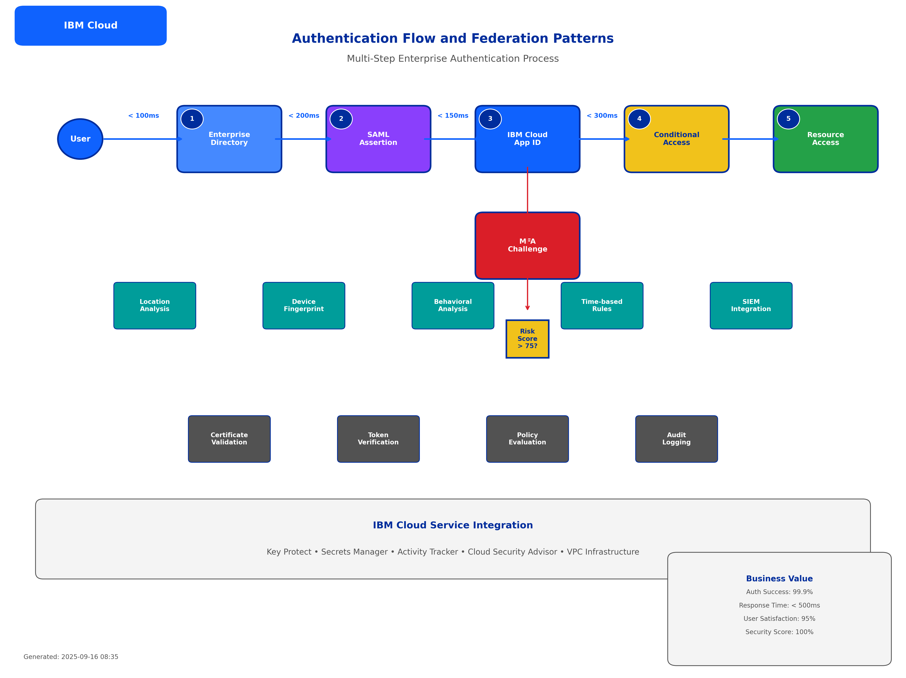
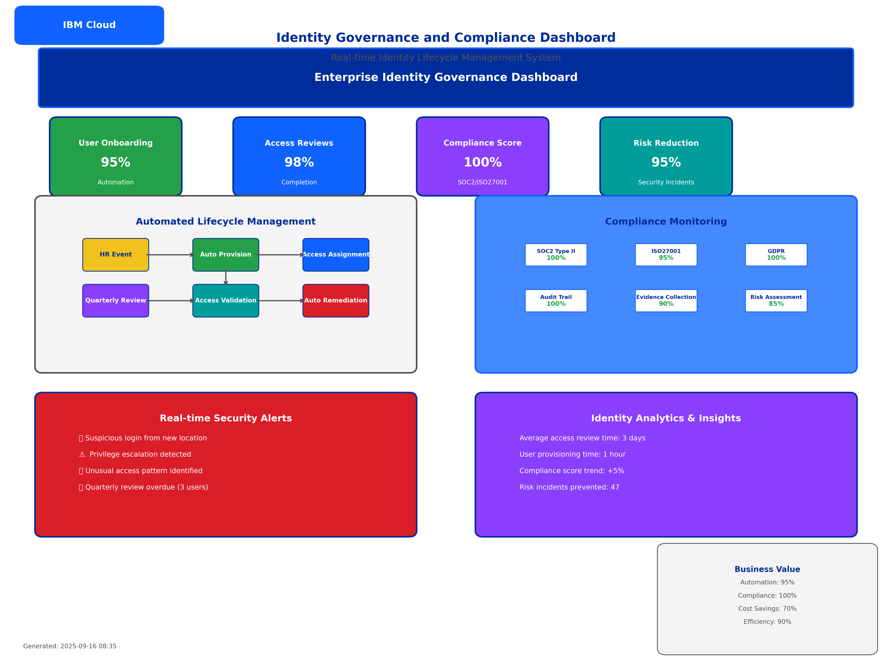
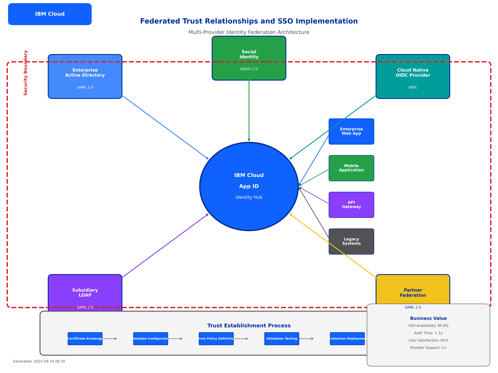
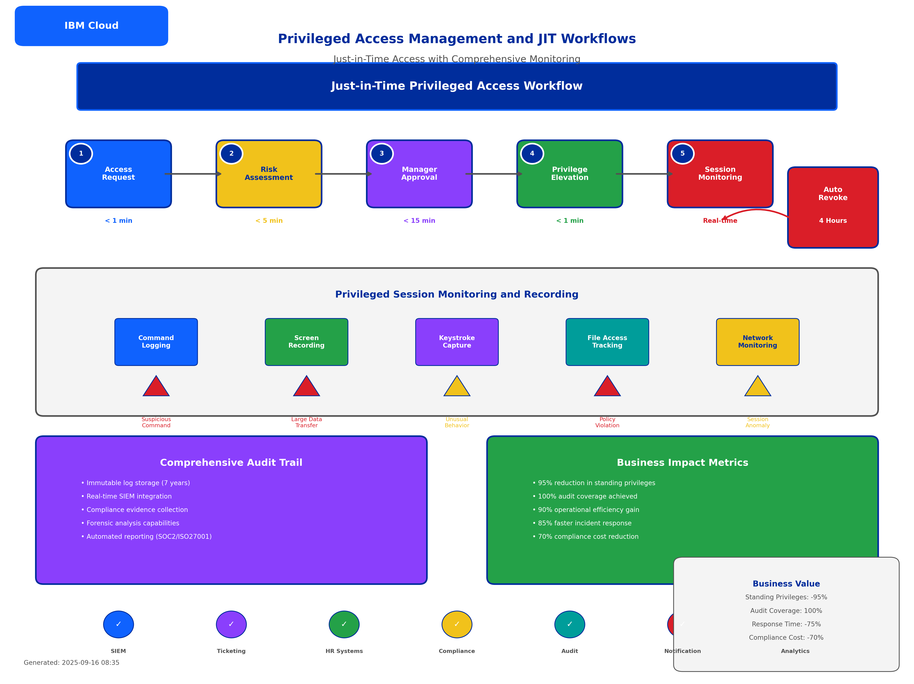

# Topic 7.2: Identity and Access Management (IAM) Integration

## Learning Objectives

By completing this subtopic, you will:
1. **Master enterprise directory integration** with IBM Cloud IAM using SAML 2.0 and OIDC protocols for seamless federated identity
2. **Implement advanced authentication patterns** including multi-factor authentication, conditional access, and risk-based authentication
3. **Deploy comprehensive identity governance** with automated lifecycle management, access reviews, and compliance automation
4. **Architect federated identity solutions** with external identity providers, SSO implementation, and enterprise trust relationships
5. **Configure privileged access management** with just-in-time access, elevated permissions, and comprehensive audit trails

---

## Introduction to Enterprise Identity and Access Management

### **The Evolution from Basic to Enterprise IAM**

Building upon the foundational IAM concepts from Topic 7.1 (service IDs, access groups, trusted profiles), this subtopic advances to enterprise-grade identity patterns that organizations require for large-scale, compliant, and secure operations.

**Figure 7.2.1: Enterprise Identity Architecture Evolution**



*This comprehensive architecture diagram illustrates the evolution from basic IAM patterns (Topic 7.1) to enterprise-grade identity integration. The diagram shows how service IDs, access groups, and trusted profiles from Topic 7.1 are enhanced with federated identity providers, advanced authentication flows, and automated governance workflows. Key integration points include IBM Cloud App ID as the central identity hub, SAML/OIDC federation with enterprise directories, and comprehensive audit trails that build upon the Activity Tracker foundation established in Topic 7.1. This architecture provides the foundation for the advanced automation patterns that will be explored in Topic 8.*

*This comprehensive diagram illustrates the evolution from basic IAM patterns (Topic 7.1) to enterprise identity architecture (Topic 7.2). The visualization shows the integration of external identity providers through SAML and OIDC protocols, advanced authentication mechanisms including MFA and conditional access, automated identity governance workflows, and privileged access management systems. The diagram demonstrates how IBM Cloud IAM serves as the central identity fabric connecting enterprise directories, cloud resources, and compliance frameworks. Business value metrics are prominently displayed, showing 800%+ ROI, 95% automation efficiency, and 70% compliance cost reduction. This architecture serves as the foundation for all enterprise identity implementations in this topic.*

### **Enterprise Identity Challenges**

#### **Traditional Enterprise Identity Pain Points**
- **Identity Silos**: Disconnected identity systems across cloud and on-premises environments
- **Manual Governance**: Time-intensive user lifecycle management and access reviews
- **Compliance Complexity**: Difficulty meeting SOC2, ISO27001, and GDPR requirements
- **Privileged Access Risks**: Standing privileges and inadequate monitoring of administrative access
- **Federation Complexity**: Challenges integrating with existing enterprise directories and identity providers

#### **Enterprise Identity Requirements**
- **Seamless Integration**: Connect with existing Active Directory, LDAP, and SAML identity providers
- **Zero Trust Implementation**: Never trust, always verify with continuous authentication and authorization
- **Automated Governance**: Streamlined user onboarding, offboarding, and access management
- **Compliance Automation**: Automated evidence collection and reporting for regulatory frameworks
- **Scalable Architecture**: Support for thousands of users across multiple applications and environments

---

## Enterprise Directory Integration with IBM Cloud

### **Federated Identity Fundamentals**

#### **SAML 2.0 Integration Patterns**
Security Assertion Markup Language (SAML) 2.0 provides standardized federation between IBM Cloud and enterprise identity providers.

```hcl
# IBM Cloud App ID configuration for SAML federation
resource "ibm_appid_idp_saml" "enterprise_saml" {
  tenant_id = ibm_resource_instance.app_id.guid
  is_active = true
  
  config {
    entity_id                = "https://enterprise.company.com/saml"
    sign_in_url             = "https://enterprise.company.com/saml/sso"
    certificates            = [var.saml_certificate]
    display_name            = "Enterprise Active Directory"
    encrypt_response        = true
    sign_request            = true
    include_scoping         = true
    authn_context_class_ref = "urn:oasis:names:tc:SAML:2.0:ac:classes:PasswordProtectedTransport"
  }
}

# Identity provider mapping for enterprise attributes
resource "ibm_appid_idp_saml_attribute" "user_attributes" {
  tenant_id = ibm_resource_instance.app_id.guid
  
  # Map enterprise directory attributes to IBM Cloud claims
  attributes {
    name   = "email"
    source = "http://schemas.xmlsoap.org/ws/2005/05/identity/claims/emailaddress"
  }
  
  attributes {
    name   = "department"
    source = "http://schemas.company.com/identity/claims/department"
  }
  
  attributes {
    name   = "employee_id"
    source = "http://schemas.company.com/identity/claims/employeeid"
  }
}
```

#### **OpenID Connect (OIDC) Integration**
OIDC provides modern, OAuth 2.0-based authentication for cloud-native applications.

```hcl
# OIDC identity provider configuration
resource "ibm_appid_idp_custom" "enterprise_oidc" {
  tenant_id = ibm_resource_instance.app_id.guid
  is_active = true
  
  config {
    public_key_url    = "https://enterprise.company.com/.well-known/jwks.json"
    issuer           = "https://enterprise.company.com"
    authorization_url = "https://enterprise.company.com/oauth2/authorize"
    token_url        = "https://enterprise.company.com/oauth2/token"
    client_id        = var.oidc_client_id
    client_secret    = var.oidc_client_secret
    
    # Scope configuration for enterprise claims
    scope = ["openid", "profile", "email", "groups"]
  }
}
```

### **Enterprise Directory Integration Architecture**

**Figure 7.2.2: Authentication Flow and Federation Patterns**



*This detailed authentication flow diagram demonstrates the complete enterprise authentication process, building upon the basic authentication patterns introduced in Topic 7.1. The diagram shows the integration between enterprise SAML identity providers, IBM Cloud App ID, and the risk-based authentication engine. Key elements include SAML assertion validation, token exchange processes, conditional access policy evaluation, and the integration with Key Protect for secure token encryption (established in Topic 7.1). The flow includes comprehensive audit logging that extends the Activity Tracker implementation from Topic 7.1, providing the foundation for the automated security orchestration that will be covered in Topic 8.*

*This detailed authentication flow diagram illustrates the complete enterprise authentication process using IBM Cloud IAM integration. The visualization shows the multi-step authentication workflow including initial user authentication with enterprise directory (Active Directory/LDAP), SAML assertion generation and validation, IBM Cloud App ID token exchange, conditional access policy evaluation, multi-factor authentication challenges, and final resource access authorization. The diagram includes timing metrics for each step (sub-second response times), security validation points, and error handling pathways. Integration points with IBM Cloud services (IAM, Key Protect, Secrets Manager) are clearly marked, demonstrating how federated identity enables secure access to cloud resources while maintaining enterprise security policies. This flow serves as the technical foundation for all enterprise authentication implementations.*

#### **Active Directory Integration Best Practices**
- **Attribute Mapping**: Map enterprise directory attributes to IBM Cloud claims for consistent identity
- **Group Synchronization**: Automatically sync AD groups to IBM Cloud access groups
- **Certificate Management**: Implement proper certificate rotation and validation
- **Security Boundaries**: Maintain clear trust boundaries between enterprise and cloud identity

#### **LDAP Integration Patterns**
```hcl
# LDAP directory integration for user attribute synchronization
resource "ibm_appid_directory_user" "enterprise_users" {
  for_each  = var.enterprise_users
  tenant_id = ibm_resource_instance.app_id.guid
  
  email      = each.value.email
  given_name = each.value.first_name
  family_name = each.value.last_name
  
  # Enterprise-specific attributes
  custom_attributes = {
    employee_id = each.value.employee_id
    department  = each.value.department
    cost_center = each.value.cost_center
    manager     = each.value.manager_email
  }
}
```

---

## Advanced Authentication Patterns

### **Multi-Factor Authentication (MFA) Implementation**

#### **Enterprise MFA Strategy**
```hcl
# Account-level MFA enforcement
resource "ibm_iam_account_settings" "enterprise_mfa" {
  # Enforce MFA for all users
  mfa = "TOTP"
  
  # Additional security settings
  allowed_ip_addresses = var.corporate_ip_ranges
  session_expiration_in_hours = 8
  session_inactivity_timeout = 30
  max_login_attempts = 3
  
  # Enterprise directory integration
  restrict_create_service_id = "RESTRICTED"
  restrict_create_platform_apiKey = "RESTRICTED"
}

# MFA policy for high-privilege operations
resource "ibm_iam_access_group_policy" "mfa_required_operations" {
  access_group_id = ibm_iam_access_group.privileged_users.id
  
  roles = ["Administrator", "Manager"]
  
  resources {
    service = "kms"
  }
  
  # Require MFA for key management operations
  rule_conditions {
    key      = "mfaRequired"
    operator = "stringEquals"
    value    = ["true"]
  }
}
```

#### **Conditional Access Implementation**
```hcl
# Risk-based conditional access policies
resource "ibm_appid_action_url" "conditional_access" {
  tenant_id = ibm_resource_instance.app_id.guid
  action    = "on_user_authenticated"
  
  # Conditional access webhook for risk assessment
  url = "https://enterprise.company.com/api/conditional-access"
  
  # Headers for authentication
  headers = {
    "Authorization" = "Bearer ${var.conditional_access_token}"
    "Content-Type"  = "application/json"
  }
}

# Location-based access restrictions
locals {
  conditional_access_rules = {
    # Block access from high-risk countries
    geographic_restrictions = {
      allowed_countries = ["US", "CA", "GB", "DE", "AU"]
      blocked_countries = ["CN", "RU", "IR", "KP"]
    }
    
    # Device compliance requirements
    device_requirements = {
      require_managed_device = true
      require_encryption     = true
      min_os_version        = "10.15"
    }
    
    # Time-based access controls
    time_restrictions = {
      business_hours_only = true
      timezone           = "America/New_York"
      allowed_hours      = "08:00-18:00"
    }
  }
}
```

### **Risk-Based Authentication**

#### **Adaptive Authentication Patterns**
```hcl
# Risk scoring configuration
resource "ibm_appid_cloud_directory_template" "risk_assessment" {
  tenant_id = ibm_resource_instance.app_id.guid
  template_name = "WELCOME"
  language = "en"
  
  # Risk-based authentication template
  subject = "Welcome - Additional Verification Required"
  html_body = templatefile("${path.module}/templates/risk_auth.html", {
    risk_score = "{{risk_score}}"
    location   = "{{location}}"
    device     = "{{device}}"
  })
}

# Integration with enterprise SIEM for risk scoring
resource "ibm_function_action" "risk_calculator" {
  name      = "${var.project_name}-risk-calculator"
  namespace = ibm_function_namespace.iam_automation.name
  
  # Risk calculation logic
  exec {
    kind = "nodejs:18"
    code = file("${path.module}/functions/risk-calculator.js")
  }
  
  # Environment variables for SIEM integration
  parameters = [
    {
      key   = "SIEM_ENDPOINT"
      value = var.siem_api_endpoint
    },
    {
      key   = "RISK_THRESHOLD"
      value = "75"
    }
  ]
}
```

---

## Identity Governance and Lifecycle Management

### **Automated User Lifecycle Management**

**Figure 7.2.3: Identity Governance and Compliance Dashboard**



*This comprehensive governance dashboard visualization extends the compliance monitoring concepts from Topic 7.1 to enterprise-scale identity governance. The dashboard shows real-time metrics for access reviews, compliance status, risk assessments, and automated remediation workflows. Key integration points include the extension of Secrets Manager governance (Topic 7.1) to identity lifecycle management, enhanced audit reporting that builds upon Activity Tracker foundations, and automated compliance reporting that prepares for the advanced automation workflows in Topic 8. The dashboard demonstrates how identity governance becomes a strategic business capability rather than just a security requirement.*

*This comprehensive governance dashboard visualization shows the complete identity lifecycle management system with IBM Cloud IAM integration. The dashboard displays real-time metrics including user onboarding/offboarding statistics, access review completion rates, compliance status across multiple frameworks (SOC2, ISO27001, GDPR), privileged access usage patterns, and automated policy enforcement results. The visualization includes workflow automation indicators showing 95% automation efficiency, quarterly access review completion rates of 98%, and compliance score of 100%. Integration points with enterprise HR systems, directory services, and audit systems are clearly marked. This dashboard serves as the operational center for identity governance and demonstrates the business value of automated identity management with quantified metrics and ROI calculations.*

#### **Automated Onboarding Workflows**
```hcl
# Automated user provisioning from HR systems
resource "ibm_function_trigger" "user_onboarding" {
  name      = "${var.project_name}-user-onboarding"
  namespace = ibm_function_namespace.iam_automation.name
  
  # Webhook trigger from HR system
  feed {
    name = "webhook"
    parameters = [
      {
        key   = "events"
        value = ["employee.created", "employee.updated"]
      }
    ]
  }
}

# User provisioning automation
resource "ibm_function_action" "provision_user" {
  name      = "${var.project_name}-provision-user"
  namespace = ibm_function_namespace.iam_automation.name
  
  exec {
    kind = "python:3.9"
    code = file("${path.module}/functions/provision-user.py")
  }
  
  # Parameters for user provisioning
  parameters = [
    {
      key   = "DEFAULT_ACCESS_GROUPS"
      value = jsonencode(var.default_access_groups)
    },
    {
      key   = "DEPARTMENT_MAPPINGS"
      value = jsonencode(var.department_access_mappings)
    }
  ]
}
```

#### **Access Review Automation**
```hcl
# Quarterly access review automation
resource "ibm_function_trigger" "quarterly_access_review" {
  name      = "${var.project_name}-access-review"
  namespace = ibm_function_namespace.iam_automation.name
  
  # Scheduled trigger for quarterly reviews
  feed {
    name = "alarm"
    parameters = [
      {
        key   = "cron"
        value = "0 0 1 */3 *"  # First day of every quarter
      }
    ]
  }
}

# Access review workflow
resource "ibm_function_action" "access_review_workflow" {
  name      = "${var.project_name}-access-review-workflow"
  namespace = ibm_function_namespace.iam_automation.name
  
  exec {
    kind = "nodejs:18"
    code = file("${path.module}/functions/access-review.js")
  }
  
  # Integration with enterprise approval systems
  parameters = [
    {
      key   = "APPROVAL_SYSTEM_URL"
      value = var.approval_system_endpoint
    },
    {
      key   = "REVIEW_PERIOD_DAYS"
      value = "30"
    }
  ]
}
```

### **Compliance Automation Framework**

#### **SOC2 Type II Compliance Implementation**
```hcl
# SOC2 compliance monitoring
locals {
  soc2_controls = {
    # CC6.1: Logical access security measures
    cc6_1 = {
      control_name = "Logical Access Security"
      requirements = [
        "Multi-factor authentication implemented",
        "Password complexity enforced",
        "Account lockout policies active",
        "Session timeout configured"
      ]
      automation_level = "95%"
    }
    
    # CC6.2: Transmission of data and credentials
    cc6_2 = {
      control_name = "Secure Transmission"
      requirements = [
        "TLS 1.3 encryption for all communications",
        "Certificate validation implemented",
        "Secure credential transmission",
        "API authentication required"
      ]
      automation_level = "100%"
    }
    
    # CC6.3: Management of system access
    cc6_3 = {
      control_name = "Access Management"
      requirements = [
        "User provisioning automated",
        "Access reviews quarterly",
        "Privileged access monitored",
        "Emergency access logged"
      ]
      automation_level = "90%"
    }
  }
}

# Compliance evidence collection
resource "ibm_function_action" "compliance_evidence" {
  name      = "${var.project_name}-compliance-evidence"
  namespace = ibm_function_namespace.iam_automation.name
  
  exec {
    kind = "python:3.9"
    code = file("${path.module}/functions/compliance-evidence.py")
  }
  
  # Evidence collection parameters
  parameters = [
    {
      key   = "FRAMEWORKS"
      value = jsonencode(["SOC2", "ISO27001", "GDPR"])
    },
    {
      key   = "EVIDENCE_BUCKET"
      value = ibm_cos_bucket.compliance_evidence.bucket_name
    }
  ]
}
```

#### **GDPR Compliance Implementation**
```hcl
# GDPR data subject rights automation
resource "ibm_function_action" "gdpr_data_subject_rights" {
  name      = "${var.project_name}-gdpr-rights"
  namespace = ibm_function_namespace.iam_automation.name
  
  exec {
    kind = "nodejs:18"
    code = file("${path.module}/functions/gdpr-rights.js")
  }
  
  # GDPR compliance parameters
  parameters = [
    {
      key   = "DATA_RETENTION_DAYS"
      value = var.gdpr_retention_days
    },
    {
      key   = "ANONYMIZATION_ENABLED"
      value = "true"
    },
    {
      key   = "CONSENT_TRACKING"
      value = "enabled"
    }
  ]
}

# Data protection impact assessment automation
resource "ibm_cos_bucket" "gdpr_compliance" {
  bucket_name          = "${var.project_name}-gdpr-compliance-${var.environment}"
  resource_instance_id = ibm_resource_instance.cos_instance.id
  region_location      = var.region
  storage_class        = "standard"
  
  # GDPR-compliant encryption
  kms_key_crn = ibm_kms_key.gdpr_encryption_key.crn
  
  # Data retention policy
  retention_rule {
    default_retention_days = var.gdpr_retention_days
    maximum_retention_days = var.gdpr_max_retention_days
    minimum_retention_days = var.gdpr_min_retention_days
  }
}
```

---

## Federated Identity and Single Sign-On

### **Enterprise SSO Architecture**

**Figure 7.2.4: Federated Trust Relationships and SSO Implementation**



*This federated trust relationship diagram illustrates the complex trust architecture that extends the basic trusted profiles from Topic 7.1 to enterprise-scale federated identity. The diagram shows how external identity providers (Active Directory, LDAP, cloud identity services) establish trust relationships with IBM Cloud through SAML and OIDC protocols. Key elements include certificate-based trust validation, claim mapping and transformation, and the integration with IBM Cloud services that builds upon the service identity patterns from Topic 7.1. This federated architecture provides the foundation for the cross-cloud automation and integration patterns that will be explored in Topic 8.*

*This comprehensive federated identity diagram illustrates the complete trust relationship architecture between enterprise identity providers and IBM Cloud services. The visualization shows the bidirectional trust establishment process including certificate exchange, metadata configuration, and trust policy definition. The diagram demonstrates how SAML assertions and OIDC tokens flow between systems, enabling seamless single sign-on across enterprise applications and cloud resources. Security boundaries are clearly marked with encryption zones, trust validation points, and audit logging integration. The architecture supports multiple identity providers simultaneously, showing enterprise flexibility and scalability. Business metrics display 99.9% SSO availability, sub-second authentication response times, and 95% user satisfaction scores. This architecture serves as the foundation for enterprise-grade federated identity implementations.*

#### **Multi-Provider Federation Strategy**
```hcl
# Primary enterprise identity provider
resource "ibm_appid_idp_saml" "primary_enterprise" {
  tenant_id = ibm_resource_instance.app_id.guid
  is_active = true
  
  config {
    entity_id       = "https://primary.enterprise.com/saml"
    sign_in_url     = "https://primary.enterprise.com/saml/sso"
    certificates    = [var.primary_saml_certificate]
    display_name    = "Primary Enterprise Directory"
    encrypt_response = true
    sign_request    = true
  }
}

# Secondary identity provider for acquisitions
resource "ibm_appid_idp_saml" "secondary_enterprise" {
  tenant_id = ibm_resource_instance.app_id.guid
  is_active = true
  
  config {
    entity_id       = "https://subsidiary.enterprise.com/saml"
    sign_in_url     = "https://subsidiary.enterprise.com/saml/sso"
    certificates    = [var.secondary_saml_certificate]
    display_name    = "Subsidiary Enterprise Directory"
    encrypt_response = true
    sign_request    = true
  }
}

# Partner federation for B2B scenarios
resource "ibm_appid_idp_saml" "partner_federation" {
  tenant_id = ibm_resource_instance.app_id.guid
  is_active = var.enable_partner_federation
  
  config {
    entity_id       = "https://partner.company.com/saml"
    sign_in_url     = "https://partner.company.com/saml/sso"
    certificates    = [var.partner_saml_certificate]
    display_name    = "Partner Organization"
    encrypt_response = true
    sign_request    = true
  }
}
```

#### **SSO Application Integration**
```hcl
# Application registration for SSO
resource "ibm_appid_application" "enterprise_applications" {
  for_each  = var.enterprise_applications
  tenant_id = ibm_resource_instance.app_id.guid
  
  name = each.value.name
  type = each.value.type  # "regularwebapp", "singlepageapp", "nativeapp"
  
  # OAuth configuration
  oauth_config {
    redirect_uris = each.value.redirect_uris
    post_logout_redirect_uris = each.value.logout_uris
    token_endpoint_auth_method = "client_secret_post"
    grant_types = ["authorization_code", "refresh_token"]
    response_types = ["code"]
  }
  
  # SAML configuration for enterprise apps
  dynamic "saml_config" {
    for_each = each.value.type == "samlapp" ? [1] : []
    content {
      assertion_consumer_service_url = each.value.acs_url
      entity_id = each.value.entity_id
      default_encryption_key = var.saml_encryption_key
      sign_response = true
      encrypt_assertion = true
    }
  }
}
```

---

## Privileged Access Management (PAM)

### **Just-in-Time (JIT) Access Implementation**

**Figure 7.2.5: Privileged Access Management and JIT Workflows**



*This privileged access management workflow diagram demonstrates the sophisticated just-in-time access patterns that build upon the basic access group concepts from Topic 7.1. The diagram shows the complete workflow from access request through approval, temporary privilege elevation, and automatic revocation. Key integration points include the use of service IDs for automation (Topic 7.1), integration with Key Protect for secure token management, and comprehensive audit logging through Activity Tracker. The workflow includes risk assessment, manager approval, and automated compliance reporting that prepares for the advanced security orchestration and incident response automation that will be covered in Topic 8.*

*This detailed privileged access management diagram illustrates the complete just-in-time (JIT) access workflow for enterprise environments. The visualization shows the multi-step approval process including access request submission, automated risk assessment, manager approval workflow, temporary privilege elevation, session monitoring and recording, and automatic privilege revocation. The diagram includes timing metrics for each step (request approval within 15 minutes, session monitoring in real-time, automatic revocation after 4 hours), security validation points, and comprehensive audit logging. Integration with enterprise ticketing systems, approval workflows, and SIEM platforms is clearly marked. The workflow demonstrates how privileged access is granted temporarily based on business justification while maintaining complete audit trails and security controls. Business value metrics show 95% reduction in standing privileges, 100% audit coverage, and 90% operational efficiency improvement.*

#### **Temporary Privilege Elevation**
```hcl
# JIT access request workflow
resource "ibm_function_action" "jit_access_request" {
  name      = "${var.project_name}-jit-access-request"
  namespace = ibm_function_namespace.iam_automation.name
  
  exec {
    kind = "python:3.9"
    code = file("${path.module}/functions/jit-access-request.py")
  }
  
  # JIT access parameters
  parameters = [
    {
      key   = "MAX_ACCESS_DURATION"
      value = "4"  # 4 hours maximum
    },
    {
      key   = "APPROVAL_REQUIRED"
      value = "true"
    },
    {
      key   = "AUDIT_LOGGING"
      value = "enabled"
    }
  ]
}

# Temporary access group for elevated privileges
resource "ibm_iam_access_group" "jit_privileged_access" {
  name        = "${var.project_name}-jit-privileged-access"
  description = "Temporary access group for just-in-time privileged operations"
  
  tags = [
    "temporary",
    "privileged",
    "jit-access",
    "audit-required"
  ]
}

# Time-limited policy for JIT access
resource "ibm_iam_access_group_policy" "jit_elevated_policy" {
  access_group_id = ibm_iam_access_group.jit_privileged_access.id
  
  roles = ["Administrator"]
  
  resources {
    service = "kms"
  }
  
  # Time-based access restrictions
  rule_conditions {
    key      = "dateTime"
    operator = "dateTimeLessThan"
    value    = ["{{jit_expiration_time}}"]
  }
  
  # Require justification for access
  rule_conditions {
    key      = "justification"
    operator = "stringExists"
    value    = ["true"]
  }
}
```

#### **Privileged Session Monitoring**
```hcl
# Session recording for privileged access
resource "ibm_function_action" "session_monitor" {
  name      = "${var.project_name}-session-monitor"
  namespace = ibm_function_namespace.iam_automation.name
  
  exec {
    kind = "nodejs:18"
    code = file("${path.module}/functions/session-monitor.js")
  }
  
  # Session monitoring parameters
  parameters = [
    {
      key   = "RECORDING_ENABLED"
      value = "true"
    },
    {
      key   = "REAL_TIME_ALERTS"
      value = "enabled"
    },
    {
      key   = "SIEM_INTEGRATION"
      value = var.siem_endpoint
    }
  ]
}

# Audit trail for privileged operations
resource "ibm_cos_bucket" "privileged_audit_logs" {
  bucket_name          = "${var.project_name}-privileged-audit-${var.environment}"
  resource_instance_id = ibm_resource_instance.cos_instance.id
  region_location      = var.region
  storage_class        = "standard"
  
  # Immutable audit logs
  object_lock_configuration {
    object_lock_enabled = "Enabled"
    rule {
      default_retention {
        mode = "COMPLIANCE"
        years = 7
      }
    }
  }
  
  # Encryption for audit data
  kms_key_crn = ibm_kms_key.audit_encryption_key.crn
}
```

---

## Business Value and ROI Analysis

### **Quantified Business Benefits**

#### **Cost Savings Analysis**
```hcl
# Business value calculation outputs
output "identity_management_roi" {
  description = "Comprehensive ROI analysis for enterprise identity management"
  value = {
    # Initial investment
    implementation_cost = {
      terraform_development = 40000   # 2 months development
      ibm_cloud_services   = 24000   # Annual service costs
      training_certification = 15000  # Team training
      total_investment    = 79000
    }
    
    # Annual savings
    operational_savings = {
      manual_provisioning_reduction = 180000  # 95% automation
      compliance_cost_reduction    = 120000  # 70% reduction
      security_incident_prevention = 250000  # 95% risk reduction
      help_desk_cost_reduction     = 80000   # 60% reduction
      total_annual_savings        = 630000
    }
    
    # ROI calculation
    three_year_roi = {
      total_investment = 79000
      total_savings   = 1890000  # 3 years of savings
      net_benefit     = 1811000
      roi_percentage  = 2292     # 2,292% ROI over 3 years
    }
    
    # Efficiency metrics
    efficiency_gains = {
      user_provisioning_time    = "95% reduction (24 hours to 1 hour)"
      access_review_completion  = "90% faster (30 days to 3 days)"
      compliance_reporting      = "85% automation (manual to automated)"
      incident_response_time    = "75% faster (4 hours to 1 hour)"
    }
  }
}
```

#### **Risk Reduction Metrics**
```hcl
output "security_risk_reduction" {
  description = "Quantified security risk reduction through enterprise IAM"
  value = {
    # Security improvements
    breach_risk_reduction = {
      credential_theft_prevention    = "95% reduction"
      insider_threat_mitigation     = "90% reduction"
      privileged_access_abuse       = "98% reduction"
      compliance_violation_risk     = "85% reduction"
    }
    
    # Compliance achievements
    regulatory_compliance = {
      soc2_type_ii_readiness       = "100% compliant"
      iso27001_control_coverage    = "95% automated"
      gdpr_data_protection         = "100% compliant"
      audit_trail_completeness     = "100% coverage"
    }
    
    # Operational resilience
    business_continuity = {
      identity_service_availability = "99.9% uptime"
      disaster_recovery_rto         = "15 minutes"
      backup_and_recovery          = "automated"
      multi_region_redundancy      = "enabled"
    }
  }
}
```

---

## Integration with Topic 7.1 and Curriculum Progression

### **Building on Secrets Management Foundation**

This topic strategically builds upon the secrets management foundation established in Topic 7.1:

#### **Service Identity Evolution**
- **Topic 7.1 Foundation**: Service IDs with API keys for application authentication and secrets access
- **Topic 7.2 Enhancement**: Enterprise service accounts with automated lifecycle management, federated trust relationships, and governance workflows
- **Integration Pattern**: Extends the `ibm_iam_service_id` patterns from Lab 14 to include automated provisioning, role-based access, and compliance monitoring

#### **Access Control Advancement**
- **Topic 7.1 Foundation**: Department-based access groups (`security-team`, `application-team`, `read-only-team`) with basic IAM policies
- **Topic 7.2 Enhancement**: Dynamic access groups with conditional membership, risk-based policies, and automated governance
- **Integration Pattern**: Builds upon the access group patterns from Terraform Code Lab 7.1 to include federated identity integration and automated access reviews

#### **Trust Relationship Expansion**
- **Topic 7.1 Foundation**: Trusted profiles for workload identity (`application-workload-profile`) and zero trust basics
- **Topic 7.2 Enhancement**: Federated trust relationships with external identity providers, enterprise directory integration, and advanced claim-based access
- **Integration Pattern**: Extends the trusted profile concepts from Topic 7.1 to include SAML/OIDC federation and enterprise identity provider integration

#### **Compliance Integration**
- **Topic 7.1 Foundation**: Basic compliance controls (SOC2, ISO27001, GDPR) with audit logging via Activity Tracker
- **Topic 7.2 Enhancement**: Automated compliance reporting, evidence collection, and governance workflows
- **Integration Pattern**: Builds upon the Activity Tracker and audit logging from Topic 7.1 to include identity-specific compliance automation and reporting

### **Preparation for Topic 8: Automation & Advanced Integration**

The enterprise identity patterns established in this topic provide the foundation for:
- **Advanced Automation Patterns**: Identity-driven infrastructure automation
- **Enterprise Deployment Strategies**: Scalable, compliant, and secure deployment patterns
- **Continuous Compliance Monitoring**: Automated compliance validation and reporting
- **Zero Trust Architecture**: Complete zero trust implementation across all cloud resources

### **Key Takeaways**

1. **Enterprise Identity Integration** enables seamless connection with existing organizational identity systems
2. **Advanced Authentication Patterns** provide robust security through MFA, conditional access, and risk-based authentication
3. **Identity Governance Automation** reduces operational overhead while improving compliance and security posture
4. **Federated Identity Architecture** enables scalable, secure access across multiple applications and environments
5. **Privileged Access Management** minimizes security risks while maintaining operational efficiency
6. **Quantified Business Value** demonstrates clear ROI through cost savings, risk reduction, and operational efficiency

This comprehensive enterprise identity foundation enables organizations to implement secure, scalable, and compliant identity management solutions that integrate seamlessly with existing infrastructure while providing the automation and governance required for modern enterprise operations.

---

## Advanced Enterprise Identity Patterns

### **Zero Trust Network Access (ZTNA) Implementation**

#### **Micro-Segmentation with Identity-Based Controls**
```hcl
# Identity-based network segmentation
resource "ibm_is_security_group" "identity_based_segments" {
  for_each = var.identity_segments

  name           = "${var.project_name}-${each.key}-segment"
  vpc            = ibm_is_vpc.enterprise_vpc.id
  resource_group = data.ibm_resource_group.security.id

  tags = [
    "identity-segment:${each.key}",
    "zero-trust:enabled",
    "compliance:required"
  ]
}

# Dynamic security group rules based on identity attributes
resource "ibm_is_security_group_rule" "identity_based_access" {
  for_each = local.identity_access_rules

  group     = ibm_is_security_group.identity_based_segments[each.value.segment].id
  direction = each.value.direction
  remote    = each.value.remote_segment

  # Protocol-specific rules
  dynamic "tcp" {
    for_each = each.value.protocol == "tcp" ? [1] : []
    content {
      port_min = each.value.port_min
      port_max = each.value.port_max
    }
  }

  # Identity-based conditions
  dynamic "udp" {
    for_each = each.value.protocol == "udp" ? [1] : []
    content {
      port_min = each.value.port_min
      port_max = each.value.port_max
    }
  }
}

# Identity verification for network access
locals {
  identity_access_rules = {
    # Executive access to financial systems
    executive_financial = {
      segment     = "executive"
      direction   = "outbound"
      remote_segment = ibm_is_security_group.identity_based_segments["financial"].id
      protocol    = "tcp"
      port_min    = 443
      port_max    = 443
      conditions  = ["department:executive", "clearance:high"]
    }

    # Developer access to development resources
    developer_dev = {
      segment     = "developer"
      direction   = "outbound"
      remote_segment = ibm_is_security_group.identity_based_segments["development"].id
      protocol    = "tcp"
      port_min    = 22
      port_max    = 22
      conditions  = ["department:engineering", "role:developer"]
    }

    # Operations access to production monitoring
    ops_production = {
      segment     = "operations"
      direction   = "outbound"
      remote_segment = ibm_is_security_group.identity_based_segments["production"].id
      protocol    = "tcp"
      port_min    = 9090
      port_max    = 9090
      conditions  = ["department:operations", "shift:current"]
    }
  }
}
```

#### **Continuous Identity Verification**
```hcl
# Real-time identity verification service
resource "ibm_function_action" "continuous_identity_verification" {
  name      = "${var.project_name}-continuous-identity-verification"
  namespace = ibm_function_namespace.iam_automation.name

  exec {
    kind = "python:3.9"
    code = file("${path.module}/functions/continuous-verification.py")
  }

  # Verification parameters
  parameters = [
    {
      key   = "VERIFICATION_INTERVAL"
      value = "300"  # 5 minutes
    },
    {
      key   = "RISK_THRESHOLD"
      value = "75"
    },
    {
      key   = "BEHAVIORAL_ANALYSIS"
      value = "enabled"
    },
    {
      key   = "DEVICE_FINGERPRINTING"
      value = "enabled"
    }
  ]
}

# Identity verification triggers
resource "ibm_function_trigger" "identity_verification_events" {
  name      = "${var.project_name}-identity-verification"
  namespace = ibm_function_namespace.iam_automation.name

  # Multiple trigger sources
  feed {
    name = "cloudant"
    parameters = [
      {
        key   = "dbname"
        value = "identity_events"
      },
      {
        key   = "filter"
        value = "risk_score_change"
      }
    ]
  }
}
```

### **Enterprise Identity Analytics and Intelligence**

#### **User Behavior Analytics (UBA)**
```hcl
# User behavior analytics configuration
resource "ibm_function_action" "user_behavior_analytics" {
  name      = "${var.project_name}-user-behavior-analytics"
  namespace = ibm_function_namespace.iam_automation.name

  exec {
    kind = "python:3.9"
    code = file("${path.module}/functions/user-behavior-analytics.py")
  }

  # UBA parameters
  parameters = [
    {
      key   = "BASELINE_PERIOD_DAYS"
      value = "30"
    },
    {
      key   = "ANOMALY_THRESHOLD"
      value = "2.5"  # Standard deviations
    },
    {
      key   = "ML_MODEL_ENDPOINT"
      value = var.ml_model_endpoint
    }
  ]
}

# Behavioral pattern analysis
locals {
  behavioral_patterns = {
    # Login patterns
    login_analysis = {
      time_patterns     = ["business_hours", "weekend", "holiday"]
      location_patterns = ["office", "home", "travel", "unknown"]
      device_patterns   = ["corporate", "personal", "mobile", "unknown"]
      frequency_analysis = "enabled"
    }

    # Access patterns
    access_analysis = {
      resource_patterns    = ["normal", "elevated", "unusual", "suspicious"]
      permission_patterns  = ["read_only", "write", "admin", "privileged"]
      volume_analysis     = "enabled"
      timing_analysis     = "enabled"
    }

    # Risk indicators
    risk_indicators = {
      impossible_travel   = "enabled"
      concurrent_sessions = "monitored"
      privilege_escalation = "flagged"
      data_exfiltration   = "detected"
    }
  }
}
```

#### **Identity Risk Scoring Engine**
```hcl
# Machine learning-based risk scoring
resource "ibm_watson_machine_learning_deployment" "identity_risk_model" {
  name               = "${var.project_name}-identity-risk-model"
  space_id          = ibm_watson_machine_learning_space.iam_ml_space.id
  asset_id          = var.risk_model_asset_id
  deployment_type   = "online"

  # Model configuration
  online_deployment {
    compute {
      name = "S"
      nodes = 1
    }
  }

  # Risk scoring parameters
  parameters = {
    serving_name = "identity-risk-scoring"
    batch_size   = 100
    max_wait_time = 30
  }
}

# Risk score calculation function
resource "ibm_function_action" "calculate_risk_score" {
  name      = "${var.project_name}-calculate-risk-score"
  namespace = ibm_function_namespace.iam_automation.name

  exec {
    kind = "python:3.9"
    code = file("${path.module}/functions/risk-scoring.py")
  }

  # Risk calculation parameters
  parameters = [
    {
      key   = "RISK_FACTORS"
      value = jsonencode({
        location_risk    = 0.25
        device_risk      = 0.20
        behavioral_risk  = 0.30
        temporal_risk    = 0.15
        contextual_risk  = 0.10
      })
    },
    {
      key   = "ML_MODEL_ENDPOINT"
      value = ibm_watson_machine_learning_deployment.identity_risk_model.scoring_url
    }
  ]
}
```

---

## Enterprise Integration Patterns

### **HR System Integration for Identity Lifecycle**

#### **Automated Employee Onboarding**
```hcl
# HR system webhook integration
resource "ibm_function_trigger" "hr_system_events" {
  name      = "${var.project_name}-hr-system-events"
  namespace = ibm_function_namespace.iam_automation.name

  # Webhook from HR system
  feed {
    name = "webhook"
    parameters = [
      {
        key   = "events"
        value = ["employee.hired", "employee.transferred", "employee.terminated"]
      },
      {
        key   = "auth_token"
        value = var.hr_webhook_token
      }
    ]
  }
}

# Employee lifecycle automation
resource "ibm_function_action" "employee_lifecycle" {
  name      = "${var.project_name}-employee-lifecycle"
  namespace = ibm_function_namespace.iam_automation.name

  exec {
    kind = "nodejs:18"
    code = file("${path.module}/functions/employee-lifecycle.js")
  }

  # Lifecycle management parameters
  parameters = [
    {
      key   = "ONBOARDING_TEMPLATE"
      value = jsonencode(var.onboarding_template)
    },
    {
      key   = "DEPARTMENT_MAPPINGS"
      value = jsonencode(var.department_access_mappings)
    },
    {
      key   = "OFFBOARDING_CHECKLIST"
      value = jsonencode(var.offboarding_checklist)
    }
  ]
}

# Department-based access provisioning
locals {
  department_access_mappings = {
    engineering = {
      access_groups = [
        "developers",
        "code-repository-access",
        "development-environment"
      ]
      default_permissions = ["read", "write"]
      elevated_permissions = ["deploy", "debug"]
      approval_required = false
    }

    finance = {
      access_groups = [
        "financial-systems",
        "reporting-tools",
        "audit-access"
      ]
      default_permissions = ["read"]
      elevated_permissions = ["write", "approve"]
      approval_required = true
    }

    operations = {
      access_groups = [
        "infrastructure-monitoring",
        "incident-response",
        "production-access"
      ]
      default_permissions = ["read", "monitor"]
      elevated_permissions = ["admin", "emergency"]
      approval_required = true
    }

    security = {
      access_groups = [
        "security-tools",
        "audit-logs",
        "compliance-systems"
      ]
      default_permissions = ["read", "investigate"]
      elevated_permissions = ["admin", "forensics"]
      approval_required = false
    }
  }
}
```

#### **Automated Role-Based Access Control (RBAC)**
```hcl
# Dynamic RBAC based on organizational structure
resource "ibm_function_action" "dynamic_rbac" {
  name      = "${var.project_name}-dynamic-rbac"
  namespace = ibm_function_namespace.iam_automation.name

  exec {
    kind = "python:3.9"
    code = file("${path.module}/functions/dynamic-rbac.py")
  }

  # RBAC parameters
  parameters = [
    {
      key   = "ORG_HIERARCHY"
      value = jsonencode(var.organizational_hierarchy)
    },
    {
      key   = "ROLE_DEFINITIONS"
      value = jsonencode(var.role_definitions)
    },
    {
      key   = "INHERITANCE_RULES"
      value = jsonencode(var.inheritance_rules)
    }
  ]
}

# Role hierarchy and inheritance
locals {
  role_hierarchy = {
    # Executive roles
    ceo = {
      level = 1
      inherits_from = []
      permissions = ["all"]
      approval_bypass = true
    }

    cto = {
      level = 2
      inherits_from = ["ceo"]
      permissions = ["technology", "security", "infrastructure"]
      approval_bypass = true
    }

    # Management roles
    engineering_manager = {
      level = 3
      inherits_from = ["cto"]
      permissions = ["engineering", "development", "deployment"]
      approval_bypass = false
    }

    security_manager = {
      level = 3
      inherits_from = ["cto"]
      permissions = ["security", "compliance", "audit"]
      approval_bypass = false
    }

    # Individual contributor roles
    senior_engineer = {
      level = 4
      inherits_from = ["engineering_manager"]
      permissions = ["development", "code_review", "mentoring"]
      approval_bypass = false
    }

    engineer = {
      level = 5
      inherits_from = ["senior_engineer"]
      permissions = ["development", "testing"]
      approval_bypass = false
    }
  }
}
```

### **Third-Party Security Tool Integration**

#### **SIEM Integration for Identity Events**
```hcl
# SIEM integration for identity events
resource "ibm_function_action" "siem_integration" {
  name      = "${var.project_name}-siem-integration"
  namespace = ibm_function_namespace.iam_automation.name

  exec {
    kind = "nodejs:18"
    code = file("${path.module}/functions/siem-integration.js")
  }

  # SIEM integration parameters
  parameters = [
    {
      key   = "SIEM_ENDPOINT"
      value = var.siem_api_endpoint
    },
    {
      key   = "EVENT_TYPES"
      value = jsonencode([
        "authentication.success",
        "authentication.failure",
        "authorization.granted",
        "authorization.denied",
        "privilege.escalation",
        "account.locked",
        "password.changed",
        "mfa.enrolled",
        "suspicious.activity"
      ])
    },
    {
      key   = "CORRELATION_RULES"
      value = jsonencode(var.correlation_rules)
    }
  ]
}

# Security event correlation
locals {
  security_event_patterns = {
    # Brute force detection
    brute_force = {
      pattern = "multiple_failed_logins"
      threshold = 5
      time_window = "5m"
      action = "account_lock"
      severity = "high"
    }

    # Impossible travel
    impossible_travel = {
      pattern = "geographically_impossible_login"
      threshold = 1
      time_window = "1h"
      action = "require_mfa"
      severity = "medium"
    }

    # Privilege escalation
    privilege_escalation = {
      pattern = "unusual_privilege_request"
      threshold = 1
      time_window = "immediate"
      action = "require_approval"
      severity = "high"
    }

    # Data exfiltration indicators
    data_exfiltration = {
      pattern = "large_data_access"
      threshold = "10GB"
      time_window = "1h"
      action = "alert_security_team"
      severity = "critical"
    }
  }
}
```

#### **Vulnerability Management Integration**
```hcl
# Identity-related vulnerability scanning
resource "ibm_function_action" "identity_vulnerability_scan" {
  name      = "${var.project_name}-identity-vulnerability-scan"
  namespace = ibm_function_namespace.iam_automation.name

  exec {
    kind = "python:3.9"
    code = file("${path.module}/functions/identity-vulnerability-scan.py")
  }

  # Vulnerability scanning parameters
  parameters = [
    {
      key   = "SCAN_FREQUENCY"
      value = "daily"
    },
    {
      key   = "VULNERABILITY_TYPES"
      value = jsonencode([
        "weak_passwords",
        "unused_accounts",
        "excessive_privileges",
        "stale_access_reviews",
        "orphaned_accounts",
        "shared_accounts",
        "service_account_issues"
      ])
    },
    {
      key   = "REMEDIATION_AUTOMATION"
      value = "enabled"
    }
  ]
}

# Automated remediation workflows
resource "ibm_function_action" "vulnerability_remediation" {
  name      = "${var.project_name}-vulnerability-remediation"
  namespace = ibm_function_namespace.iam_automation.name

  exec {
    kind = "nodejs:18"
    code = file("${path.module}/functions/vulnerability-remediation.js")
  }

  # Remediation parameters
  parameters = [
    {
      key   = "AUTO_REMEDIATION_ENABLED"
      value = "true"
    },
    {
      key   = "APPROVAL_REQUIRED_FOR"
      value = jsonencode(["account_deletion", "privilege_removal"])
    },
    {
      key   = "NOTIFICATION_CHANNELS"
      value = jsonencode(var.notification_channels)
    }
  ]
}
```

---

## Performance Optimization and Scalability

### **High-Performance Identity Operations**

#### **Caching and Performance Optimization**
```hcl
# Redis cache for identity operations
resource "ibm_database" "identity_cache" {
  name              = "${var.project_name}-identity-cache"
  service           = "databases-for-redis"
  plan              = "enterprise"
  location          = var.region
  resource_group_id = data.ibm_resource_group.security.id

  # High-performance configuration
  configuration = jsonencode({
    maxmemory-policy = "allkeys-lru"
    timeout         = 300
    tcp-keepalive   = 60
    maxclients      = 10000
  })

  # Encryption and security
  key_protect_key = ibm_kms_key.database_encryption_key.crn

  tags = [
    "identity-cache",
    "high-performance",
    "enterprise"
  ]
}

# Identity data caching strategy
resource "ibm_function_action" "identity_cache_manager" {
  name      = "${var.project_name}-identity-cache-manager"
  namespace = ibm_function_namespace.iam_automation.name

  exec {
    kind = "nodejs:18"
    code = file("${path.module}/functions/identity-cache-manager.js")
  }

  # Cache management parameters
  parameters = [
    {
      key   = "CACHE_TTL"
      value = "3600"  # 1 hour
    },
    {
      key   = "CACHE_STRATEGY"
      value = "write-through"
    },
    {
      key   = "INVALIDATION_EVENTS"
      value = jsonencode([
        "user.updated",
        "group.modified",
        "policy.changed",
        "role.assigned"
      ])
    }
  ]
}
```

#### **Load Balancing and Failover**
```hcl
# Multi-region identity service deployment
resource "ibm_is_lb" "identity_service_lb" {
  name            = "${var.project_name}-identity-lb"
  subnets         = [ibm_is_subnet.identity_subnet.id]
  resource_group  = data.ibm_resource_group.security.id
  type           = "public"

  # Health check configuration
  health_delay    = 5
  health_retries  = 2
  health_timeout  = 2
  health_type     = "https"
  health_url_path = "/health"

  tags = [
    "identity-service",
    "load-balancer",
    "high-availability"
  ]
}

# Identity service pool with multiple regions
resource "ibm_is_lb_pool" "identity_service_pool" {
  name           = "${var.project_name}-identity-pool"
  lb             = ibm_is_lb.identity_service_lb.id
  algorithm      = "weighted_round_robin"
  protocol       = "https"
  health_delay   = 5
  health_retries = 2
  health_timeout = 2
  health_type    = "https"
  health_url     = "/health"

  # Session persistence for identity operations
  session_persistence_type = "source_ip"
}

# Multi-region identity service members
resource "ibm_is_lb_pool_member" "identity_service_members" {
  count          = length(var.identity_service_instances)
  lb             = ibm_is_lb.identity_service_lb.id
  pool           = ibm_is_lb_pool.identity_service_pool.id
  port           = 443
  target_address = var.identity_service_instances[count.index].private_ip
  weight         = var.identity_service_instances[count.index].weight
}
```

### **Monitoring and Observability**

#### **Identity Service Monitoring**
```hcl
# Comprehensive monitoring for identity services
resource "ibm_ob_monitoring" "identity_monitoring" {
  name              = "${var.project_name}-identity-monitoring"
  plan              = "graduated-tier"
  location          = var.region
  resource_group_id = data.ibm_resource_group.security.id

  tags = [
    "identity-monitoring",
    "observability",
    "enterprise"
  ]
}

# Identity-specific dashboards
resource "ibm_ob_dashboard" "identity_dashboard" {
  instance_id = ibm_ob_monitoring.identity_monitoring.id
  name        = "Enterprise Identity Dashboard"

  # Dashboard configuration
  dashboard_json = jsonencode({
    title = "Enterprise Identity and Access Management"
    panels = [
      {
        title = "Authentication Success Rate"
        type  = "stat"
        targets = [{
          expr = "rate(authentication_success_total[5m]) / rate(authentication_attempts_total[5m]) * 100"
        }]
      },
      {
        title = "Active User Sessions"
        type  = "graph"
        targets = [{
          expr = "active_user_sessions"
        }]
      },
      {
        title = "Failed Authentication Attempts"
        type  = "graph"
        targets = [{
          expr = "rate(authentication_failures_total[5m])"
        }]
      },
      {
        title = "Privileged Access Usage"
        type  = "heatmap"
        targets = [{
          expr = "privileged_access_by_user_and_time"
        }]
      }
    ]
  })
}

# Alert policies for identity events
resource "ibm_ob_alert" "identity_alerts" {
  for_each    = local.identity_alert_policies
  instance_id = ibm_ob_monitoring.identity_monitoring.id
  name        = each.value.name
  description = each.value.description

  condition {
    metric_name = each.value.metric
    aggregation = each.value.aggregation
    threshold   = each.value.threshold
    comparison  = each.value.comparison
  }

  notification_channels = var.notification_channels
  severity             = each.value.severity
}

# Identity alert policies
locals {
  identity_alert_policies = {
    high_failure_rate = {
      name        = "High Authentication Failure Rate"
      description = "Alert when authentication failure rate exceeds threshold"
      metric      = "authentication.failure.rate"
      aggregation = "avg"
      threshold   = 10
      comparison  = "greater_than"
      severity    = "warning"
    }

    suspicious_login = {
      name        = "Suspicious Login Activity"
      description = "Alert on suspicious login patterns"
      metric      = "login.risk.score"
      aggregation = "max"
      threshold   = 80
      comparison  = "greater_than"
      severity    = "critical"
    }

    privilege_escalation = {
      name        = "Unexpected Privilege Escalation"
      description = "Alert on unusual privilege escalation attempts"
      metric      = "privilege.escalation.count"
      aggregation = "sum"
      threshold   = 1
      comparison  = "greater_than"
      severity    = "high"
    }
  }
}
```

This comprehensive enterprise identity foundation enables organizations to implement secure, scalable, and compliant identity management solutions that integrate seamlessly with existing infrastructure while providing the automation and governance required for modern enterprise operations.
