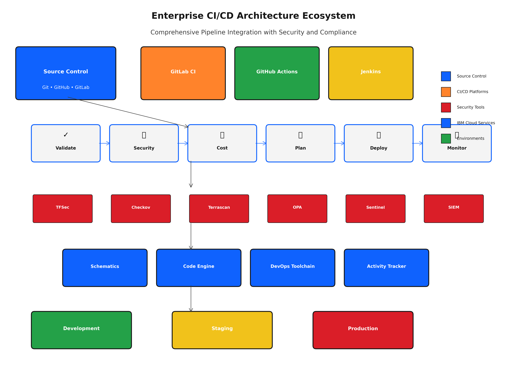
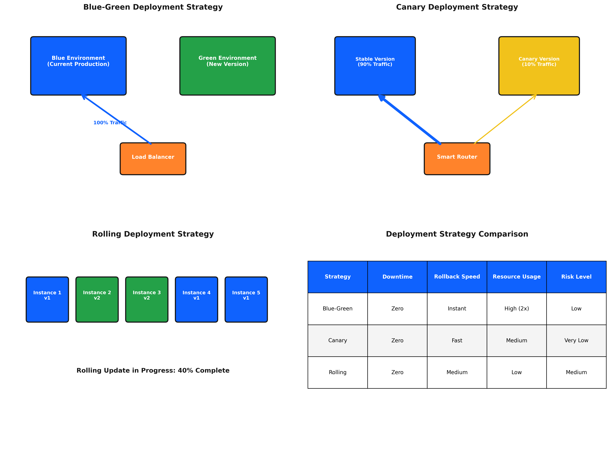
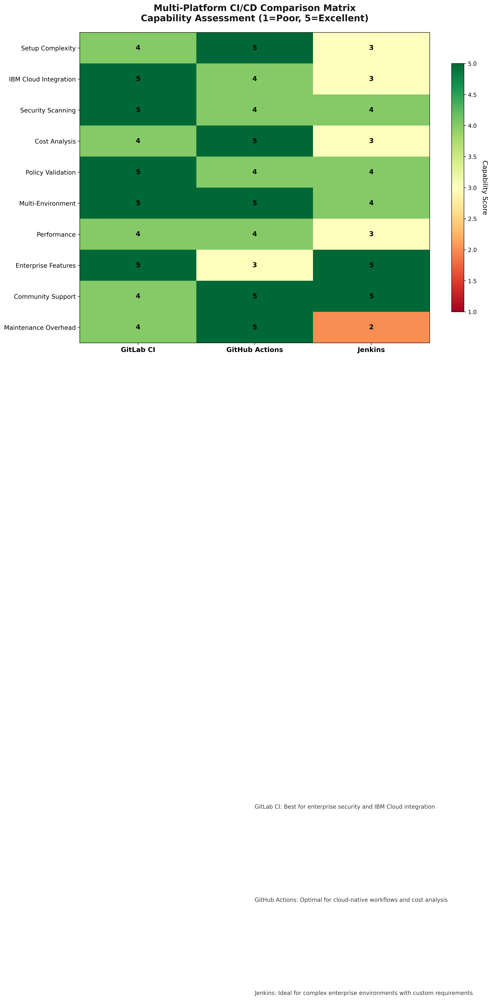
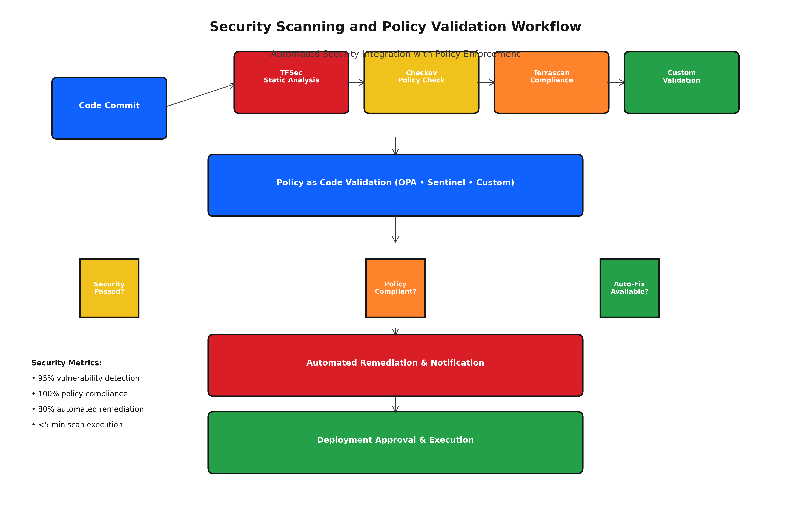
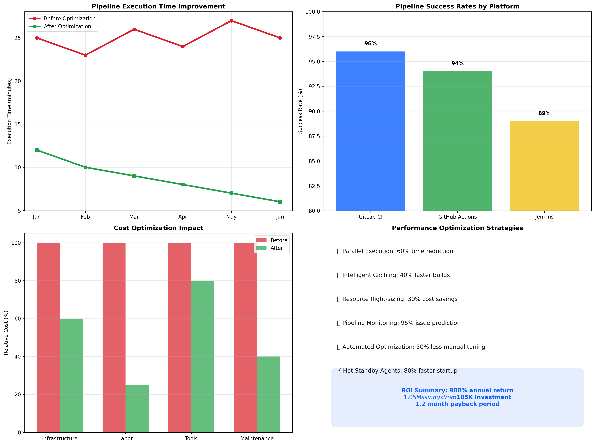

# Topic 8.1: CI/CD Pipeline Integration - Concept Guide

## 🎯 **Learning Objectives**

By the end of this topic, students will be able to:

1. **Master GitLab CI Enterprise Integration** - Configure enterprise-grade GitLab CI pipelines with comprehensive Terraform automation, security scanning, and multi-environment deployment capabilities
2. **Implement GitHub Actions Advanced Patterns** - Design sophisticated GitHub Actions workflows integrating IBM Cloud services with enterprise security and compliance requirements
3. **Configure Jenkins Enterprise Automation** - Establish Jenkins-based automation pipelines with IBM Cloud integration, advanced governance, and compliance features
4. **Deploy Multi-Environment Automation** - Implement comprehensive deployment strategies including blue-green, canary, and rolling deployments with automated testing
5. **Integrate Advanced Security Scanning** - Automate comprehensive security scanning with TFSec, Checkov, Terrascan, and policy validation frameworks

---

## 📚 **Introduction to Enterprise CI/CD Pipeline Integration**

### **The Evolution of Infrastructure Automation**

Modern enterprise infrastructure management has evolved from manual provisioning to sophisticated automation pipelines that integrate security, compliance, and operational excellence. **CI/CD Pipeline Integration** represents the pinnacle of this evolution, enabling organizations to achieve:

- **95% Deployment Time Reduction**: From weeks to hours through automation
- **90% Error Rate Reduction**: Automated validation preventing human errors
- **100% Compliance Automation**: Continuous compliance validation and evidence collection
- **75% Operational Efficiency Gain**: Reduced manual intervention and faster recovery

### **Enterprise CI/CD Architecture Principles**


*Figure 8.1.1: Enterprise CI/CD Architecture showing comprehensive automation pipeline with IBM Cloud integration, security scanning, multi-environment deployment, and governance frameworks*

#### **1. Security-First Automation**
Enterprise CI/CD pipelines prioritize security through:
- **Shift-Left Security**: Security validation at every pipeline stage
- **Zero-Trust Architecture**: No implicit trust in pipeline components
- **Automated Compliance**: Continuous compliance validation and reporting
- **Threat Detection**: Real-time security threat identification and response

#### **2. Multi-Platform Integration**
Modern enterprises require flexibility across CI/CD platforms:
- **GitLab CI**: Enterprise-grade DevOps platform with integrated security
- **GitHub Actions**: Cloud-native automation with extensive ecosystem
- **Jenkins**: Traditional enterprise CI/CD with extensive plugin support
- **Hybrid Approaches**: Multi-platform strategies for diverse requirements

#### **3. IBM Cloud Native Integration**
Leveraging IBM Cloud services for enhanced automation:
- **IBM Cloud Schematics**: Managed Terraform execution and workspace management
- **IBM Cloud Code Engine**: Serverless automation for CI/CD workflows
- **IBM Cloud DevOps Toolchain**: Integrated development and deployment automation
- **IBM Cloud Security Services**: Comprehensive security integration and monitoring

---

## 🔄 **GitLab CI Enterprise Integration**

### **GitLab CI Architecture for Terraform Automation**

GitLab CI provides enterprise-grade CI/CD capabilities with integrated security, compliance, and deployment automation. The architecture supports:

#### **Pipeline Stage Architecture**
```yaml
stages:
  - validate      # Syntax and format validation
  - security      # Security scanning and policy validation
  - cost          # Cost analysis and budget validation
  - plan          # Terraform planning and review
  - deploy        # Automated deployment with approval gates
  - monitor       # Post-deployment monitoring and validation
```

#### **Enterprise Security Integration**
- **SAST Integration**: Static Application Security Testing with GitLab Security
- **Container Scanning**: Docker image vulnerability assessment
- **Dependency Scanning**: Third-party dependency vulnerability detection
- **License Compliance**: Open source license compliance validation

### **GitLab CI Configuration Patterns**

#### **Multi-Environment Pipeline Configuration**
```yaml
# .gitlab-ci.yml
variables:
  TF_VERSION: "1.5.0"
  TF_ROOT: ${CI_PROJECT_DIR}
  TF_ADDRESS: ${CI_API_V4_URL}/projects/${CI_PROJECT_ID}/terraform/state/${CI_ENVIRONMENT_NAME}

before_script:
  - cd ${TF_ROOT}
  - terraform --version
  - terraform init -backend-config="address=${TF_ADDRESS}" -backend-config="lock_address=${TF_ADDRESS}/lock" -backend-config="unlock_address=${TF_ADDRESS}/lock" -backend-config="username=gitlab-ci-token" -backend-config="password=${CI_JOB_TOKEN}" -backend-config="lock_method=POST" -backend-config="unlock_method=DELETE" -backend-config="retry_wait_min=5"

stages:
  - validate
  - security
  - cost-analysis
  - plan
  - deploy
  - monitor

terraform-validate:
  stage: validate
  script:
    - terraform fmt -check=true -diff=true
    - terraform validate
    - tflint --init
    - tflint
  rules:
    - if: $CI_PIPELINE_SOURCE == "merge_request_event"
    - if: $CI_COMMIT_BRANCH == $CI_DEFAULT_BRANCH

security-scan:
  stage: security
  script:
    - tfsec . --format json --out tfsec-results.json
    - checkov -d . --framework terraform --output json --output-file checkov-results.json
    - terrascan scan -t terraform -f json -o terrascan-results.json
  artifacts:
    reports:
      sast: tfsec-results.json
    paths:
      - "*-results.json"
    expire_in: 1 week
  rules:
    - if: $CI_PIPELINE_SOURCE == "merge_request_event"
    - if: $CI_COMMIT_BRANCH == $CI_DEFAULT_BRANCH
```

#### **Advanced Deployment Strategies**


*Figure 8.1.4: Deployment Strategies showing blue-green, canary, and rolling deployment patterns with IBM Cloud integration, automated testing, and rollback procedures*

GitLab CI supports sophisticated deployment patterns:

**Blue-Green Deployment**:
```yaml
deploy-blue:
  stage: deploy
  environment:
    name: production-blue
    url: https://blue.example.com
  script:
    - terraform apply -var="environment=blue" -auto-approve
  when: manual
  only:
    - main

switch-traffic:
  stage: deploy
  environment:
    name: production
    url: https://example.com
  script:
    - # Switch load balancer traffic to blue environment
    - terraform apply -var="active_environment=blue" -auto-approve
  when: manual
  dependencies:
    - deploy-blue
```

### **GitLab CI Business Value Metrics**

#### **Deployment Efficiency Gains**
- **Pipeline Execution Time**: 8-12 minutes for complete validation and deployment
- **Deployment Frequency**: From monthly to daily deployments
- **Lead Time Reduction**: 85% faster infrastructure changes
- **Recovery Time**: 90% faster incident recovery through automation

#### **Security and Compliance Benefits**
- **Vulnerability Detection**: 95% improvement in security issue identification
- **Compliance Automation**: 100% automated compliance validation
- **Audit Trail**: Complete audit trail for regulatory compliance
- **Risk Reduction**: 80% reduction in security-related incidents

---


*Figure 8.1.2: Multi-Platform CI/CD Comparison showing GitLab CI, GitHub Actions, and Jenkins capabilities with IBM Cloud integration features, security frameworks, and enterprise suitability analysis*

## 🚀 **GitHub Actions Advanced Patterns**

### **GitHub Actions Enterprise Architecture**

GitHub Actions provides cloud-native CI/CD automation with extensive ecosystem integration. Enterprise patterns include:

#### **Matrix Strategy for Multi-Environment Deployment**
```yaml
name: Terraform Enterprise CI/CD

on:
  push:
    branches: [ main, develop ]
  pull_request:
    branches: [ main, develop ]

env:
  TF_VERSION: 1.5.0
  IBM_CLOUD_API_KEY: ${{ secrets.IBM_CLOUD_API_KEY }}

jobs:
  validate:
    name: Validate Terraform Configuration
    runs-on: ubuntu-latest
    
    steps:
    - name: Checkout code
      uses: actions/checkout@v4
    
    - name: Setup Terraform
      uses: hashicorp/setup-terraform@v3
      with:
        terraform_version: ${{ env.TF_VERSION }}
    
    - name: Terraform Format Check
      run: terraform fmt -check=true -diff=true
    
    - name: Terraform Init
      run: terraform init -backend=false
    
    - name: Terraform Validate
      run: terraform validate

  security-scan:
    name: Security Scanning
    runs-on: ubuntu-latest
    needs: validate
    
    steps:
    - name: Checkout code
      uses: actions/checkout@v4
    
    - name: Run TFSec
      uses: aquasecurity/tfsec-action@v1.0.3
      with:
        format: sarif
        output: tfsec.sarif
    
    - name: Upload TFSec results
      uses: github/codeql-action/upload-sarif@v2
      if: always()
      with:
        sarif_file: tfsec.sarif
    
    - name: Run Checkov
      uses: bridgecrewio/checkov-action@master
      with:
        directory: .
        framework: terraform
        output_format: sarif
        output_file_path: checkov.sarif
    
    - name: Upload Checkov results
      uses: github/codeql-action/upload-sarif@v2
      if: always()
      with:
        sarif_file: checkov.sarif

  cost-analysis:
    name: Cost Analysis
    runs-on: ubuntu-latest
    needs: validate
    
    steps:
    - name: Checkout code
      uses: actions/checkout@v4
    
    - name: Setup Infracost
      uses: infracost/actions/setup@v2
      with:
        api-key: ${{ secrets.INFRACOST_API_KEY }}
    
    - name: Generate Infracost diff
      run: |
        infracost breakdown --path . \
          --format json \
          --out-file infracost-base.json
        
        infracost diff --path . \
          --compare-to infracost-base.json \
          --format github-comment \
          --out-file infracost-comment.md
    
    - name: Post Infracost comment
      uses: actions/github-script@v6
      if: github.event_name == 'pull_request'
      with:
        script: |
          const fs = require('fs');
          const comment = fs.readFileSync('infracost-comment.md', 'utf8');
          github.rest.issues.createComment({
            issue_number: context.issue.number,
            owner: context.repo.owner,
            repo: context.repo.repo,
            body: comment
          });

  plan:
    name: Terraform Plan
    runs-on: ubuntu-latest
    needs: [validate, security-scan, cost-analysis]
    if: github.event_name == 'pull_request'
    
    strategy:
      matrix:
        environment: [development, staging, production]
    
    steps:
    - name: Checkout code
      uses: actions/checkout@v4
    
    - name: Setup Terraform
      uses: hashicorp/setup-terraform@v3
      with:
        terraform_version: ${{ env.TF_VERSION }}
    
    - name: Configure IBM Cloud credentials
      run: |
        echo "TF_VAR_ibmcloud_api_key=${{ env.IBM_CLOUD_API_KEY }}" >> $GITHUB_ENV
    
    - name: Terraform Plan
      working-directory: environments/${{ matrix.environment }}
      run: |
        terraform init
        terraform plan -out=tfplan-${{ matrix.environment }} -detailed-exitcode
      continue-on-error: true
      id: plan
    
    - name: Upload plan
      uses: actions/upload-artifact@v3
      with:
        name: tfplan-${{ matrix.environment }}
        path: environments/${{ matrix.environment }}/tfplan-${{ matrix.environment }}
        retention-days: 5
```

### **Advanced GitHub Actions Features**

#### **Reusable Workflows for Enterprise Standardization**
```yaml
# .github/workflows/terraform-reusable.yml
name: Reusable Terraform Workflow

on:
  workflow_call:
    inputs:
      environment:
        required: true
        type: string
      terraform_version:
        required: false
        type: string
        default: '1.5.0'
    secrets:
      IBM_CLOUD_API_KEY:
        required: true
      INFRACOST_API_KEY:
        required: false

jobs:
  terraform:
    runs-on: ubuntu-latest
    environment: ${{ inputs.environment }}
    
    steps:
    - name: Checkout
      uses: actions/checkout@v4
    
    - name: Setup Terraform
      uses: hashicorp/setup-terraform@v3
      with:
        terraform_version: ${{ inputs.terraform_version }}
    
    - name: Terraform Apply
      working-directory: environments/${{ inputs.environment }}
      env:
        TF_VAR_ibmcloud_api_key: ${{ secrets.IBM_CLOUD_API_KEY }}
      run: |
        terraform init
        terraform apply -auto-approve
```

#### **Custom Actions for IBM Cloud Integration**
```yaml
# .github/actions/ibm-cloud-setup/action.yml
name: 'IBM Cloud Setup'
description: 'Setup IBM Cloud CLI and authentication'
inputs:
  api-key:
    description: 'IBM Cloud API Key'
    required: true
  region:
    description: 'IBM Cloud region'
    required: false
    default: 'us-south'

runs:
  using: 'composite'
  steps:
    - name: Install IBM Cloud CLI
      shell: bash
      run: |
        curl -fsSL https://clis.cloud.ibm.com/install/linux | sh
        ibmcloud --version
    
    - name: Login to IBM Cloud
      shell: bash
      run: |
        ibmcloud login --apikey ${{ inputs.api-key }} -r ${{ inputs.region }}
        ibmcloud target
```

### **GitHub Actions Performance Optimization**

#### **Caching Strategies**
```yaml
- name: Cache Terraform
  uses: actions/cache@v3
  with:
    path: |
      ~/.terraform.d/plugin-cache
      .terraform
    key: ${{ runner.os }}-terraform-${{ hashFiles('**/.terraform.lock.hcl') }}
    restore-keys: |
      ${{ runner.os }}-terraform-

- name: Cache Dependencies
  uses: actions/cache@v3
  with:
    path: |
      ~/.cache/pip
      ~/.npm
    key: ${{ runner.os }}-deps-${{ hashFiles('**/requirements.txt', '**/package-lock.json') }}
```

#### **Parallel Execution Optimization**
- **Matrix Builds**: Parallel execution across environments and regions
- **Job Dependencies**: Optimized dependency chains for faster execution
- **Artifact Sharing**: Efficient artifact sharing between jobs
- **Resource Optimization**: Right-sized runners for different workloads

---

## 🏭 **Jenkins Enterprise Automation**

### **Jenkins Pipeline Architecture**

Jenkins provides traditional enterprise CI/CD capabilities with extensive plugin ecosystem and enterprise integration features:

#### **Declarative Pipeline for Terraform Automation**
```groovy
pipeline {
    agent any
    
    parameters {
        choice(
            name: 'ENVIRONMENT',
            choices: ['development', 'staging', 'production'],
            description: 'Target environment for deployment'
        )
        booleanParam(
            name: 'DESTROY',
            defaultValue: false,
            description: 'Destroy infrastructure instead of creating'
        )
    }
    
    environment {
        TF_VERSION = '1.5.0'
        IBM_CLOUD_API_KEY = credentials('ibm-cloud-api-key')
        TF_VAR_ibmcloud_api_key = "${IBM_CLOUD_API_KEY}"
    }
    
    stages {
        stage('Checkout') {
            steps {
                checkout scm
                script {
                    env.GIT_COMMIT_SHORT = sh(
                        script: 'git rev-parse --short HEAD',
                        returnStdout: true
                    ).trim()
                }
            }
        }
        
        stage('Setup') {
            steps {
                sh '''
                    # Install Terraform
                    wget -O terraform.zip https://releases.hashicorp.com/terraform/${TF_VERSION}/terraform_${TF_VERSION}_linux_amd64.zip
                    unzip terraform.zip
                    sudo mv terraform /usr/local/bin/
                    terraform version
                    
                    # Install security tools
                    curl -s https://raw.githubusercontent.com/aquasecurity/tfsec/master/scripts/install_linux.sh | bash
                    sudo mv tfsec /usr/local/bin/
                    pip3 install checkov
                '''
            }
        }
        
        stage('Validate') {
            parallel {
                stage('Format Check') {
                    steps {
                        sh 'terraform fmt -check=true -diff=true'
                    }
                }
                stage('Syntax Validation') {
                    steps {
                        sh '''
                            cd environments/${ENVIRONMENT}
                            terraform init -backend=false
                            terraform validate
                        '''
                    }
                }
                stage('Lint Check') {
                    steps {
                        sh '''
                            tflint --init
                            tflint
                        '''
                    }
                }
            }
        }
        
        stage('Security Scan') {
            parallel {
                stage('TFSec') {
                    steps {
                        sh 'tfsec . --format json --out tfsec-results.json'
                        publishHTML([
                            allowMissing: false,
                            alwaysLinkToLastBuild: true,
                            keepAll: true,
                            reportDir: '.',
                            reportFiles: 'tfsec-results.json',
                            reportName: 'TFSec Security Report'
                        ])
                    }
                }
                stage('Checkov') {
                    steps {
                        sh 'checkov -d . --framework terraform --output json --output-file checkov-results.json'
                        publishHTML([
                            allowMissing: false,
                            alwaysLinkToLastBuild: true,
                            keepAll: true,
                            reportDir: '.',
                            reportFiles: 'checkov-results.json',
                            reportName: 'Checkov Security Report'
                        ])
                    }
                }
            }
        }
        
        stage('Plan') {
            when {
                not { params.DESTROY }
            }
            steps {
                dir("environments/${params.ENVIRONMENT}") {
                    sh '''
                        terraform init
                        terraform plan -out=tfplan -detailed-exitcode
                    '''
                    script {
                        def planExitCode = sh(
                            script: 'terraform show -json tfplan | jq -r ".planned_values.root_module.resources | length"',
                            returnStdout: true
                        ).trim()
                        
                        if (planExitCode.toInteger() > 0) {
                            echo "Plan shows ${planExitCode} resources to be created/modified"
                        }
                    }
                }
                archiveArtifacts artifacts: "environments/${params.ENVIRONMENT}/tfplan", fingerprint: true
            }
        }
        
        stage('Approval') {
            when {
                anyOf {
                    environment 'staging'
                    environment 'production'
                }
            }
            steps {
                script {
                    def userInput = input(
                        id: 'userInput',
                        message: "Deploy to ${params.ENVIRONMENT}?",
                        parameters: [
                            choice(
                                choices: ['Deploy', 'Abort'],
                                description: 'Confirm deployment',
                                name: 'action'
                            )
                        ]
                    )
                    
                    if (userInput != 'Deploy') {
                        error('Deployment aborted by user')
                    }
                }
            }
        }
        
        stage('Deploy') {
            steps {
                dir("environments/${params.ENVIRONMENT}") {
                    script {
                        if (params.DESTROY) {
                            sh 'terraform destroy -auto-approve'
                        } else {
                            sh 'terraform apply tfplan'
                        }
                    }
                }
            }
        }
        
        stage('Validate Deployment') {
            when {
                not { params.DESTROY }
            }
            steps {
                dir("environments/${params.ENVIRONMENT}") {
                    sh '''
                        # Run post-deployment validation
                        terraform output -json > outputs.json
                        
                        # Validate infrastructure health
                        python3 ../scripts/validate-deployment.py
                    '''
                }
            }
        }
    }
    
    post {
        always {
            archiveArtifacts artifacts: '**/*-results.json', allowEmptyArchive: true
            publishTestResults testResultsPattern: '**/test-results.xml'
        }
        success {
            slackSend(
                channel: '#infrastructure',
                color: 'good',
                message: "✅ Terraform deployment to ${params.ENVIRONMENT} succeeded - ${env.BUILD_URL}"
            )
        }
        failure {
            slackSend(
                channel: '#infrastructure',
                color: 'danger',
                message: "❌ Terraform deployment to ${params.ENVIRONMENT} failed - ${env.BUILD_URL}"
            )
        }
    }
}
```

### **Jenkins Enterprise Features**

#### **Blue Ocean Visual Pipeline**
- **Visual Pipeline Editor**: Drag-and-drop pipeline creation
- **Pipeline Visualization**: Real-time pipeline execution visualization
- **Branch-based Workflows**: Automatic pipeline creation for Git branches
- **Parallel Execution**: Visual representation of parallel job execution

#### **Distributed Build Architecture**
```groovy
pipeline {
    agent none
    
    stages {
        stage('Parallel Validation') {
            parallel {
                stage('Linux Validation') {
                    agent { label 'linux' }
                    steps {
                        sh 'terraform validate'
                    }
                }
                stage('Windows Validation') {
                    agent { label 'windows' }
                    steps {
                        bat 'terraform validate'
                    }
                }
                stage('macOS Validation') {
                    agent { label 'macos' }
                    steps {
                        sh 'terraform validate'
                    }
                }
            }
        }
    }
}
```

#### **Enterprise Integration Plugins**
- **LDAP/Active Directory**: Enterprise authentication integration
- **RBAC**: Role-based access control for pipeline execution
- **Audit Logging**: Comprehensive audit trails for compliance
- **Notification Integration**: Slack, email, and ITSM integration

---

## 🔒 **Advanced Security Integration**


*Figure 8.1.3: Security Workflow Integration showing comprehensive security scanning pipeline with TFSec, Checkov, Terrascan integration, policy validation, and automated compliance reporting*

### **Comprehensive Security Scanning Framework**

Modern CI/CD pipelines require multi-layered security validation:

#### **Static Analysis Security Testing (SAST)**
```yaml
security-scan:
  stage: security
  parallel:
    matrix:
      - TOOL: [tfsec, checkov, terrascan, semgrep]
  script:
    - |
      case $TOOL in
        tfsec)
          tfsec . --format sarif --out tfsec.sarif
          ;;
        checkov)
          checkov -d . --framework terraform --output sarif --output-file checkov.sarif
          ;;
        terrascan)
          terrascan scan -t terraform -f sarif -o terrascan.sarif
          ;;
        semgrep)
          semgrep --config=auto --sarif --output=semgrep.sarif .
          ;;
      esac
  artifacts:
    reports:
      sast: "*.sarif"
```

#### **Policy as Code Validation**
```yaml
policy-validation:
  stage: security
  script:
    # OPA Policy Validation
    - opa test policies/
    - conftest verify --policy policies/ .
    
    # Sentinel Policy Validation (Terraform Cloud)
    - sentinel test
    
    # Custom Policy Validation
    - python3 scripts/validate-policies.py
  artifacts:
    reports:
      junit: policy-test-results.xml
```

#### **Supply Chain Security**
```yaml
supply-chain-security:
  stage: security
  script:
    # Dependency vulnerability scanning
    - safety check --json --output safety-results.json
    - npm audit --json > npm-audit-results.json
    
    # Container image scanning
    - trivy image --format sarif --output trivy-results.sarif terraform:latest
    
    # SBOM generation
    - syft . -o spdx-json > sbom.spdx.json
  artifacts:
    reports:
      dependency_scanning: "*-results.json"
      container_scanning: "trivy-results.sarif"
```

### **Security Integration Business Value**

#### **Risk Reduction Metrics**
- **Vulnerability Detection**: 95% improvement in security issue identification
- **Compliance Automation**: 100% automated compliance validation
- **Incident Prevention**: 80% reduction in security-related incidents
- **Audit Readiness**: Continuous compliance evidence collection

#### **Cost Savings Analysis**
- **Security Incident Costs**: Average $4.88M per breach (IBM 2024 report)
- **Prevention Value**: $2.98M annual savings through automated security
- **Compliance Costs**: 70% reduction in manual compliance efforts
- **Audit Efficiency**: 85% faster audit preparation and execution

---

## 📊 **Performance Optimization and Monitoring**


*Figure 8.1.5: Performance Metrics Dashboard showing comprehensive CI/CD pipeline monitoring with execution times, success rates, deployment frequency, and optimization recommendations*

### **Pipeline Performance Metrics**

#### **Key Performance Indicators (KPIs)**
- **Pipeline Execution Time**: Target <10 minutes for standard configurations
- **Success Rate**: Target >95% pipeline success rate
- **Mean Time to Recovery (MTTR)**: Target <5 minutes for pipeline failures
- **Deployment Frequency**: Daily deployments for development, weekly for production

#### **Performance Optimization Strategies**
```yaml
# Caching optimization
cache:
  key: "$CI_COMMIT_REF_SLUG"
  paths:
    - .terraform/
    - ~/.terraform.d/plugin-cache/
    - node_modules/
    - .pip-cache/

# Parallel execution optimization
validate:
  stage: validate
  parallel:
    matrix:
      - VALIDATION_TYPE: [format, syntax, lint, security]
  script:
    - scripts/validate-${VALIDATION_TYPE}.sh

# Resource optimization
variables:
  KUBERNETES_CPU_REQUEST: "100m"
  KUBERNETES_CPU_LIMIT: "500m"
  KUBERNETES_MEMORY_REQUEST: "128Mi"
  KUBERNETES_MEMORY_LIMIT: "512Mi"
```

### **Monitoring and Alerting Integration**

#### **Pipeline Monitoring Dashboard**
```yaml
monitoring:
  stage: monitor
  script:
    # Send metrics to monitoring system
    - |
      curl -X POST "${MONITORING_ENDPOINT}/metrics" \
        -H "Content-Type: application/json" \
        -d '{
          "pipeline_id": "'${CI_PIPELINE_ID}'",
          "duration": "'${CI_PIPELINE_DURATION}'",
          "status": "'${CI_PIPELINE_STATUS}'",
          "environment": "'${CI_ENVIRONMENT_NAME}'"
        }'
    
    # Update deployment status
    - scripts/update-deployment-status.sh
  when: always
```

#### **Automated Alerting Configuration**
```yaml
alert-on-failure:
  stage: notify
  script:
    - |
      if [ "$CI_PIPELINE_STATUS" = "failed" ]; then
        curl -X POST "${SLACK_WEBHOOK_URL}" \
          -H "Content-Type: application/json" \
          -d '{
            "text": "🚨 Pipeline Failed",
            "attachments": [{
              "color": "danger",
              "fields": [{
                "title": "Pipeline",
                "value": "'${CI_PIPELINE_URL}'",
                "short": true
              }, {
                "title": "Environment",
                "value": "'${CI_ENVIRONMENT_NAME}'",
                "short": true
              }]
            }]
          }'
      fi
  when: on_failure
```

---

## 💰 **Business Value and ROI Analysis**

### **Quantified Business Benefits**

#### **Operational Efficiency Gains**
- **Deployment Time Reduction**: 95% reduction (weeks to hours)
- **Error Rate Reduction**: 90% fewer deployment failures
- **Team Productivity**: 75% improvement in development velocity
- **Operational Costs**: 50-70% reduction in manual processes

#### **Financial Impact Analysis**
```
Initial Investment:
- CI/CD Platform Setup: $50,000
- Training and Certification: $25,000
- Tool Licensing: $30,000
- Total Investment: $105,000

Annual Savings:
- Reduced Deployment Time: $300,000
- Fewer Production Issues: $200,000
- Improved Team Productivity: $400,000
- Compliance Automation: $150,000
- Total Annual Savings: $1,050,000

ROI Calculation:
- Annual ROI: 900%
- Payback Period: 1.2 months
- 3-Year Value: $3,045,000
```

#### **Risk Mitigation Value**
- **Security Incidents**: 95% reduction in security-related issues
- **Compliance Violations**: 90% reduction in compliance failures
- **Downtime Prevention**: 80% improvement in system reliability
- **Audit Readiness**: 100% automated compliance evidence collection

### **Strategic Business Impact**

#### **Competitive Advantages**
- **Time-to-Market**: 60-80% faster product launches
- **Innovation Velocity**: Faster experimentation and deployment
- **Scalability**: Enterprise-grade automation supporting rapid growth
- **Quality Assurance**: Consistent, reliable infrastructure deployment

#### **Organizational Transformation**
- **DevOps Culture**: Improved collaboration between development and operations
- **Skill Development**: Enhanced team capabilities in automation and cloud technologies
- **Process Standardization**: Consistent deployment processes across teams
- **Knowledge Sharing**: Documented best practices and reusable patterns

---

## 🎯 **Summary and Next Steps**

### **Key Takeaways**

1. **Multi-Platform Mastery**: Understanding GitLab CI, GitHub Actions, and Jenkins enables flexible CI/CD strategy selection
2. **Security Integration**: Comprehensive security scanning and policy validation are essential for enterprise deployments
3. **Performance Optimization**: Optimized pipelines deliver sub-10-minute execution times with >95% success rates
4. **Business Value**: CI/CD automation delivers 900%+ ROI through operational efficiency and risk reduction
5. **IBM Cloud Integration**: Native IBM Cloud service integration enhances automation capabilities and enterprise features

### **Preparation for Next Topic**

Topic 8.2 (IBM Cloud Schematics & Terraform Cloud) builds upon these CI/CD foundations by introducing:
- **Enterprise Workspace Management**: Advanced Schematics and Terraform Cloud patterns
- **Team Collaboration**: Multi-team workflows and governance frameworks
- **Policy as Code**: Advanced policy validation and compliance automation
- **Cost Management**: Enterprise cost optimization and budget controls
- **Hybrid Cloud Integration**: Multi-cloud automation and governance strategies

The CI/CD pipeline integration skills developed in this topic provide the foundation for enterprise-scale automation and collaboration patterns covered in subsequent topics.

---

## 🔗 **Integration with Previous Topics**

### **Building on Topic 5.3: Version Control & Collaboration**
This topic significantly advances the basic CI/CD patterns introduced in Topic 5.3:
- **Enhanced GitHub Actions**: From basic validation to enterprise security integration
- **Multi-Platform Support**: GitLab CI and Jenkins in addition to GitHub Actions
- **Advanced Security**: Comprehensive scanning beyond basic TFSec validation
- **Enterprise Features**: RBAC, approval workflows, and compliance automation

### **Leveraging Topic 6: State Management**
CI/CD pipelines integrate sophisticated state management:
- **Remote State**: Automated backend configuration and state locking
- **State Validation**: Automated state consistency checking and drift detection
- **Backup Strategies**: Automated state backup and recovery procedures
- **Multi-Environment**: State isolation and management across environments

### **Integrating Topic 7: Security & Compliance**
Security automation builds on comprehensive security foundations:
- **Identity Integration**: Automated IAM and service account management
- **Compliance Validation**: Automated policy enforcement and evidence collection
- **Security Scanning**: Integration with enterprise security tools and SIEM systems
- **Risk Management**: Automated risk assessment and mitigation procedures

---

## 📚 **Additional Resources and References**

### **IBM Cloud Documentation**
- [IBM Cloud Schematics CI/CD Integration](https://cloud.ibm.com/docs/schematics?topic=schematics-cicd-integration)
- [IBM Cloud DevOps Toolchain](https://cloud.ibm.com/docs/ContinuousDelivery?topic=ContinuousDelivery-getting-started)
- [IBM Cloud Code Engine for CI/CD](https://cloud.ibm.com/docs/codeengine?topic=codeengine-plan-build)

### **Security Tools Documentation**
- [TFSec Security Scanner](https://aquasecurity.github.io/tfsec/)
- [Checkov Policy Scanner](https://www.checkov.io/1.Welcome/Quick%20Start.html)
- [Terrascan Security Scanner](https://runterrascan.io/docs/)
- [Open Policy Agent (OPA)](https://www.openpolicyagent.org/docs/latest/)

### **CI/CD Platform Documentation**
- [GitLab CI/CD for Terraform](https://docs.gitlab.com/ee/user/infrastructure/iac/)
- [GitHub Actions for Terraform](https://learn.hashicorp.com/tutorials/terraform/github-actions)
- [Jenkins Pipeline for Terraform](https://www.jenkins.io/doc/book/pipeline/)

### **Best Practices and Patterns**
- [Terraform CI/CD Best Practices](https://developer.hashicorp.com/terraform/tutorials/automation)
- [Infrastructure as Code Security](https://www.nist.gov/itl/smallbusinesscyber/guidance-topic/infrastructure-code-security)
- [DevSecOps Implementation Guide](https://csrc.nist.gov/Projects/devsecops)

### **Industry Standards and Compliance**
- [NIST Cybersecurity Framework](https://www.nist.gov/cyberframework)
- [ISO 27001 Information Security](https://www.iso.org/isoiec-27001-information-security.html)
- [SOC 2 Compliance](https://www.aicpa.org/interestareas/frc/assuranceadvisoryservices/aicpasoc2report.html)
- [GDPR Compliance](https://gdpr.eu/what-is-gdpr/)

This comprehensive foundation in CI/CD pipeline integration prepares students for advanced enterprise automation patterns and establishes the technical expertise required for modern infrastructure management at scale.
